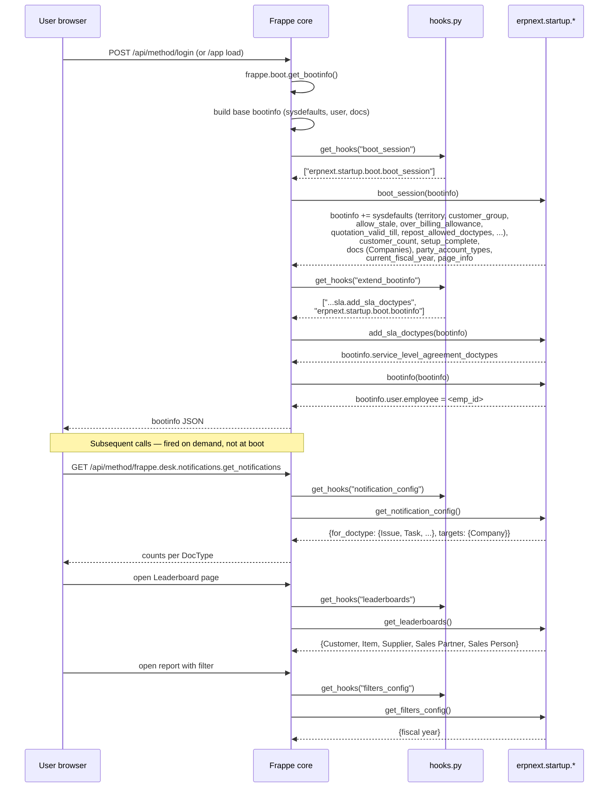

# Boot session and bootinfo injection

> **TL;DR:** On every login (and every `frappe.boot` refresh), Frappe core builds a `bootinfo` dict and runs ERPNext's `boot_session` and `extend_bootinfo` hooks to inject ERPNext-specific defaults. ERPNext also registers `notification_config` (open-document badges in the navbar), `leaderboards` (per-master leaderboard widgets), and `filters_config` (custom report-filter types). Together these registrations are what turns a vanilla Frappe Desk into the ERPNext UX.

## Key files

- [erpnext/hooks.py:68-72](../../erpnext/hooks.py:68) — registers `boot_session`, `notification_config`, `leaderboards`, `filters_config`, and the help-messages hook.
- [erpnext/hooks.py:687-690](../../erpnext/hooks.py:687) — registers `extend_bootinfo` (two entries: SLA doctypes from Support, plus `erpnext.startup.boot.bootinfo`).
- [erpnext/startup/boot.py](../../erpnext/startup/boot.py) — `boot_session` (the main injector), `update_page_info`, and the `bootinfo` extender (employee link).
- [erpnext/startup/notifications.py](../../erpnext/startup/notifications.py) — `get_notification_config` (returns the navbar badge config).
- [erpnext/startup/leaderboard.py](../../erpnext/startup/leaderboard.py) — `get_leaderboards` (returns the leaderboard config) plus the data-fetch endpoints for each leaderboard.
- [erpnext/startup/filters.py](../../erpnext/startup/filters.py) — `get_filters_config` (returns the custom report-filter registry).
- [erpnext/support/doctype/service_level_agreement/service_level_agreement.py:1053-1054](../../erpnext/support/doctype/service_level_agreement/service_level_agreement.py:1053) — `add_sla_doctypes(bootinfo)` (the second `extend_bootinfo` hook; injects the list of SLA-enabled DocTypes).

## Diagram



## 1. `boot_session` — primary boot injector

Registered at [hooks.py:68](../../erpnext/hooks.py:68):

```python
boot_session = "erpnext.startup.boot.boot_session"
```

Frappe core calls this exactly once per `bootinfo` build (i.e. on login + on `/app` page load). The function lives at [boot.py:12-69](../../erpnext/startup/boot.py:12).

**Guest short-circuit:** `if frappe.session["user"] != "Guest"` ([boot.py:15](../../erpnext/startup/boot.py:15)) — none of the injection runs for unauthenticated requests.

### What gets injected into `bootinfo` (in order)

| Key path | Source | Purpose |
|----------|--------|---------|
| `bootinfo.page_info["Chart of Accounts" / "Chart of Cost Centers" / "Item Group Tree" / "Customer Group Tree" / "Territory Tree" / "Sales Person Tree"]` | [boot.py:72-82](../../erpnext/startup/boot.py:72) — `update_page_info(bootinfo)` | Routes the desk's "Chart of Accounts", "Item Group Tree" etc. links to the correct `Tree/<DocType>` URL. |
| `bootinfo.sysdefaults.territory` | `Selling Settings.territory` ([boot.py:18](../../erpnext/startup/boot.py:18)) | Default territory used when creating new Customer / Quotation / Sales Order without an explicit territory. |
| `bootinfo.sysdefaults.customer_group` | `Selling Settings.customer_group` ([boot.py:19](../../erpnext/startup/boot.py:19)) | Default customer group on new Customer. |
| `bootinfo.sysdefaults.use_legacy_js_reactivity` | `Selling Settings.use_legacy_js_reactivity` ([boot.py:20-22](../../erpnext/startup/boot.py:20)) | Toggles legacy vs new JS reactivity engine for Selling forms. |
| `bootinfo.sysdefaults.allow_stale` | `Accounts Settings.allow_stale` ([boot.py:23](../../erpnext/startup/boot.py:23)) | Whether stale exchange rates are allowed when posting in foreign currency. |
| `bootinfo.sysdefaults.over_billing_allowance` | `Accounts Settings.over_billing_allowance` ([boot.py:24-26](../../erpnext/startup/boot.py:24)) | % allowed over-billing on a Sales / Purchase Invoice relative to the linked Delivery Note / Purchase Receipt. |
| `bootinfo.sysdefaults.quotation_valid_till` | `CRM Settings.default_valid_till` ([boot.py:28-30](../../erpnext/startup/boot.py:28)) | Default validity (days) populated on new Quotation. |
| `bootinfo.sysdefaults.allow_sales_order_creation_for_expired_quotation` | `Selling Settings.allow_sales_order_creation_for_expired_quotation` ([boot.py:32-34](../../erpnext/startup/boot.py:32)) | Whether the SO `make_from_quotation` flow is allowed against an expired quotation. |
| `bootinfo.customer_count` | `select count(*) from tabCustomer` ([boot.py:37](../../erpnext/startup/boot.py:37)) | Drives the "create your first customer" empty-state UI. |
| `bootinfo.setup_complete` | `"Yes" / "No"` based on whether any Company exists ([boot.py:39-48](../../erpnext/startup/boot.py:39)) | If `customer_count == 0`, also injects setup-completion flag. Drives setup-wizard re-prompts. |
| `bootinfo.docs += [{Company...}]` | `select ... from tabCompany` ([boot.py:50-55](../../erpnext/startup/boot.py:50)) | Pre-loads every Company doc into `frappe.boot.docs` (with `doctype=":Company"` marker) so the desk can render Company-aware pickers without an extra round trip. Fields: `name`, `default_currency`, `cost_center`, `default_selling_terms`, `default_buying_terms`, `default_letter_head`, `default_bank_account`, `enable_perpetual_inventory`, `country`, `exchange_gain_loss_account`. |
| `bootinfo.party_account_types` | `select name, account_type from tabParty Type` → `frappe._dict` ([boot.py:57-58](../../erpnext/startup/boot.py:57)) | Maps each Party Type (Customer / Supplier / Employee / Shareholder / Member / Student) to its default account type (`Receivable` / `Payable` / etc.). Consumed by Payment Entry and Journal Entry to pick the right account-type filter when the user picks a party type. |
| `bootinfo.current_fiscal_year` | `erpnext.accounts.utils.get_fiscal_years(today, company=user_default_company)` ([boot.py:59-63](../../erpnext/startup/boot.py:59)) | The active Fiscal Year for the user's default company; used as the default value in date-range pickers and report filters. `raise_on_missing=False` — boot does not throw if no fiscal year is configured. |
| `bootinfo.sysdefaults.demo_company` | `Global Defaults.demo_company` ([boot.py:65](../../erpnext/startup/boot.py:65)) | Name of the demo Company (if seeded via `erpnext/setup/demo.py`). Drives the "Delete Demo Data" navbar item registered at [hooks.py:220-229](../../erpnext/hooks.py:220). |
| `bootinfo.sysdefaults.default_ageing_range` | `Accounts Settings.default_ageing_range` ([boot.py:66-68](../../erpnext/startup/boot.py:66)) | Default aging buckets (e.g. `30, 60, 90`) used by AR / AP reports. |
| `bootinfo.sysdefaults.repost_allowed_doctypes` | `frappe.get_hooks("repost_allowed_doctypes")` ([boot.py:69](../../erpnext/startup/boot.py:69)) | The hook content from [hooks.py:707](../../erpnext/hooks.py:707) — surfaced to JS so `Accounts Settings.repost_allowed_types` link picker can filter to allowed values. See [hooks-catalogue.md](hooks-catalogue.md#33-repost_allowed_doctypes). |

## 2. `extend_bootinfo` — additional injectors

Registered at [hooks.py:687-690](../../erpnext/hooks.py:687):

```python
extend_bootinfo = [
    "erpnext.support.doctype.service_level_agreement.service_level_agreement.add_sla_doctypes",
    "erpnext.startup.boot.bootinfo",
]
```

Frappe core calls every entry in this list **after** `boot_session`. Each receives the same `bootinfo` dict and is free to add keys.

### 2.1 `add_sla_doctypes(bootinfo)`

[service_level_agreement.py:1053-1054](../../erpnext/support/doctype/service_level_agreement/service_level_agreement.py:1053):

```python
def add_sla_doctypes(bootinfo):
    bootinfo.service_level_agreement_doctypes = get_sla_doctypes()
```

`get_sla_doctypes()` ([service_level_agreement.py:1041-1050](../../erpnext/support/doctype/service_level_agreement/service_level_agreement.py:1041)) is `@redis_cache()`-wrapped and reads `select distinct document_type from tabService Level Agreement where enabled=1`. Returns a list like `["Issue", "Sales Order", ...]`.

**Consumer:** Frappe Desk's form scripts read `frappe.boot.service_level_agreement_doctypes` to know which forms should render the SLA timer/status panel. Without this hook, Support's SLA UX would not appear.

### 2.2 `bootinfo(bootinfo)` (employee link)

[boot.py:85-92](../../erpnext/startup/boot.py:85):

```python
def bootinfo(bootinfo):
    if bootinfo.get("user") and bootinfo["user"].get("name"):
        bootinfo["user"]["employee"] = ""
        frappe.session.data.employee = ""
        employee = frappe.db.get_value("Employee", {"user_id": bootinfo["user"]["name"]}, "name")
        if employee:
            bootinfo["user"]["employee"] = employee
            frappe.session.data.employee = employee
```

**What it does:** looks up the `Employee` row whose `user_id` matches the logged-in user, and stores the employee name on both `bootinfo.user.employee` and `frappe.session.data.employee`. Always sets the field (to `""` if no employee exists) so JS can read it without `undefined` checks.

**Consumer:** any DocType that auto-fills `employee` from the current user (Leave Application, Expense Claim, Timesheet, Attendance) reads `frappe.session.user_employee` (populated from `frappe.session.data.employee`).

## 3. `notification_config` — navbar badges

Registered at [hooks.py:69](../../erpnext/hooks.py:69):

```python
notification_config = "erpnext.startup.notifications.get_notification_config"
```

Called by Frappe core via `frappe.desk.notifications.get_notifications` (an on-demand RPC, **not** part of the boot payload). Implementation at [notifications.py:8-61](../../erpnext/startup/notifications.py:8).

### 3.1 `for_doctype` — open-document counters

Each entry in [notifications.py:10-45](../../erpnext/startup/notifications.py:10) maps a DocType to a filter; Frappe runs `count(*) where <filter>` and renders the result as a badge in the desk's notification icon for that DocType.

| DocType | Filter | What "open" means |
|---------|--------|-------------------|
| `Issue` | `status: Open` | Active support tickets. |
| `Warranty Claim` | `status: Open` | Active warranty claims. |
| `Task` | `status in (Open, Overdue)` | Tasks needing action. |
| `Project` | `status: Open` | Active projects. |
| `Lead` | `status: Open` | Open CRM leads. |
| `Contact` | `status: Open` | _(rare; most Contacts default to Passive)_ |
| `Opportunity` | `status: Open` | Open opportunities. |
| `Quotation` | `docstatus: 0` | Draft quotations. |
| `Sales Order` | `status not in (Completed, Closed)` and `docstatus < 2` | Active SOs. |
| `Journal Entry` | `docstatus: 0` | Draft JEs. |
| `Sales Invoice` | `outstanding_amount > 0` and `docstatus < 2` | Unpaid invoices. |
| `Purchase Invoice` | `outstanding_amount > 0` and `docstatus < 2` | Unpaid bills. |
| `Payment Entry` | `docstatus: 0` | Draft payments. |
| `Leave Application` | `docstatus: 0` | Draft leave requests. |
| `Expense Claim` | `docstatus: 0` | Draft expense claims. |
| `Job Applicant` | `status: Open` | Open candidates. |
| `Delivery Note` | `status not in (Completed, Closed)` and `docstatus < 2` | Active deliveries. |
| `Stock Entry` | `docstatus: 0` | Draft stock entries. |
| `Material Request` | `docstatus < 2` and `status not in (Stopped,)` and `per_ordered < 100` | Open / partially fulfilled MRs. |
| `Request for Quotation` | `docstatus: 0` | Draft RFQs. |
| `Supplier Quotation` | `docstatus: 0` | Draft supplier quotations. |
| `Purchase Order` | `status not in (Completed, Closed)` and `docstatus < 2` | Active POs. |
| `Purchase Receipt` | `status not in (Completed, Closed)` and `docstatus < 2` | Active PRs. |
| `Work Order` | `status in (Draft, Not Started, In Process)` | Active manufacturing orders. |
| `BOM` | `docstatus: 0` | Draft BOMs. |
| `Timesheet` | `status: Draft` | Draft timesheets. |
| `Lab Test` | `docstatus: 0` | Draft lab tests. _(Healthcare module — out-of-tree but registered here)_ |
| `Sample Collection` | `docstatus: 0` | _(Healthcare module)_ |
| `Patient Appointment` | `status: Open` | _(Healthcare module)_ |
| `Patient Encounter` | `docstatus: 0` | _(Healthcare module)_ |

**Auto-extension:** [notifications.py:55-59](../../erpnext/startup/notifications.py:55) appends every other submittable DocType (those not already in the dict) with the default filter `{docstatus: 0}`. This means **any custom submittable DocType automatically gets a "draft count" badge** without an explicit registration.

### 3.2 `targets` — sales-target progress

[notifications.py:46-52](../../erpnext/startup/notifications.py:46):

```python
"targets": {
    "Company": {
        "filters": {"monthly_sales_target": (">", 0)},
        "target_field": "monthly_sales_target",
        "value_field": "total_monthly_sales",
    }
}
```

For each Company with `monthly_sales_target > 0`, the desk renders a progress bar `total_monthly_sales / monthly_sales_target`. The `total_monthly_sales` field is refreshed by the `cache_companies_monthly_sales_history` daily scheduler job ([hooks.py:470](../../erpnext/hooks.py:470)) — see [scheduler-jobs.md](scheduler-jobs.md#75-setup--reports--misc).

## 4. `leaderboards` — sidebar leaderboard widgets

Registered at [hooks.py:71](../../erpnext/hooks.py:71):

```python
leaderboards = "erpnext.startup.leaderboard.get_leaderboards"
```

Called by Frappe Desk's Leaderboard page (`/app/leaderboard`). Implementation at [leaderboard.py:6-53](../../erpnext/startup/leaderboard.py:6).

| Leaderboard | Fields | Data fetcher | Source DocType |
|-------------|--------|--------------|----------------|
| `Customer` ([:8](../../erpnext/startup/leaderboard.py:8)) | `total_sales_amount` (Currency), `total_qty_sold`, `outstanding_amount` (Currency) | [`get_all_customers`](../../erpnext/startup/leaderboard.py:57) | `Sales Order` (sales / qty) or `Sales Invoice` (outstanding) — sums grouped by customer. |
| `Item` ([:17](../../erpnext/startup/leaderboard.py:17)) | `total_sales_amount`, `total_qty_sold`, `total_purchase_amount`, `total_qty_purchased`, `available_stock_qty`, `available_stock_value` | [`get_all_items`](../../erpnext/startup/leaderboard.py:92) | `Sales Order Item` / `Purchase Order Item` for transactional fields; `Bin` for stock fields. |
| `Supplier` ([:29](../../erpnext/startup/leaderboard.py:29)) | `total_purchase_amount`, `total_qty_purchased`, `outstanding_amount` | [`get_all_suppliers`](../../erpnext/startup/leaderboard.py:138) | `Purchase Order` / `Purchase Invoice`. |
| `Sales Partner` ([:38](../../erpnext/startup/leaderboard.py:38)) | `total_sales_amount`, `total_commission` | [`get_all_sales_partner`](../../erpnext/startup/leaderboard.py:174) | `Sales Order` filtered to rows with `sales_partner` set. |
| `Sales Person` ([:46](../../erpnext/startup/leaderboard.py:46)) | `total_sales_amount` | [`get_all_sales_person`](../../erpnext/startup/leaderboard.py:199) | `Sales Order` joined with the `Sales Team` child table; sums `allocated_amount`. |

Each fetcher is `@frappe.whitelist()` and accepts `(date_range, company, field, limit)`. Leaderboards render a top-N list with the chosen field as the rank value.

## 5. `filters_config` — custom report filter types

Registered at [hooks.py:72](../../erpnext/hooks.py:72):

```python
filters_config = "erpnext.startup.filters.get_filters_config"
```

Called by Frappe core when building report filter widgets. Implementation at [filters.py:1-11](../../erpnext/startup/filters.py:1):

```python
def get_filters_config():
    return {
        "fiscal year": {
            "label": "Fiscal Year",
            "get_field": "erpnext.accounts.utils.get_fiscal_year_filter_field",
            "valid_for_fieldtypes": ["Date", "Datetime", "DateRange"],
            "depends_on": "company",
        }
    }
```

**Single registration:** the `fiscal year` filter type. Any report that declares a filter of this type (in its `filters` JSON spec) gets a dropdown of `Fiscal Year` rows; selecting one sets the underlying date / date-range field to the year's `year_start_date` and `year_end_date`. The `depends_on: company` rule means the picker is greyed out until a Company filter is also chosen (because Fiscal Year is company-scoped).

**Consumer:** Frappe report builder + Query Report runner. The `get_field` callback ([accounts/utils.py — `get_fiscal_year_filter_field`](../../erpnext/accounts/utils.py)) returns the Frappe form field descriptor that renders the picker.

## 6. `get_help_messages`

Registered at [hooks.py:70](../../erpnext/hooks.py:70):

```python
get_help_messages = "erpnext.utilities.activation.get_help_messages"
```

Called by the desk's "What's next" / activation widget. Returns a list of suggested next-steps (e.g. "Add a Customer", "Create a Sales Invoice") tailored to the site's current state. Not strictly part of bootinfo — fetched on demand.

## 7. `additional_print_settings`

Registered at [hooks.py:73](../../erpnext/hooks.py:73):

```python
additional_print_settings = "erpnext.controllers.print_settings.get_print_settings"
```

Called when rendering print formats. Returns ERPNext-specific Print Settings overrides (compact item totals, currency precision, etc.). Not part of bootinfo.

## 8. `on_session_creation`

Registered at [hooks.py:75](../../erpnext/hooks.py:75):

```python
on_session_creation = "erpnext.portal.utils.create_customer_or_supplier"
```

Fires **once per login** (not per request). [portal/utils.create_customer_or_supplier](../../erpnext/portal/utils.py) checks the user's roles and auto-provisions a `Customer` or `Supplier` linked record if the user has the corresponding portal role and no record exists yet. This is what powers the "log in as customer → see your orders" flow on the portal pages registered via `website_route_rules` ([hooks.py:121-218](../../erpnext/hooks.py:121)).

## 9. Putting it together: order of execution per login

1. Frappe core authenticates the user.
2. `on_session_creation` fires once → may create a Customer/Supplier link.
3. Browser requests `/app` → Frappe builds `bootinfo`:
   - Frappe-core base bootinfo (sysdefaults, user, roles, modules, docs).
   - `boot_session` → ERPNext sysdefaults + Companies pre-load + party-account-types + current fiscal year (see § 1).
   - `extend_bootinfo[0]` → `add_sla_doctypes` → `bootinfo.service_level_agreement_doctypes`.
   - `extend_bootinfo[1]` → `bootinfo` → `bootinfo.user.employee`.
4. Browser receives `bootinfo` JSON; `frappe.boot` is populated.
5. Subsequent on-demand calls (not part of boot):
   - `notification_config` → poll every N seconds for navbar badges.
   - `leaderboards` → on /app/leaderboard.
   - `filters_config` → when a report renders.

## Tracing entry points

### Inspect the boot payload

```bash
# In bench console (Python REPL with the site context)
bench --site <site-name> console
>>> import frappe
>>> frappe.set_user("Administrator")
>>> from frappe.boot import get_bootinfo
>>> b = get_bootinfo()
>>> b.sysdefaults.repost_allowed_doctypes
>>> b.party_account_types
>>> b.current_fiscal_year
>>> b.user.employee
>>> b.service_level_agreement_doctypes
```

### Force-test the notification counters

```bash
bench --site <site-name> console
>>> from erpnext.startup.notifications import get_notification_config
>>> get_notification_config()
```

To see live counts as they appear in the navbar:

```bash
>>> import frappe
>>> frappe.call("frappe.desk.notifications.get_notifications")
```

### Re-fetch a single sysdefault

The sysdefaults injected by `boot_session` are computed every time `bootinfo` is built — there is no cache. Changing `Selling Settings.territory` and reloading `/app` will surface the new value immediately. (`add_sla_doctypes` is `@redis_cache()`-wrapped — reload that with `bench --site <site> clear-cache`.)

## Open questions

- **TODO(verify)** — order of `extend_bootinfo` execution. Frappe iterates the list in declaration order, but the relative ordering between `boot_session` and `extend_bootinfo` is documented only by convention (`boot_session` first, then each entry in `extend_bootinfo`). A direct read of `frappe.boot.get_bootinfo` would confirm.
- **TODO(verify)** — Healthcare DocType notifications (`Lab Test`, `Sample Collection`, `Patient Appointment`, `Patient Encounter`) are registered in [notifications.py:41-44](../../erpnext/startup/notifications.py:41) but the Healthcare module itself is no longer in this tree (split out of ERPNext in v13). Either the registrations are dead code, or the Healthcare app is expected to install on top of ERPNext and rely on these registrations — clarification needed.

## Related

- [Hooks and overrides](hooks-and-overrides.md) — high-level tour of `hooks.py` (boot section is § 7).
- [Hooks catalogue](hooks-catalogue.md) — the per-DocType list registries (`repost_allowed_doctypes` is one of them; surfaced via `boot.py:69`).
- [Scheduler jobs catalogue](scheduler-jobs.md) — what runs on intervals (vs what runs once per login).
- [Setup module](../modules/setup.md) — how the seed data behind the boot defaults (Selling Settings, Accounts Settings, Companies, Fiscal Year, Global Defaults) is created at install time.
- [Selling module](../modules/selling.md) — Selling Settings fields read by `boot_session`.
- [Accounts module](../modules/accounts.md) — Accounts Settings fields read by `boot_session`.

## Changelog

- `2026-04-18` — initial version. Documents `boot_session`, `extend_bootinfo` (both entries), `notification_config` (33 DocType counters + Company target), `leaderboards` (5 leaderboards + 5 fetchers), `filters_config` (1 custom filter type), plus `get_help_messages`, `additional_print_settings`, `on_session_creation`.
