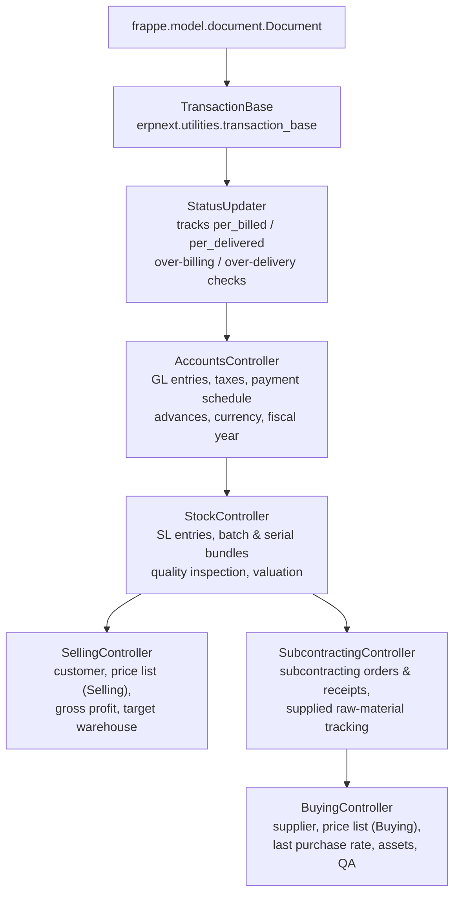

# Controller hierarchy

> **TL;DR:** Transaction DocTypes in ERPNext inherit from a fixed chain of controllers under [erpnext/controllers/](../../erpnext/controllers). Each layer adds one concern: status propagation → accounting (GL, taxes, payments) → stock (SL, batch/serial, quality inspection) → selling or buying specialisation (subcontracting is a branch between `StockController` and `BuyingController`). Concrete DocType classes call `super().validate() / super().on_submit() / super().on_cancel()` so every layer contributes in order.

## The chain (verified by reading the class signatures)



> Note: in this repository `BuyingController` extends `SubcontractingController`, not `StockController` directly (see [erpnext/controllers/buying_controller.py:29](../../erpnext/controllers/buying_controller.py:29)). `SubcontractingController` in turn extends `StockController` at [erpnext/controllers/subcontracting_controller.py:26](../../erpnext/controllers/subcontracting_controller.py:26).

## Key files

- [erpnext/controllers/status_updater.py](../../erpnext/controllers/status_updater.py:180) — `StatusUpdater(Document)`; defines `status_map`, `set_status`, `update_prevdoc_status`, `validate_qty`, billing-status roll-up.
- [erpnext/controllers/accounts_controller.py](../../erpnext/controllers/accounts_controller.py:104) — `AccountsController(TransactionBase)`; `validate`, `before_cancel`, `on_trash`, `on_cancel`, tax setup, payment schedule, party account currency, fiscal-year validation, regional hook calls.
- [erpnext/controllers/stock_controller.py](../../erpnext/controllers/stock_controller.py:56) — `StockController(AccountsController)`; `validate`, `on_update`, `make_gl_entries`, `make_sl_entries`, quality inspection, batch expiry.
- [erpnext/controllers/selling_controller.py](../../erpnext/controllers/selling_controller.py:18) — `SellingController(StockController)`; `validate`, `set_missing_values` (customer + selling price list), gross profit, target warehouse.
- [erpnext/controllers/subcontracting_controller.py](../../erpnext/controllers/subcontracting_controller.py:26) — `SubcontractingController(StockController)`; `before_validate`, `validate`, raw-materials supplied/received tracking.
- [erpnext/controllers/buying_controller.py](../../erpnext/controllers/buying_controller.py:29) — `BuyingController(SubcontractingController)`; `validate`, `set_missing_values` (supplier + buying price list), `on_submit`, `on_cancel`, last purchase rate, fixed-asset auto-creation.
- [erpnext/controllers/taxes_and_totals.py](../../erpnext/controllers/taxes_and_totals.py:1) — tax & total calculation engine invoked from `AccountsController.validate`.
- [erpnext/controllers/sales_and_purchase_return.py](../../erpnext/controllers/sales_and_purchase_return.py:1) — return handling shared between sales and buying sides.

## Responsibilities per layer

### `TransactionBase`
Foundational mixin for all transactional records. Provides common helpers (currency fetch, party-address fetch, company defaults). Imported at [erpnext/controllers/accounts_controller.py:80](../../erpnext/controllers/accounts_controller.py:80).

### `StatusUpdater`
Owns the **cross-document status machine**. Every transaction has a `status` (e.g. Sales Order: `Draft / To Deliver and Bill / To Bill / Completed / Cancelled / Closed / On Hold`). The mapping lives in `status_map` at [erpnext/controllers/status_updater.py:20](../../erpnext/controllers/status_updater.py:20).

Public methods:
- `set_status(update=False, status=None)` — recompute status from `status_map` using `eval:` rules; optionally persist. See [erpnext/controllers/status_updater.py:195](../../erpnext/controllers/status_updater.py:195).
- `get_status()` — dict of `{status, per_billed, ...}`. Can be overridden per DocType for custom logic. See [erpnext/controllers/status_updater.py:216](../../erpnext/controllers/status_updater.py:216).
- `update_prevdoc_status()` — cascade completion back to referenced prior docs (e.g. Sales Invoice updates `per_billed` on its source Sales Order). See [erpnext/controllers/status_updater.py:191](../../erpnext/controllers/status_updater.py:191).
- `validate_qty()` — enforce over-delivery / over-billing limits via `check_overflow_with_allowance` ([erpnext/controllers/status_updater.py:388](../../erpnext/controllers/status_updater.py:388)); raises `OverAllowanceError` when the role is not in `role_allowed_to_over_deliver_receive` / `role_allowed_to_over_bill`.
- `update_billing_status` / `update_billing_status_for_zero_amount_refdoc` — maintain `per_billed` and `billing_status` on source documents ([erpnext/controllers/status_updater.py:652](../../erpnext/controllers/status_updater.py:652)).

### `AccountsController`
Heavy lifting for money-related concerns. Declares `validate`, `before_cancel`, `on_trash`, `on_cancel` at the layer level.

Key behaviours inside `AccountsController.validate` ([erpnext/controllers/accounts_controller.py:218](../../erpnext/controllers/accounts_controller.py:218)):
- `validate_qty_is_not_zero`
- `set_missing_values(for_validate=True)` if action is not `update_after_submit`
- `ensure_supplier_is_not_blocked`
- `validate_date_with_fiscal_year`, `validate_party_accounts`
- `validate_inter_company_reference`, `validate_internal_transaction`
- `set_incoming_rate`, `validate_against_voucher_outstanding`
- Tax setup: `validate_enabled_taxes_and_charges`, `validate_tax_account_company`, `set_taxes_and_charges`, `calculate_taxes_and_totals`
- Returns: `validate_return(self)` from [erpnext/controllers/sales_and_purchase_return.py](../../erpnext/controllers/sales_and_purchase_return.py:1)
- `validate_all_documents_schedule` — payment schedule
- Regional hooks: `validate_regional(self)` and `validate_einvoice_fields(self)` inside a `temporary_flag("company", self.company)` context, see [erpnext/controllers/accounts_controller.py:301](../../erpnext/controllers/accounts_controller.py:301). Both functions are `@erpnext.allow_regional` stubs at [erpnext/controllers/accounts_controller.py:4314](../../erpnext/controllers/accounts_controller.py:4314).
- Pricing rules: `apply_pricing_rule_on_transaction`
- Address / company consistency: `validate_company_in_accounting_dimension`, `validate_party_address_and_contact`, `validate_company_linked_addresses`

`AccountsController.on_trash` at [erpnext/controllers/accounts_controller.py:464](../../erpnext/controllers/accounts_controller.py:464) optionally deletes linked `GL Entry`, `Stock Ledger Entry`, `Payment Ledger Entry`, and exchange gain/loss journals (gated by `Accounts Settings.delete_linked_ledger_entries`).

`AccountsController.on_cancel` at [erpnext/controllers/accounts_controller.py:1956](../../erpnext/controllers/accounts_controller.py:1956) removes the doc from `Bank Transaction`, cancels system-generated credit/debit notes, cancels exchange-gain/loss and common-party journals, and optionally unlinks payment entries (gated by `Accounts Settings.unlink_payment_on_cancellation_of_invoice`). For `Sales Order` / `Purchase Order` it unlinks advance payments.

`AccountsController.on_update` at [erpnext/controllers/accounts_controller.py:142](../../erpnext/controllers/accounts_controller.py:142) calls `process_item_wise_tax_details` from [taxes_and_totals.py](../../erpnext/controllers/taxes_and_totals.py:1).

### `StockController`
Adds stock-specific validation and the two posting entry points.

`StockController.validate` ([erpnext/controllers/stock_controller.py:57](../../erpnext/controllers/stock_controller.py:57)):
1. `super().validate()` — full `AccountsController` validation.
2. `validate_duplicate_serial_and_batch_bundle` for each of `items / packed_items / supplied_items`.
3. `validate_inspection` (quality inspection) unless this is a return.
4. `validate_warehouse_of_sabb`, `validate_serialized_batch`, `clean_serial_nos`, `validate_customer_provided_item`.
5. `set_rate_of_stock_uom`, `validate_internal_transfer`, `validate_putaway_capacity`, `reset_conversion_factor`.

Entry points:
- `make_gl_entries(gl_entries=None, from_repost=False, via_landed_cost_voucher=False)` at [erpnext/controllers/stock_controller.py:256](../../erpnext/controllers/stock_controller.py:256) — handles both normal posting and cancellation (reverse) path.
- `make_sl_entries(sl_entries, allow_negative_stock=False, via_landed_cost_voucher=False)` at [erpnext/controllers/stock_controller.py:1232](../../erpnext/controllers/stock_controller.py:1232) — delegates to `erpnext.stock.stock_ledger.make_sl_entries` and then `update_batch_qty`.

Error classes declared here: `QualityInspectionRequiredError`, `QualityInspectionRejectedError`, `QualityInspectionNotSubmittedError`, `BatchExpiredError` (see top of file).

### `SubcontractingController`
Branch inserted above `BuyingController`. Handles Subcontracting Order, Subcontracting Inward Order, and Subcontracting Receipt, plus the legacy "old subcontracting flow" on `Purchase Order` / `Purchase Receipt`.

`SubcontractingController.__init__` ([erpnext/controllers/subcontracting_controller.py:27](../../erpnext/controllers/subcontracting_controller.py:27)) sets `self.subcontract_data` based on `is_old_subcontracting_flow` flag or the current doctype. This dict parameterises raw-material resolution (e.g. `order_doctype`, `rm_detail_field`).

`before_validate` ([erpnext/controllers/subcontracting_controller.py:58](../../erpnext/controllers/subcontracting_controller.py:58)) runs only for `Subcontracting Order / Subcontracting Inward Order / Subcontracting Receipt`, trimming empty rows and setting conversion factors.

`validate` ([erpnext/controllers/subcontracting_controller.py:67](../../erpnext/controllers/subcontracting_controller.py:67)) has two branches:
- Subcontracting DocTypes → `validate_items`, `create_raw_materials_supplied_or_received`, `set_valuation_rate_for_rm`.
- Everything else → `super().validate()` (i.e. `StockController.validate`).

### `SellingController`
Sales side. Consumers: `Quotation`, `Sales Order`, `Delivery Note`, `Sales Invoice`.

`validate` ([erpnext/controllers/selling_controller.py:59](../../erpnext/controllers/selling_controller.py:59)):
1. `super().validate()` — `StockController.validate` → `AccountsController.validate`.
2. `validate_items`, `validate_max_discount`, `validate_selling_price`.
3. `set_qty_as_per_stock_uom`, `set_po_nos(for_validate=True)`, `set_gross_profit`.
4. `set_default_income_account_for_item(self)`.
5. `set_customer_address`, `validate_for_duplicate_items`, `validate_target_warehouse`.
6. `validate_auto_repeat_subscription_dates`.
7. `set_serial_and_batch_bundle` for `items` and `packed_items`.

`set_missing_values` ([erpnext/controllers/selling_controller.py:109](../../erpnext/controllers/selling_controller.py:109)) fetches customer/lead party details, selling price list, company contact person.

### `BuyingController`
Buying side. Consumers: `Material Request`, `Request for Quotation`, `Supplier Quotation`, `Purchase Order`, `Purchase Receipt`, `Purchase Invoice`.

`validate` ([erpnext/controllers/buying_controller.py:33](../../erpnext/controllers/buying_controller.py:33)):
1. `set_rate_for_standalone_debit_note`
2. `super().validate()` — `SubcontractingController.validate` → `StockController.validate` → `AccountsController.validate`.
3. Supplier resolution: `supplier_name` from `supplier` master.
4. `validate_items`, `set_qty_as_per_stock_uom`, `validate_stock_or_nonstock_items`.
5. `validate_warehouse`, `validate_from_warehouse`, `set_supplier_address`.
6. `validate_asset_return`, `validate_auto_repeat_subscription_dates`, `create_package_for_transfer`.
7. `Purchase Invoice`: `validate_purchase_receipt_if_update_stock`.
8. `Purchase Receipt` or `Purchase Invoice with update_stock`: `validate_purchase_return`, `validate_rejected_warehouse`, `validate_accepted_rejected_qty`, `validate_for_items`, subcontracting checks, landed cost calculation.
9. `Purchase Receipt / Purchase Invoice`: `update_valuation_rate`, `set_serial_and_batch_bundle`.

`BuyingController.on_submit` ([erpnext/controllers/buying_controller.py:932](../../erpnext/controllers/buying_controller.py:932)): `process_fixed_asset` for PR/PI; `update_last_purchase_rate(self, is_submit=1)` for PO/PR/PI (gated by `Buying Settings.disable_last_purchase_rate`).

`BuyingController.on_cancel` ([erpnext/controllers/buying_controller.py:946](../../erpnext/controllers/buying_controller.py:946)): `super().on_cancel()` (AccountsController), then reverse `update_last_purchase_rate`, then `delete_linked_asset` / `update_fixed_asset(..., delete_asset=True)` for PR/PI.

## The super() call order at submit

For a concrete Sales Invoice ([erpnext/accounts/doctype/sales_invoice/sales_invoice.py:59](../../erpnext/accounts/doctype/sales_invoice/sales_invoice.py:59)), `on_submit` produces this runtime stack (explicit calls + inherited passthroughs):

```mermaid
sequenceDiagram
  participant Frappe
  participant SI as SalesInvoice.on_submit
  participant SC as SellingController
  participant STK as StockController
  participant AC as AccountsController
  participant SU as StatusUpdater

  Frappe->>SI: on_submit()
  Note over SI: SalesInvoice does not call super().on_submit();<br/>it orchestrates directly (line 450)
  SI->>SU: update_prevdoc_status() (line 467)
  SI->>SU: update_billing_status_in_dn() (line 469)
  SI->>STK: update_stock_ledger() → make_sl_entries (line 484)
  SI->>AC: make_gl_entries() → StockController override → general_ledger (line 491)
  SI->>AC: update_billing_status_for_zero_amount_refdoc (line 497-498)
```

In other words, `super().on_submit()` is **not** universal — several concrete DocTypes orchestrate the same building blocks (`update_prevdoc_status`, `make_sl_entries`, `make_gl_entries`) explicitly. The chain *is* universal at `validate()`, where every concrete class calls `super().validate()`.

See [doctype-lifecycle.md](doctype-lifecycle.md) for a complete per-event map.

## Where to put new cross-transaction logic

- **Affects every transaction, regardless of side** → `AccountsController`.
- **Affects anything that touches inventory** → `StockController`.
- **Sales side only** → `SellingController`.
- **Purchase side only** → `BuyingController`.
- **Subcontracting-specific** → `SubcontractingController`.
- **Cross-doc status propagation / over-limit checks** → `StatusUpdater`.
- **Country-specific** → do **not** edit controllers; add a function in `erpnext/regional/<country>/utils.py` and register it in `regional_overrides` (see [regional-overrides.md](../patterns/regional-overrides.md)).

## Related

- [DocType lifecycle](doctype-lifecycle.md) — which methods fire at validate / submit / cancel / trash.
- [DocType pattern](doctype-pattern.md) — the files around each controller class.
- [Hooks and overrides](hooks-and-overrides.md) — how `regional_overrides` and `extend_doctype_class` participate.

## Changelog

- `2026-04-17` — initial version.
