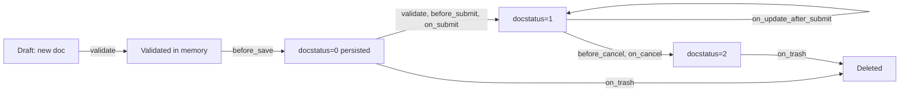
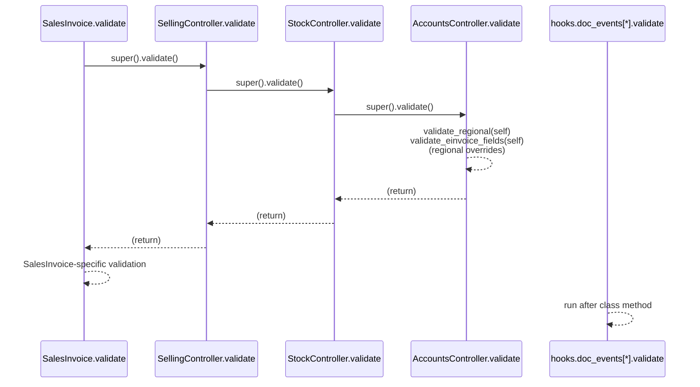

# DocType lifecycle

> **TL;DR:** A submittable ERPNext transaction goes through `before_validate → validate → before_save → (before_submit → on_submit) → on_update_after_submit → (before_cancel → on_cancel) → on_trash`. At each step, Frappe first calls the concrete class's method; that method typically calls `super().method()`, which walks up the [controller chain](controllers.md) (`Concrete → SellingController/BuyingController → StockController → AccountsController → StatusUpdater → TransactionBase → Document`). `doc_events` registered in [erpnext/hooks.py:343](../../erpnext/hooks.py:343) fire in addition — their run order relative to the class method depends on the event (Frappe calls hooks *after* the class method for most events).

## Overall lifecycle

- `docstatus` values: `0` Draft, `1` Submitted, `2` Cancelled.
- Only DocTypes with `is_submittable: 1` in the JSON schema traverse the submit/cancel path. Others go `new → validate → before_save → on_update → on_trash`.

## Per-event call order (submittable transaction)

For each event, the **concrete DocType class method runs first**, which typically calls `super().<method>()` to invoke the controller chain. Then Frappe invokes any `doc_events` handlers registered in `hooks.py`.

### `validate`

Runs on every save (both while in Draft and immediately before Submit). Concrete classes almost always call `super().validate()` first.

Key calls in each layer:
- `AccountsController.validate` at [erpnext/controllers/accounts_controller.py:218](../../erpnext/controllers/accounts_controller.py:218) — fiscal year, party, tax setup, pricing rules, regional stubs, address validation.
- `StockController.validate` at [erpnext/controllers/stock_controller.py:57](../../erpnext/controllers/stock_controller.py:57) — serial/batch bundles, inspection, warehouse, putaway.
- `SellingController.validate` at [erpnext/controllers/selling_controller.py:59](../../erpnext/controllers/selling_controller.py:59) — items, max discount, gross profit, customer address.
- `BuyingController.validate` at [erpnext/controllers/buying_controller.py:33](../../erpnext/controllers/buying_controller.py:33) — supplier, warehouses, fixed-asset returns, subcontracting checks.
- Concrete `SalesInvoice.validate` at [erpnext/accounts/doctype/sales_invoice/sales_invoice.py:300](../../erpnext/accounts/doctype/sales_invoice/sales_invoice.py:300) — SI-specific: `so_dn_required`, `validate_debit_to_acc`, `validate_fixed_asset`, `validate_accounts`.

Global `doc_events["*"].validate` hooks registered at [erpnext/hooks.py:345](../../erpnext/hooks.py:345):
- `erpnext.support.doctype.service_level_agreement.service_level_agreement.apply`
- `erpnext.setup.doctype.transaction_deletion_record.transaction_deletion_record.check_for_running_deletion_job`

Plus per-DocType `validate` hooks (e.g. Accounting Period check for period-closing doctypes at [erpnext/hooks.py:350](../../erpnext/hooks.py:350)).

### `before_save`

Runs just before the row is written to the database. Only the concrete class tends to implement it (the controller chain does not, as a rule). Example: Sales Invoice sets `paid_amount` here — [erpnext/accounts/doctype/sales_invoice/sales_invoice.py:443](../../erpnext/accounts/doctype/sales_invoice/sales_invoice.py:443).

### `before_submit`

Final pre-submit adjustments (e.g. add remarks). Example: [erpnext/accounts/doctype/sales_invoice/sales_invoice.py:447](../../erpnext/accounts/doctype/sales_invoice/sales_invoice.py:447) calls `add_remarks`.

### `on_submit`

This is where GL entries and Stock Ledger entries are typically posted. **Not every concrete class calls `super().on_submit()`** — several orchestrate the building blocks (`make_sl_entries`, `make_gl_entries`, `update_prevdoc_status`) directly, because the ordering is precise.

Example: Sales Invoice ([erpnext/accounts/doctype/sales_invoice/sales_invoice.py:450](../../erpnext/accounts/doctype/sales_invoice/sales_invoice.py:450)) does, in order:
1. `validate_pos_paid_amount()`
2. `check_prev_docstatus()`
3. `SalesTaxWithholding(self).on_submit()`
4. `update_status_updater_args()` and `update_prevdoc_status()` — cascades `per_delivered` / `per_billed` to Sales Order (see [status_updater.py:191](../../erpnext/controllers/status_updater.py:191)).
5. `update_billing_status_in_dn()` — back-propagates billing to Delivery Note.
6. If `update_stock == 1`: `update_stock_ledger()` — invokes `make_sl_entries` under the hood.
7. `make_gl_entries()` — concrete override at [sales_invoice.py:1537](../../erpnext/accounts/doctype/sales_invoice/sales_invoice.py:1537).
8. `update_billing_status_for_zero_amount_refdoc("Delivery Note" / "Sales Order")`.
9. `update_against_document_in_jv()` unless POS.
10. Loyalty / coupon / common-party / billed-qty side effects.

Example: Buying side — `BuyingController.on_submit` at [erpnext/controllers/buying_controller.py:932](../../erpnext/controllers/buying_controller.py:932):
- `process_fixed_asset` for `Purchase Receipt` / `Purchase Invoice`
- `update_last_purchase_rate(self, is_submit=1)` for PO/PR/PI (gated by `Buying Settings.disable_last_purchase_rate`)

Per-DocType `on_submit` hooks from `hooks.py`:
- Italy Sales Invoice submit handler at [erpnext/hooks.py:376](../../erpnext/hooks.py:376): `erpnext.regional.italy.utils.sales_invoice_on_submit`.
- Stock Entry → Material Request qty update at [erpnext/hooks.py:354](../../erpnext/hooks.py:354).

### `on_update_after_submit`

Fires when a submitted document is edited (only fields flagged `allow_on_submit` in the schema can be edited). Example at [erpnext/accounts/doctype/sales_invoice/sales_invoice.py:841](../../erpnext/accounts/doctype/sales_invoice/sales_invoice.py:841).

> Note: `AccountsController.validate` at [erpnext/controllers/accounts_controller.py:229](../../erpnext/controllers/accounts_controller.py:229) branches on `self._action != "update_after_submit"` before calling `set_missing_values`, to avoid re-fetching on inline edits.

### `before_cancel`

Last chance to block or clean up before cancellation. `AccountsController.before_cancel` at [erpnext/controllers/accounts_controller.py:373](../../erpnext/controllers/accounts_controller.py:373) calls `validate_einvoice_fields(self)` (regional stub). Concrete classes typically call `super().before_cancel()` — see Sales Invoice [sales_invoice.py:583](../../erpnext/accounts/doctype/sales_invoice/sales_invoice.py:583).

### `on_cancel`

Reverse accounting and stock postings, then unlink dependent docs. `AccountsController.on_cancel` at [erpnext/controllers/accounts_controller.py:1956](../../erpnext/controllers/accounts_controller.py:1956) handles:
- Removes from Bank Transaction.
- For `Sales Invoice / Purchase Invoice / Payment Entry / Journal Entry`: cancels system-generated credit/debit notes, exchange-gain/loss journals, common-party journals, optionally unlinks payment entries.
- For `Sales Order / Purchase Order`: optionally unlinks advance payments; Sales Order also unlinks its children from downstream Purchase Orders (`unlink_ref_doc_from_po`).

`BuyingController.on_cancel` at [erpnext/controllers/buying_controller.py:946](../../erpnext/controllers/buying_controller.py:946): `super().on_cancel()`, then reverse last-purchase-rate, then delete auto-created assets for PR/PI.

Concrete Sales Invoice ([sales_invoice.py:586](../../erpnext/accounts/doctype/sales_invoice/sales_invoice.py:586)):
1. `check_if_return_invoice_linked_with_payment_entry(self)`
2. `super().on_cancel()` — AccountsController cleanup.
3. `update_status_updater_args()` and `update_prevdoc_status()` — reverse cascade.
4. `update_billing_status_in_dn()`.
5. `SalesTaxWithholding(self).on_cancel()`.
6. If `update_stock == 1`: `update_stock_ledger()` — writes reversing SLE.

**Reverse ledger entries, not deletion.** GL Entry / Stock Ledger Entry / Payment Ledger Entry / Advance Payment Ledger Entry are in `auto_cancel_exempted_doctypes` at [erpnext/hooks.py:418](../../erpnext/hooks.py:418) — cancelling the parent creates reverse entries instead of cancelling the ledger rows, preserving ledger immutability.

Per-DocType `on_cancel` hooks:
- Italy Sales Invoice cancel handler at [erpnext/hooks.py:379](../../erpnext/hooks.py:379).
- Stock Entry → Material Request qty update at [erpnext/hooks.py:355](../../erpnext/hooks.py:355).

### `on_trash`

Runs on delete. `AccountsController.on_trash` at [erpnext/controllers/accounts_controller.py:464](../../erpnext/controllers/accounts_controller.py:464):
1. `_remove_references_in_repost_doctypes` — detach from `Repost Payment Ledger Items` / `Repost Accounting Ledger Items`.
2. `_remove_references_in_unreconcile` — detach from `Unreconcile Payment`.
3. `remove_serial_and_batch_bundle`.
4. If `Accounts Settings.delete_linked_ledger_entries` is set: delete linked GL / SL / Payment Ledger entries, cancel exchange-gain/loss journal, remove Advance Payment Ledger entries.

Per-DocType `on_trash` hooks in [erpnext/hooks.py:382](../../erpnext/hooks.py:382):
- `Sales Invoice`, `Payment Entry` → `erpnext.regional.check_deletion_permission`.
- `Contact` → `erpnext.support.doctype.issue.issue.update_issue`.

## `super()` call discipline

The chain is only automatic where concrete classes call `super()`. Verified patterns:

| Method | Always calls `super()`? | Evidence |
|---|---|---|
| `validate` | **Yes** across the codebase — every controller's `validate` starts with `super().validate()`. | [stock_controller.py:58](../../erpnext/controllers/stock_controller.py:58), [selling_controller.py:60](../../erpnext/controllers/selling_controller.py:60), [buying_controller.py:36](../../erpnext/controllers/buying_controller.py:36), [sales_invoice.py:302](../../erpnext/accounts/doctype/sales_invoice/sales_invoice.py:302). |
| `on_submit` | **No.** Concrete classes typically *do not* call `super().on_submit()`; they orchestrate `update_prevdoc_status`, `make_sl_entries`, `make_gl_entries` directly. `BuyingController.on_submit` is the exception that *is* inherited when no concrete override exists. | [buying_controller.py:932](../../erpnext/controllers/buying_controller.py:932), [sales_invoice.py:450](../../erpnext/accounts/doctype/sales_invoice/sales_invoice.py:450) does not call super. |
| `on_cancel` | **Yes**, in the concrete classes examined. | [sales_invoice.py:589](../../erpnext/accounts/doctype/sales_invoice/sales_invoice.py:589), [buying_controller.py:947](../../erpnext/controllers/buying_controller.py:947). |
| `before_cancel` | **Yes**. | [sales_invoice.py:583](../../erpnext/accounts/doctype/sales_invoice/sales_invoice.py:583). |
| `set_missing_values` | **Yes** at each layer. | [selling_controller.py:110](../../erpnext/controllers/selling_controller.py:110), [buying_controller.py:209](../../erpnext/controllers/buying_controller.py:209). |

When adding a lifecycle method to a concrete DocType, **always** check whether the parent controller already implements it and decide explicitly whether to call `super()`.

## Related

- [Controller hierarchy](controllers.md)
- [DocType pattern](doctype-pattern.md)
- [Hooks and overrides](hooks-and-overrides.md)

## Changelog

- `2026-04-17` — initial version.
