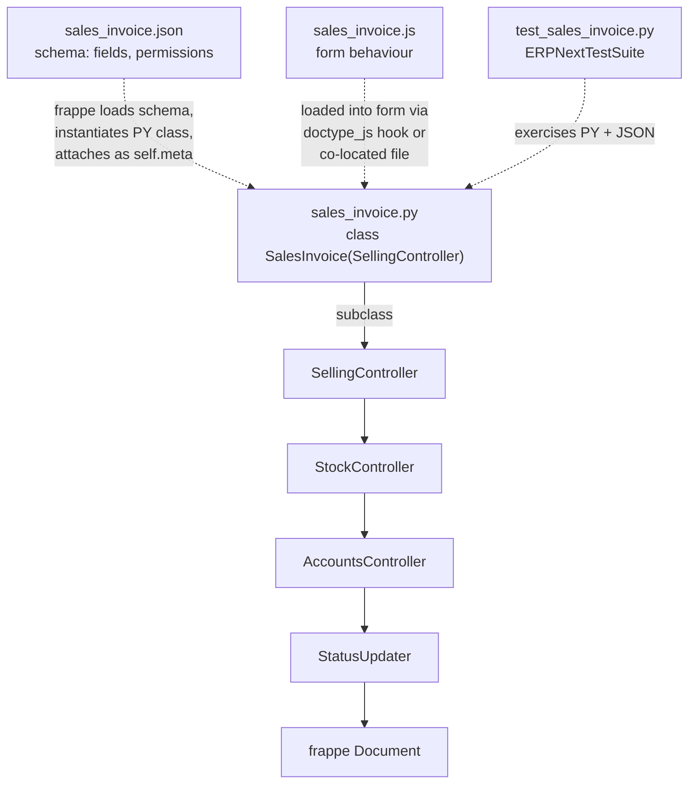

# DocType pattern

> **TL;DR:** Every business entity in ERPNext is a **DocType** — a Frappe construct that combines a JSON schema, a Python controller, a JS form script, and tests. Transaction DocTypes plug into the [controller hierarchy](controllers.md) by subclassing `SellingController`, `BuyingController`, `StockController`, `AccountsController`, or (most commonly) their concrete children like `SalesInvoice(SellingController)`. The `.json` is the schema source of truth.

## File layout per DocType

Every DocType lives in `erpnext/<module>/doctype/<name>/`. A canonical example — Sales Invoice:

```
erpnext/accounts/doctype/sales_invoice/
├── __init__.py
├── README.md                         — optional prose
├── regional/                         — country-specific templates (print formats, e-invoice XML)
├── sales_invoice.json                — schema: fields, permissions, workflow, naming
├── sales_invoice.py                  — Python controller (extends SellingController)
├── sales_invoice.js                  — client-side form script
├── sales_invoice_dashboard.py        — related-links panel on the form
├── sales_invoice_list.js             — list-view customisation
├── test_records.json                 — sample records for tests
└── test_sales_invoice.py             — tests (extends ERPNextTestSuite)
```

Verified by listing [erpnext/accounts/doctype/sales_invoice/](../../erpnext/accounts/doctype/sales_invoice).

## The four mandatory parts

### 1. `<name>.json` — schema

The JSON is the **source of truth for field-level concerns**: field list, types, options, permissions matrix, workflow states, child tables, naming rule, `is_submittable` flag. When investigating a DocType, read the JSON **in full** — never skim. Fields not declared here cannot be accessed on `self` without `db_set` workarounds.

Important top-level keys:

- `fields: [...]` — every field, including child-table columns (referenced by `options` pointing to another DocType).
- `permissions: [...]` — role-based permissions.
- `autoname` — naming series pattern (e.g. `ACC-SINV-.YYYY.-` or `naming_series:`).
- `is_submittable: 1` — enables the `docstatus` lifecycle (Draft / Submitted / Cancelled).
- `track_changes`, `track_seen`, `track_views` — audit-level flags.
- `engine: "InnoDB"` — MariaDB storage engine.

Child tables are separate DocTypes (e.g. `Sales Invoice Item`) referenced from the parent via `fieldtype: "Table"` + `options: "<Child DocType>"`.

### 2. `<name>.py` — controller

Python class that extends either `Document` (for non-transactional DocTypes) or one of the controllers in `erpnext/controllers/`. Example: `class SalesInvoice(SellingController)` at [erpnext/accounts/doctype/sales_invoice/sales_invoice.py:59](../../erpnext/accounts/doctype/sales_invoice/sales_invoice.py:59).

Lifecycle methods defined here override / extend the chain. Typical Sales Invoice outline:

- `validate` at [sales_invoice.py:300](../../erpnext/accounts/doctype/sales_invoice/sales_invoice.py:300) — calls `super().validate()` first, then sales-invoice-specific rules.
- `before_save` at [sales_invoice.py:443](../../erpnext/accounts/doctype/sales_invoice/sales_invoice.py:443).
- `before_submit` at [sales_invoice.py:447](../../erpnext/accounts/doctype/sales_invoice/sales_invoice.py:447).
- `on_submit` at [sales_invoice.py:450](../../erpnext/accounts/doctype/sales_invoice/sales_invoice.py:450) — orchestrates `update_prevdoc_status`, `update_stock_ledger`, `make_gl_entries`, etc.
- `before_cancel` at [sales_invoice.py:578](../../erpnext/accounts/doctype/sales_invoice/sales_invoice.py:578).
- `on_cancel` at [sales_invoice.py:586](../../erpnext/accounts/doctype/sales_invoice/sales_invoice.py:586) — calls `super().on_cancel()` (AccountsController).
- `on_update_after_submit` at [sales_invoice.py:841](../../erpnext/accounts/doctype/sales_invoice/sales_invoice.py:841).
- `set_missing_values` at [sales_invoice.py:746](../../erpnext/accounts/doctype/sales_invoice/sales_invoice.py:746).
- `make_gl_entries` at [sales_invoice.py:1537](../../erpnext/accounts/doctype/sales_invoice/sales_invoice.py:1537) — overrides `StockController.make_gl_entries`.
- `set_status` at [sales_invoice.py:2208](../../erpnext/accounts/doctype/sales_invoice/sales_invoice.py:2208) — overrides `StatusUpdater.set_status`.

See [doctype-lifecycle.md](doctype-lifecycle.md) for the call order at each phase.

### 3. `<name>.js` — client script

Runs in the Desk form. Registers handlers via `frappe.ui.form.on("<DocType>", { ... })`. Typical concerns: field visibility, fetch-on-change logic, buttons under `Create` / `Get Items From`, client-side validation.

Client scripts are **not** the source of truth for validation — the server-side controller always re-validates.

### 4. `test_<name>.py` — tests

Test classes extend `ERPNextTestSuite` from [erpnext/tests/utils.py](../../erpnext/tests/utils.py:1). Tests run via:

```bash
bench --site <site-name> run-tests --module erpnext.accounts.doctype.sales_invoice.test_sales_invoice
```

See the [root CLAUDE.md](../../CLAUDE.md) `Running Tests` section.

## How a transaction DocType plugs into the controller chain



Dashed arrows are build-time / load-time wiring performed by Frappe; solid arrow is Python inheritance.

## Concrete DocType → controller mapping

The mapping below comes from inspecting the `class X(Y)` declarations:

| DocType | Controller | File |
|---|---|---|
| Sales Invoice | `SellingController` | [erpnext/accounts/doctype/sales_invoice/sales_invoice.py:59](../../erpnext/accounts/doctype/sales_invoice/sales_invoice.py:59) |
| Sales Order | `SellingController` | `erpnext/selling/doctype/sales_order/sales_order.py` |
| Delivery Note | `SellingController` | `erpnext/stock/doctype/delivery_note/delivery_note.py` |
| Quotation | `SellingController` | `erpnext/selling/doctype/quotation/quotation.py` |
| Purchase Invoice | `BuyingController` | `erpnext/accounts/doctype/purchase_invoice/purchase_invoice.py` |
| Purchase Order | `BuyingController` | `erpnext/buying/doctype/purchase_order/purchase_order.py` |
| Purchase Receipt | `BuyingController` | `erpnext/stock/doctype/purchase_receipt/purchase_receipt.py` |
| Material Request | `BuyingController` | `erpnext/stock/doctype/material_request/material_request.py` |
| Supplier Quotation | `BuyingController` | `erpnext/buying/doctype/supplier_quotation/supplier_quotation.py` |
| Subcontracting Order | `SubcontractingController` | `erpnext/subcontracting/doctype/subcontracting_order/subcontracting_order.py` |
| Subcontracting Receipt | `SubcontractingController` | `erpnext/subcontracting/doctype/subcontracting_receipt/subcontracting_receipt.py` |
| Stock Entry | `StockController` | `erpnext/stock/doctype/stock_entry/stock_entry.py` |
| Journal Entry | `AccountsController` | `erpnext/accounts/doctype/journal_entry/journal_entry.py` |
| Payment Entry | `AccountsController` | `erpnext/accounts/doctype/payment_entry/payment_entry.py` |

> TODO(verify): only Sales Invoice and Purchase Invoice were confirmed by direct read. The rest are mapped from the canonical list in [CLAUDE.md](../../CLAUDE.md) and the chain declared in [erpnext/controllers/buying_controller.py:29](../../erpnext/controllers/buying_controller.py:29) / [erpnext/controllers/selling_controller.py:18](../../erpnext/controllers/selling_controller.py:18). When editing any specific DocType, re-read its `class X(Y)` line first.

## Non-transactional DocTypes

Master data DocTypes (Customer, Supplier, Item, Warehouse, Company, Account, Cost Center) generally extend `Document` or a small specialised base (e.g. `NestedSet` for tree-organised entities). They do not participate in the controller chain above; their lifecycle is the vanilla Frappe one.

Tree-organised DocTypes are declared via the `treeviews` hook at [erpnext/hooks.py:77](../../erpnext/hooks.py:77):

```
treeviews = ["Account", "Cost Center", "Warehouse", "Item Group", "Customer Group",
             "Supplier Group", "Sales Person", "Territory", "Department"]
```

## Cross-cutting augmentation

Without subclassing, two `hooks.py` mechanisms can attach behaviour to a DocType:

- `doc_events` — register a free function to run on a lifecycle event (any DocType, including Frappe core). Example at [erpnext/hooks.py:375](../../erpnext/hooks.py:375) adding Italy-specific handlers to Sales Invoice `on_submit` / `on_cancel`.
- `extend_doctype_class` — inject an additional base class into a specific DocType's controller. Example at [erpnext/hooks.py:56](../../erpnext/hooks.py:56) adding `ERPNextAddress` to Frappe's core `Address` DocType.

See [hooks-and-overrides.md](hooks-and-overrides.md) for the full catalogue.

## Related

- [Controller hierarchy](controllers.md)
- [DocType lifecycle](doctype-lifecycle.md)
- [Hooks and overrides](hooks-and-overrides.md)

## Changelog

- `2026-04-17` — initial version.
