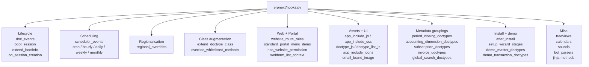

# Hooks and overrides

> **TL;DR:** [erpnext/hooks.py](../../erpnext/hooks.py:1) is the single declarative registry that wires ERPNext into the Frappe framework. It declares lifecycle hooks (`doc_events`), scheduled jobs (`scheduler_events`), regional function swaps (`regional_overrides`), class injections (`extend_doctype_class`), whitelisted method overrides (`override_whitelisted_methods`), portal routes (`website_route_rules`, `standard_portal_menu_items`), boot-time data (`boot_session`, `extend_bootinfo`), DocType groupings for accounting dimensions and subscriptions, and more. **When tracing any cross-cutting behaviour, open `hooks.py` first.**

## Key file

- [erpnext/hooks.py](../../erpnext/hooks.py:1) — 714 lines of declarative registrations. Everything below cites specific line ranges in this file.

## Registration categories



## 1. `doc_events` — lifecycle hooks

Declared at [erpnext/hooks.py:343](../../erpnext/hooks.py:343). Registers free functions to run at DocType lifecycle events. The `"*"` key applies to every DocType.

Global hooks (run on every save):
- [erpnext/hooks.py:345](../../erpnext/hooks.py:345) — `validate`:
  - `erpnext.support.doctype.service_level_agreement.service_level_agreement.apply`
  - `erpnext.setup.doctype.transaction_deletion_record.transaction_deletion_record.check_for_running_deletion_job`

Bulk-scoped via tuple keys:
- `tuple(period_closing_doctypes)` at [erpnext/hooks.py:350](../../erpnext/hooks.py:350) — `validate_accounting_period_on_doc_save`. `period_closing_doctypes` is itself declared at [erpnext/hooks.py:322](../../erpnext/hooks.py:322) and lists 17 doctypes (invoices, journal entries, stock entries, assets, etc.).

Per-DocType hooks worth remembering:
- `Stock Entry.on_submit / on_cancel` → `update_completed_and_requested_qty` on Material Request ([erpnext/hooks.py:353](../../erpnext/hooks.py:353)).
- `User.after_insert / validate / on_update` → contact / employee / portal wiring ([erpnext/hooks.py:357](../../erpnext/hooks.py:357)).
- `Communication.on_update / after_insert` — SLA, issue first-response time, CRM prospect linking ([erpnext/hooks.py:362](../../erpnext/hooks.py:362)).
- `Sales Invoice.on_submit / on_cancel / on_trash` — Italy regional hooks + deletion permission check ([erpnext/hooks.py:375](../../erpnext/hooks.py:375)).
- `Purchase Invoice.validate` — UAE RCM grand total update + returns validation ([erpnext/hooks.py:384](../../erpnext/hooks.py:384)).
- `Payment Entry.on_trash` → `erpnext.regional.check_deletion_permission` ([erpnext/hooks.py:390](../../erpnext/hooks.py:390)).
- `Address.validate` → Italy state-code setter ([erpnext/hooks.py:393](../../erpnext/hooks.py:393)).
- `Contact.on_trash / after_insert / validate` — issue update, call-log linking, CRM phone update ([erpnext/hooks.py:398](../../erpnext/hooks.py:398)).
- `Integration Request.validate` → `payment_request.validate_payment` ([erpnext/hooks.py:406](../../erpnext/hooks.py:406)).

Hooks fire **in addition to** the class method. Their ordering relative to the controller-chain methods follows Frappe's default (hooks run after the class method for most events).

## 2. `scheduler_events` — background jobs

Declared at [erpnext/hooks.py:433](../../erpnext/hooks.py:433). Schedules maintenance, billing, depreciation, refresh, and rollup jobs.

Frequencies used in this repo:
- `cron: "0/15 * * * *"` — BOM cost update resume ([erpnext/hooks.py:435](../../erpnext/hooks.py:435)).
- `cron: "0/30 * * * *"` — parallel reposting for Repost Item Valuation ([erpnext/hooks.py:438](../../erpnext/hooks.py:438)).
- `cron: "30 * * * *"` — rename GL/SL docs ([erpnext/hooks.py:442](../../erpnext/hooks.py:442)).
- `hourly` — project reminders ([erpnext/hooks.py:448](../../erpnext/hooks.py:448)).
- `hourly_maintenance` — item-valuation reposting, bulk-transaction retry, project status, Plaid sync, YouTube data ([erpnext/hooks.py:452](../../erpnext/hooks.py:452)).
- `daily_maintenance` — the big batch: issue auto-close, opportunity auto-close, [update_invoice_status](../../erpnext/controllers/accounts_controller.py:1), fiscal-year auto-create, supplier scorecards, company sales cache, asset maintenance, reorder items, subscription processing, email digest, BOM price update, depreciation posting — 30+ entries at [erpnext/hooks.py:462](../../erpnext/hooks.py:462).
- `weekly` — exchange-rate revaluation ([erpnext/hooks.py:493](../../erpnext/hooks.py:493)).
- `monthly_long` — deferred accounting + exchange revaluation ([erpnext/hooks.py:496](../../erpnext/hooks.py:496)).

See [scheduler-jobs.md](scheduler-jobs.md) for the full catalogue (every entry, owning module, blast radius) and guidance on adding new jobs.

## 3. `regional_overrides` — country-specific function swaps

Declared at [erpnext/hooks.py:608](../../erpnext/hooks.py:608). Maps a function path → its regional replacement, keyed by country.

Current entries:
- **France** — test-only override ([hooks.py:609](../../erpnext/hooks.py:609)).
- **United Arab Emirates** — `update_itemised_tax_data`, `make_regional_gl_entries` ([hooks.py:610](../../erpnext/hooks.py:610)).
- **Saudi Arabia** — reuses UAE's `update_itemised_tax_data` ([hooks.py:614](../../erpnext/hooks.py:614)).
- **Italy** — `update_itemised_tax_data`, `validate_regional` ([hooks.py:617](../../erpnext/hooks.py:617)).

The dispatch mechanism lives in `erpnext.allow_regional` at [erpnext/__init__.py:135](../../erpnext/__init__.py:135):

```python
def allow_regional(fn):
    @functools.wraps(fn)
    def caller(*args, **kwargs):
        overrides = frappe.get_hooks("regional_overrides", {}).get(get_region())
        function_path = f"{inspect.getmodule(fn).__name__}.{fn.__name__}"
        if not overrides or function_path not in overrides:
            return fn(*args, **kwargs)
        return frappe.get_attr(overrides[function_path][-1])(*args, **kwargs)
    return caller
```

`get_region()` at [erpnext/__init__.py:120](../../erpnext/__init__.py:120) resolves the country from `frappe.local.flags.company` → `Company.country` → `frappe.flags.country` → `System Settings.country`. See [patterns/regional-overrides.md](../patterns/regional-overrides.md) for the full pattern.

## 4. `extend_doctype_class` — class injection

Declared at [erpnext/hooks.py:56](../../erpnext/hooks.py:56):

```python
extend_doctype_class = {"Address": "erpnext.accounts.custom.address.ERPNextAddress"}
```

Frappe mixes the named class into the target DocType's MRO so ERPNext can add behaviour to Frappe's core `Address` without subclassing via `doctype_class`.

## 5. `override_whitelisted_methods` — RPC endpoint swap

Declared at [erpnext/hooks.py:58](../../erpnext/hooks.py:58):

```python
override_whitelisted_methods = {
    "frappe.www.contact.send_message": "erpnext.templates.utils.send_message"
}
```

Redirects any client call to `frappe.www.contact.send_message` to ERPNext's implementation.

## 6. Web and portal

- [erpnext/hooks.py:121](../../erpnext/hooks.py:121) — `website_route_rules`: 20+ portal URL patterns (`/orders`, `/invoices`, `/quotations`, `/shipments`, `/rfq`, `/material-requests`, ...). Each maps to either a DocType list or a detail template.
- [erpnext/hooks.py:231](../../erpnext/hooks.py:231) — `standard_portal_menu_items`: menu entries for `Customer` and `Supplier` roles.
- [erpnext/hooks.py:307](../../erpnext/hooks.py:307) — `has_website_permission`: per-DocType portal permission checkers (mostly delegating to `erpnext.controllers.website_list_for_contact.has_website_permission`).
- [erpnext/hooks.py:109](../../erpnext/hooks.py:109) — `webform_list_context`.
- [erpnext/hooks.py:111](../../erpnext/hooks.py:111) — `calendars`: DocTypes exposed to the calendar view.
- [erpnext/hooks.py:113](../../erpnext/hooks.py:113) — `website_generators`: `BOM`, `Sales Partner`.

## 7. Boot & startup

- [erpnext/hooks.py:68](../../erpnext/hooks.py:68) — `boot_session = "erpnext.startup.boot.boot_session"`. Runs once per session load; injects ERPNext defaults into `frappe.boot`.
- [erpnext/hooks.py:687](../../erpnext/hooks.py:687) — `extend_bootinfo`: two additional boot hooks for SLA doctypes and startup bootinfo.
- [erpnext/hooks.py:69](../../erpnext/hooks.py:69) — `notification_config`.
- [erpnext/hooks.py:75](../../erpnext/hooks.py:75) — `on_session_creation = "erpnext.portal.utils.create_customer_or_supplier"`.
- [erpnext/hooks.py:66](../../erpnext/hooks.py:66) — `after_install = "erpnext.setup.install.after_install"`.
- [erpnext/hooks.py:63](../../erpnext/hooks.py:63) — `setup_wizard_stages`.

## 8. Metadata groupings

These are plain Python lists consumed elsewhere in ERPNext. They are not hooks per se, but they centralise information that would otherwise be scattered.

- `period_closing_doctypes` — [erpnext/hooks.py:322](../../erpnext/hooks.py:322). Used as a key into `doc_events` for accounting-period validation.
- `accounting_dimension_doctypes` — [erpnext/hooks.py:537](../../erpnext/hooks.py:537). Doctypes that participate in the Accounting Dimension custom-field machinery.
- `subscription_doctypes` — [erpnext/hooks.py:592](../../erpnext/hooks.py:592).
- `invoice_doctypes` — [erpnext/hooks.py:528](../../erpnext/hooks.py:528).
- `bank_reconciliation_doctypes` — [erpnext/hooks.py:530](../../erpnext/hooks.py:530).
- `advance_payment_receivable_doctypes` / `advance_payment_payable_doctypes` — [erpnext/hooks.py:525](../../erpnext/hooks.py:525).
- `communication_doctypes` — [erpnext/hooks.py:523](../../erpnext/hooks.py:523).
- `auto_cancel_exempted_doctypes` — [erpnext/hooks.py:418](../../erpnext/hooks.py:418). **Cancellation behaviour lives here**: `Payment Entry`, `GL Entry`, `Stock Ledger Entry`, `Payment Ledger Entry`, `Advance Payment Ledger Entry`, `Account Closing Balance` do **not** auto-cancel with the parent — they receive reverse entries instead.
- `repost_allowed_doctypes` — [erpnext/hooks.py:707](../../erpnext/hooks.py:707).
- `global_search_doctypes` — [erpnext/hooks.py:637](../../erpnext/hooks.py:637).
- `ignore_links_on_delete` — [erpnext/hooks.py:680](../../erpnext/hooks.py:680).

## 9. Assets and UI

- [erpnext/hooks.py:25](../../erpnext/hooks.py:25) — `app_include_js`, `app_include_css`, `web_include_css`, `email_css`.
- [erpnext/hooks.py:38](../../erpnext/hooks.py:38) — `doctype_js`: adds `public/js/address.js`, `communication.js`, `event.js`, `newsletter.js`, `contact.js` to Frappe core DocTypes.
- [erpnext/hooks.py:45](../../erpnext/hooks.py:45) — `doctype_list_js`: extra list-view JS for `Code List` and `Common Code` (EDI module).
- [erpnext/hooks.py:54](../../erpnext/hooks.py:54) — `page_js`: customises the print page.
- [erpnext/hooks.py:220](../../erpnext/hooks.py:220) — `standard_navbar_items`: `Delete Demo Data` action.
- [erpnext/hooks.py:299](../../erpnext/hooks.py:299) — `sounds`: POS / phone UX.

## 10. Other hooks

- [erpnext/hooks.py:102](../../erpnext/hooks.py:102) — `jinja`: exposes `get_serial_or_batch_nos` for templates.
- [erpnext/hooks.py:515](../../erpnext/hooks.py:515) — `bot_parsers`: `FindItemBot`.
- [erpnext/hooks.py:412](../../erpnext/hooks.py:412) — `naming_series_variables`: custom naming-series variables (`FY`, `TFY`, `ABBR`, `MM`, `DD`, `YY`, `YYYY`, `JJJ`, `WW`) all resolved by `parse_naming_series_variable`.
- [erpnext/hooks.py:77](../../erpnext/hooks.py:77) — `treeviews`: tree-organised DocTypes.
- [erpnext/hooks.py:693](../../erpnext/hooks.py:693) — `default_log_clearing_doctypes`: retention for `Repost Item Valuation` = 60 days.
- [erpnext/hooks.py:705](../../erpnext/hooks.py:705) — `require_type_annotated_api_methods = True`: enforces type hints on `@frappe.whitelist()` methods.
- [erpnext/hooks.py:697](../../erpnext/hooks.py:697) — `export_python_type_annotations = True`.

## Tracing workflow

When you see a behaviour you don't recognise:

1. **Is it a lifecycle-triggered thing?** → search `doc_events` for the DocType at [erpnext/hooks.py:343](../../erpnext/hooks.py:343).
2. **Scheduled?** → search `scheduler_events` at [erpnext/hooks.py:433](../../erpnext/hooks.py:433).
3. **Country-specific?** → check `regional_overrides` at [erpnext/hooks.py:608](../../erpnext/hooks.py:608) and `erpnext/regional/<country>/`.
4. **A method is behaving differently on different DocTypes?** → look for `extend_doctype_class` or a concrete subclass declaration.
5. **URL-based?** → `website_route_rules` at [erpnext/hooks.py:121](../../erpnext/hooks.py:121).
6. **Runs once on login?** → `boot_session` + `extend_bootinfo`.

## Related

- [Architecture overview](overview.md)
- [Controller hierarchy](controllers.md)
- [DocType lifecycle](doctype-lifecycle.md)
- [Regional overrides](../patterns/regional-overrides.md)
- [Patches](../patterns/patches.md)

## Changelog

- `2026-04-17` — initial version.
