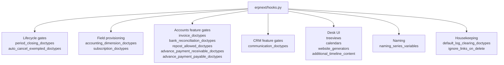

# Hooks catalogue (per-DocType registries)

> **TL;DR:** Beyond the high-level categories already covered by [hooks-and-overrides.md](hooks-and-overrides.md), `erpnext/hooks.py` declares ~17 plain Python lists / dicts that **gate per-DocType behaviour across the whole stack** (period-closing validation, cancel cascade, dimension-field provisioning, repost permission, bank reconciliation matching, subscription extension, Payment Reconciliation, etc.). This page is the depth read: every list, its current contents, the consumer code path, the semantics, and what changes if you add or remove a DocType.

## Key file

- [erpnext/hooks.py](../../erpnext/hooks.py:1) — single source of truth. Every entry below cites a specific line range.

## Diagram



## 1. Lifecycle gates

### 1.1 `period_closing_doctypes`

- **Declared:** [hooks.py:322-341](../../erpnext/hooks.py:322) (18 DocTypes).
- **Current contents:** `Sales Invoice`, `Purchase Invoice`, `Journal Entry`, `Bank Clearance`, `Stock Entry`, `Dunning`, `Invoice Discounting`, `Payment Entry`, `Period Closing Voucher`, `Process Deferred Accounting`, `Asset`, `Asset Capitalization`, `Asset Repair`, `Delivery Note`, `Landed Cost Voucher`, `Purchase Receipt`, `Stock Reconciliation`, `Subcontracting Receipt`.
- **Consumed by:**
  - [hooks.py:350](../../erpnext/hooks.py:350) — `tuple(period_closing_doctypes)` is used as a `doc_events` key, binding `validate_accounting_period_on_doc_save` to every listed DocType's `validate` event.
  - [accounting_period.py:96-140](../../erpnext/accounts/doctype/accounting_period/accounting_period.py:96) — `validate_accounting_period_on_doc_save(doc, method)` reads `Accounting Period` rows for the company, finds rows whose `start_date <= posting_date <= end_date` with a matching `Closed Document.document_type` row marked `closed=1`, and `frappe.throw`s unless the user has the `exempted_role`. Special-cases: `Bank Clearance` is skipped; `Asset` uses `available_for_use_date` (and skips `Existing Asset`); `Asset Repair` uses `completion_date`; `Period Closing Voucher` uses `period_end_date`; everything else uses `posting_date`.
  - [accounting_period.py:72-82](../../erpnext/accounts/doctype/accounting_period/accounting_period.py:72) — `get_doctypes_for_closing()` reads the hook to populate the `Closed Document` child rows when an Accounting Period is created.
  - [controllers/queries.py:891-899](../../erpnext/controllers/queries.py:891) — `get_doctypes_for_closing(...)` whitelisted query reads the hook to drive the `document_type` link search inside an Accounting Period row.
- **Semantics:** any DocType in this list is **blocked from save** if the company has an enabled `Accounting Period` covering the doc's posting date with the doctype marked closed.
- **Adding a DocType:** triggers the global `validate` hook on every save; new DocType automatically appears in `Accounting Period.closed_documents` after a fresh period is created.
- **Removing a DocType:** new postings will succeed in closed periods (data integrity risk).

### 1.2 `auto_cancel_exempted_doctypes`

- **Declared:** [hooks.py:418-431](../../erpnext/hooks.py:418).
- **Current contents:** `Payment Entry`, `GL Entry`, `Stock Ledger Entry`, `Payment Ledger Entry`, `Advance Payment Ledger Entry`, `Account Closing Balance`.
- **Consumed by:** Frappe core (`frappe.model.delete_doc.cancel_all_linked_docs` and the `on_cancel` cascade). When a parent submitted document is cancelled, Frappe walks `frappe.get_all_linked_docs` and auto-cancels any submittable child **unless** its DocType appears in this hook.
- **Semantics — the immutable-ledger policy:** the in-file comment at [hooks.py:419-431](../../erpnext/hooks.py:419) is load-bearing:
  - `Payment Entry` is exempted because cancelling an invoice should **unlink** the Payment Entry, not cancel it (a paid PE remains a real payment; the invoice link just goes away).
  - `GL Entry`, `Stock Ledger Entry`, `Payment Ledger Entry`, `Advance Payment Ledger Entry` are exempted because **reverse entries are posted instead** to preserve ledger immutability (no row is ever destroyed; cancellation appends a debit/credit-reversed twin via `make_reverse_gl_entries` / similar; see [flows/accounting-flow.md](../flows/accounting-flow.md) and [flows/stock-flow.md](../flows/stock-flow.md)).
  - `Account Closing Balance` is exempted because `Period Closing Voucher` cancel runs custom logic to rebuild it; auto-cancel would create stale rows.
- **Adding a DocType:** the parent's cancel will skip cancelling rows of this child DocType. Use only when an immutable-twin reversal pattern handles the cancel side.
- **Removing a DocType:** cancelling any doc that links to this DocType will also cancel matching rows — high risk for ledger integrity.

## 2. Field provisioning

### 2.1 `accounting_dimension_doctypes`

- **Declared:** [hooks.py:537-590](../../erpnext/hooks.py:537) (54 DocTypes — the largest registry).
- **Current contents:** every transaction parent + child that should carry custom Accounting Dimension fields. Examples: `GL Entry`, `Payment Ledger Entry`, all 4 invoice DocTypes + their `Item` children, `Payment Entry` + `Payment Entry Deduction`, `Stock Entry` + `Stock Entry Detail`, `Asset` + `Asset Capitalization` + `Asset Repair` + `Asset Movement Item` + `Asset Depreciation Schedule`, `Sales Order` + `Sales Order Item`, `Purchase Order` + `Purchase Order Item`, `Delivery Note` + `Delivery Note Item`, `Purchase Receipt` + `Purchase Receipt Item`, `Material Request Item`, `Subscription` + `Subscription Plan`, `POS Profile` + `POS Invoice` + `POS Invoice Item`, `Subcontracting Order` + `Subcontracting Order Item` + `Subcontracting Receipt` + `Subcontracting Receipt Item`, `Account Closing Balance`, `Supplier Quotation` + `Supplier Quotation Item`, `Payment Reconciliation` + `Payment Reconciliation Allocation`, `Payment Request`, `Sales Taxes and Charges`, `Purchase Taxes and Charges`, `Shipping Rule`, `Landed Cost Item`, `Asset Value Adjustment`, `Loyalty Program`, `Stock Reconciliation`, `Opening Invoice Creation Tool` + `Opening Invoice Creation Tool Item`, `Budget`, `Advance Taxes and Charges`.
- **Consumed by:**
  - [accounting_dimension.py:237](../../erpnext/accounts/doctype/accounting_dimension/accounting_dimension.py:237) — `get_doctypes_for_dimension()` reads the hook and is the single source for "where does this dimension's custom field need to be created/destroyed?"
  - [accounts_settings.py:220-223](../../erpnext/accounts/doctype/accounts_settings/accounts_settings.py:220) — `toggle_accounting_dimension_sections(hide)` walks the hook and creates a Property Setter on each DocType to show/hide the standard `accounting_dimensions_section`.
  - When you create or rename an `Accounting Dimension` row, Frappe auto-creates a `Custom Field` of type Link (or whatever the dimension's source DocType is) on every DocType in this hook. Disabling/deleting the dimension drops the custom field everywhere.
- **Semantics:** **the registry of every place a cost-center-like dimension propagates**. Every transaction line item, every ledger row, every voucher header listed here will be augmented with whatever `Accounting Dimension` records exist (Project, Branch, Cost Center if custom, plus any user-defined dimensions).
- **Adding a DocType:** next save of an `Accounting Dimension` row provisions custom fields on the new DocType. Existing dimension rows can be re-saved to retroactively provision.
- **Removing a DocType:** custom fields stay (Frappe doesn't auto-drop them); but new dimension rows won't propagate. Reports filtering by dimension may produce inconsistent results across DocTypes.

### 2.2 `subscription_doctypes`

- **Declared:** [hooks.py:592](../../erpnext/hooks.py:592).
- **Current contents:** `Sales Invoice`, `Purchase Invoice`, `Payment Request`, `POS Invoice`.
- **Consumed by:** [accounts_settings.py:242-245](../../erpnext/accounts/doctype/accounts_settings/accounts_settings.py:242) — `toggle_subscription_sections(hide)` creates a Property Setter on each DocType to show/hide the `subscription_section` when `Accounts Settings.enable_subscription` is toggled.
- **Semantics:** the DocTypes that can be auto-generated by a `Subscription` (one per cycle) and therefore expose a `subscription` link + section in their form.
- **Adding a DocType:** the section toggle covers it; but you also need to wire `process_subscription` to know how to create that DocType.
- **Removing a DocType:** the form section becomes orphaned (custom field still present); hide-section property setter no longer covers it.

## 3. Accounts feature gates

### 3.1 `invoice_doctypes`

- **Declared:** [hooks.py:528](../../erpnext/hooks.py:528).
- **Current contents:** `Sales Invoice`, `Purchase Invoice`.
- **Consumed by:**
  - [party.py:990-991](../../erpnext/accounts/party.py:990) — when computing party advance amount from `Payment Ledger Entry`, rows whose `voucher_type` is in this hook are excluded (advances vs invoice-allocated payments are kept separate).
  - [payment_entry.py:680](../../erpnext/accounts/doctype/payment_entry/payment_entry.py:680) — when validating Payment Entry references, references pointing to a DocType in this hook trigger party-account validation against the invoice's `debit_to` / `credit_to`.
  - [payment_entry.py:2386](../../erpnext/accounts/doctype/payment_entry/payment_entry.py:2386) — equivalent check on Payment Entry submit.
  - [payment_entry.js:1074](../../erpnext/accounts/doctype/payment_entry/payment_entry.js:1074) and [payment_entry.js:1115](../../erpnext/accounts/doctype/payment_entry/payment_entry.js:1115) — client-side equivalent (`get_invoice_doctypes` exposes the hook to the form).
- **Semantics:** **the canonical "is this an invoice?" gate**. Used to differentiate invoice-style vouchers from non-invoice vouchers in Payment Entry and party-balance computations.
- **Adding a DocType (e.g. a custom credit-memo DocType):** Payment Entry will start treating it as an invoice for party-account validation; advance computations will exclude it.

### 3.2 `bank_reconciliation_doctypes`

- **Declared:** [hooks.py:530-535](../../erpnext/hooks.py:530).
- **Current contents:** `Payment Entry`, `Journal Entry`, `Purchase Invoice`, `Sales Invoice`.
- **Consumed by:** [bank_transaction.py:354-357](../../erpnext/accounts/doctype/bank_transaction/bank_transaction.py:354) — `get_doctypes_for_bank_reconciliation()` returns this hook directly. Drives the **DocType picker** in the Bank Reconciliation Tool: which DocTypes show up as candidates for matching against a `Bank Transaction` line.
- **Semantics:** **the DocTypes that can be reconciled against bank statement lines**. PI/SI are included because UPI/wire-direct invoices exist; PE/JE are the typical bank-side voucher types.
- **Adding a DocType:** appears in the Bank Reconciliation Tool's match-candidate list.
- **Removing a DocType:** users cannot reconcile that voucher type against bank lines via the tool.

### 3.3 `repost_allowed_doctypes`

- **Declared:** [hooks.py:707-713](../../erpnext/hooks.py:707).
- **Current contents:** `Sales Invoice`, `Purchase Invoice`, `Journal Entry`, `Payment Entry`, `Purchase Receipt`.
- **Consumed by:**
  - [install.py:78-82](../../erpnext/setup/install.py:78) — `setup_repost_defaults()` runs at `after_install`, reads the hook, and seeds each entry as a row in `Accounts Settings.repost_allowed_types`. See [getting-started/after-install-seed.md](../getting-started/after-install-seed.md).
  - [boot.py:69](../../erpnext/startup/boot.py:69) — `bootinfo.sysdefaults.repost_allowed_doctypes = frappe.get_hooks(...)`. Surfaced to client JS as `frappe.boot.sysdefaults.repost_allowed_doctypes`.
  - [accounts_settings.js:9](../../erpnext/accounts/doctype/accounts_settings/accounts_settings.js:9) — uses the boot value as the `name in` filter for the `repost_allowed_types` link picker.
  - [repost_accounting_ledger.py:205-212](../../erpnext/accounts/doctype/repost_accounting_ledger/repost_accounting_ledger.py:205) — when a `Repost Accounting Ledger` row submits, falls back to a generic `make_gl_entries` repost for any DocType in this hook (apart from PE/JE/Expense Claim which have explicit branches).
  - [patches/v16_0/merge_repost_settings_to_accounts_settings.py:5](../../erpnext/patches/v16_0/merge_repost_settings_to_accounts_settings.py:5) — migrated existing site settings to use this hook as the seed source.
- **Semantics:** **which DocTypes a `Repost Accounting Ledger` operation can rebuild GL for**. Distinct from `Repost Item Valuation` (which rebuilds SLE). Membership here means the DocType has a `make_gl_entries` method usable for backdated GL rebuild.
- **Adding a DocType:** must implement `make_gl_entries` (and optionally accept `cancel=1`); will then appear in the `Accounts Settings.repost_allowed_types` picker; users can include it in a Repost Accounting Ledger run.

### 3.4 `advance_payment_receivable_doctypes` / `advance_payment_payable_doctypes`

- **Declared:** [hooks.py:525-526](../../erpnext/hooks.py:525).
- **Current contents:**
  - `advance_payment_receivable_doctypes = ["Sales Order"]`
  - `advance_payment_payable_doctypes = ["Purchase Order"]`
- **Consumed by:**
  - [accounts/utils.py:2592-2602](../../erpnext/accounts/utils.py:2592) — `get_advance_payment_doctypes(payment_type=None)` returns receivable, payable, or both depending on caller. Used by Payment Reconciliation and the receivables/payables reports.
  - [accounts_receivable.py:72-73](../../erpnext/accounts/report/accounts_receivable/accounts_receivable.py:72) — combines both hooks to find DocTypes whose advance payments should appear in AR/AP aging.
  - [payment_entry.py — `set_liability_account`](../../erpnext/accounts/doctype/payment_entry/payment_entry.py:229) — uses the hooks to decide whether to route the advance side of a payment to the **separate advance party account** when `book_advance_payments_in_separate_party_account` is enabled. See [flows/payments-flow.md](../flows/payments-flow.md) and [modules/accounts-doctypes.md](../modules/accounts-doctypes.md).
- **Semantics:** **which order DocTypes can receive/make advance payments before invoicing**. Drives the "advance against order" UX in Payment Entry, Payment Reconciliation, and the AR/AP reports.
- **Adding a DocType:** the AR/AP report will start showing advances for it; Payment Entry will offer the separate advance-account routing for it.

## 4. CRM feature gates

### 4.1 `communication_doctypes`

- **Declared:** [hooks.py:523](../../erpnext/hooks.py:523).
- **Current contents:** `Customer`, `Supplier`.
- **Consumed by:** Frappe core's Communication module (out-of-tree). The hook designates which DocTypes get **Communication-tab integration** (the timeline/email-merge sidebar that lists all Communications linked via Dynamic Link).
- **Semantics:** **which party DocTypes show the Communication panel**. Customer and Supplier are the two ERPNext-side parties; Frappe core also reads its own `communication_doctypes` (Lead, Contact, Issue, etc.).
- **Adding a DocType:** that DocType's form will surface the Communication side panel and accept email/call link backreferences.

## 5. Desk UI

### 5.1 `treeviews`

- **Declared:** [hooks.py:77-87](../../erpnext/hooks.py:77).
- **Current contents:** `Account`, `Cost Center`, `Warehouse`, `Item Group`, `Customer Group`, `Supplier Group`, `Sales Person`, `Territory`, `Department`.
- **Consumed by:** Frappe Desk routing. A DocType in this list gets a `Tree/<DocType>` view URL (e.g. `/app/account/view/tree`) in addition to the standard `List/<DocType>` view. The DocType must extend `frappe.utils.nestedset.NestedSet` for the tree view to render usefully.
- **Semantics:** **declares which DocTypes have a desk Tree view**. Mostly NestedSet hierarchy masters.
- **Adding a DocType:** the Tree view becomes available; sidebar "Tree" link appears.

### 5.2 `calendars`

- **Declared:** [hooks.py:111](../../erpnext/hooks.py:111).
- **Current contents:** `Task`, `Work Order`, `Sales Order`, `Holiday List`, `ToDo`.
- **Consumed by:** Frappe Desk routing. A DocType in this list gets the `View/<DocType>/Calendar` view; the DocType must declare a `<doctype>_calendar.js` file under its folder describing the date fields and event color logic.
- **Semantics:** **DocTypes that have a calendar view**. Mostly time-bounded operational DocTypes.
- **Adding a DocType:** must also ship `<doctype>_calendar.js`; calendar view becomes available.

### 5.3 `website_generators`

- **Declared:** [hooks.py:113](../../erpnext/hooks.py:113).
- **Current contents:** `BOM`, `Sales Partner`.
- **Consumed by:** Frappe core's Website Generator base class. A DocType in this list automatically generates a public web page per record (the DocType must extend `frappe.website.website_generator.WebsiteGenerator`).
- **Semantics:** **DocTypes whose records auto-publish as web pages** (e.g. `/boms/<bom>`, `/sales-partners/<partner>`).
- **Adding a DocType:** the DocType class must extend `WebsiteGenerator` and define a `route` field + `get_context()` method.

### 5.4 `additional_timeline_content`

- **Declared:** [hooks.py:684](../../erpnext/hooks.py:684).
- **Current contents:** `{"*": ["erpnext.telephony.doctype.call_log.call_log.get_linked_call_logs"]}`.
- **Consumed by:** Frappe core's timeline rendering. For each rendered timeline, Frappe calls every function in this hook for the matching DocType key (`*` = all DocTypes); each function returns a list of `{icon, is_card, creation, template, template_data}` rows that are merged into the timeline.
- **Code path:** [call_log.py:200-227](../../erpnext/telephony/doctype/call_log/call_log.py:200) — `get_linked_call_logs(doctype, docname)` looks up `Dynamic Link` rows where `parenttype='Call Log'` and the link points to the rendered doc, and returns one timeline card per linked call.
- **Semantics:** **inject extra timeline cards per doc** without modifying the doc's controller. Telephony uses it to show every call linked via the Call Log's Dynamic Link table.
- **Adding a function:** runs on every doc's timeline render (because the key is `*`). Keep cheap — single SQL is the rule.

## 6. Naming

### 6.1 `naming_series_variables`

- **Declared:** [hooks.py:412-416](../../erpnext/hooks.py:412).
- **Current contents:** `naming_series_variables_list = ["FY", "TFY", "ABBR", "MM", "DD", "YY", "YYYY", "JJJ", "WW"]` — the dict comprehension binds every variable to the same handler `erpnext.accounts.utils.parse_naming_series_variable`.
- **Consumed by:** Frappe's naming engine. Whenever a naming series template includes one of these tokens (e.g. `SI-{FY}-{####}`), Frappe calls the registered handler with `(variable, doc)` to resolve the value before generating the document name.
- **Code path:** the handler `parse_naming_series_variable` lives in [accounts/utils.py](../../erpnext/accounts/utils.py) — it switches on the variable name and reads the company's fiscal year (`FY`/`TFY`), abbreviation (`ABBR`), or computes calendar tokens (`MM`/`DD`/`YY`/`YYYY`/`JJJ`/`WW`) from `posting_date` / today. See [modules/setup.md](../modules/setup.md) for the full token semantics.
- **Semantics:** **the single point that turns custom naming-series tokens into resolved values**. Without these registrations, those tokens would render literally in the document name.
- **Adding a token:** append to `naming_series_variables_list` and extend the handler with a new branch.

## 7. Housekeeping

### 7.1 `default_log_clearing_doctypes`

- **Declared:** [hooks.py:693-695](../../erpnext/hooks.py:693).
- **Current contents:** `{"Repost Item Valuation": 60}`.
- **Consumed by:** Frappe core's `Log Settings` doctype (and the daily log-purge task). The dict maps `DocType → retention days`. Anything older than the value is purged by the periodic log-clearing job.
- **Semantics:** **per-DocType retention policy for log-style records**. ERPNext only registers `Repost Item Valuation` (60 days) — `Repost Item Valuation` rows accumulate quickly during heavy backdated-stock activity.
- **Adding a DocType:** that DocType's old rows will be auto-purged after the configured days. Use only for log-style DocTypes; never for transaction DocTypes.

### 7.2 `ignore_links_on_delete`

- **Declared:** [hooks.py:680-682](../../erpnext/hooks.py:680).
- **Current contents:** `["Tax Withholding Entry"]`.
- **Consumed by:** Frappe core's `delete_doc` cascade. By default, Frappe blocks deletion of any doc that has linked submittable documents (via `frappe.get_all_linked_docs`). Adding a DocType here bypasses that check **for that specific DocType** when deleting any other doc.
- **Semantics:** **suppress the "linked doc exists" delete guard** for orphan-tolerant DocTypes. `Tax Withholding Entry` rows are write-once log entries that should not block deletion of a parent invoice.
- **Adding a DocType:** parent docs will be deletable even if rows of this DocType still link to them. The orphan rows are not removed — they survive as dangling references.

## 8. Quick reference table

| Registry | Line in hooks.py | Type | Cardinality | Primary consumer |
|----------|------------------|------|-------------|------------------|
| `period_closing_doctypes` | [322](../../erpnext/hooks.py:322) | list | 18 | `accounting_period.validate_accounting_period_on_doc_save` |
| `auto_cancel_exempted_doctypes` | [418](../../erpnext/hooks.py:418) | list | 6 | Frappe core cancel cascade |
| `accounting_dimension_doctypes` | [537](../../erpnext/hooks.py:537) | list | 54 | `accounting_dimension.get_doctypes_for_dimension`, custom-field provisioner |
| `subscription_doctypes` | [592](../../erpnext/hooks.py:592) | list | 4 | `accounts_settings.toggle_subscription_sections` |
| `invoice_doctypes` | [528](../../erpnext/hooks.py:528) | list | 2 | `payment_entry.validate`, `party.get_party_advance` |
| `bank_reconciliation_doctypes` | [530](../../erpnext/hooks.py:530) | list | 4 | `bank_transaction.get_doctypes_for_bank_reconciliation` |
| `repost_allowed_doctypes` | [707](../../erpnext/hooks.py:707) | list | 5 | `repost_accounting_ledger.on_submit`, `setup_repost_defaults`, `boot_session` |
| `advance_payment_receivable_doctypes` | [525](../../erpnext/hooks.py:525) | list | 1 | `accounts/utils.get_advance_payment_doctypes`, AR/AP reports, PE liability routing |
| `advance_payment_payable_doctypes` | [526](../../erpnext/hooks.py:526) | list | 1 | same as above |
| `communication_doctypes` | [523](../../erpnext/hooks.py:523) | list | 2 | Frappe Communication module |
| `treeviews` | [77](../../erpnext/hooks.py:77) | list | 9 | Frappe Desk Tree-view router |
| `calendars` | [111](../../erpnext/hooks.py:111) | list | 5 | Frappe Desk Calendar-view router |
| `website_generators` | [113](../../erpnext/hooks.py:113) | list | 2 | Frappe `WebsiteGenerator` |
| `naming_series_variables` | [412](../../erpnext/hooks.py:412) | dict | 9 | Frappe naming engine → `accounts.utils.parse_naming_series_variable` |
| `default_log_clearing_doctypes` | [693](../../erpnext/hooks.py:693) | dict | 1 | Frappe `Log Settings` purge |
| `ignore_links_on_delete` | [680](../../erpnext/hooks.py:680) | list | 1 | Frappe `delete_doc` cascade |
| `additional_timeline_content` | [684](../../erpnext/hooks.py:684) | dict | 1 (`*`) | Frappe timeline render |

## How to discover consumers of a registry

```bash
# Find every read of a hook by name
grep -rn 'frappe.get_hooks("period_closing_doctypes")' .
grep -rn 'frappe.get_hooks("accounting_dimension_doctypes")' .

# Find every place a registry name is referenced (declarations + reads)
grep -rn 'period_closing_doctypes' erpnext/
```

`frappe.get_hooks(<name>)` is the canonical reader. Some registries are also exposed via `frappe.boot.sysdefaults.<name>` (see `repost_allowed_doctypes` in [boot.py:69](../../erpnext/startup/boot.py:69)).

## Open questions

- **TODO(verify)** — `communication_doctypes` consumer code lives in Frappe core, not in this tree; the exact UI behaviour (which side panel, which event) was inferred from the hook name and the analogous Frappe-core registry of the same name. Direct read of Frappe's `frappe/public/js/frappe/form/sidebar/form_sidebar.js` would confirm.

## Related

- [Hooks and overrides](hooks-and-overrides.md) — the high-level tour (`doc_events`, `scheduler_events`, `regional_overrides`, `extend_doctype_class`, `override_whitelisted_methods`, etc.). This catalogue is the depth read for the per-DocType list registries.
- [Scheduler jobs catalogue](scheduler-jobs.md) — the depth read for `scheduler_events`.
- [Boot session](boot-session.md) — what runs on every login (`repost_allowed_doctypes` is one of the boot-injected sysdefaults; cross-link).
- [Setup module](../modules/setup.md) — `naming_series_variables` deep dive.
- [Accounts module](../modules/accounts.md) — most accounts feature gates above.

## Changelog

- `2026-04-18` — initial version. Documents 17 per-DocType registries with consumer code paths and semantics.
