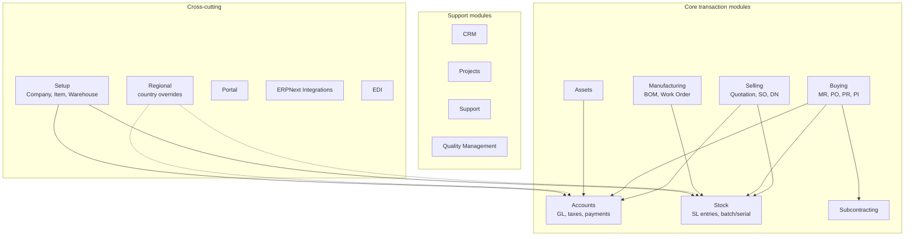

# Architecture Overview

> **TL;DR:** ERPNext is a Frappe app. Every business entity is a **DocType** (schema JSON + Python controller + JS script + tests). Transaction DocTypes inherit a fixed controller chain (`StatusUpdater → AccountsController → StockController → SubcontractingController → BuyingController` on the buying side, and `StockController → SellingController` on the selling side). Cross-cutting behaviour (lifecycle hooks, scheduler jobs, regional overrides, boot data, portal routes) is registered in one central file: [erpnext/hooks.py](../../erpnext/hooks.py:1). Country-specific code lives under `erpnext/regional/<country>/` and is wired via `regional_overrides` in `hooks.py`. Database migrations live in `erpnext/patches/` and are listed in [patches.txt](../../erpnext/patches.txt:1).

## Where to start tracing

When you need to understand where a behaviour comes from:

1. **Cross-cutting behaviour** (validation on save, scheduled job, portal menu, regional variant) → open [erpnext/hooks.py](../../erpnext/hooks.py:1). It is the project map.
2. **Per-DocType behaviour** (validation, GL posting, stock posting) → open the DocType's Python file under `erpnext/<module>/doctype/<name>/<name>.py`, then walk the `super().method()` calls up the [controller chain](controllers.md).
3. **Country-specific behaviour** → check `regional_overrides` in [erpnext/hooks.py:608](../../erpnext/hooks.py:608) and the corresponding `erpnext/regional/<country>/utils.py` module.
4. **A field / permission / workflow / child table** → open `<doctype>.json`. The schema is the source of truth.

## Key files

- [erpnext/hooks.py](../../erpnext/hooks.py:1) — central registration point for `doc_events`, `scheduler_events`, `regional_overrides`, `override_whitelisted_methods`, `extend_doctype_class`, `website_route_rules`, `standard_portal_menu_items`, `boot_session`, fixtures, global search, accounting dimensions registry, and more.
- [erpnext/modules.txt](../../erpnext/modules.txt:1) — authoritative list of top-level modules: Accounts, CRM, Buying, Projects, Selling, Setup, Manufacturing, Stock, Support, Utilities, Assets, Portal, Maintenance, Regional, ERPNext Integrations, Quality Management, Communication, Telephony, Bulk Transaction, Subcontracting, EDI.
- [erpnext/controllers/](../../erpnext/controllers) — base controller classes that transaction DocTypes inherit from. See [controllers.md](controllers.md).
- [erpnext/patches.txt](../../erpnext/patches.txt:1) — ordered list of migrations split into `[pre_model_sync]` and `[post_model_sync]` sections.
- [erpnext/regional/](../../erpnext/regional) — country-specific logic (Italy, United Arab Emirates, United States, Australia, Turkey, South Africa, France via patches).
- [erpnext/__init__.py](../../erpnext/__init__.py:135) — `allow_regional` decorator: the mechanism that makes a function body swappable per country.

## High-level module map

Solid arrows are runtime dependencies via the controller chain; dashed arrows are registration-time swaps via `regional_overrides`.

## What "Frappe app" means here

ERPNext runs inside a **bench** environment alongside the Frappe framework. It is not standalone: its `Document`, `TransactionBase`, form rendering, permissions engine, ORM, and background runner all come from Frappe. ERPNext adds:

- A controller hierarchy on top of Frappe's `Document` base class (see [controllers.md](controllers.md)).
- A few dozen core transaction DocTypes (Sales Invoice, Purchase Invoice, Journal Entry, Stock Entry, etc.).
- Master data DocTypes (Item, Customer, Supplier, Warehouse, Account, Company).
- Registrations in `hooks.py` that weave into Frappe's lifecycle, scheduler, and web-routing.

## Conventions encoded in this codebase

- **Tab indentation** everywhere (Python & JS). Ruff config in [pyproject.toml](../../pyproject.toml:1).
- **Submittable documents** use `docstatus` (0 = Draft, 1 = Submitted, 2 = Cancelled) — the full lifecycle is described in [doctype-lifecycle.md](doctype-lifecycle.md).
- **Reverse GL / SL entries** on cancel (not delete): see `auto_cancel_exempted_doctypes` at [erpnext/hooks.py:418](../../erpnext/hooks.py:418). This preserves ledger immutability.
- **Regional opt-in**: default implementations in the core are no-ops decorated with `@erpnext.allow_regional`; the real body is picked from `regional_overrides` at call time. See [erpnext/__init__.py:135](../../erpnext/__init__.py:135).

## Related

- [Controller hierarchy](controllers.md)
- [DocType pattern](doctype-pattern.md)
- [DocType lifecycle](doctype-lifecycle.md)
- [Hooks and overrides](hooks-and-overrides.md)
- [Regional overrides](../patterns/regional-overrides.md)
- [Patches](../patterns/patches.md)

## Changelog

- `2026-04-17` — initial version.
