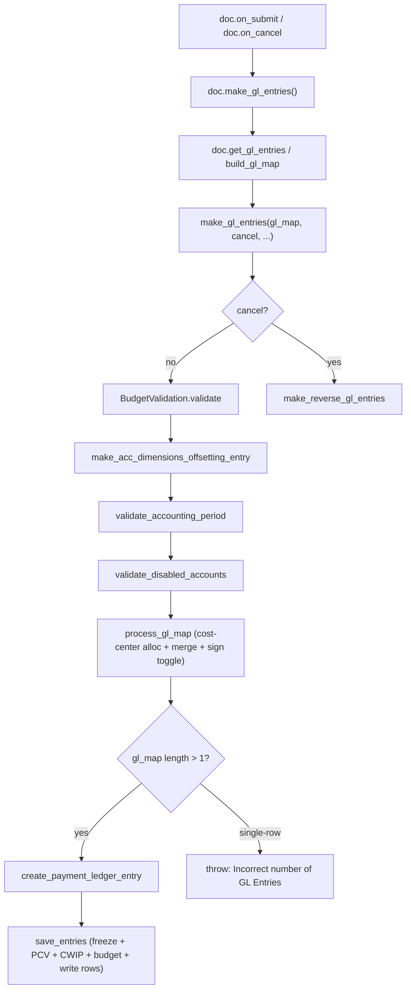
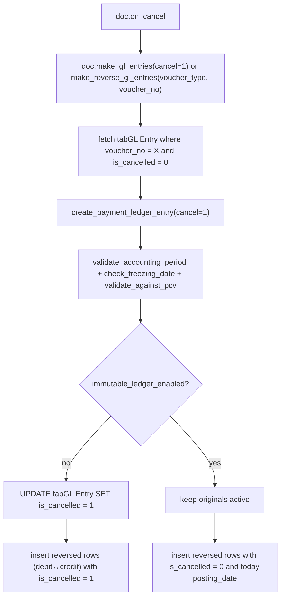
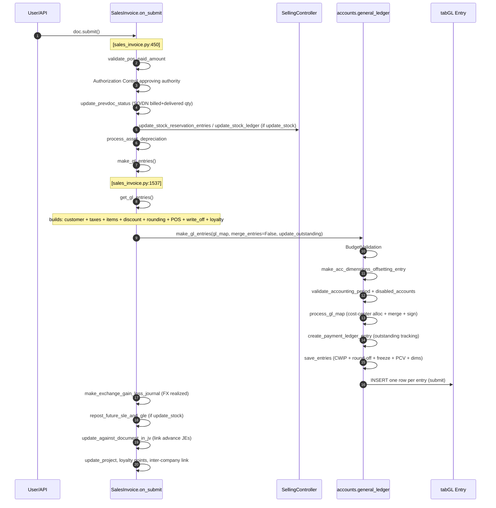
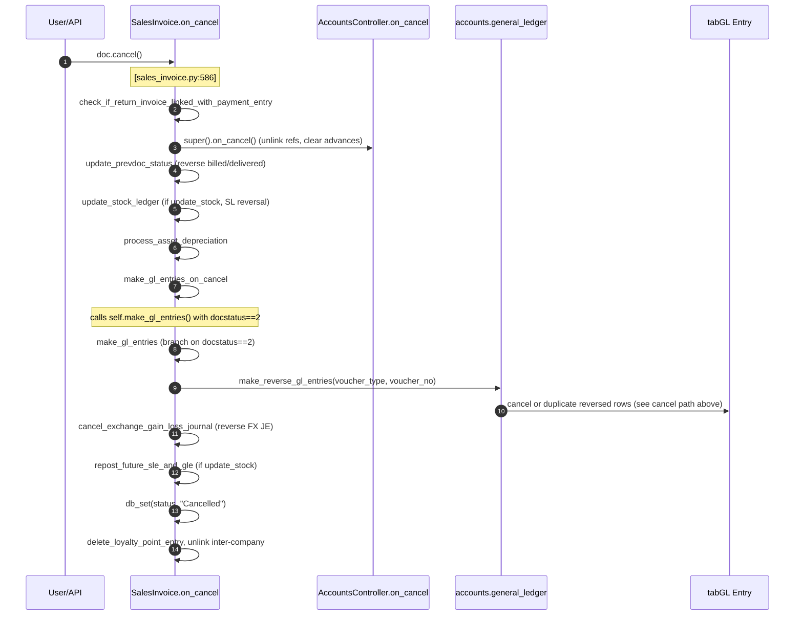

# Accounting Flow — GL Entry Creation, Repost, and Cancel

> **TL;DR:** Every accounting voucher (Sales Invoice, Purchase Invoice, Payment Entry, Journal Entry, Period Closing Voucher, Stock-linked docs in perpetual inventory mode) funnels into [`make_gl_entries` in `erpnext/accounts/general_ledger.py`](erpnext/accounts/general_ledger.py:28). The doc builds a `gl_map` in its own `get_gl_entries` / `build_gl_map` method, then hands it off. `general_ledger.py` runs budget validation, dimension offsetting, accounting-period guards, cost-center allocation, merging, debit/credit sign normalization, rounding-difference detection, and finally persists one `GL Entry` row per entry. Cancellation inserts the *reverse* set (`is_cancelled=1` or immutable-ledger mode).

## Key files

- [`erpnext/accounts/general_ledger.py`](erpnext/accounts/general_ledger.py:1) — the universal GL write path: [`make_gl_entries`](erpnext/accounts/general_ledger.py:28), [`process_gl_map`](erpnext/accounts/general_ledger.py:188), [`merge_similar_entries`](erpnext/accounts/general_ledger.py:273), [`save_entries`](erpnext/accounts/general_ledger.py:406), [`make_reverse_gl_entries`](erpnext/accounts/general_ledger.py:681), [`process_debit_credit_difference`](erpnext/accounts/general_ledger.py:471), [`make_round_off_gle`](erpnext/accounts/general_ledger.py:549), [`make_acc_dimensions_offsetting_entry`](erpnext/accounts/general_ledger.py:70), [`validate_accounting_period`](erpnext/accounts/general_ledger.py:153), [`distribute_gl_based_on_cost_center_allocation`](erpnext/accounts/general_ledger.py:203), [`validate_against_pcv`](erpnext/accounts/general_ledger.py:817), [`check_freezing_date`](erpnext/accounts/general_ledger.py:793).
- [`erpnext/accounts/doctype/sales_invoice/sales_invoice.py`](erpnext/accounts/doctype/sales_invoice/sales_invoice.py:1537) — [`make_gl_entries`](erpnext/accounts/doctype/sales_invoice/sales_invoice.py:1537), [`get_gl_entries`](erpnext/accounts/doctype/sales_invoice/sales_invoice.py:1578), [`make_customer_gl_entry`](erpnext/accounts/doctype/sales_invoice/sales_invoice.py:1606), [`make_tax_gl_entries`](erpnext/accounts/doctype/sales_invoice/sales_invoice.py:1648), [`make_item_gl_entries`](erpnext/accounts/doctype/sales_invoice/sales_invoice.py:1697).
- [`erpnext/accounts/doctype/purchase_invoice/purchase_invoice.py`](erpnext/accounts/doctype/purchase_invoice/purchase_invoice.py:810) — [`make_gl_entries`](erpnext/accounts/doctype/purchase_invoice/purchase_invoice.py:810), [`get_gl_entries`](erpnext/accounts/doctype/purchase_invoice/purchase_invoice.py:862), [`make_supplier_gl_entry`](erpnext/accounts/doctype/purchase_invoice/purchase_invoice.py:901), [`make_item_gl_entries`](erpnext/accounts/doctype/purchase_invoice/purchase_invoice.py:948), [`make_tax_gl_entries`](erpnext/accounts/doctype/purchase_invoice/purchase_invoice.py:1405), [`make_gl_entries_for_tax_withholding`](erpnext/accounts/doctype/purchase_invoice/purchase_invoice.py:1522).
- [`erpnext/accounts/doctype/payment_entry/payment_entry.py`](erpnext/accounts/doctype/payment_entry/payment_entry.py:1302) — [`make_gl_entries`](erpnext/accounts/doctype/payment_entry/payment_entry.py:1302), [`build_gl_map`](erpnext/accounts/doctype/payment_entry/payment_entry.py:1289), [`make_advance_gl_entries`](erpnext/accounts/doctype/payment_entry/payment_entry.py:1442).
- [`erpnext/accounts/doctype/journal_entry/journal_entry.py`](erpnext/accounts/doctype/journal_entry/journal_entry.py:1204) — [`make_gl_entries`](erpnext/accounts/doctype/journal_entry/journal_entry.py:1204).
- [`erpnext/accounts/doctype/period_closing_voucher/period_closing_voucher.py`](erpnext/accounts/doctype/period_closing_voucher/period_closing_voucher.py:169) — [`make_gl_entries`](erpnext/accounts/doctype/period_closing_voucher/period_closing_voucher.py:169), [`process_gl_and_closing_entries`](erpnext/accounts/doctype/period_closing_voucher/period_closing_voucher.py:463), [`cancel_gl_entries`](erpnext/accounts/doctype/period_closing_voucher/period_closing_voucher.py:440).
- [`erpnext/controllers/budget_controller.py`](erpnext/controllers/budget_controller.py:1) — [`BudgetValidation`](erpnext/accounts/general_ledger.py:24) is instantiated inside `make_gl_entries` and runs before the map is written (unless legacy mode or PCV).
- [`erpnext/accounts/utils.py`](erpnext/accounts/utils.py:1) — [`create_payment_ledger_entry`](erpnext/accounts/general_ledger.py:23), [`is_immutable_ledger_enabled`](erpnext/accounts/general_ledger.py:23) (referenced throughout).

See the [controller hierarchy](../architecture/controllers.md) for how `make_gl_entries` is wired into the `on_submit` lifecycle, and the [DocType lifecycle](../architecture/doctype-lifecycle.md) for per-event ordering.

## The canonical entry point — `make_gl_entries`

Every GL write goes through [`make_gl_entries(gl_map, cancel, adv_adj, merge_entries, update_outstanding, from_repost)`](erpnext/accounts/general_ledger.py:28). The helper is a decision tree, not just a writer:

Each branch is documented below.

### Pre-write validations (non-cancel path)

Inside [`make_gl_entries`](erpnext/accounts/general_ledger.py:28), before any row is written:

1. **Budget validation.** [`BudgetValidation(gl_map=gl_map).validate()`](erpnext/accounts/general_ledger.py:41) runs when the `use_legacy_budget_controller` setting on **Accounts Settings** is false and voucher is not a *Period Closing Voucher*. Legacy per-row budget checks still run later inside [`make_entry`](erpnext/accounts/general_ledger.py:441) via [`validate_expense_against_budget`](erpnext/accounts/general_ledger.py:441).
2. **Accounting-dimension offsetting.** [`make_acc_dimensions_offsetting_entry`](erpnext/accounts/general_ledger.py:70) duplicates each GL row with a credit/debit swap against `offsetting_account` for every accounting dimension whose detail row has `automatically_post_balancing_accounting_entry = 1` **and** the current map uses more than one distinct value for that dimension. The offsetting rows inherit the source row but null `party`, `party_type`, `against_voucher`, `against_voucher_type`.
3. **Accounting period lock.** [`validate_accounting_period`](erpnext/accounts/general_ledger.py:153) throws `ClosedAccountingPeriod` if a matching `Accounting Period` has the voucher's document type marked *closed*, unless the user holds the period's `exempted_role`.
4. **Disabled accounts.** [`validate_disabled_accounts`](erpnext/accounts/general_ledger.py:134) bails if any `account` in the map is `disabled=1` in `tabAccount` for the same company.

### `process_gl_map` — shape, distribute, merge, normalize

[`process_gl_map(gl_map, merge_entries=True, precision=None, from_repost=False)`](erpnext/accounts/general_ledger.py:188) runs three passes:

1. **Cost-center allocation.** Unless the voucher is a *Period Closing Voucher*, [`distribute_gl_based_on_cost_center_allocation`](erpnext/accounts/general_ledger.py:203) looks up `Cost Center Allocation` (cached via `@request_cache` at [`get_cost_center_allocation_data`](erpnext/accounts/general_ledger.py:247)) for the row's cost center. If an allocation exists, each input GL row is replicated once per sub-cost-center with `debit`/`credit` multiplied by the allocation percentage. The round-off account is exempt — it keeps the main cost center unchanged. When not `from_repost`, [`validate_expense_against_budget`](erpnext/accounts/general_ledger.py:227) is called per pre-split row.
2. **Merge similar entries.** [`merge_similar_entries`](erpnext/accounts/general_ledger.py:273) groups rows whose `merge_key` (see [`get_merge_properties`](erpnext/accounts/general_ledger.py:329): `account`, `cost_center`, `party`, `party_type`, `voucher_detail_no`, `against_voucher`, `against_voucher_type`, `project`, `finance_book`, `voucher_no`, `advance_voucher_type`, `advance_voucher_no`, plus every accounting dimension) match. Debit/credit amounts in all three currencies are summed. Rows flagged `_skip_merge` are preserved individually. Zero-debit/zero-credit rows are filtered out unless the voucher is a `Journal Entry` of type `Exchange Gain Or Loss`.
3. **Sign normalization.** [`toggle_debit_credit_if_negative`](erpnext/accounts/general_ledger.py:363) converts negatives to the opposite column (e.g. `debit=-10` becomes `credit=10`). For rows with `post_net_value` set and both sides non-zero, the smaller side is subtracted from the larger and zeroed, so only the net appears in the ledger.

After `process_gl_map`, if `len(gl_map) > 1` and the voucher is not a `Period Closing Voucher`, [`create_payment_ledger_entry`](erpnext/accounts/general_ledger.py:51) writes the Payment Ledger (outstanding bookkeeping). Then [`save_entries`](erpnext/accounts/general_ledger.py:58) persists.

### `save_entries` — the final write

[`save_entries`](erpnext/accounts/general_ledger.py:406) performs:

1. **CWIP guard.** [`validate_cwip_accounts`](erpnext/accounts/general_ledger.py:444) blocks Journal Entries from touching any account whose `account_type = "Capital Work in Progress"` when CWIP is enabled in *any* Asset Category.
2. **Debit/credit reconciliation + rounding.** [`process_debit_credit_difference`](erpnext/accounts/general_ledger.py:471) sums `debit - credit` and `debit_in_transaction_currency - credit_in_transaction_currency`. Tolerance from [`get_debit_credit_allowance`](erpnext/accounts/general_ledger.py:525): `5.0 / 10**precision` for Journal Entry and Payment Entry, `0.5` for everything else. Differences above tolerance throw via [`raise_debit_credit_not_equal_error`](erpnext/accounts/general_ledger.py:534); smaller differences are resolved by appending a round-off row via [`make_round_off_gle`](erpnext/accounts/general_ledger.py:549) against `Company.round_off_account` (or `Round Off for Opening` when the map has opening entries) with cost center from `Company.round_off_cost_center`.
3. **Freeze date.** [`check_freezing_date`](erpnext/accounts/general_ledger.py:793) throws if `posting_date <= Company.accounts_frozen_till_date` and the user is neither in `role_allowed_for_frozen_entries` nor bypassing via `adv_adj`. Administrator does **not** bypass.
4. **PCV guard.** [`validate_against_pcv`](erpnext/accounts/general_ledger.py:817) blocks creating opening entries once a submitted Period Closing Voucher exists, and blocks any entry whose `posting_date <= latest PCV.period_end_date`.
5. **Per-row write.** For each row [`validate_allowed_dimensions`](erpnext/accounts/general_ledger.py:847) checks against `Accounting Dimension Filter` allow/restrict lists (throws `MandatoryAccountDimensionError` / `InvalidAccountDimensionError`). Then [`make_entry`](erpnext/accounts/general_ledger.py:424) creates a `GL Entry` doc, sets `flags.ignore_permissions = 1`, `flags.from_repost`, `flags.adv_adj`, `flags.update_outstanding`, and calls `gle.submit()`. Legacy per-row budget validation fires again inside `make_entry` unless `from_repost` or PCV.

### Cancel path — `make_reverse_gl_entries`

When `cancel=True` (or when a doc's `on_cancel` calls its own `make_gl_entries(cancel=1)`), [`make_reverse_gl_entries`](erpnext/accounts/general_ledger.py:681) takes over:

Key details:

- **Immutable ledger mode** is detected via [`is_immutable_ledger_enabled`](erpnext/accounts/general_ledger.py:695). When enabled, original rows are *not* flagged cancelled; fresh reversal rows are inserted with `posting_date = form_dict.posting_date or today` and `is_cancelled=0`, preserving full history.
- **Partial cancel** (used by the "Book Advance Payments in Separate Party Account" feature — see [Payment Entry — advance flow](payments-flow.md#advances-and-separate-party-accounts)): [`make_reverse_gl_entries(... partial_cancel=True)`](erpnext/accounts/general_ledger.py:681) only updates rows whose `voucher_detail_no` matches the unlinked reference, rather than cancelling the whole voucher's GL set.
- Each reversed row swaps `debit`↔`credit`, `debit_in_account_currency`↔`credit_in_account_currency`, and `debit_in_transaction_currency`↔`credit_in_transaction_currency`, then sets `remarks = "On cancellation of <voucher_no>"`. Rows with zero debit and zero credit are skipped.

## Sales Invoice submit — end-to-end sequence

Call-site references:

- Submit dispatcher: [`SalesInvoice.on_submit`](erpnext/accounts/doctype/sales_invoice/sales_invoice.py:450).
- `make_gl_entries` → `get_gl_entries` pipeline: [`sales_invoice.py:1537`](erpnext/accounts/doctype/sales_invoice/sales_invoice.py:1537) and [`sales_invoice.py:1578`](erpnext/accounts/doctype/sales_invoice/sales_invoice.py:1578).
- Order of composite builders inside `get_gl_entries`: customer → taxes → internal transfer → items (including stock side via `super().get_gl_entries()` when `update_stock=1`) → precision loss → discount → regional → merge → loyalty → POS → write-off → rounding adjustment (see [`sales_invoice.py:1578-1604`](erpnext/accounts/doctype/sales_invoice/sales_invoice.py:1578)).
- `update_outstanding="No"` is used when POS, write-off, or loyalty redemption is involved; `update_voucher_outstanding` is called explicitly after (see [`sales_invoice.py:1564`](erpnext/accounts/doctype/sales_invoice/sales_invoice.py:1564)).
- `merge_entries=False` at the outer `make_gl_entries` call because SI already merges inside `get_gl_entries` at [`sales_invoice.py:1595`](erpnext/accounts/doctype/sales_invoice/sales_invoice.py:1595) before appending loyalty/POS/write-off lines.

### Regional hook in Sales Invoice GL construction

Within [`get_gl_entries`](erpnext/accounts/doctype/sales_invoice/sales_invoice.py:1592) the line `gl_entries = make_regional_gl_entries(gl_entries, self)` calls the module-level [`make_regional_gl_entries`](erpnext/accounts/doctype/sales_invoice/sales_invoice.py:2591) function decorated with `@erpnext.allow_regional` — the default is a no-op pass-through. Country implementations can replace it via [`regional_overrides` in `hooks.py`](erpnext/hooks.py:608). See [regional overrides pattern](../patterns/regional-overrides.md) for the full mechanism.

## Sales Invoice cancel — end-to-end sequence

Call-site references:

- `SalesInvoice.on_cancel` entry: [`sales_invoice.py:586`](erpnext/accounts/doctype/sales_invoice/sales_invoice.py:586).
- The cancel branch inside `make_gl_entries` is at [`sales_invoice.py:1561`](erpnext/accounts/doctype/sales_invoice/sales_invoice.py:1561) (`elif self.docstatus == 2:` → `make_reverse_gl_entries`).
- When `update_stock=1` **and** perpetual inventory is enabled and no GL entries exist, the cancel path still calls `make_reverse_gl_entries` at [`sales_invoice.py:1576`](erpnext/accounts/doctype/sales_invoice/sales_invoice.py:1576) to reverse the stock-side GL from `super().get_gl_entries()` written on submit.
- `ignore_linked_doctypes` at [`sales_invoice.py:637`](erpnext/accounts/doctype/sales_invoice/sales_invoice.py:637) prevents Frappe from auto-cancelling the ledger rows (`GL Entry`, `Stock Ledger Entry`, `Payment Ledger Entry`, `Serial and Batch Bundle`, `Tax Withholding Entry`, repost docs, unreconcile docs) — these are already handled explicitly.

## Purchase Invoice submit — notable differences

Purchase Invoice [`on_submit`](erpnext/accounts/doctype/purchase_invoice/purchase_invoice.py:750) mirrors SI but:

- Calls `super().on_submit()` first (from `BuyingController`), not last. The stock update precedes `make_gl_entries` by design (see [`purchase_invoice.py:776-785`](erpnext/accounts/doctype/purchase_invoice/purchase_invoice.py:776)).
- `get_gl_entries` order: supplier → items → precision loss → taxes → internal transfer → tax-withholding → regional → merge → payment (for `is_paid=1`) → write-off → rounding → purchase-expense line (for periodic inventory) at [`purchase_invoice.py:862-890`](erpnext/accounts/doctype/purchase_invoice/purchase_invoice.py:862).
- `is_paid=1` causes `update_outstanding="No"` at [`purchase_invoice.py:811`](erpnext/accounts/doctype/purchase_invoice/purchase_invoice.py:811). The supplier outstanding is then refreshed via [`update_supplier_outstanding`](erpnext/accounts/doctype/purchase_invoice/purchase_invoice.py:852).
- Cancel at [`purchase_invoice.py:1682`](erpnext/accounts/doctype/purchase_invoice/purchase_invoice.py:1682) calls `make_reverse_gl_entries` then [`cancel_provisional_entries`](erpnext/accounts/doctype/purchase_invoice/purchase_invoice.py:830), which flips `is_cancelled=1` on GL rows from the *linked Purchase Receipts* — provisional postings written by PR that PI has now booked definitively.
- **Immutable-ledger repost** — [`on_update_after_submit`](erpnext/accounts/doctype/purchase_invoice/purchase_invoice.py:797) compares a controlled list of fields (`cash_bank_account`, `write_off_account`, `unrealized_profit_loss_account`, `is_opening`, and child-table `items.expense_account`, `taxes.account_head`). Changes trigger `validate_for_repost` + `repost_accounting_entries`, which reposts the ledger without cancelling the voucher.

## Payment Entry, Journal Entry, Period Closing Voucher

Each builds its own `gl_map` and calls [`make_gl_entries` in `general_ledger.py`](erpnext/accounts/general_ledger.py:28) with different semantics:

| Doctype | gl-map builder | Cancel path | Special |
| --- | --- | --- | --- |
| Payment Entry | [`build_gl_map`](erpnext/accounts/doctype/payment_entry/payment_entry.py:1289) → `add_party_gl_entries` + `add_bank_gl_entries` + `add_deductions_gl_entries` + `add_tax_gl_entries` + regional | [`make_gl_entries(cancel=1)`](erpnext/accounts/doctype/payment_entry/payment_entry.py:1302) then [`make_advance_gl_entries(cancel=1)`](erpnext/accounts/doctype/payment_entry/payment_entry.py:1314) | Can also produce advance GL entries in a separate pass for the "Book Advance Payments in Separate Party Account" feature (see [payments flow](payments-flow.md#advances-and-separate-party-accounts)). |
| Journal Entry | [`make_gl_entries(cancel=0)`](erpnext/accounts/doctype/journal_entry/journal_entry.py:1204) builds rows from `accounts` child table directly. | [`make_gl_entries(1)`](erpnext/accounts/doctype/journal_entry/journal_entry.py:316) inside `on_cancel`. | Queues submission/cancellation in background when `len(accounts) > 100` via [`queue_submission`](erpnext/accounts/doctype/journal_entry/journal_entry.py:182) + [`journal_entry.py:191`](erpnext/accounts/doctype/journal_entry/journal_entry.py:191). Exchange Gain Or Loss JEs are exempt from zero-amount filtering — see [`general_ledger.py:317-321`](erpnext/accounts/general_ledger.py:317). |
| Period Closing Voucher | [`get_pcv_gl_entries`](erpnext/accounts/doctype/period_closing_voucher/period_closing_voucher.py:185) — builds two sets: P&L reversal rows + closing-account rows per accounting-dimension tuple. | [`cancel_gl_entries`](erpnext/accounts/doctype/period_closing_voucher/period_closing_voucher.py:440) uses [`process_cancellation`](erpnext/accounts/doctype/period_closing_voucher/period_closing_voucher.py:488) which calls `make_reverse_gl_entries(voucher_type, voucher_no)` **and** deletes `Account Closing Balance` rows. | The entire step bypasses `BudgetValidation`, the cost-center-allocation pass, and `create_payment_ledger_entry` — see the `voucher_type != "Period Closing Voucher"` guards at [`general_ledger.py:40`](erpnext/accounts/general_ledger.py:40), [`general_ledger.py:50`](erpnext/accounts/general_ledger.py:50), [`general_ledger.py:192`](erpnext/accounts/general_ledger.py:192), [`general_ledger.py:416`](erpnext/accounts/general_ledger.py:416). Dispatched through [`Process Period Closing Voucher`](erpnext/accounts/doctype/period_closing_voucher/period_closing_voucher.py:137) unless `use_legacy_controller_for_pcv` is true, and runs in an enqueued background job when `tabGL Entry` exceeds 100 000 rows (see [`period_closing_voucher.py:170`](erpnext/accounts/doctype/period_closing_voucher/period_closing_voucher.py:170)). |

Details for each voucher live in [docs/modules/accounts-doctypes.md](../modules/accounts-doctypes.md).

## Repost — `from_repost=True`

When accounting fields are amended on a submitted voucher (see `on_update_after_submit` of PI/PE/JE), the doc calls `repost_accounting_entries`, which ultimately re-invokes the voucher's `make_gl_entries` with `from_repost=True` after cancelling the prior GL. Three behaviours change when `from_repost=True`:

- **Per-row budget validation is skipped** inside [`distribute_gl_based_on_cost_center_allocation`](erpnext/accounts/general_ledger.py:226) and inside [`make_entry`](erpnext/accounts/general_ledger.py:437) — preventing double-counting against budgets that were already validated on the original submission.
- **CWIP validation is skipped** at [`save_entries`](erpnext/accounts/general_ledger.py:407).
- The row's [`flags.from_repost = from_repost`](erpnext/accounts/general_ledger.py:428) propagates into the new `GL Entry` doc for downstream triggers.

## Debit/credit tolerance rules

Tolerance is set by [`get_debit_credit_allowance`](erpnext/accounts/general_ledger.py:525):

- `Journal Entry`, `Payment Entry` → `5.0 / 10**precision` (half a smallest-currency-fraction).
- Everything else → `0.5` (half a unit of the company currency).

Differences above tolerance raise the error `Debit and Credit not equal for <type> #<no>. Difference is <amount>.` ([`general_ledger.py:534`](erpnext/accounts/general_ledger.py:534)). Differences at or above a single precision step but below tolerance get balanced with a round-off entry on the company's configured `round_off_account` or `round_off_for_opening` ([`general_ledger.py:549`](erpnext/accounts/general_ledger.py:549)).

After adding the round-off row, `process_debit_credit_difference` re-checks the balance at [`general_ledger.py:494`](erpnext/accounts/general_ledger.py:494) and still throws if the new difference somehow exceeds allowance — defensive check for edge cases where the round-off row itself can't fully close the gap because of opening/PCV branches.

## Related

- [Taxes and totals lifecycle](taxes-and-totals.md) — how the numbers fed into `make_tax_gl_entries` are computed.
- [Payments flow](payments-flow.md) — Payment Entry / Payment Reconciliation / FX gain-loss.
- [Accounts module](../modules/accounts.md) — directory layout, CoA structure, dimensions, fiscal year.
- [Accounts DocType reference cards](../modules/accounts-doctypes.md) — per-doctype submit/cancel pointers.
- [Controller hierarchy](../architecture/controllers.md) — where `make_gl_entries` is called.
- [DocType lifecycle](../architecture/doctype-lifecycle.md) — call order.
- [Regional overrides](../patterns/regional-overrides.md) — how `make_regional_gl_entries` is replaced per country.

## Changelog

- `2026-04-17` — initial version (commit `fbe976fb3b`, branch `feat/setting-claude`).
