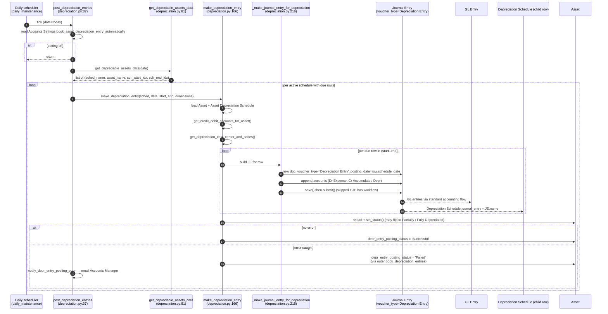
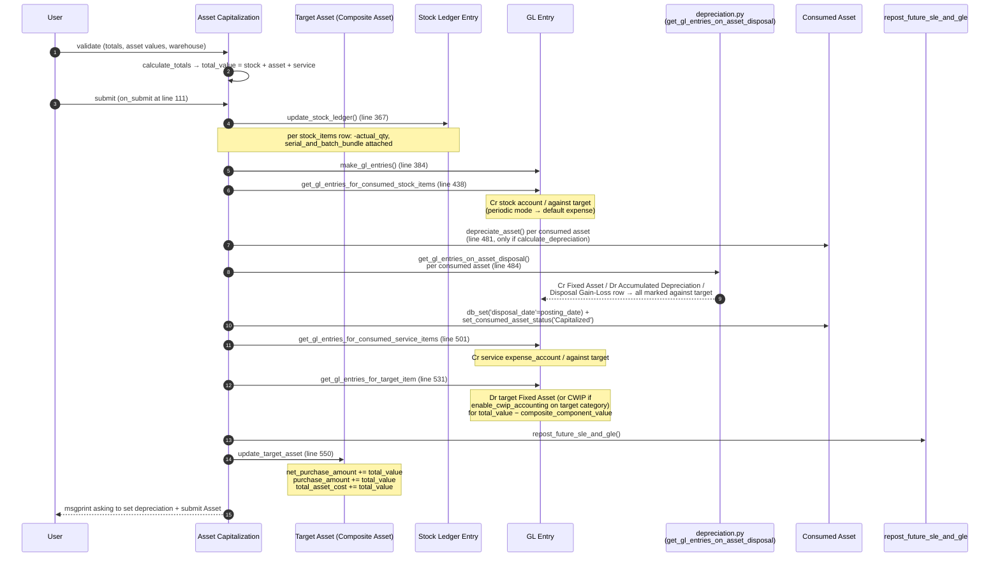
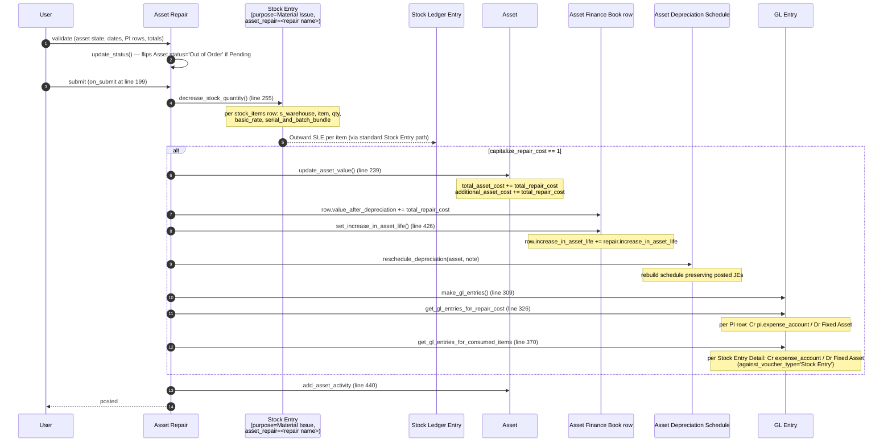

# Assets Flow

> **TL;DR:** Three asset-side flows worth tracing end-to-end. **(1) Depreciation posting** — daily scheduler walks every active `Asset Depreciation Schedule`, posts a Journal Entry per due row (Dr Depreciation Expense / Cr Accumulated Depreciation), and stamps `journal_entry` on the schedule row. **(2) Capitalization** — `Asset Capitalization` consumes stock items (SLE), retires consumed assets (asset-disposal GL), and rolls services + composite-component value into the target asset, bumping its `net_purchase_amount` / `total_asset_cost`. **(3) Repair** — `Asset Repair` always issues consumed stock through a child Stock Entry; with `capitalize_repair_cost=1` it then posts GL bridging the originating PI's expense account into the Fixed Asset account and bumps the asset's value + finance-book life. Each flow links back to [accounting-flow.md](accounting-flow.md) for GL plumbing and [stock-flow.md](stock-flow.md) for SLE plumbing.

## Key files

- [erpnext/hooks.py:471-491](../../erpnext/hooks.py:471) — daily scheduler entries: `update_maintenance_status`, `make_post_gl_entry`, `update_asset_maintenance_log_status`, `post_depreciation_entries`.
- [erpnext/assets/doctype/asset/depreciation.py](../../erpnext/assets/doctype/asset/depreciation.py) — depreciation scheduler, JE posting, disposal/regain GL builders.
- [erpnext/assets/doctype/asset/asset.py](../../erpnext/assets/doctype/asset/asset.py) — Asset(`AccountsController`), CWIP→Fixed Asset GL, status machine.
- [erpnext/assets/doctype/asset_capitalization/asset_capitalization.py](../../erpnext/assets/doctype/asset_capitalization/asset_capitalization.py) — AssetCapitalization(`StockController`); SLE for stock items + GL composer.
- [erpnext/assets/doctype/asset_repair/asset_repair.py](../../erpnext/assets/doctype/asset_repair/asset_repair.py) — AssetRepair(`AccountsController`); stock issue via child Stock Entry; capitalisation branch.
- [erpnext/assets/doctype/asset_depreciation_schedule/deppreciation_schedule_controller.py](../../erpnext/assets/doctype/asset_depreciation_schedule/deppreciation_schedule_controller.py) — schedule rebuild + `reschedule_depreciation` helper.
- [erpnext/assets/doctype/asset_depreciation_schedule/depreciation_methods.py](../../erpnext/assets/doctype/asset_depreciation_schedule/depreciation_methods.py) — Straight Line / WDV / Double Declining Balance / shift mathematics.

For module-level orientation read [docs/modules/assets.md](../modules/assets.md). For DocType reference cards read [docs/modules/assets-doctypes.md](../modules/assets-doctypes.md).

---

## Flow 1: Depreciation posting

The depreciation engine is **scheduler-only**: there is no on-submit "post all depreciation" path. The Asset's depreciation schedule is materialised at Asset save time, and individual rows post their own Journal Entries when their `schedule_date` is reached.

### Pre-conditions

For a row to post on a given day:

1. `Accounts Settings.book_asset_depreciation_entry_automatically` must be on ([depreciation.py:39](../../erpnext/assets/doctype/asset/depreciation.py:39)).
2. `Asset.calculate_depreciation == 1` ([depreciation.py:93](../../erpnext/assets/doctype/asset/depreciation.py:93)).
3. `Asset.docstatus == 1` ([depreciation.py:94](../../erpnext/assets/doctype/asset/depreciation.py:94)).
4. `Asset.status IN ('Submitted', 'Partially Depreciated')` ([depreciation.py:96](../../erpnext/assets/doctype/asset/depreciation.py:96)) — `Fully Depreciated` and `Sold` / `Scrapped` skip the engine.
5. The owning `Asset Depreciation Schedule.docstatus == 1` ([depreciation.py:95](../../erpnext/assets/doctype/asset/depreciation.py:95)) (status `Active`).
6. The row's `journal_entry IS NULL` ([depreciation.py:97](../../erpnext/assets/doctype/asset/depreciation.py:97)) — already-posted rows are skipped.
7. The row's `schedule_date <= today` ([depreciation.py:98](../../erpnext/assets/doctype/asset/depreciation.py:98)).
8. The asset's company is not frozen for that date for this user ([depreciation.py:103-106](../../erpnext/assets/doctype/asset/depreciation.py:103)).

### Sequence

### GL impact (per row, Expense root_type case)

| Account | Dr | Cr | Source |
|---|---|---|---|
| Depreciation Expense | `Depreciation Schedule.depreciation_amount` | — | [depreciation.py:275-281](../../erpnext/assets/doctype/asset/depreciation.py:275) |
| Accumulated Depreciation | — | `Depreciation Schedule.depreciation_amount` | [depreciation.py:267-273](../../erpnext/assets/doctype/asset/depreciation.py:267) |

Both rows carry `reference_type='Asset'`, `reference_name=<asset>`, `cost_center=<asset cost center or company default>`, finance-book = the parent schedule's finance book ([depreciation.py:251-261](../../erpnext/assets/doctype/asset/depreciation.py:251)). Accounting dimensions are inherited from the asset where mandatory or set ([depreciation.py:283-292](../../erpnext/assets/doctype/asset/depreciation.py:283)).

When `depreciation_expense_account.root_type == 'Income'` (recovered-depreciation accounting), `get_credit_and_debit_accounts` ([depreciation.py:296-308](../../erpnext/assets/doctype/asset/depreciation.py:296)) swaps the dr/cr.

For the underlying GL plumbing (`make_gl_entries` → `process_gl_map` → `save_entries`), cross-link [docs/flows/accounting-flow.md](accounting-flow.md). Note that depreciation does **not** go through the standard `make_gl_entries` path — it submits a Journal Entry directly, and the JE submit path posts the GL Entries.

### Schedule-row index range

`get_depreciable_assets_data` returns `(Min(idx)-1, Max(idx))` per schedule. Inside `make_depreciation_entry`, the slice `depr_schedule[(sch_start_idx or 0):(sch_end_idx or len(...))]` is iterated. This means a single scheduler tick can post multiple rows for the same schedule when several rows became due during one tick (e.g. weekend gap, missed runs).

### Failure isolation

- Each schedule is processed in its own transaction (`frappe.db.commit()` after each, [depreciation.py:65-66](../../erpnext/assets/doctype/asset/depreciation.py:65)).
- An exception inside one schedule rolls back that schedule only, marks the asset `depr_entry_posting_status='Failed'`, logs an `Error Log`, and the engine continues.
- After the loop, `notify_depr_entry_posting_error` ([depreciation.py:316-330](../../erpnext/assets/doctype/asset/depreciation.py:316)) emails the role configured in `Accounts Settings.role_to_notify_on_depreciation_failure` (defaulting to Accounts Manager, then System Manager).

### Mid-period and disposal interactions

- `reschedule_depreciation(asset_doc, notes, disposal_date=None)` ([deppreciation_schedule_controller.py:193](../../erpnext/assets/doctype/asset_depreciation_schedule/deppreciation_schedule_controller.py:193)) is the central rebuild helper. Asset Value Adjustment ([asset_value_adjustment.py:184](../../erpnext/assets/doctype/asset_value_adjustment/asset_value_adjustment.py:184)), Asset Repair (capitalisation branch, [asset_repair.py:207](../../erpnext/assets/doctype/asset_repair/asset_repair.py:207)), Asset Capitalization (consumed-asset branch, via `depreciate_asset` at [asset_capitalization.py:481](../../erpnext/assets/doctype/asset_capitalization/asset_capitalization.py:481)), and SI disposal (`depreciate_asset_on_sale` → `depreciate_asset` → `reschedule_depreciation`, [depreciation.py:475-485](../../erpnext/assets/doctype/asset/depreciation.py:475)) all call it.
- The rebuild **preserves already-posted JEs**: it cancels the prior schedule with `flags.should_not_cancel_depreciation_entries = True` ([deppreciation_schedule_controller.py:212](../../erpnext/assets/doctype/asset_depreciation_schedule/deppreciation_schedule_controller.py:212)), so [asset_depreciation_schedule.py:108](../../erpnext/assets/doctype/asset_depreciation_schedule/asset_depreciation_schedule.py:108) skips JE cancellation.
- On disposal date the engine calls `make_depreciation_entry_on_disposal` ([depreciation.py:127-131](../../erpnext/assets/doctype/asset/depreciation.py:127)) to post the partial-period depreciation up to disposal, then the disposal GL builder fills in the Cr Fixed Asset / Dr Accumulated Depreciation pair plus gain/loss.

### Regional override slot

`cancel_depreciation_entries(asset_doc, date)` ([depreciation.py:488-493](../../erpnext/assets/doctype/asset/depreciation.py:488)) is a no-op decorated `@erpnext.allow_regional`. The comment at [depreciation.py:492](../../erpnext/assets/doctype/asset/depreciation.py:492) notes "Overwritten via India Compliance app" — Indian Income Tax Act forbids depreciating an asset in the financial year it was sold/scrapped, so the override reverses the in-year postings. No country in the in-tree `erpnext/regional/<country>/` packages overrides this slot. See [docs/patterns/regional-overrides.md](../patterns/regional-overrides.md).

---

## Flow 2: Capitalization

Asset Capitalization rolls one or more **consumed sources** — stock items, fully-depreciated or in-service consumed assets, and service-cost lines — into a **target asset** (typically a `Composite Asset`). The DocType extends `StockController`, so it speaks both SLE and GL natively.

### Pre-conditions

- `target_item_code` must be `Item.is_fixed_asset=1` ([asset_capitalization.py:178-184](../../erpnext/assets/doctype/asset_capitalization/asset_capitalization.py:178)).
- If `target_asset` is set: it must be a `Composite Asset` in `Draft` status with matching company and item code ([asset_capitalization.py:186-215](../../erpnext/assets/doctype/asset_capitalization/asset_capitalization.py:186)).
- Each consumed stock item must be `Item.is_stock_item=1` and have positive qty ([asset_capitalization.py:217-228](../../erpnext/assets/doctype/asset_capitalization/asset_capitalization.py:217)).
- Each consumed asset must not be the target itself; status must not be `Draft` / `Scrapped` / `Sold` / `Capitalized` ([asset_capitalization.py:230-261](../../erpnext/assets/doctype/asset_capitalization/asset_capitalization.py:230)).
- Each service item must be a non-stock, non-fixed-asset item with positive qty and rate ([asset_capitalization.py:263-280](../../erpnext/assets/doctype/asset_capitalization/asset_capitalization.py:263)).
- At least one of the three source tables must have rows ([asset_capitalization.py:282-288](../../erpnext/assets/doctype/asset_capitalization/asset_capitalization.py:282)).

### Sequence

### GL impact (per source type)

| Source | Dr | Cr | `against` | Source |
|---|---|---|---|---|
| Consumed stock item | (target Fixed Asset / CWIP — composed in target row) | stock account (perpetual) or default expense (periodic) | target asset account | [asset_capitalization.py:438-466](../../erpnext/assets/doctype/asset_capitalization/asset_capitalization.py:438) |
| Consumed asset (depreciable) | (target Fixed Asset / CWIP) | Fixed Asset of consumed | target asset account | via `get_gl_entries_on_asset_disposal` ([depreciation.py:633](../../erpnext/assets/doctype/asset/depreciation.py:633)) |
| Consumed asset (depreciable, accum) | Accumulated Depreciation | — | target asset account | same |
| Consumed asset (gain or loss) | Disposal Gain-Loss (one side) | Disposal Gain-Loss (other side) | target asset account | `get_profit_gl_entries` ([depreciation.py:757-775](../../erpnext/assets/doctype/asset/depreciation.py:757)) |
| Service item | (target Fixed Asset / CWIP) | service `expense_account` | target asset account | [asset_capitalization.py:501-521](../../erpnext/assets/doctype/asset_capitalization/asset_capitalization.py:501) |
| Target item (sum) | target Fixed Asset (or CWIP — see below) | (sum of all "against") | comma-joined source accounts | [asset_capitalization.py:531-548](../../erpnext/assets/doctype/asset_capitalization/asset_capitalization.py:531) |

The target debit account flips between Fixed Asset and CWIP based on `is_cwip_accounting_enabled(target_asset.asset_category)` ([asset_capitalization.py:424-436](../../erpnext/assets/doctype/asset_capitalization/asset_capitalization.py:424)). Consumed `Composite Component` assets are excluded from the target row debit (their value is reflected via the consumed-asset disposal rows).

### Asset materialisation

- The **target asset is not auto-created** by Asset Capitalization — it must already exist in `Draft` status.
- After submit, `update_target_asset` ([asset_capitalization.py:550-575](../../erpnext/assets/doctype/asset_capitalization/asset_capitalization.py:550)) bumps the target asset's value fields. The user is prompted by msgprint to fill in depreciation parameters and submit the Asset.
- On Asset submit, `before_submit` checks `has_active_capitalization(self.name)` for Composite Asset and throws if none is found ([asset.py:246-250](../../erpnext/assets/doctype/asset/asset.py:246)).
- On Asset Capitalization cancel, `restore_consumed_asset_items` ([asset_capitalization.py:577-590](../../erpnext/assets/doctype/asset_capitalization/asset_capitalization.py:577)) un-capitalises the consumed assets — reverses the disposal-date depreciation entry and rebuilds their schedule via `reset_depreciation_schedule`.

### Repost

`repost_future_sle_and_gle()` (inherited from `StockController`) handles the case where back-dated capitalisation needs to ripple through subsequent SLE/GL. Cross-link [docs/flows/stock-flow.md](stock-flow.md) (`Repost Item Valuation`).

---

## Flow 3: Repair

Asset Repair always issues consumed stock items via a child Stock Entry. Whether it posts asset-side GL depends on `capitalize_repair_cost`:

- `capitalize_repair_cost = 0` — repair is treated as a period expense; the cost lives in the originating Purchase Invoice's expense GL and the consumed Stock Entry's GL. Asset-side GL is **not** posted; asset value is **not** bumped; no schedule rebuild.
- `capitalize_repair_cost = 1` — repair cost is capitalised onto the asset; GL bridges PI's `expense_account` and the Stock Entry's stock-expense account into the Fixed Asset account; `Asset.total_asset_cost`, `Asset.additional_asset_cost`, and each finance book's `value_after_depreciation` are bumped; depreciation schedule is rebuilt with `increase_in_asset_life` extending each finance book's life.

### Pre-conditions

- `Asset.status` must not be `Sold`, `Fully Depreciated`, or `Scrapped` ([asset_repair.py:72-78](../../erpnext/assets/doctype/asset_repair/asset_repair.py:72)).
- `failure_date <= completion_date` ([asset_repair.py:80-84](../../erpnext/assets/doctype/asset_repair/asset_repair.py:80)).
- Each linked Purchase Invoice row must reference a submitted PI ([asset_repair.py:115-139](../../erpnext/assets/doctype/asset_repair/asset_repair.py:115)).
- Each PI row's `expense_account` must come from a non-stock, non-fixed-asset Item line in that PI ([asset_repair.py:141-154](../../erpnext/assets/doctype/asset_repair/asset_repair.py:141)).
- Per (PI, expense_account) combination, the requested `repair_cost` must not exceed the PI's GL net of already-allocated repair costs ([asset_repair.py:156-173](../../erpnext/assets/doctype/asset_repair/asset_repair.py:156)).
- `repair_status` must be `Completed` (not `Pending`) at submit time ([asset_repair.py:235-237](../../erpnext/assets/doctype/asset_repair/asset_repair.py:235)).

### Sequence (capitalising branch)

### GL impact (capitalising branch)

| Account | Dr | Cr | `against` | `against_voucher` | Source |
|---|---|---|---|---|---|
| Fixed Asset | `repair_cost` (sum across PIs) | — | comma-joined `expense_account` | `Asset / <asset>` | [asset_repair.py:351-368](../../erpnext/assets/doctype/asset_repair/asset_repair.py:351) |
| PI `expense_account` (one per PI row) | — | `pi.repair_cost` | Fixed Asset | — | [asset_repair.py:334-349](../../erpnext/assets/doctype/asset_repair/asset_repair.py:334) |
| Fixed Asset | `stock_entry_detail.amount` (per item) | — | item expense account | `Stock Entry / <SE name>` | [asset_repair.py:407-423](../../erpnext/assets/doctype/asset_repair/asset_repair.py:407) |
| Stock-Entry expense account (per item) | — | `stock_entry_detail.amount` | Fixed Asset | — | [asset_repair.py:388-405](../../erpnext/assets/doctype/asset_repair/asset_repair.py:388) |

In periodic-inventory mode, the consumed-item expense account falls back to `Company.default_expense_account` ([asset_repair.py:381-386](../../erpnext/assets/doctype/asset_repair/asset_repair.py:381)).

The `against_voucher_type='Asset'` link on the Fixed Asset debit ([asset_repair.py:362-363](../../erpnext/assets/doctype/asset_repair/asset_repair.py:362)) is what `get_unallocated_repair_cost` ([asset_repair.py:562-577](../../erpnext/assets/doctype/asset_repair/asset_repair.py:562)) uses later to enforce that no PI line is double-billed across multiple Asset Repairs.

### Cancel

`on_cancel` ([asset_repair.py:219-230](../../erpnext/assets/doctype/asset_repair/asset_repair.py:219)) reverses the bump: `update_asset_value` flips sign, `make_gl_entries(cancel=True)` posts reverse GL, `set_increase_in_asset_life` un-extends the finance books, `reschedule_depreciation` rebuilds, and `cancel_sabb` cancels the Serial and Batch Bundle attached to each consumed stock row. The child Stock Entry from `decrease_stock_quantity` is **not** auto-cancelled by Asset Repair — it is independent and is cancelled via `ignore_linked_doctypes` propagation when the Asset Repair cancellation cascade runs.

---

## Cross-references

- [docs/flows/accounting-flow.md](accounting-flow.md) — for `make_gl_entries` / `process_gl_map` / `save_entries` / `make_reverse_gl_entries`. Note: depreciation posts via Journal Entry submit, not via `make_gl_entries` directly. Asset Capitalization and Asset Repair (capitalising) use the standard `make_gl_entries` pathway via `StockController` / `AccountsController`.
- [docs/flows/stock-flow.md](stock-flow.md) — for `make_sl_entries`, `update_entries_after`, `update_bin_qty`, repost mechanics that govern Asset Capitalization SLE and the child Stock Entry that Asset Repair uses.
- [docs/flows/buying-flow.md](buying-flow.md) — Purchase Receipt / Purchase Invoice with `is_fixed_asset=1` items auto-create Asset rows via `BuyingController.process_fixed_asset` → `auto_make_assets` → `make_asset` ([buying_controller.py:990-1109](../../erpnext/controllers/buying_controller.py:990)). The CWIP bridge (PR posts CWIP, Asset submit flips CWIP → Fixed Asset) is documented in [docs/modules/assets.md#buying--assets-auto-creation](../modules/assets.md#buying--assets-auto-creation).
- [docs/flows/selling-flow.md](selling-flow.md) — Sales Invoice with `is_fixed_asset=1` item triggers `process_asset_depreciation` on submit and on cancel ([sales_invoice.py:488, 611, 1450](../../erpnext/accounts/doctype/sales_invoice/sales_invoice.py:488)).
- [docs/modules/assets.md](../modules/assets.md) — module overview, controller posture, scheduler reference, regional override slots.
- [docs/modules/assets-doctypes.md](../modules/assets-doctypes.md) — per-DocType reference cards.

## Changelog

- `2026-04-18` — initial version (Phase 1 of Assets gap-fill).
