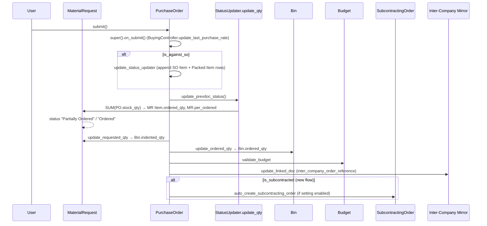
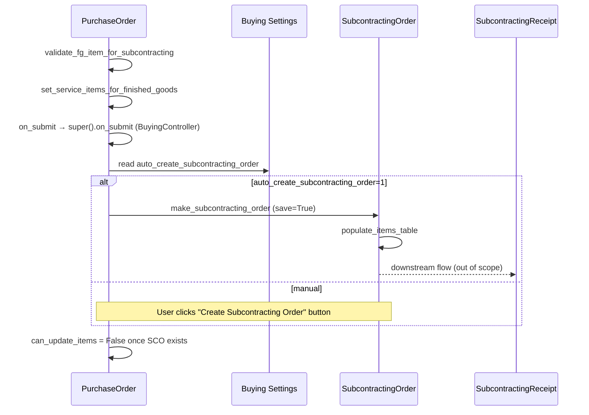
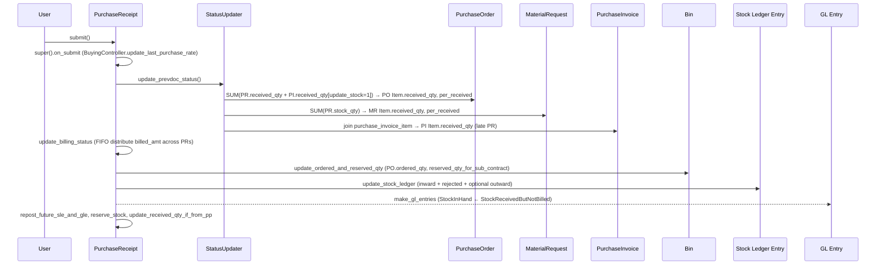
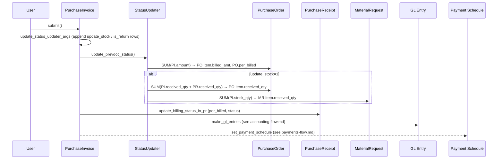
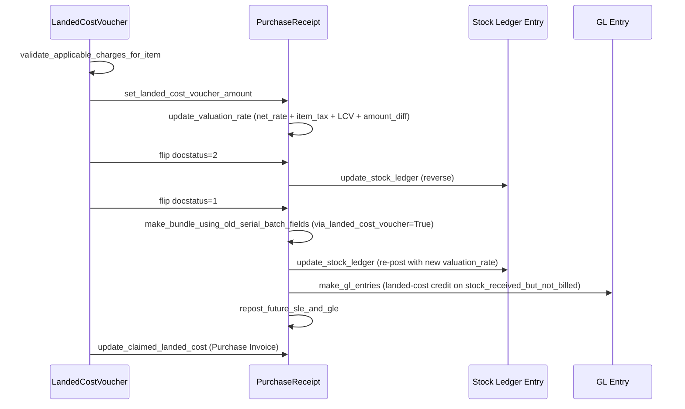
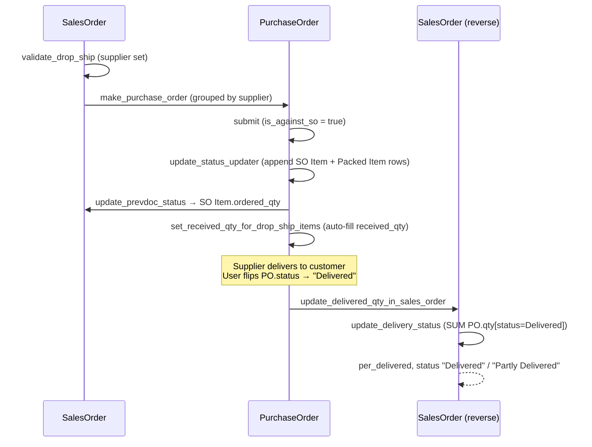

# Buying Flow: Material Request → RFQ → Supplier Quotation → Purchase Order → Purchase Receipt → Purchase Invoice

> **TL;DR:** The buying cascade threads qty / amount completion state across six DocTypes using the `status_updater[]` contract from [StatusUpdater](../../erpnext/controllers/status_updater.py:180). On each downstream submit / cancel, `update_prevdoc_status` (qty roll-up via [StatusUpdater.update_qty](../../erpnext/controllers/status_updater.py:494)) and `update_billing_status` (amount roll-up, custom per DocType) walk the chain backwards, refreshing `ordered_qty`, `received_qty`, `billed_amt` and the parent `per_ordered` / `per_received` / `per_billed` fields. SLE and GL side-effects run **only** at Purchase Receipt and Purchase Invoice submit (see [flows/stock-flow.md](./stock-flow.md), [flows/accounting-flow.md](./accounting-flow.md)). Special variants: Drop-Ship (SO → PO → PR with `update_delivered_qty_in_sales_order` as the reverse lane), Subcontracted PO (auto-creates Subcontracting Order), Internal Supplier / inter-company (mirrored PO ↔ SO and PI ↔ SI), return flow, Landed Cost Voucher (re-post PR SLE + GL).

## Scope of this document

This page documents **the buying cascade itself**. For the per-stage side effects, cross-link to:

- GL writes on PI / PR submit / cancel → [flows/accounting-flow.md](./accounting-flow.md).
- Tax + totals math at every stage (Purchase Taxes and Charges, valuation vs total category) → [flows/taxes-and-totals.md](./taxes-and-totals.md).
- SLE writes on PR submit / cancel (and PI with `update_stock=1`) → [flows/stock-flow.md](./stock-flow.md).
- Payment Entry / `set_payment_schedule` on PO and PI → [flows/payments-flow.md](./payments-flow.md).
- Drop-ship SO → PO → delivery-status writeback from the **selling** perspective → [flows/selling-flow.md](./selling-flow.md).
- Per-DocType method cards → [modules/buying-doctypes.md](../modules/buying-doctypes.md).
- `BuyingController` and `SubcontractingController` inheritance → [architecture/controllers.md](../architecture/controllers.md).

Subcontracting has its own in-depth flow (not in this doc) — we describe only the PO-level branch that creates a Subcontracting Order.

## Key files

- [buying_controller.py](../../erpnext/controllers/buying_controller.py:29) — `BuyingController` base for MR / RFQ / SQ / PO / PR / PI.
- [subcontracting_controller.py](../../erpnext/controllers/subcontracting_controller.py:26) — parent of `BuyingController`; contributes supplied-items, raw-material-transfer, subcontract-rate math.
- [status_updater.py](../../erpnext/controllers/status_updater.py:180) — `StatusUpdater.update_qty` + `validate_qty` core of the cascade, plus the `status_map` literal for `Purchase Order` / `Purchase Receipt` / `Material Request` at [status_updater.py:68](../../erpnext/controllers/status_updater.py:68), [:102](../../erpnext/controllers/status_updater.py:102), [:115](../../erpnext/controllers/status_updater.py:115).
- [material_request.py](../../erpnext/stock/doctype/material_request/material_request.py:31) — MR lifecycle, MR mappers → PO / SQ / RFQ / Stock Entry / Pick List / Work Order.
- [request_for_quotation.py](../../erpnext/buying/doctype/request_for_quotation/request_for_quotation.py:26) — RFQ + supplier-email solicitation.
- [supplier_quotation.py](../../erpnext/buying/doctype/supplier_quotation/supplier_quotation.py:19) — SQ lifecycle + `update_rfq_supplier_status`.
- [purchase_order.py](../../erpnext/buying/doctype/purchase_order/purchase_order.py:36) — PO with three `status_updater` rows (MR, SO for drop-ship, Production Plan).
- [purchase_receipt.py](../../erpnext/stock/doctype/purchase_receipt/purchase_receipt.py:33) — PR with four-plus `status_updater` rows (PO, MR, PI-when-update_stock, DN-for-internal-transfer).
- [purchase_invoice.py](../../erpnext/accounts/doctype/purchase_invoice/purchase_invoice.py:54) — PI with PO-billing `status_updater` + `update_status_updater_args` appending received-qty when `update_stock=1`.
- [landed_cost_voucher.py](../../erpnext/stock/doctype/landed_cost_voucher/landed_cost_voucher.py:24) — LCV with `update_landed_cost` re-posting SLE + GL for each linked PR.
- [make_purchase_order (from MR)](../../erpnext/stock/doctype/material_request/material_request.py:502) — MR → PO mapper.
- [make_request_for_quotation](../../erpnext/stock/doctype/material_request/material_request.py:570) — MR → RFQ mapper.
- [make_supplier_quotation](../../erpnext/stock/doctype/material_request/material_request.py:698) — MR → SQ mapper.
- [make_purchase_order (from SQ)](../../erpnext/buying/doctype/supplier_quotation/supplier_quotation.py:244) — SQ → PO mapper.
- [make_purchase_receipt (from PO)](../../erpnext/buying/doctype/purchase_order/purchase_order.py:710) — PO → PR mapper.
- [make_purchase_invoice (from PO)](../../erpnext/buying/doctype/purchase_order/purchase_order.py:776) — PO → PI mapper.
- [make_subcontracting_order (from PO)](../../erpnext/buying/doctype/purchase_order/purchase_order.py:915) — PO → SCO branch.
- [update_delivered_qty_in_sales_order (drop-ship)](../../erpnext/buying/doctype/purchase_order/purchase_order.py:556) — PO → SO `delivered_qty` reverse lane.

## The `status_updater` contract

Each transactional buying DocType declares one or more `status_updater` dicts in `__init__`. At submit, `StatusUpdater.update_prevdoc_status` → `update_qty` ([status_updater.py:191](../../erpnext/controllers/status_updater.py:191), [:494](../../erpnext/controllers/status_updater.py:494)) walks the list and:

1. Per `source_dt` child row, SUMs `source_field` across all submitted parents (`docstatus=1`) into `target_field` on the `target_dt` child identified by `join_field` ([status_updater.py:511-561](../../erpnext/controllers/status_updater.py:511)).
2. If a `percent_join_field` / `target_parent_field` is provided, aggregates per `target_parent_dt` and recomputes `per_*` ([status_updater.py:563-641](../../erpnext/controllers/status_updater.py:563)).
3. `validate_qty` checks overflow with the allowance from Item / Stock Settings / Accounts Settings ([status_updater.py:388-428](../../erpnext/controllers/status_updater.py:388)); role override via `role_allowed_to_over_deliver_receive` (qty) or `role_allowed_to_over_bill` (amount).

The canonical chain for buying:

| From (source_dt) | To (target_dt) | join_field | target_field | Location |
|---|---|---|---|---|
| Purchase Order Item | Material Request Item | `material_request_item` | `ordered_qty` + `per_ordered` | [purchase_order.py:176](../../erpnext/buying/doctype/purchase_order/purchase_order.py:176) |
| Purchase Order Item | Sales Order Item | `sales_order_item` | `ordered_qty` (drop-ship / internal) | [purchase_order.py:516](../../erpnext/buying/doctype/purchase_order/purchase_order.py:516) |
| Purchase Order Item | Packed Item | `sales_order_packed_item` | `ordered_qty` | [purchase_order.py:529](../../erpnext/buying/doctype/purchase_order/purchase_order.py:529) |
| Purchase Order Item | Production Plan Sub Assembly Item | `production_plan_sub_assembly_item` | `received_qty` (PP branch) | [purchase_order.py:542](../../erpnext/buying/doctype/purchase_order/purchase_order.py:542) |
| Purchase Receipt Item | Purchase Order Item | `purchase_order_item` | `received_qty` + `per_received` (SUM with PI when `update_stock=1`) | [purchase_receipt.py:161](../../erpnext/stock/doctype/purchase_receipt/purchase_receipt.py:161) |
| Purchase Receipt Item | Material Request Item | `material_request_item` | `received_qty` + `per_received` | [purchase_receipt.py:180](../../erpnext/stock/doctype/purchase_receipt/purchase_receipt.py:180) |
| Purchase Receipt Item | Purchase Invoice Item | `purchase_invoice_item` | `received_qty` + `per_received` | [purchase_receipt.py:191](../../erpnext/stock/doctype/purchase_receipt/purchase_receipt.py:191) |
| Purchase Receipt Item | Delivery Note Item | `delivery_note_item` | `received_qty` (internal transfer mirror) | [purchase_receipt.py:203](../../erpnext/stock/doctype/purchase_receipt/purchase_receipt.py:203) |
| Purchase Invoice Item | Purchase Order Item | `po_detail` | `billed_amt` + `per_billed` | [purchase_invoice.py:228](../../erpnext/accounts/doctype/purchase_invoice/purchase_invoice.py:228) |
| Purchase Invoice Item (update_stock=1) | Purchase Order Item | `po_detail` | `received_qty` | [purchase_invoice.py:679](../../erpnext/accounts/doctype/purchase_invoice/purchase_invoice.py:679) |
| Purchase Invoice Item (update_stock=1) | Material Request Item | `material_request_item` | `received_qty` | [purchase_invoice.py:700](../../erpnext/accounts/doctype/purchase_invoice/purchase_invoice.py:700) |

Cancel reverses the effect: `update_qty` re-sums with `parent != <self.name>` ([status_updater.py:504](../../erpnext/controllers/status_updater.py:504)), dropping the cancelling voucher out of the aggregate.

### Status maps

- Material Request: `Pending` → `Partially Ordered` → `Ordered` → `Partially Received` → `Received`, plus `Issued` / `Transferred` for non-Purchase types and manual `Stopped` ([status_updater.py:115](../../erpnext/controllers/status_updater.py:115)).
- Purchase Order: `To Receive and Bill` → `To Bill` / `To Receive` → `Completed`, plus manual `Closed` / `On Hold` and `Delivered` (drop-ship trigger) ([status_updater.py:68](../../erpnext/controllers/status_updater.py:68)).
- Purchase Receipt: `To Bill` → `Partly Billed` → `Completed`, plus `Return` / `Return Issued` and manual `Closed` ([status_updater.py:102](../../erpnext/controllers/status_updater.py:102)).

## Material Request

MR is the pre-purchase indent. A single MR may target Purchase, Material Transfer, Material Issue, Manufacture, Subcontracting, or Customer Provided flows; only `Purchase` and `Subcontracting` feed the PO chain ([material_request.py:502](../../erpnext/stock/doctype/material_request/material_request.py:502) validation).

### On submit

[MaterialRequest.on_submit](../../erpnext/stock/doctype/material_request/material_request.py:232):

1. `update_requested_qty_in_production_plan` — bumps `Material Request Plan Item.requested_qty` when this MR was spawned from a Production Plan ([material_request.py:401](../../erpnext/stock/doctype/material_request/material_request.py:401)).
2. `update_requested_qty` — refreshes `Bin.indented_qty` per item × warehouse via `stock_balance.get_indented_qty` ([material_request.py:380](../../erpnext/stock/doctype/material_request/material_request.py:380)).
3. If `material_request_type == "Purchase"`: `update_prevdoc_status` walks the `status_updater[]` (targeting SO Item and Packed Item for `requested_qty`, from the MR's own `__init__` at [material_request.py:90](../../erpnext/stock/doctype/material_request/material_request.py:90)) — this reverse-writes `requested_qty` on a Sales Order when the MR was cut against it (`make_material_request` from SO at [sales_order.py:1027](../../erpnext/selling/doctype/sales_order/sales_order.py:1027)).
4. If any Budget with `applicable_on_material_request=1` exists, `validate_budget` runs.

`before_save` and `before_submit` invoke `set_status(update=True)` so the `Pending` → `Partially Ordered` → `Ordered` / `Received` literal is set in the DB.

### On cancel

[MaterialRequest.on_cancel](../../erpnext/stock/doctype/material_request/material_request.py:290) mirrors submit: decrements Production Plan references and `Bin.indented_qty`, and re-runs `update_prevdoc_status` to drop this MR from Sales Order `requested_qty` aggregate.

### update_completed_qty (non-Purchase branch)

For Material Transfer / Material Issue / Customer Provided / Manufacture, MR does not feed a PO — the Stock Entry / Work Order downstream increments `Material Request Item.ordered_qty`. [MaterialRequest.update_completed_qty](../../erpnext/stock/doctype/material_request/material_request.py:327) is invoked from the **downstream** doc (Stock Entry `on_submit` via hook — see [update_completed_and_requested_qty](../../erpnext/stock/doctype/material_request/material_request.py:422) registered on Stock Entry doc_events at [hooks.py:353](../../erpnext/hooks.py:353)) to SUM into `ordered_qty` and compute `per_ordered` via `_update_percent_field`.

## MR → RFQ → Supplier Quotation

### RFQ solicitation

[RequestforQuotation.on_submit](../../erpnext/buying/doctype/request_for_quotation/request_for_quotation.py:161) sets `status = "Submitted"`, resets every `Request for Quotation Supplier.email_sent = 0` and `quote_status = "Pending"`, then `send_to_supplier()` iterates suppliers and mails the RFQ link to each one with a one-time reset-password link if the supplier has no portal user ([request_for_quotation.py:192](../../erpnext/buying/doctype/request_for_quotation/request_for_quotation.py:192), [:278](../../erpnext/buying/doctype/request_for_quotation/request_for_quotation.py:278)).

Supplier-scorecard gate at RFQ: [validate_supplier_list](../../erpnext/buying/doctype/request_for_quotation/request_for_quotation.py:127) — throws if a supplier has `prevent_rfqs=1` and warns if `warn_rfqs=1`, quoting the current Supplier Scorecard standing.

The supplier opens the portal link (registered at [hooks.py:190](../../erpnext/hooks.py:190): `/rfq → Request for Quotation`, with permission check [hooks.py:311](../../erpnext/hooks.py:311) — `website_list_for_contact.has_website_permission`) and submits a **Supplier Quotation** via the `create_supplier_quotation_from_rfq` whitelisted endpoint.

### Supplier Quotation on submit

[SupplierQuotation.on_submit](../../erpnext/buying/doctype/supplier_quotation/supplier_quotation.py:131):

1. `db_set("status", "Submitted")`.
2. `update_rfq_supplier_status(1)` ([supplier_quotation.py:172](../../erpnext/buying/doctype/supplier_quotation/supplier_quotation.py:172)) — for each RFQ this SQ references, recomputes `Request for Quotation Supplier.quote_status` per (RFQ, supplier): `Received` if at least one submitted SQ line covers each RFQ item, otherwise `Pending`.

On `on_cancel`, the same routine runs with `include_me=0` so the SQ drops out of the aggregate.

`set_expired_status` ([supplier_quotation.py:344](../../erpnext/buying/doctype/supplier_quotation/supplier_quotation.py:344)) — scheduler job (daily) at [hooks.py:481](../../erpnext/hooks.py:481) flips submitted SQs past `valid_till` to `Expired`.

### MR → PO / SQ / RFQ mappers

All three live on `MaterialRequest`:

- [make_purchase_order](../../erpnext/stock/doctype/material_request/material_request.py:502) — filters rows with `ordered_qty < stock_qty`, field-maps `material_request_item` / `material_request` / `sales_order` / `sales_order_item`. Sets `is_subcontracted=1` when `material_request_type='Subcontracting'`, rewriting `item_code → fg_item` and rewiring to the subcontracting BOM's service item ([material_request.py:460](../../erpnext/stock/doctype/material_request/material_request.py:460)). Resets stale `schedule_date` to null if in the past.
- [make_supplier_quotation](../../erpnext/stock/doctype/material_request/material_request.py:698) — direct MR-Item → SQ-Item map, no qty filter.
- [make_request_for_quotation](../../erpnext/stock/doctype/material_request/material_request.py:570) — maps item rows only (no supplier table — user fills it on the RFQ).

## MR → Purchase Order

### Mapper

[make_purchase_order (from MR)](../../erpnext/stock/doctype/material_request/material_request.py:502) invoked by the user from the MR form. Validations: MR must be submitted and `material_request_type in ("Purchase", "Subcontracting")` ([:548](../../erpnext/stock/doctype/material_request/material_request.py:548)).

### Cascade on PO submit

[PurchaseOrder.on_submit](../../erpnext/buying/doctype/purchase_order/purchase_order.py:451):

1. `super().on_submit()` — `BuyingController.on_submit` ([buying_controller.py:932](../../erpnext/controllers/buying_controller.py:932)): `process_fixed_asset` on PR / PI only (no-op for PO), `update_last_purchase_rate(is_submit=1)` via [buying/utils.py:14](../../erpnext/buying/utils.py:14) (skipped if `Buying Settings.disable_last_purchase_rate=1` or `is_internal_supplier=1`).
2. `is_against_so()` → if any PO item has `sales_order`: [update_status_updater](../../erpnext/buying/doctype/purchase_order/purchase_order.py:516) appends two additional rows targeting **Sales Order Item** and **Packed Item** for `ordered_qty` (drop-ship / inter-company writeback).
3. `is_against_pp()` → similar branch adding **Production Plan Sub Assembly Item** row ([:542](../../erpnext/buying/doctype/purchase_order/purchase_order.py:542)).
4. **`update_prevdoc_status`** — walks the full list: MR `ordered_qty` + `per_ordered`; SO Item `ordered_qty` (drop-ship); Packed Item `ordered_qty`.
5. `update_requested_qty` ([material_request.py:380](../../erpnext/stock/doctype/material_request/material_request.py:380)) on the MR → refreshes `Bin.indented_qty` (if not subcontracted or old-subcontracting-flow).
6. `update_ordered_qty` ([purchase_order.py:415](../../erpnext/buying/doctype/purchase_order/purchase_order.py:415)) → bumps `Bin.ordered_qty` via `stock_balance.get_ordered_qty` × each unique `[item_code, warehouse]` (skips `delivered_by_supplier=1` drop-ship rows).
7. `validate_budget` — either the new [BudgetValidation](../../erpnext/controllers/budget_controller.py) flow, or the legacy `validate_expense_against_budget` per item ([buying_controller.py:965](../../erpnext/controllers/buying_controller.py:965)).
8. `update_reserved_qty_for_subcontract` ([purchase_order.py:584](../../erpnext/buying/doctype/purchase_order/purchase_order.py:584)) — old-subcontracting-flow only: bumps `Bin.reserved_qty_for_sub_contract` per supplied raw material.
9. Authorization Control — approval-limit check.
10. `update_blanket_order` — bumps `Blanket Order Item.ordered_qty` if `against_blanket_order` is set.
11. `update_linked_doc` — writes the mirror reference on `inter_company_order_reference` (paired SO in the other company).
12. `auto_create_subcontracting_order` ([purchase_order.py:646](../../erpnext/buying/doctype/purchase_order/purchase_order.py:646)) — new-subcontracting flow: if `is_subcontracted=1` and `Buying Settings.auto_create_subcontracting_order=1`, calls [make_subcontracting_order](../../erpnext/buying/doctype/purchase_order/purchase_order.py:915) which maps PO → Subcontracting Order.

### Cascade on PO cancel

[PurchaseOrder.on_cancel](../../erpnext/buying/doctype/purchase_order/purchase_order.py:478):

1. `ignore_linked_doctypes = ("GL Entry", "Payment Ledger Entry", "Advance Payment Ledger Entry", "Unreconcile Payment", "Unreconcile Payment Entries")`.
2. `super().on_cancel()` → `BuyingController.on_cancel` ([buying_controller.py:946](../../erpnext/controllers/buying_controller.py:946)) → `update_last_purchase_rate(is_submit=0)`.
3. `update_status_updater` / `update_status_updater_if_from_pp` branches as in submit.
4. If drop-ship (`has_drop_ship_item()` at [:570](../../erpnext/buying/doctype/purchase_order/purchase_order.py:570)): `update_delivered_qty_in_sales_order` ([:556](../../erpnext/buying/doctype/purchase_order/purchase_order.py:556)) → for each linked SO, call `SalesOrder.update_delivery_status()` + `set_status(update=True)` to recompute `per_delivered` without this PO.
5. `update_reserved_qty_for_subcontract`, `check_on_hold_or_closed_status` (MR link).
6. `db_set("status", "Cancelled")`.
7. `update_prevdoc_status` — reverses MR / SO / Packed Item aggregates.
8. `update_requested_qty`, `update_ordered_qty`, `update_blanket_order`.
9. `unlink_inter_company_doc` — clears mirror reference.

### Sequence diagram

## Purchase Order → Subcontracting Order

When `PurchaseOrder.is_subcontracted=1` **and** not the legacy flow (`is_old_subcontracting_flow=0`), the PO carries FG items but no stock movement; a **Subcontracting Order** is the actual execution document.

- `validate_fg_item_for_subcontracting` ([purchase_order.py:340](../../erpnext/buying/doctype/purchase_order/purchase_order.py:340)) — each PO row must carry `fg_item` pointing to a subcontracted Item with a BOM (own or default).
- `set_service_items_for_finished_goods` ([purchase_order.py:601](../../erpnext/buying/doctype/purchase_order/purchase_order.py:601)) — auto-fills `item_code` from the matching Subcontracting BOM service item if the user left it blank.
- `auto_create_subcontracting_order` ([purchase_order.py:646](../../erpnext/buying/doctype/purchase_order/purchase_order.py:646)) — gated by `Buying Settings.auto_create_subcontracting_order`.
- [make_subcontracting_order](../../erpnext/buying/doctype/purchase_order/purchase_order.py:915) — maps PO → SCO only if `is_po_fully_subcontracted(name)` returns False (some line still has `qty > subcontracted_qty`).
- `can_update_items` ([purchase_order.py:620](../../erpnext/buying/doctype/purchase_order/purchase_order.py:620)) — disables the "Update Items" dialog once a non-cancelled SCO exists for this PO.
- `update_subcontracting_order_status` ([purchase_order.py:651](../../erpnext/buying/doctype/purchase_order/purchase_order.py:651)) — when the PO is closed, cascades the `Closed` status to the linked SCO.

The SCO-side flow (supplied-items creation, raw-material transfer stock entry, Subcontracting Receipt posting) lives in the subcontracting module and is out of scope here. See [flows/subcontracting-flow.md](./subcontracting-flow.md) for the end-to-end cascade, [modules/subcontracting.md](../modules/subcontracting.md) for the `SubcontractingController` responsibilities, and [modules/subcontracting-doctypes.md](../modules/subcontracting-doctypes.md) for per-DocType reference cards.

### Legacy subcontracting (is_old_subcontracting_flow=1)

`BuyingController` still handles the legacy flow in-line:

- `create_raw_materials_supplied` is called from `BuyingController.validate` ([buying_controller.py:62](../../erpnext/controllers/buying_controller.py:62)) on PR / PI and from `PurchaseOrder.validate` ([purchase_order.py:219](../../erpnext/buying/doctype/purchase_order/purchase_order.py:219)).
- `get_supplied_items_cost` contributes to `valuation_rate` in [buying_controller.py:478](../../erpnext/controllers/buying_controller.py:478).
- `make_sl_entries_for_supplier_warehouse` at PR SLE-write time ([buying_controller.py:871](../../erpnext/controllers/buying_controller.py:871)) and a dedicated **supplier warehouse** GL credit in PR `make_sub_contracting_gl_entries` ([purchase_receipt.py:677](../../erpnext/stock/doctype/purchase_receipt/purchase_receipt.py:677)).

### Sequence diagram

## Purchase Order → Purchase Receipt

### Mapper

[make_purchase_receipt (from PO)](../../erpnext/buying/doctype/purchase_order/purchase_order.py:710):

- Skips rows with `delivered_by_supplier=1` (drop-ship — no PR on our side).
- `update_item` sets `qty = obj.qty - obj.received_qty` (pending-to-receive balance).
- `has_unit_price_items=1` PO: `qty=0` rows flow through at zero qty.
- Field map: `name → purchase_order_item`, `parent → purchase_order`, `bom`, `material_request`, `material_request_item`, `sales_order`, `sales_order_item`, `wip_composite_asset`.

### Cascade on PR submit

[PurchaseReceipt.on_submit](../../erpnext/stock/doctype/purchase_receipt/purchase_receipt.py:385):

1. `super().on_submit()` → BuyingController.
2. Authorization Control — approval-limit check.
3. **`update_prevdoc_status`** ([purchase_receipt.py:393](../../erpnext/stock/doctype/purchase_receipt/purchase_receipt.py:393)) — walks the full 4-row `status_updater` (+ 2 more on return):
   - **Purchase Order Item** `received_qty` + `per_received` — aggregated with PI `received_qty` when PI has `update_stock=1` (via `second_source_dt=Purchase Invoice Item` + filtered `second_source_extra_cond` at [:176](../../erpnext/stock/doctype/purchase_receipt/purchase_receipt.py:176)).
   - **Material Request Item** `received_qty` + `per_received` with `validate_qty: False` (no over-receipt check against MR; MR is advisory).
   - **Purchase Invoice Item** `received_qty` + `per_received` — when PR arrives **after** PI (PI → PR ordering).
   - **Delivery Note Item** `received_qty` — internal transfer / inter-company mirror.
4. **`update_billing_status`** ([purchase_receipt.py:972](../../erpnext/stock/doctype/purchase_receipt/purchase_receipt.py:972)) — for each PR item with `purchase_invoice` + `purchase_invoice_item`, sets `PR Item.billed_amt = amount` directly. For items with `purchase_order_item`, calls [update_billed_amount_based_on_po](../../erpnext/stock/doctype/purchase_receipt/purchase_receipt.py:1121) which redistributes FIFO across all PRs against that PO line. Finally calls [update_billing_percentage](../../erpnext/stock/doctype/purchase_receipt/purchase_receipt.py:1254) per touched PR doc — computes `PR.per_billed` excluding returned qty (and respects `Buying Settings.bill_for_rejected_quantity_in_purchase_invoice`). If `per_billed` already `>= 100` before the cascade, PR status jumps straight to `Completed`.
5. `make_bundle_for_sales_purchase_return`, `make_bundle_using_old_serial_batch_fields` — build `Serial and Batch Bundle` for return / legacy rows.
6. **`update_stock_ledger`** ([buying_controller.py:736](../../erpnext/controllers/buying_controller.py:736)) — SLE write path. Order:
   1. `update_ordered_and_reserved_qty` ([buying_controller.py:906](../../erpnext/controllers/buying_controller.py:906)) → refreshes `Bin.ordered_qty` and `reserved_qty_for_sub_contract` on the linked PO.
   2. Per item: inward SLE to `d.warehouse`; if `d.from_warehouse` is set (internal transfer), outward SLE from the source warehouse first; rejected-qty SLE to `d.rejected_warehouse` if any.
   3. `make_sl_entries_for_supplier_warehouse` (old-subcontracting).
   4. Returns use `get_rate_for_return` for outgoing_rate (mirrors original item cost).
7. **`make_gl_entries`** — [perpetual-inventory GL](../../erpnext/stock/doctype/purchase_receipt/purchase_receipt.py:496) posts: Stock-in-Hand (debit) ← SRBNB (credit, `stock_received_but_not_billed`), plus landed-cost credit, divisional loss, and sub-contracting `supplier_warehouse` credit for the old flow. See [flows/accounting-flow.md](./accounting-flow.md) for the full GL composition.
8. `repost_future_sle_and_gle` — if posting-date is older than the latest SLE for that item × warehouse, re-runs forward SLEs.
9. `set_consumed_qty_in_subcontract_order` — for the new subcontracting flow (PR linked via SCO).
10. `reserve_stock` ([purchase_receipt.py:988](../../erpnext/stock/doctype/purchase_receipt/purchase_receipt.py:988)) — if `Stock Settings.enable_stock_reservation=1` + `auto_reserve_stock_for_sales_order_on_purchase=1`, creates SREs against linked Sales Orders for items with `sales_order` + `sales_order_item`; also reserves against Production Plan items.
11. `update_received_qty_if_from_pp` — bumps `Production Plan Sub Assembly Item.received_qty`.

Ordering of steps 3 and 6 is load-bearing: the SLE writer reads the updated PO `ordered_qty` / `reserved_qty_for_sub_contract` before recomputing `Bin` — comment at [purchase_receipt.py:401](../../erpnext/stock/doctype/purchase_receipt/purchase_receipt.py:401).

### Cascade on PR cancel

[PurchaseReceipt.on_cancel](../../erpnext/stock/doctype/purchase_receipt/purchase_receipt.py:456):

1. `super().on_cancel()` → BuyingController (decrements `last_purchase_rate`, deletes linked Assets).
2. `check_on_hold_or_closed_status` — throws if any linked PO is `Closed` / `On Hold`.
3. Throws if any submitted PI still references this PR ([:461](../../erpnext/stock/doctype/purchase_receipt/purchase_receipt.py:461)).
4. `update_prevdoc_status` + `update_billing_status` — reverses PO `received_qty`, redistributes `billed_amt` back.
5. `update_stock_ledger` (reverse SLE), `make_gl_entries_on_cancel` (reverse GL), `repost_future_sle_and_gle`.
6. `ignore_linked_doctypes = ("GL Entry", "Stock Ledger Entry", "Repost Item Valuation", "Serial and Batch Bundle")`.
7. `delete_auto_created_batches`, `set_consumed_qty_in_subcontract_order`, `update_received_qty_if_from_pp`.
8. `before_cancel` ([:488](../../erpnext/stock/doctype/purchase_receipt/purchase_receipt.py:488)) → `remove_amount_difference_with_purchase_invoice` — zeros the PI-rate-adjustment amount on each item.

### Partial receipts and over-receipt tolerance

- `make_purchase_receipt` mapper filters rows with `abs(received_qty) >= abs(qty)`; so multiple PRs against the same PO arise naturally.
- Over-receipt allowance: `over_delivery_receipt_allowance` (Item → Stock Settings → Accounts Settings fallback) at [status_updater.py:388](../../erpnext/controllers/status_updater.py:388); role override via `role_allowed_to_over_deliver_receive`.
- Rejected-qty flows to `rejected_warehouse` via `validate_accepted_rejected_qty` ([buying_controller.py:693](../../erpnext/controllers/buying_controller.py:693)) with the sum invariant `received_qty == qty + rejected_qty`.
- `set_valuation_rate_for_rejected_materials` (Buying Settings) toggles whether rejected qty posts to SLE/GL at `valuation_rate` ([buying_controller.py:853](../../erpnext/controllers/buying_controller.py:853)).

### Sequence diagram

## Purchase Receipt → Purchase Invoice

Two orderings are allowed:

1. **PR first, then PI** — PI maps from PR (or PO), inherits `pr_detail` + `purchase_receipt`; PI submit writes `billed_amt` on the PR.
2. **PI first, then PR** — PI has no PR linkage; PR submit later fills `PR Item.billed_amt` via `update_billed_amount_based_on_po` ([purchase_receipt.py:1121](../../erpnext/stock/doctype/purchase_receipt/purchase_receipt.py:1121)).

The `Buying Settings.pr_required="Yes"` flag (enforced in [purchase_invoice.py:638](../../erpnext/accounts/doctype/purchase_invoice/purchase_invoice.py:638) via `pr_required`) forces the PR-first order for non-internal-transfer PIs. Similarly `po_required="Yes"` at [purchase_invoice.py:272](../../erpnext/accounts/doctype/purchase_invoice/purchase_invoice.py:272).

### Mapper

[make_purchase_invoice (from PR)](../../erpnext/stock/doctype/purchase_receipt/purchase_receipt.py) — invoked via a button; the PO-based mapper is covered by [make_purchase_invoice (from PO)](../../erpnext/buying/doctype/purchase_order/purchase_order.py:776). From PO, `update_item` computes `qty = obj.qty - billed_qty(po_item)` so partial-billing is respected, and `get_billed_qty` queries `Sum(PI Item.qty) where docstatus=1 and po_detail=...`.

### Cascade on PI submit

[PurchaseInvoice.on_submit](../../erpnext/accounts/doctype/purchase_invoice/purchase_invoice.py:750) — this is the accounting lifecycle; from the **buying-cascade** perspective:

1. PI `__init__` seeds `status_updater[0]` targeting `Purchase Order Item.billed_amt` + `Purchase Order.per_billed` ([purchase_invoice.py:228](../../erpnext/accounts/doctype/purchase_invoice/purchase_invoice.py:228)).
2. `update_status_updater_args` ([purchase_invoice.py:679](../../erpnext/accounts/doctype/purchase_invoice/purchase_invoice.py:679)) — if `update_stock=1`, appends:
   - PO Item `received_qty` row (aggregated with PR `received_qty` via `second_source_dt=Purchase Receipt Item`).
   - MR Item `received_qty` row.
   - If `is_return=1`: PO Item `returned_qty` row with filtered `extra_cond` ensuring only update-stock returns count.
3. `is_return and not update_billed_amount_in_purchase_order` (= normal debit note): `self.status_updater = []` ([:758](../../erpnext/accounts/doctype/purchase_invoice/purchase_invoice.py:758)) — the entire cascade is skipped for standalone returns.
4. `update_prevdoc_status` — PO `per_billed` refreshed, and if `update_stock=1` the PR-equivalent received SUM is refreshed.
5. `update_billing_status_for_zero_amount_refdoc("Purchase Receipt")` and `("Purchase Order")` ([:769](../../erpnext/accounts/doctype/purchase_invoice/purchase_invoice.py:769)) — handles zero-amount PR/PO lines (free items etc.).
6. **`update_billing_status_in_pr`** ([purchase_invoice.py:1787](../../erpnext/accounts/doctype/purchase_invoice/purchase_invoice.py:1787)) — writes `billed_amt` / `per_billed` / status (`Partly Billed` / `Completed`) back on every linked PR doc.
7. Authorization Control.
8. `update_against_document_in_jv` — reconciles Journal Entry advances.
9. If `update_stock=1`: `make_bundle_for_sales_purchase_return`, `make_bundle_using_old_serial_batch_fields`, `update_stock_ledger` (BuyingController writer), `set_consumed_qty_in_subcontract_order` (old flow).
10. `make_gl_entries` — GL composition including Creditors, Expense/Stock, SRBNB reversal, taxes, WHT. See [flows/accounting-flow.md](./accounting-flow.md).
11. `repost_future_sle_and_gle` if `update_stock=1`.
12. `project_update_frequency == 'Each Transaction'` → `update_project` (project cost sync).
13. `update_linked_doc(inter_company_invoice_reference)` — mirror the PI → SI link.
14. `process_common_party_accounting` — common-party entries.

### Cascade on PI cancel

[PurchaseInvoice.on_cancel](../../erpnext/accounts/doctype/purchase_invoice/purchase_invoice.py:1682) — symmetric: skip `status_updater` on pure return; re-run `update_status_updater_args` + `update_prevdoc_status` without this PI; reverse `update_billing_status_in_pr`; reverse SLE + GL if `update_stock=1`; `unlink_inter_company_doc`.

### Cross-reference: accounts-doctypes card

For the full PI GL composition (creditors line, item expense vs stock accounts, SRBNB reversal, RCM / WHT / CWIP branches) see [modules/accounts-doctypes.md#purchase-invoice](../modules/accounts-doctypes.md#purchase-invoice) and [flows/accounting-flow.md](./accounting-flow.md). The `on_update_after_submit` / repost path at [:797](../../erpnext/accounts/doctype/purchase_invoice/purchase_invoice.py:797) also belongs to the accounts doc.

### Sequence diagram

## Stock Received But Not Billed / Service Received But Not Billed

The SRBNB account is the bridge between PR (inward stock / asset) and PI (supplier liability). Flow:

| Event | Debit | Credit |
|---|---|---|
| PR submit (stock item, perpetual) | Stock-in-Hand | Stock Received But Not Billed (SRBNB) |
| PR submit (fixed asset) | CWIP / Asset | Asset Received But Not Billed |
| PI submit (`update_stock=0`, has PR) | SRBNB | Creditors |
| PI submit (`update_stock=0`, no PR) | Expense / CWIP | Creditors |
| PI submit (`update_stock=1`, no PR) | Stock-in-Hand | Creditors |

See [flows/accounting-flow.md](./accounting-flow.md) and [modules/accounts.md](../modules/accounts.md) for how SRBNB is resolved per company (`Company.stock_received_but_not_billed`) and how the `make_stock_received_but_not_billed_entry` routine ([purchase_receipt.py:540](../../erpnext/stock/doctype/purchase_receipt/purchase_receipt.py:540)) handles FX adjustments when the PI's conversion rate differs from the PR's.

**Provisional expense** for non-stock items: `Company.enable_provisional_accounting_for_non_stock_items=1` + per-item `provisional_expense_account` triggers a temporary debit to the provisional account on PR submit, reversed by PI submit via `add_provisional_gl_entry` ([purchase_receipt.py:839](../../erpnext/stock/doctype/purchase_receipt/purchase_receipt.py:839)).

## Landed Cost Voucher

`Landed Cost Voucher` attaches additional cost (freight, duty, insurance) to one or more existing Purchase Receipts / Purchase Invoices (with `update_stock=1`) / Subcontracting Receipts ([landed_cost_voucher.py:24](../../erpnext/stock/doctype/landed_cost_voucher/landed_cost_voucher.py:24)).

### On submit

[LandedCostVoucher.on_submit](../../erpnext/stock/doctype/landed_cost_voucher/landed_cost_voucher.py:291):

1. `validate_applicable_charges_for_item` ([:234](../../erpnext/stock/doctype/landed_cost_voucher/landed_cost_voucher.py:234)) — checks `SUM(items.applicable_charges) == total_taxes_and_charges` (2-precision tolerance).
2. **`update_landed_cost`** ([:309](../../erpnext/stock/doctype/landed_cost_voucher/landed_cost_voucher.py:309)) — for each linked PR (or PI / SCR):
   - `set_landed_cost_voucher_amount` on the item rows.
   - `update_valuation_rate(reset_outgoing_rate=False)` — re-runs `BuyingController.update_valuation_rate` so `item.valuation_rate = (net_rate + item_tax_amount + landed_cost_voucher_amount + amount_difference_with_purchase_invoice) / qty_in_stock_uom` ([buying_controller.py:485](../../erpnext/controllers/buying_controller.py:485)).
   - `update_rate_in_serial_no_for_non_asset_items` — propagates the new valuation to Serial No records.
   - **Cancel-then-submit-again pattern** ([:337](../../erpnext/stock/doctype/landed_cost_voucher/landed_cost_voucher.py:337)): the PR is temporarily flipped `docstatus=2`, `update_stock_ledger(via_landed_cost_voucher=True)` re-issues reverse SLEs, then flipped back to `docstatus=1`, bundle re-made, SLEs re-written, `make_gl_entries(via_landed_cost_voucher=True)`, and `repost_future_sle_and_gle(via_landed_cost_voucher=True)`.
3. `update_claimed_landed_cost` — writes back `Purchase Invoice.claimed_landed_cost_amount` on each linked vendor invoice (supports multi-LCV attribution).

### On cancel

Runs the same `update_landed_cost` path — when LCV is cancelled, each item's `landed_cost_voucher_amount` drops to 0 and the re-post re-writes SLE / GL without the charge.

### Sequence diagram

The LCV → PR revaluation is idempotent: multiple LCVs can stack on the same PR since `set_landed_cost_voucher_amount` aggregates.

## Drop-ship: SO → PO → PR-equivalent → SO delivery

The reverse lane in the buying flow is the drop-ship cascade: **the Sales Order is the parent; the Purchase Order + Purchase Receipt are executed by the supplier; the SO's delivery status is updated directly from the PO** (without a Delivery Note on our side).

Full selling-side walkthrough is in [flows/selling-flow.md#drop-ship-so--po--pr--dn-equivalent](./selling-flow.md). Buying-side specifics:

- Drop-ship items carry `delivered_by_supplier=1` + `supplier` on the Sales Order Item row. `validate_drop_ship` ([sales_order.py:493](../../erpnext/selling/doctype/sales_order/sales_order.py:493)) enforces the supplier field.
- [make_purchase_order (from SO)](../../erpnext/selling/doctype/sales_order/sales_order.py:1598) — groups items by supplier into one PO per supplier; sets PO `shipping_address` = SO `shipping_address`.
- PO submit: [update_status_updater](../../erpnext/buying/doctype/purchase_order/purchase_order.py:516) appends the SO Item / Packed Item rows to `status_updater[]`, so `update_prevdoc_status` writes `ordered_qty` back on the SO.
- PO → PR mapper **skips** `delivered_by_supplier=1` rows (condition at [purchase_order.py:763](../../erpnext/buying/doctype/purchase_order/purchase_order.py:763)) — we never create a PR for drop-ship; the supplier sends directly to the customer.
- `set_received_qty_for_drop_ship_items` ([purchase_order.py:579](../../erpnext/buying/doctype/purchase_order/purchase_order.py:579)) — auto-sets `PO Item.received_qty = qty` for drop-ship rows at validate time, so these rows aren't blocked on a PR.
- `update_ordered_qty` ([purchase_order.py:415](../../erpnext/buying/doctype/purchase_order/purchase_order.py:415)) — skips `delivered_by_supplier=1` items when updating `Bin.ordered_qty`.
- The trigger for SO `delivered_qty`: when the PO `status` flips to `Delivered` (manual action on the PO), [update_delivered_qty_in_sales_order](../../erpnext/buying/doctype/purchase_order/purchase_order.py:556) calls `SalesOrder.update_delivery_status()` + `set_status(update=True)`. This is also invoked from `update_status` ([purchase_order.py:902](../../erpnext/buying/doctype/purchase_order/purchase_order.py:902)) and from `PurchaseOrder.on_cancel` ([:495](../../erpnext/buying/doctype/purchase_order/purchase_order.py:495)).

### Drop-ship diagram

## Internal supplier / inter-company

Mirrored to the selling inter-company flow:

- Fields: `is_internal_supplier` on Supplier, `represents_company` linking back to the mirror company.
- `inter_company_order_reference` on PO / `inter_company_invoice_reference` on PI hold the mirror doc name.
- [validate_inter_company_party](../../erpnext/accounts/doctype/sales_invoice/sales_invoice.py:2330) — shared util, called from both `PurchaseOrder.validate` ([:227](../../erpnext/buying/doctype/purchase_order/purchase_order.py:227)) and `PurchaseInvoice.validate` ([:297](../../erpnext/accounts/doctype/purchase_invoice/purchase_invoice.py:297)).
- [update_linked_doc](../../erpnext/accounts/doctype/sales_invoice/sales_invoice.py:2372) — on submit, writes the current doc's name back into the mirror's `inter_company_*_reference`.
- [unlink_inter_company_doc](../../erpnext/accounts/doctype/sales_invoice/sales_invoice.py:2382) — on cancel, clears the mirror reference.
- [make_inter_company_sales_order (from PO)](../../erpnext/buying/doctype/purchase_order/purchase_order.py:908) and [make_inter_company_transaction](../../erpnext/accounts/doctype/sales_invoice/sales_invoice.py:2596) — mirror actions.

Internal-transfer PR (from internal Delivery Note): `BuyingController.is_internal_transfer()` gates several behaviours:

- `create_package_for_transfer` ([buying_controller.py:131](../../erpnext/controllers/buying_controller.py:131)) — clones the DN's Serial and Batch Bundle as the outgoing package for the source warehouse.
- `set_incoming_rate` ([buying_controller.py:545](../../erpnext/controllers/buying_controller.py:545)) — overrides `item.rate` with `sales_incoming_rate` (outgoing rate of the paired DN at its source warehouse) unless `Stock Settings.allow_internal_transfer_at_arms_length_price=1`. Zeroes discounts / margin.
- `set_sales_incoming_rate_for_internal_transfer` ([buying_controller.py:586](../../erpnext/controllers/buying_controller.py:586)) — pulls the DN Item's `incoming_rate` (or the freshly computed `get_incoming_rate` result) scaled by `conversion_factor`.

## Return flow

Return variants:

- **Return Purchase Receipt** (`is_return=1`): appends two status_updater rows at [purchase_receipt.py:215](../../erpnext/stock/doctype/purchase_receipt/purchase_receipt.py:215):
  1. **PO Item** `returned_qty` (with `second_source_dt=Purchase Invoice Item` for `update_stock=1` returns).
  2. **PR Item** `returned_qty` + `per_returned` on the original PR (via `percent_join_field_parent=return_against`).
- **Return Purchase Invoice** (`is_return=1` + standalone): `self.status_updater = []` ([purchase_invoice.py:758](../../erpnext/accounts/doctype/purchase_invoice/purchase_invoice.py:758)) — the entire cascade is silently skipped, **unless** `update_billed_amount_in_purchase_order=1`. If `update_stock=1 and is_return=1`, `update_status_updater_args` appends a PO `returned_qty` row.
- `validate_asset_return` ([buying_controller.py:272](../../erpnext/controllers/buying_controller.py:272)) — rejects a return PR/PI if submitted Assets are linked to `return_against`.
- `set_rate_for_standalone_debit_note` ([buying_controller.py:183](../../erpnext/controllers/buying_controller.py:183)) — for standalone debit notes (`is_return=1 + update_stock=1 + return_against=None`), auto-fills `rate` from `get_incoming_rate` (current valuation_rate).

## Scheduler jobs touching buying

From [hooks.py:433](../../erpnext/hooks.py:433):

- **Daily** (`scheduler_events.daily_maintenance`):
  - `erpnext.buying.doctype.supplier_scorecard.supplier_scorecard.refresh_scorecards` ([hooks.py:469](../../erpnext/hooks.py:469)) — walks every Supplier Scorecard, creates new Supplier Scorecard Period rows for elapsed intervals ([supplier_scorecard.py:183](../../erpnext/buying/doctype/supplier_scorecard/supplier_scorecard.py:183), [:201](../../erpnext/buying/doctype/supplier_scorecard/supplier_scorecard.py:201)), re-scores, and updates standings.
  - `erpnext.buying.doctype.supplier_quotation.supplier_quotation.set_expired_status` ([hooks.py:481](../../erpnext/hooks.py:481)) — SQL update on Supplier Quotation flipping `valid_till < today` to `Expired` ([supplier_quotation.py:344](../../erpnext/buying/doctype/supplier_quotation/supplier_quotation.py:344)).
  - `erpnext.stock.reorder_item.reorder_item` ([hooks.py:486](../../erpnext/hooks.py:486)) — auto-creates Material Requests for items below reorder level. The MR side of this is buying's input — see [modules/stock.md](../modules/stock.md).
  - `erpnext.controllers.accounts_controller.update_invoice_status` ([hooks.py:465](../../erpnext/hooks.py:465)) — refreshes PI `status` to `Overdue` / `Paid`.

Doc events on Stock Entry drive MR completion for Material Transfer / Material Issue: `Stock Entry.on_submit` → `material_request.update_completed_and_requested_qty` at [hooks.py:354](../../erpnext/hooks.py:354).

## Regional overrides touching buying

From [hooks.py:608](../../erpnext/hooks.py:608) + [hooks.py:384](../../erpnext/hooks.py:384):

- **UAE / Saudi Arabia** ([hooks.py:610](../../erpnext/hooks.py:610)):
  - `erpnext.accounts.doctype.purchase_invoice.purchase_invoice.make_regional_gl_entries` → `erpnext.regional.united_arab_emirates.utils.make_regional_gl_entries` — Reverse-Charge Mechanism (RCM) GL lines on PI submit.
  - `erpnext.controllers.taxes_and_totals.update_itemised_tax_data` → UAE variant (item-wise VAT breakdown for PI).
  - `doc_events` [hooks.py:384](../../erpnext/hooks.py:384): Purchase Invoice `validate` → `erpnext.regional.united_arab_emirates.utils.update_grand_total_for_rcm` + `validate_returns`.
- **Italy** ([hooks.py:617](../../erpnext/hooks.py:617)) — no dedicated buying override; the `update_itemised_tax_data` regional hook still covers PI when tax data is emitted. Italy's inbound FatturaPA path is a separate DocType (`Import Supplier Invoice`) that produces draft PIs outside the buying-flow cascade — see [modules/regional.md](../modules/regional.md#italy).
- **Generic regional hook for PR valuation**: `update_regional_item_valuation_rate(doc)` at [buying_controller.py:1258](../../erpnext/controllers/buying_controller.py:1258) is decorated `@erpnext.allow_regional` and called unconditionally from `BuyingController.set_incoming_rate` at [buying_controller.py:495](../../erpnext/controllers/buying_controller.py:495). **No country override is registered in core** at this commit — the [regional_overrides registry at hooks.py:608](../../erpnext/hooks.py:608) does not map this path under any country. The stub body is `pass`. The slot is reserved for external localization apps (historically `india_compliance` used it for landed-cost adjustments at PR); see [modules/regional.md](../modules/regional.md#erpnextallow_regional-stubs-override-slots) for the full inventory of open override slots.

See [patterns/regional-overrides.md](../patterns/regional-overrides.md) for the `@erpnext.allow_regional` mechanism and [architecture/hooks-and-overrides.md](../architecture/hooks-and-overrides.md) for the complete hook inventory.

## Pricing Rule on the buying side

Pricing Rule DocType lives in `erpnext/accounts/doctype/pricing_rule/` (see [modules/selling-doctypes.md](../modules/selling-doctypes.md) for the full card). The `buying=1` flag on a Pricing Rule makes it applicable to Supplier Quotation, Purchase Order, Purchase Receipt, and Purchase Invoice. Pricing-rule evaluation happens in the shared `get_item_details` flow invoked from `set_missing_item_details` on the controller chain; the same `pricing_rules` child table is populated on the buying doc's items and `PricingRuleDetail` records are written. Promotional Scheme + Coupon Code follow the same buying/selling split.

For the full match logic (party-group, warehouse, qty bracket, validity, margin vs discount) refer to the selling-doctypes card; buying-side usage is mechanically identical.

## Gotchas

- **`self.status_updater = []` at runtime.** `PurchaseInvoice.on_submit` clears the list for pure returns ([purchase_invoice.py:758](../../erpnext/accounts/doctype/purchase_invoice/purchase_invoice.py:758)); `on_cancel` clears it similarly ([:1692](../../erpnext/accounts/doctype/purchase_invoice/purchase_invoice.py:1692)). The cascade is silently skipped unless `update_billed_amount_in_purchase_order=1`.
- **`update_stock=1` on PI** — engages the full SLE + GL stock-inward write path (BuyingController.`update_stock_ledger`), and extends the buying cascade with PR-equivalent received-qty tracking via `update_status_updater_args`. Mutually exclusive with a linked PR ([purchase_invoice.py:730](../../erpnext/accounts/doctype/purchase_invoice/purchase_invoice.py:730) `validate_purchase_receipt_if_update_stock` throws).
- **Order of operations at PR submit**: `update_prevdoc_status` **must** precede `update_stock_ledger` (Bin `ordered_qty` / `reserved_qty_for_sub_contract` depend on the updated PO `received_qty`). The comment at [purchase_receipt.py:401](../../erpnext/stock/doctype/purchase_receipt/purchase_receipt.py:401) is load-bearing.
- **MR `validate_qty: False` on PR row** — `Material Request` is advisory; no over-receipt check fires there. Over-receipt enforcement against PO is normal.
- **`maintain_same_rate`** — `Buying Settings` flag ([purchase_order.py:276](../../erpnext/buying/doctype/purchase_order/purchase_order.py:276), [purchase_receipt.py:324](../../erpnext/stock/doctype/purchase_receipt/purchase_receipt.py:324)) enforces PO rate matches the linked SQ rate, and PR rate matches the linked PO rate. `maintain_same_rate_action` toggles `Stop` vs `Warn`.
- **PR against an internal-transfer DN**: `BuyingController.is_internal_transfer()` overrides item `rate` with `sales_incoming_rate` (the DN's outgoing valuation), unless `Stock Settings.allow_internal_transfer_at_arms_length_price=1` — see [buying_controller.py:562](../../erpnext/controllers/buying_controller.py:562).
- **Dropship rows are invisible to the PR mapper and to the Bin `ordered_qty` computation** — `make_purchase_receipt` condition at [purchase_order.py:763](../../erpnext/buying/doctype/purchase_order/purchase_order.py:763) and `update_ordered_qty` filter at [purchase_order.py:424](../../erpnext/buying/doctype/purchase_order/purchase_order.py:424).
- **Supplier Scorecard gate at PO / RFQ** — `Supplier.prevent_pos=1` / `warn_pos=1` checked in `PurchaseOrder.validate_supplier` ([:281](../../erpnext/buying/doctype/purchase_order/purchase_order.py:281)); `prevent_rfqs=1` / `warn_rfqs=1` in `RequestforQuotation.validate_supplier_list` ([:127](../../erpnext/buying/doctype/request_for_quotation/request_for_quotation.py:127)). Scorecard standing is pulled from `Supplier Scorecard.status`.
- **`update_last_purchase_rate`** ([buying/utils.py:14](../../erpnext/buying/utils.py:14)) — writes `Item.last_purchase_rate` on PO / PR / PI submit and reverses on cancel, guarded by `Buying Settings.disable_last_purchase_rate` and `Supplier.is_internal_supplier`.
- **Legacy vs new subcontracting** — `is_old_subcontracting_flow` is set once at doc creation and persisted; the two branches are non-trivially different (supplied_items live on PO vs SCO, supplier-warehouse SLE only in legacy). Both co-exist in the codebase.

## Related

- [buying module](../modules/buying.md) — `BuyingController` responsibilities, Buying Settings, scheduler jobs.
- [buying doctype cards](../modules/buying-doctypes.md) — per-DocType reference sheet.
- [selling-flow.md](./selling-flow.md) — drop-ship reverse lane from the SO perspective, inter-company mirror.
- [accounting-flow.md](./accounting-flow.md) — GL writes on PI / PR submit / cancel.
- [stock-flow.md](./stock-flow.md) — SLE writes on PR submit, reposting, LCV revaluation.
- [taxes-and-totals.md](./taxes-and-totals.md) — `calculate_taxes_and_totals` at every stage; Purchase Taxes valuation vs total category.
- [payments-flow.md](./payments-flow.md) — Payment Entry against PO / PI, payment schedule, advance.
- [architecture/controllers.md](../architecture/controllers.md) — controller hierarchy (StockController → SubcontractingController → BuyingController).
- [architecture/doctype-lifecycle.md](../architecture/doctype-lifecycle.md) — `validate → on_submit → on_cancel` event order.
- [patterns/regional-overrides.md](../patterns/regional-overrides.md) — UAE RCM, regional valuation hook.

## Changelog

- `2026-04-17` — initial version.
