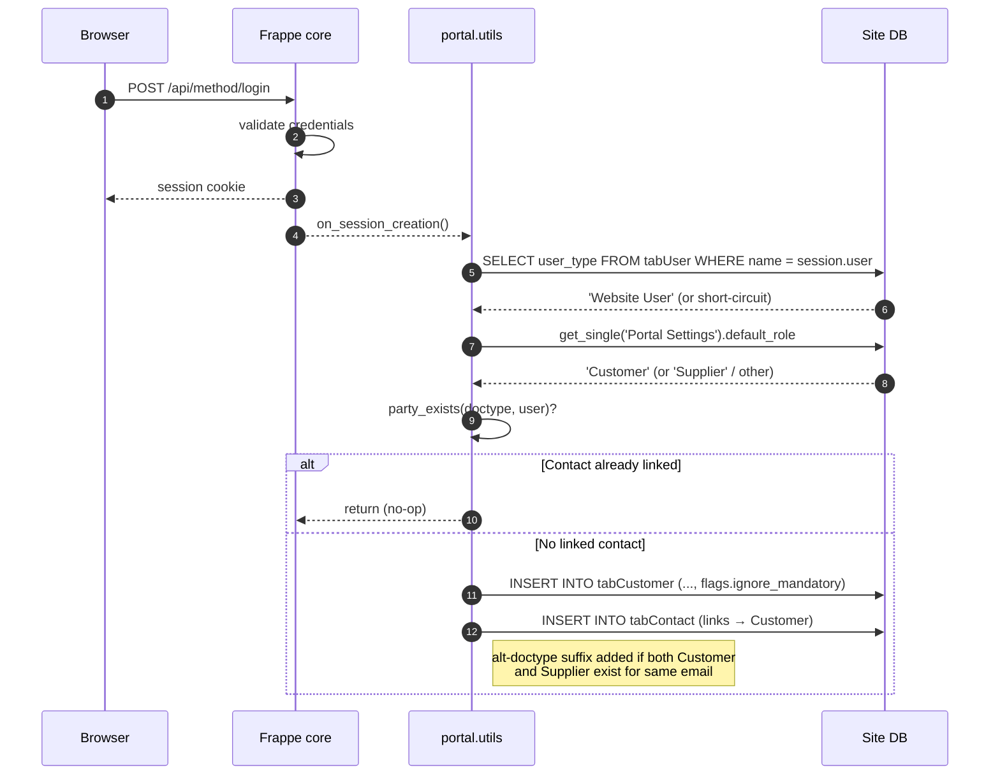
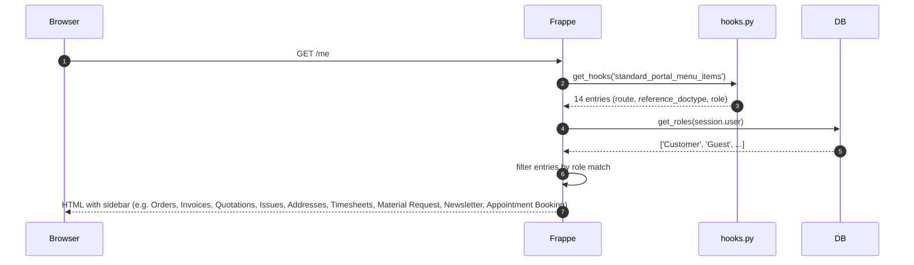
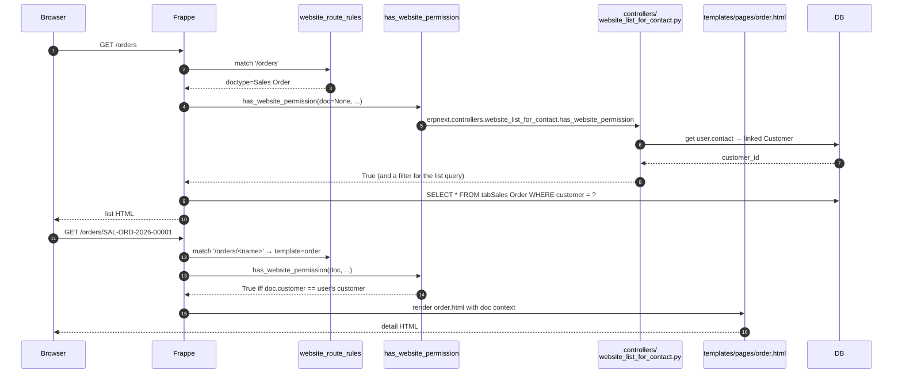

# Customer / supplier portal flow

> **TL;DR:** A Website User logs in → Frappe core fires `on_session_creation` → ERPNext's [`portal.utils.create_customer_or_supplier`](../../erpnext/portal/utils.py:22) auto-creates the matching party + Contact (one-shot, idempotent via `party_exists`). Subsequent navigation hits the URLs declared in `website_route_rules` ([hooks.py:121-218](../../erpnext/hooks.py:121)); each request is gated by `has_website_permission` ([hooks.py:307-319](../../erpnext/hooks.py:307)) which scopes record visibility to the user's linked Customer or Supplier. The sidebar is built from `standard_portal_menu_items` ([hooks.py:231-297](../../erpnext/hooks.py:231)) joined against the user's roles. The public Web Form list is filtered by `webform_list_context` ([hooks.py:109](../../erpnext/hooks.py:109)). Finally, the public contact form posts via `override_whitelisted_methods["frappe.www.contact.send_message"]` ([hooks.py:58](../../erpnext/hooks.py:58)) into ERPNext's [`templates/utils.send_message`](../../erpnext/templates/utils.py:9) which spawns a Lead + Opportunity + Communication.

## Key files

- [erpnext/portal/utils.py](../../erpnext/portal/utils.py:1) — `create_customer_or_supplier`, `set_default_role`, `create_party`, `create_party_contact`, `party_exists`.
- [erpnext/templates/utils.py](../../erpnext/templates/utils.py:1) — `send_message` (public contact-form override).
- [erpnext/controllers/website_list_for_contact.py](../../erpnext/controllers/website_list_for_contact.py) — `has_website_permission`, `get_webform_list_context` (the per-request permission and list-scoping resolver for portal records).
- [erpnext/hooks.py:75](../../erpnext/hooks.py:75) — `on_session_creation`.
- [erpnext/hooks.py:58](../../erpnext/hooks.py:58) — `override_whitelisted_methods["frappe.www.contact.send_message"]`.
- [erpnext/hooks.py:109](../../erpnext/hooks.py:109) — `webform_list_context`.
- [erpnext/hooks.py:121-218](../../erpnext/hooks.py:121) — `website_route_rules`.
- [erpnext/hooks.py:231-297](../../erpnext/hooks.py:231) — `standard_portal_menu_items`.
- [erpnext/hooks.py:307-319](../../erpnext/hooks.py:307) — `has_website_permission`.
- [erpnext/hooks.py:357-361](../../erpnext/hooks.py:357) — `doc_events["User"].on_update = portal.utils.set_default_role`.

## Stage 1 — login & auto-provision



The branching logic for the alt-doctype suffix (`fullname += "-" + doctype`) lives at [portal/utils.py:53-56](../../erpnext/portal/utils.py:53). The two inserts use `flags.ignore_mandatory = True` ([utils.py:73](../../erpnext/portal/utils.py:73), [utils.py:84](../../erpnext/portal/utils.py:84)) and `ignore_permissions=True` ([utils.py:74](../../erpnext/portal/utils.py:74), [utils.py:85](../../erpnext/portal/utils.py:85)).

## Stage 2 — portal landing & sidebar

After auto-provision, the Website User is redirected to the portal landing (Frappe core's `/me` page). The sidebar is rendered from `standard_portal_menu_items`:



Sidebar entries with no `role` key (Newsletter, Appointment Booking) are visible to **all** authenticated users.

## Stage 3 — record list / detail (per route)

For each transactional URL declared in `website_route_rules` ([hooks.py:121-218](../../erpnext/hooks.py:121)):



The same flow applies to `/invoices`, `/quotations`, `/shipments`, `/material-requests`, `/timesheets`, `/project`, `/tasks`, `/addresses`, `/supplier-quotations`, `/purchase-orders`, `/purchase-invoices`, `/rfq`. The detail templates are `order` for most transactions, `rfq` for RFQ, `addresses` for Address, `material_request_info` for Material Request — all under [erpnext/templates/pages/](../../erpnext/templates/pages/).

## Stage 4 — Web Form list view

Web Forms placed on the portal go through `webform_list_context` ([hooks.py:109](../../erpnext/hooks.py:109)) which returns the same Customer/Supplier-scoped query that `has_website_permission` uses. Both routes share [erpnext/controllers/website_list_for_contact.py](../../erpnext/controllers/website_list_for_contact.py) so the per-DocType visibility rules stay consistent across `/orders` (route rule) and `/<custom-web-form>` (Web Form).

## Stage 5 — anonymous public contact form

The public contact form (`/contact`) lives in Frappe core. ERPNext overrides the submit handler:

```python
override_whitelisted_methods = {"frappe.www.contact.send_message": "erpnext.templates.utils.send_message"}
```
([hooks.py:58](../../erpnext/hooks.py:58))

The override at [erpnext/templates/utils.py:9-60](../../erpnext/templates/utils.py:9):

1. Calls Frappe core's `send_message` first (sends the email) ([utils.py:11-13](../../erpnext/templates/utils.py:11)).
2. Looks up an existing Customer Contact for the sender email via Dynamic Link → Contact join ([utils.py:18-23](../../erpnext/templates/utils.py:18)).
3. If no Customer match, looks up an existing Lead by email; if none, **inserts a new Lead** with `lead_name = email.split('@')[0].title()` and `ignore_permissions=True` ([utils.py:25-30](../../erpnext/templates/utils.py:25)).
4. **Inserts an Opportunity** linked to the Customer or Lead, with `opportunity_from = "Customer"` or `"Lead"`, `status = "Open"`, `title = subject`, `contact_email = sender` ([utils.py:32-47](../../erpnext/templates/utils.py:32)).
5. **Inserts a Communication** referencing the Opportunity ([utils.py:49-60](../../erpnext/templates/utils.py:49)).

So one anonymous form submission lands as: 1 Lead (if new) + 1 Opportunity + 1 Communication, all owned by Administrator. This wiring is why CRM appears in the customer-portal flow even though portal pages themselves never invoke CRM directly.

## Stage 6 — User on_update keeps roles in sync

Independent of login, any save of a User document fires `doc_events["User"].on_update` → `portal.utils.set_default_role` ([hooks.py:360](../../erpnext/hooks.py:360)) → walks the email-matched Contact's `links` and adds Customer / Supplier roles for each linked party doctype. Guarded by `frappe.flags.setting_role` (re-entrance) and `frappe.flags.in_migrate` ([utils.py:6-7](../../erpnext/portal/utils.py:6)). Not in the login critical path; runs only when the User doc itself is mutated.

## Open questions

- `TODO(verify)` — the duplicate `/purchase-orders/<name>` block at [hooks.py:155-162](../../erpnext/hooks.py:155) appears to be an editing artefact. Both blocks are identical; the second silently overwrites the first.

## Related

- [Portal module](../modules/portal.md)
- [Portal DocTypes](../modules/portal-doctypes.md)
- [www / templates](../modules/www-and-templates.md) — public-page Jinja inventory.
- [Hooks & overrides](../architecture/hooks-and-overrides.md)
- [Boot session](../architecture/boot-session.md) — desk-side bootinfo is **not** rendered for portal sessions; the desk workspace lives at `/desk` and Website Users do not load it.
- [CRM module](../modules/crm.md) — Lead / Opportunity / Communication landing point for `/contact` form submissions.

## Changelog

- `2026-04-18` — initial version. End-to-end login → portal landing → list/detail → Web Form → public contact form. 4 sequence diagrams.
