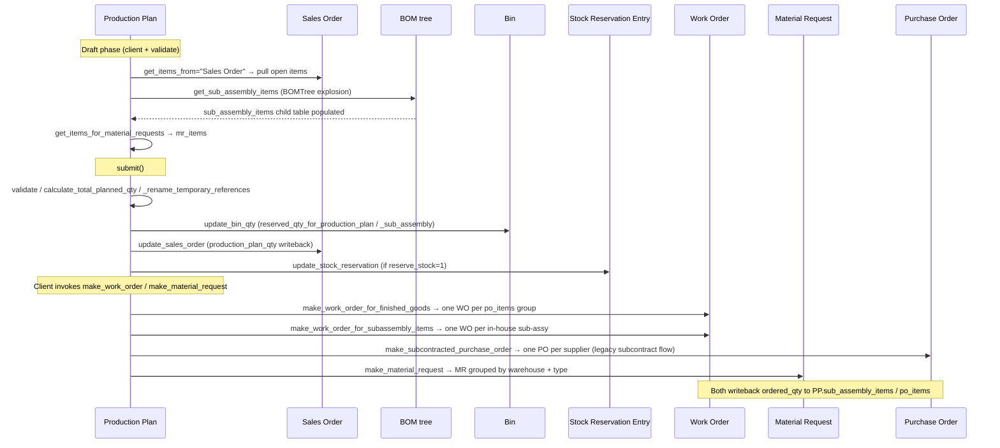
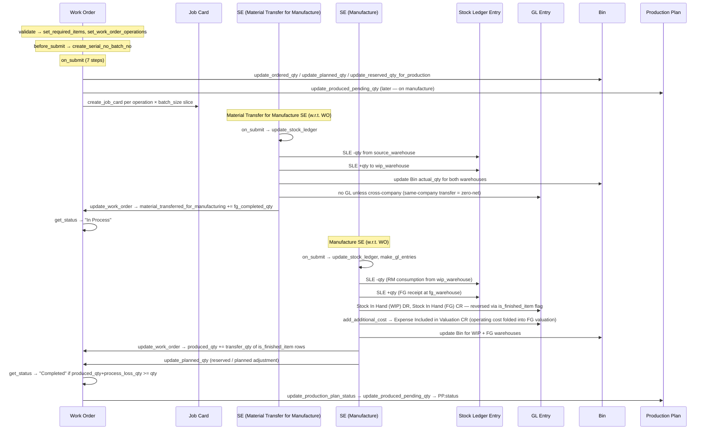
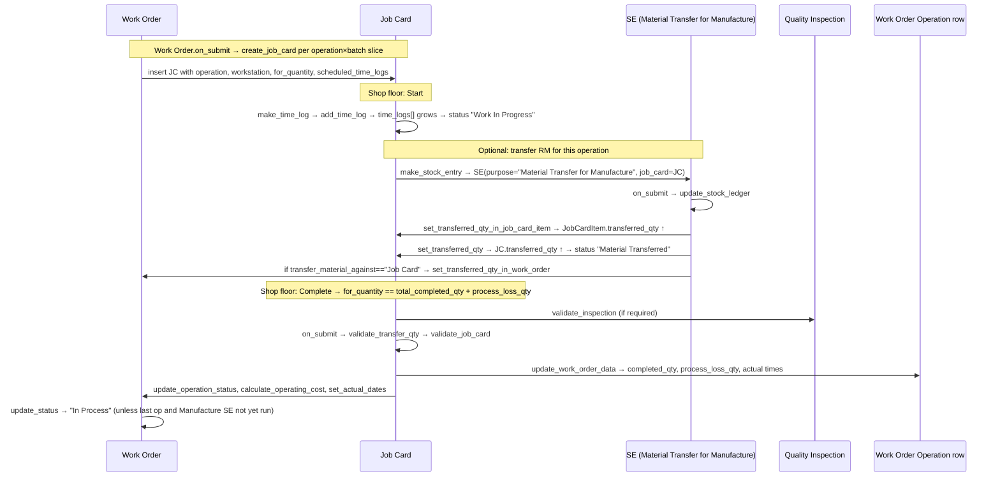
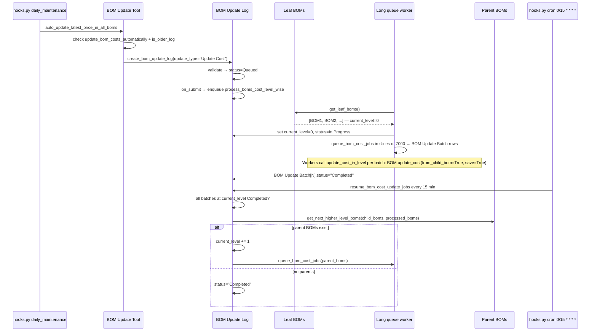
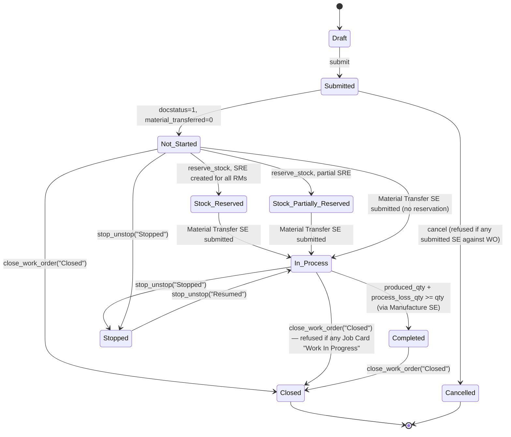

# Manufacturing Flow: Production Plan → Work Order → Job Card → Stock Entry

> **TL;DR:** ERPNext manufacturing orchestrates three document layers that together convert a demand signal (Sales Order, Material Request, direct) into finished goods: **Production Plan** (aggregation / sub-assembly explosion / auto-creation of downstream docs), **Work Order** (per-FG execution tracker with required-items and operation tables) and **Job Card** (per-operation shop-floor record). The actual inventory movement and GL postings always happen via **Stock Entry** (`purpose` = `Material Transfer for Manufacture`, `Manufacture`, `Material Consumption for Manufacture`, `Disassemble`). None of the manufacturing DocTypes post GL on their own — Work Order and Job Card are pure trackers; Stock Entry is the execution vehicle that inherits [StockController](../../erpnext/controllers/stock_controller.py) and bridges SLE + GL. Sub-assemblies flagged **Subcontract** branch out of Production Plan into a `Purchase Order` (legacy subcontracting flow) instead of a Work Order — see [subcontracting-flow.md](./subcontracting-flow.md) for the subcontracting execution.

## Scope of this document

This page threads the manufacturing execution cascade end-to-end. For overlapping subsystems, cross-link:

- SLE writer (`update_stock_ledger` on Stock Entry) and Bin updates → [flows/stock-flow.md](./stock-flow.md).
- GL composition at Stock Entry submit (WIP account, Expense Included in Valuation, Stock Adjustment) → [flows/accounting-flow.md](./accounting-flow.md).
- Production Plan triggered from Sales Order → [flows/selling-flow.md](./selling-flow.md).
- Production Plan → Purchase Order (sub-assembly subcontract branch) → [flows/buying-flow.md](./buying-flow.md).
- Subcontracting execution (`Send to Subcontractor` Stock Entry, PR-based FG receipt) → [flows/subcontracting-flow.md](./subcontracting-flow.md).
- Per-DocType method cards → [modules/manufacturing-doctypes.md](../modules/manufacturing-doctypes.md).
- Module-level controller / settings overview → [modules/manufacturing.md](../modules/manufacturing.md).

## Key files

- [production_plan.py](../../erpnext/manufacturing/doctype/production_plan/production_plan.py:39) — `ProductionPlan(Document)` (not on the transaction controller chain). `validate` at [:124](../../erpnext/manufacturing/doctype/production_plan/production_plan.py:124), `on_submit` at [:588](../../erpnext/manufacturing/doctype/production_plan/production_plan.py:588), `on_cancel` at [:594](../../erpnext/manufacturing/doctype/production_plan/production_plan.py:594), `make_work_order` at [:774](../../erpnext/manufacturing/doctype/production_plan/production_plan.py:774), `make_work_order_for_subassembly_items` at [:805](../../erpnext/manufacturing/doctype/production_plan/production_plan.py:805), `make_subcontracted_purchase_order` at [:861](../../erpnext/manufacturing/doctype/production_plan/production_plan.py:861), `make_material_request` at [:963](../../erpnext/manufacturing/doctype/production_plan/production_plan.py:963), `get_sub_assembly_items` at [:1043](../../erpnext/manufacturing/doctype/production_plan/production_plan.py:1043), `set_status` at [:687](../../erpnext/manufacturing/doctype/production_plan/production_plan.py:687), `update_produced_pending_qty` at [:577](../../erpnext/manufacturing/doctype/production_plan/production_plan.py:577).
- [work_order.py](../../erpnext/manufacturing/doctype/work_order/work_order.py:69) — `WorkOrder(Document)`. `validate` at [:186](../../erpnext/manufacturing/doctype/work_order/work_order.py:186), `before_save` at [:256](../../erpnext/manufacturing/doctype/work_order/work_order.py:256), `before_submit` at [:779](../../erpnext/manufacturing/doctype/work_order/work_order.py:779), `on_submit` at [:782](../../erpnext/manufacturing/doctype/work_order/work_order.py:782), `on_cancel` at [:802](../../erpnext/manufacturing/doctype/work_order/work_order.py:802), `on_close_or_cancel` at [:808](../../erpnext/manufacturing/doctype/work_order/work_order.py:808), `update_status` / `get_status` at [:569](../../erpnext/manufacturing/doctype/work_order/work_order.py:569) / [:582](../../erpnext/manufacturing/doctype/work_order/work_order.py:582), `update_work_order_qty` at [:626](../../erpnext/manufacturing/doctype/work_order/work_order.py:626), `get_transferred_or_manufactured_qty` at [:715](../../erpnext/manufacturing/doctype/work_order/work_order.py:715), `set_work_order_operations` at [:1252](../../erpnext/manufacturing/doctype/work_order/work_order.py:1252), `set_required_items` at [:1532](../../erpnext/manufacturing/doctype/work_order/work_order.py:1532), `create_job_card` at [:1016](../../erpnext/manufacturing/doctype/work_order/work_order.py:1016), `update_planned_qty` at [:1104](../../erpnext/manufacturing/doctype/work_order/work_order.py:1104), `update_operation_status` at [:1356](../../erpnext/manufacturing/doctype/work_order/work_order.py:1356), module-level `make_stock_entry` at [:2387](../../erpnext/manufacturing/doctype/work_order/work_order.py:2387), `stop_unstop` at [:2481](../../erpnext/manufacturing/doctype/work_order/work_order.py:2481), `close_work_order` at [:2552](../../erpnext/manufacturing/doctype/work_order/work_order.py:2552), `make_stock_return_entry` at [:2803](../../erpnext/manufacturing/doctype/work_order/work_order.py:2803).
- [job_card.py](../../erpnext/manufacturing/doctype/job_card/job_card.py:61) — `JobCard(Document)`. `validate` at [:161](../../erpnext/manufacturing/doctype/job_card/job_card.py:161), `before_save` at [:771](../../erpnext/manufacturing/doctype/job_card/job_card.py:771), `on_submit` at [:775](../../erpnext/manufacturing/doctype/job_card/job_card.py:775), `on_cancel` at [:782](../../erpnext/manufacturing/doctype/job_card/job_card.py:782), `update_work_order` at [:936](../../erpnext/manufacturing/doctype/job_card/job_card.py:936), `update_work_order_data` at [:1008](../../erpnext/manufacturing/doctype/job_card/job_card.py:1008), `set_transferred_qty` at [:1151](../../erpnext/manufacturing/doctype/job_card/job_card.py:1151), `set_transferred_qty_in_work_order` at [:1181](../../erpnext/manufacturing/doctype/job_card/job_card.py:1181), `set_status` at [:1200](../../erpnext/manufacturing/doctype/job_card/job_card.py:1200), `make_time_log` at [:1577](../../erpnext/manufacturing/doctype/job_card/job_card.py:1577), `make_material_request` at [:1620](../../erpnext/manufacturing/doctype/job_card/job_card.py:1620), `make_stock_entry` at [:1651](../../erpnext/manufacturing/doctype/job_card/job_card.py:1651), `make_corrective_job_card` at [:1771](../../erpnext/manufacturing/doctype/job_card/job_card.py:1771).
- [bom.py](../../erpnext/manufacturing/doctype/bom/bom.py:105) — `BOM(WebsiteGenerator)`. `validate` at [:275](../../erpnext/manufacturing/doctype/bom/bom.py:275), `on_submit` at [:397](../../erpnext/manufacturing/doctype/bom/bom.py:397), `on_cancel` at [:401](../../erpnext/manufacturing/doctype/bom/bom.py:401), `on_update_after_submit` at [:444](../../erpnext/manufacturing/doctype/bom/bom.py:444), `update_cost` at [:618](../../erpnext/manufacturing/doctype/bom/bom.py:618), `calculate_cost` at [:935](../../erpnext/manufacturing/doctype/bom/bom.py:935), `update_exploded_items` at [:1099](../../erpnext/manufacturing/doctype/bom/bom.py:1099), module-level `get_bom_items_as_dict` at [:1385](../../erpnext/manufacturing/doctype/bom/bom.py:1385). Tree helper `BOMTree` at [:31](../../erpnext/manufacturing/doctype/bom/bom.py:31).
- [bom_update_log.py](../../erpnext/manufacturing/doctype/bom_update_log/bom_update_log.py:26) — `BOMUpdateLog(Document)`. `on_submit` at [:106](../../erpnext/manufacturing/doctype/bom_update_log/bom_update_log.py:106), `process_boms_cost_level_wise` at [:151](../../erpnext/manufacturing/doctype/bom_update_log/bom_update_log.py:151), `resume_bom_cost_update_jobs` at [:213](../../erpnext/manufacturing/doctype/bom_update_log/bom_update_log.py:213) — registered as scheduler cron `0/15 * * * *` in [hooks.py:436](../../erpnext/hooks.py:436).
- [bom_update_tool.py](../../erpnext/manufacturing/doctype/bom_update_tool/bom_update_tool.py:15) — `enqueue_replace_bom` at [:32](../../erpnext/manufacturing/doctype/bom_update_tool/bom_update_tool.py:32), `enqueue_update_cost` at [:43](../../erpnext/manufacturing/doctype/bom_update_tool/bom_update_tool.py:43), `auto_update_latest_price_in_all_boms` at [:49](../../erpnext/manufacturing/doctype/bom_update_tool/bom_update_tool.py:49) — registered as `daily_maintenance` in [hooks.py:489](../../erpnext/hooks.py:489).
- [stock_entry.py](../../erpnext/stock/doctype/stock_entry/stock_entry.py:87) — `StockEntry(StockController, SubcontractingInwardController)`. `on_submit` at [:445](../../erpnext/stock/doctype/stock_entry/stock_entry.py:445), `on_cancel` at [:474](../../erpnext/stock/doctype/stock_entry/stock_entry.py:474), `update_work_order` at [:2089](../../erpnext/stock/doctype/stock_entry/stock_entry.py:2089), `update_disassembled_order` at [:2129](../../erpnext/stock/doctype/stock_entry/stock_entry.py:2129), `validate_purpose` at [:564](../../erpnext/stock/doctype/stock_entry/stock_entry.py:564), `set_stock_entry_type` at [:1423](../../erpnext/stock/doctype/stock_entry/stock_entry.py:1423). Manufacturing purposes listed in valid-purpose guard at [stock_entry.py:564](../../erpnext/stock/doctype/stock_entry/stock_entry.py:564) and in the `Stock Entry Type` DocType at [stock_entry_type.json:20](../../erpnext/stock/doctype/stock_entry_type/stock_entry_type.json:20).
- [manufacturing_settings.py](../../erpnext/manufacturing/doctype/manufacturing_settings/manufacturing_settings.py:11) — Single DocType. Knobs used throughout this flow: `backflush_raw_materials_based_on`, `overproduction_percentage_for_work_order`, `overproduction_percentage_for_sales_order`, `transfer_extra_materials_percentage`, `job_card_excess_transfer`, `enforce_time_logs`, `material_consumption`, `make_serial_no_batch_from_work_order`, `update_bom_costs_automatically`, `allow_editing_of_items_and_quantities_in_work_order`, `add_corrective_operation_cost_in_finished_good_valuation`, `disable_capacity_planning`, `capacity_planning_for_days`, `mins_between_operations`.

## Document layer summary

| Layer | DocType | Submits? | Posts GL? | Posts SLE? | Role |
|---|---|---|---|---|---|
| Master | `BOM` | Yes | No | No | FG recipe: items, operations, exploded items, routing, costs. |
| Master | `Routing` | No | No | No | Reusable operation sequence attached to BOM. |
| Planning | `Production Plan` | Yes | No | No | Aggregates demand (SO / MR / direct); explodes sub-assemblies; auto-creates WOs, MRs, POs. |
| Execution | `Work Order` | Yes | No | No | Per-FG tracker: required-items, operations, planned/transferred/produced qty. |
| Shop floor | `Job Card` | Yes | No | No | Per-operation time logs + employee + workstation. |
| Inventory | `Stock Entry` (`Material Transfer for Manufacture`) | Yes | Yes (between warehouses of same company, no GL unless cross-company) | Yes | Moves RM from source warehouse to WIP warehouse. |
| Inventory | `Stock Entry` (`Manufacture`) | Yes | Yes | Yes | Consumes RM from WIP; receipts FG to target warehouse; records operating cost. |
| Inventory | `Stock Entry` (`Material Consumption for Manufacture`) | Yes | Yes | Yes | Consumes RM during production without simultaneous FG receipt. |
| Inventory | `Stock Entry` (`Disassemble`) | Yes | Yes | Yes | Reverses a completed `Manufacture` SE: FG in, RM out. |
| Inventory (subcontract) | `Stock Entry` (`Send to Subcontractor`) | Yes | Yes | Yes | Sends RM to supplier warehouse; see [subcontracting-flow.md](./subcontracting-flow.md). |

The key guarantee: **Work Order and Job Card never write to `tabStock Ledger Entry` or `tabGL Entry` directly**. They writeback `produced_qty`, `material_transferred_for_manufacturing`, `transferred_qty`, `completed_qty` and `status` fields on their own rows and on child tables — the inventory / cost effect lives on the Stock Entry that cites them.

## Controller chain context

```
Document → WorkOrder               — no transaction-controller inheritance
Document → JobCard                 — no transaction-controller inheritance
Document → ProductionPlan          — no transaction-controller inheritance
Document → BOM (WebsiteGenerator)  — publishes /boms web route
StockController → StockEntry       — the GL/SLE carrier for the manufacturing purposes
```

Because Work Order / Job Card / Production Plan sit directly on `Document`, they **skip** `StatusUpdater` / `AccountsController` / `StockController`. Status propagation, qty writeback and stock reservation are implemented ad-hoc inside each class instead of via the `status_updater[]` contract used elsewhere (see [architecture/controllers.md](../architecture/controllers.md)). This is intentional: the manufacturing cascade does not map cleanly onto the `status_updater[]` `source/target/join` model because the aggregation happens *in reverse* (Stock Entry writes back to Work Order; Job Card writes back to Work Order operations).

See [architecture/doctype-lifecycle.md](../architecture/doctype-lifecycle.md) for the default `validate → before_submit → on_submit` ordering.

## Hooks.py touchpoints

- `calendars` includes `"Work Order"` at [hooks.py:111](../../erpnext/hooks.py:111).
- `website_generators` includes `"BOM"` at [hooks.py:113](../../erpnext/hooks.py:113) — BOM pages are rendered at `/boms` routes.
- `website_route_rules` redirects `/boms → BOM` at [hooks.py:205](../../erpnext/hooks.py:205).
- `scheduler_events["cron"]["0/15 * * * *"]` runs `resume_bom_cost_update_jobs` at [hooks.py:436](../../erpnext/hooks.py:436).
- `scheduler_events["daily_maintenance"]` runs `auto_update_latest_price_in_all_boms` at [hooks.py:489](../../erpnext/hooks.py:489).
- `global_search_doctypes["Default"]` lists `BOM` (index 6) and `Work Order` (index 10) at [hooks.py:645](../../erpnext/hooks.py:645)-[:649](../../erpnext/hooks.py:649).
- No entries under `doc_events`, `regional_overrides`, `extend_doctype_class` target manufacturing DocTypes — manufacturing has no country-specific overrides and no external doc-event listeners. `TODO(verify)` — confirm no manufacturing-adjacent entries in `override_doctype_class` (not currently present in hooks.py).

## Production Plan: demand aggregation and work-order creation

### Source of items

`Production Plan.get_items_from: DF.Literal["", "Sales Order", "Material Request"]` at [production_plan.py:77](../../erpnext/manufacturing/doctype/production_plan/production_plan.py:77). When unset, items are entered directly. Three input paths:

1. **Sales Order**: `po_items` child table rows carry `sales_order` + `sales_order_item`; `update_sales_order` at [:630](../../erpnext/manufacturing/doctype/production_plan/production_plan.py:630) writes `production_plan_qty` back on Sales Order Item. `validate_sales_orders` at [:144](../../erpnext/manufacturing/doctype/production_plan/production_plan.py:144) guards against double-planning.
2. **Material Request**: `po_items` rows carry `material_request` + `material_request_item`; the original MR's `production_qty` is tracked via `update_completed_qty_in_material_request` on the downstream Work Order ([work_order.py:793](../../erpnext/manufacturing/doctype/work_order/work_order.py:793)).
3. **Direct entry**: `po_items` rows carry only `item_code` + `bom_no` + `planned_qty`.

### Sub-assembly explosion

`get_sub_assembly_items` at [production_plan.py:1043](../../erpnext/manufacturing/doctype/production_plan/production_plan.py:1043) walks each `po_items` row, calls the module-level helper `get_sub_assembly_items` at [:1917](../../erpnext/manufacturing/doctype/production_plan/production_plan.py:1917) which recurses the BOM tree (leveraging the same cached-BOM traversal as `BOMTree` at [bom.py:31](../../erpnext/manufacturing/doctype/bom/bom.py:31)), and flattens the result into the `sub_assembly_items` child table (rows of type `Production Plan Sub Assembly Item`). Each row carries:

- `production_item`, `bom_no`, `qty`, `stock_qty`, `fg_warehouse`.
- `type_of_manufacturing`: `"In House"`, `"Subcontract"`, or `"Material Request"` — set by [:1120](../../erpnext/manufacturing/doctype/production_plan/production_plan.py:1120). `"Subcontract"` is chosen when the item has `is_sub_contracted_item=1` on the Item master.
- `supplier` — auto-populated from `Item Default.default_supplier` by `set_default_supplier_for_subcontracting_order` at [:1131](../../erpnext/manufacturing/doctype/production_plan/production_plan.py:1131).
- `bom_level` — depth within the BOM tree.

`skip_available_sub_assembly_item` at [:1051](../../erpnext/manufacturing/doctype/production_plan/production_plan.py:1051) short-circuits the explosion for items whose on-hand in the sub-assembly warehouse already covers demand.

`combine_sub_items` at [:1157](../../erpnext/manufacturing/doctype/production_plan/production_plan.py:1157) merges rows across different top-level FGs that share the same (item, warehouse, BOM, manufacturing type).

### Material-requirement computation

`get_items_for_material_requests` at [:1648](../../erpnext/manufacturing/doctype/production_plan/production_plan.py:1648) builds the `mr_items` child table (rows of type `Material Request Plan Item`) by walking exploded BOM items across all `po_items` and subtracting available qty. Outputs required-qty per warehouse per item for the `Material Request` that `make_material_request` at [:963](../../erpnext/manufacturing/doctype/production_plan/production_plan.py:963) will create.

### On submit / on cancel

`on_submit` at [production_plan.py:588](../../erpnext/manufacturing/doctype/production_plan/production_plan.py:588) runs, in order:

1. `update_bin_qty` — writes `reserved_qty_for_production_plan` to the `Bin` rows for raw materials, and `reserved_qty_for_sub_assembly` for sub-assembly FG warehouses.
2. `update_sales_order` — writebacks `production_plan_qty` on Sales Order Item.
3. `add_reference_to_raw_materials` — links each `mr_items` row to its sub-assembly reference.
4. `update_stock_reservation` — creates `Stock Reservation Entry` rows if `reserve_stock=1`.

`on_cancel` at [:594](../../erpnext/manufacturing/doctype/production_plan/production_plan.py:594) reverses: deletes draft Work Orders via `delete_draft_work_order` at [:680](../../erpnext/manufacturing/doctype/production_plan/production_plan.py:680), then re-runs the four steps with cancelled state.

### Auto-creation: Work Orders, Material Requests, Purchase Orders

`make_work_order` at [production_plan.py:774](../../erpnext/manufacturing/doctype/production_plan/production_plan.py:774) is the entry point for bulk creation; it is called from the client side after submit. Three branches:

- **Finished goods** (`make_work_order_for_finished_goods` at [:793](../../erpnext/manufacturing/doctype/production_plan/production_plan.py:793)) — one WO per aggregated `po_items` group via `get_production_items` at [:723](../../erpnext/manufacturing/doctype/production_plan/production_plan.py:723).
- **In-house sub-assemblies** (`make_work_order_for_subassembly_items` at [:805](../../erpnext/manufacturing/doctype/production_plan/production_plan.py:805) for rows with `type_of_manufacturing == "In House"`) — one WO per sub-assembly.
- **Subcontract sub-assemblies** (`make_subcontracted_purchase_order` at [:861](../../erpnext/manufacturing/doctype/production_plan/production_plan.py:861)) — grouped by `supplier`, creates one **Purchase Order** per supplier with `is_subcontracted=1`. This is the legacy subcontracting flow embedded in PO — see [subcontracting-flow.md](./subcontracting-flow.md).

`make_material_request` at [:963](../../erpnext/manufacturing/doctype/production_plan/production_plan.py:963) creates Material Requests grouped by (warehouse, material_request_type) for the `mr_items` rows.

### Status lifecycle

`set_status` at [production_plan.py:687](../../erpnext/manufacturing/doctype/production_plan/production_plan.py:687):

```
Draft → Submitted → Material Requested → In Process → Completed
                                      ↘  Closed (manual close, terminal)
                     Cancelled (terminal)
```

- `Submitted` immediately after `on_submit`.
- `Material Requested` when any `mr_items.requested_qty > 0` ([:717](../../erpnext/manufacturing/doctype/production_plan/production_plan.py:717)).
- `In Process` when any `po_items.ordered_qty` or `sub_assembly_items.ordered_qty > 0` ([:710](../../erpnext/manufacturing/doctype/production_plan/production_plan.py:710)), or when any WO writes back `produced_qty > 0` via `update_produced_pending_qty` at [:577](../../erpnext/manufacturing/doctype/production_plan/production_plan.py:577).
- `Completed` when `all_items_completed` at [:1188](../../erpnext/manufacturing/doctype/production_plan/production_plan.py:1188) returns True — all `po_items` produced AND all linked WOs (excluding `Closed` / `Stopped`) are `Completed`.
- `Closed` set manually via `set_status(close=True)`.

### Sequence: Production Plan submit → downstream creation



## Work Order: execution tracker

### Required items and operations

On `validate` at [work_order.py:186](../../erpnext/manufacturing/doctype/work_order/work_order.py:186):

- `set_required_items` at [:1532](../../erpnext/manufacturing/doctype/work_order/work_order.py:1532) fills the `required_items` child table (`Work Order Item`) from BOM. Honors `use_multi_level_bom` (exploded vs single-level) and `allow_alternative_item`. Guarded by `allow_editing_of_items_and_quantities_in_work_order` in Manufacturing Settings — once submitted, edits are only possible if that knob is on.
- `set_work_order_operations` at [:1252](../../erpnext/manufacturing/doctype/work_order/work_order.py:1252) fills the `operations` child table (`Work Order Operation`) from BOM's `operations`. Each row carries `operation`, `workstation` (or `workstation_type`), `time_in_mins`, `hour_rate`, `operating_cost`.
- `calculate_operating_cost` at [:197](../../erpnext/manufacturing/doctype/work_order/work_order.py:197) composes `planned_operating_cost = sum(operations.operating_cost) + additional_operating_cost`.
- `check_wip_warehouse_skip` at [:196](../../erpnext/manufacturing/doctype/work_order/work_order.py:196) sets `skip_transfer=1` when the FG and source warehouse are effectively the same flow (no WIP warehouse used).

### Transfer strategy: `transfer_material_against`

`transfer_material_against: DF.Literal["", "Work Order", "Job Card"]` at [:146](../../erpnext/manufacturing/doctype/work_order/work_order.py:146) controls where raw materials are transferred against:

- `"Work Order"`: one SE (`Material Transfer for Manufacture`) against the WO moves all RM at once.
- `"Job Card"`: each Job Card triggers its own SE at the operation level, transferring only the RMs that specific operation consumes. Aggregation happens in `set_transferred_qty_in_work_order` at [job_card.py:1181](../../erpnext/manufacturing/doctype/job_card/job_card.py:1181), which sets `Work Order.material_transferred_for_manufacturing = min(op.completed_qty + op.process_loss_qty for op in operations)`.

`skip_transfer=1` short-circuits the Material Transfer SE entirely: the `Manufacture` SE pulls RM directly from `source_warehouse`.

### Before-submit: serial / batch creation

`before_submit` at [work_order.py:779](../../erpnext/manufacturing/doctype/work_order/work_order.py:779) calls `create_serial_no_batch_no` at [:893](../../erpnext/manufacturing/doctype/work_order/work_order.py:893). When both the FG item has `has_batch_no=1`/`has_serial_no=1` AND `Manufacturing Settings.make_serial_no_batch_from_work_order=1`, it pre-creates Batch records and reserved Serial No records linked to `reference_name=work_order.name`. These get consumed by the `Manufacture` SE later.

### On submit

`on_submit` at [work_order.py:782](../../erpnext/manufacturing/doctype/work_order/work_order.py:782) runs seven steps:

1. `validate_warehouse` — WIP + FG warehouses mandatory unless `skip_transfer` or `track_semi_finished_goods`.
2. `update_work_order_qty_in_so` / `update_work_order_qty_in_combined_so` — writeback `work_order_qty` on Sales Order Item.
3. `update_ordered_qty` — Bin `ordered_qty` for FG warehouse.
4. `update_reserved_qty_for_production` — Bin `reserved_qty_for_production` for source/WIP warehouses (this is the Bin column the Sales Order availability report reads).
5. `update_completed_qty_in_material_request` — writeback `ordered_qty` on Material Request Item (when `material_request_item` is set).
6. `update_planned_qty` — Bin `planned_qty` for FG warehouse ([:1104](../../erpnext/manufacturing/doctype/work_order/work_order.py:1104)).
7. `create_job_card` at [:1016](../../erpnext/manufacturing/doctype/work_order/work_order.py:1016) — iterates `operations`; for each, `split_qty_based_on_batch_size` at [:2579](../../erpnext/manufacturing/doctype/work_order/work_order.py:2579) splits qty into operation-batch-size chunks, then `create_job_card` at [:2645](../../erpnext/manufacturing/doctype/work_order/work_order.py:2645) creates a `Job Card` per chunk. Capacity planning fills scheduled time logs; if no slot fits within `Manufacturing Settings.capacity_planning_for_days`, raises `CapacityError`.

Then optional: `update_stock_reservation` if `reserve_stock=1`, `update_subcontracting_inward_order_received_items` for inward SCIO-linked WOs.

### On cancel

`on_cancel` at [work_order.py:802](../../erpnext/manufacturing/doctype/work_order/work_order.py:802) calls `validate_cancel` ([:1087](../../erpnext/manufacturing/doctype/work_order/work_order.py:1087)) — refuses cancel if any submitted Stock Entry still cites the WO, or if status is `Stopped`. Then delegates to `on_close_or_cancel` at [:808](../../erpnext/manufacturing/doctype/work_order/work_order.py:808) which reverses the Bin / SO / MR writebacks and releases stock reservations.

### Status lifecycle

`get_status` at [work_order.py:582](../../erpnext/manufacturing/doctype/work_order/work_order.py:582) resolves the status from docstatus + transferred + produced + process-loss qty. See the full literal at [:128](../../erpnext/manufacturing/doctype/work_order/work_order.py:128):

```
Draft → Submitted → Not Started → In Process → Completed
                                              ↘  Stopped → unstop → In Process
                                              ↘  Closed (terminal)
                     Stock Reserved / Stock Partially Reserved (transient before production start)
                     Cancelled (terminal)
```

Rules:

- `Not Started`: submitted but `material_transferred_for_manufacturing == 0`.
- `In Process`: `material_transferred_for_manufacturing > 0` and `produced_qty + process_loss_qty < qty`.
- `Completed`: `produced_qty + process_loss_qty >= qty` (with `produced_qty` precision).
- `skip_transfer=1` special case: if `produced_qty < qty`, forces `In Process` regardless of transfer qty ([:602](../../erpnext/manufacturing/doctype/work_order/work_order.py:602)).
- Job Cards with status other than `Pending` force `In Process` ([:610](../../erpnext/manufacturing/doctype/work_order/work_order.py:610)).
- `Stopped` / `Closed` are manual transitions via `stop_unstop` at [:2481](../../erpnext/manufacturing/doctype/work_order/work_order.py:2481) and `close_work_order` at [:2552](../../erpnext/manufacturing/doctype/work_order/work_order.py:2552). `close_work_order` refuses close when there is any `Work In Progress` Job Card.

### Sequence: Work Order submit → Material Transfer SE → Manufacture SE



See [flows/stock-flow.md](./stock-flow.md) for the SLE write path and [flows/accounting-flow.md](./accounting-flow.md) for the GL composition. The `is_finished_item` flag on `Stock Entry Detail` is what flips the quantity sign for the FG line in a `Manufacture` SE.

### Work Order writeback from Stock Entry

The inversion happens inside Stock Entry, not Work Order:

- `StockEntry.update_work_order` at [stock_entry.py:2089](../../erpnext/stock/doctype/stock_entry/stock_entry.py:2089) runs in `on_submit` and `on_cancel`. It calls `Work Order.update_work_order_qty` ([work_order.py:626](../../erpnext/manufacturing/doctype/work_order/work_order.py:626)) which reads SLE-level aggregated qty per purpose and updates three fields on the WO: `produced_qty` (from `Manufacture` SE lines where `is_finished_item=1`), `material_transferred_for_manufacturing` (from `Material Transfer for Manufacture` SE), and `additional_transferred_qty` (same purpose, flagged `is_additional_transfer_entry=1`).
- When the SE is linked to a `job_card`, the SE additionally calls `JobCard.set_transferred_qty_in_job_card_item` and either `set_transferred_qty` or `set_manufactured_qty + update_work_order` depending on purpose (see [stock_entry.py:2101](../../erpnext/stock/doctype/stock_entry/stock_entry.py:2101)).
- `update_disassembled_order` at [stock_entry.py:2129](../../erpnext/stock/doctype/stock_entry/stock_entry.py:2129) updates `Work Order.disassembled_qty` when a `Disassemble` SE cites a WO.

### Overproduction guard

`get_transferred_or_manufactured_qty` vs `completed_qty = qty + (overproduction_percentage_for_work_order/100 * qty)` check at [work_order.py:658](../../erpnext/manufacturing/doctype/work_order/work_order.py:658) raises `StockOverProductionError` if a new SE would push the total past the allowed bound.

## Job Card: shop-floor record

### Lifecycle

`validate` at [job_card.py:161](../../erpnext/manufacturing/doctype/job_card/job_card.py:161) → `before_save` at [:771](../../erpnext/manufacturing/doctype/job_card/job_card.py:771) (sets actual-time windows and `process_loss`) → `on_submit` at [:775](../../erpnext/manufacturing/doctype/job_card/job_card.py:775) runs 5 steps:

1. `validate_inspection` at [:786](../../erpnext/manufacturing/doctype/job_card/job_card.py:786) — if BOM + operation both flag `quality_inspection_required`, requires submitted Quality Inspection with status `Accepted`. `Stock Settings.action_if_quality_inspection_is_not_submitted / _is_rejected` drive throw-vs-warn.
2. `validate_transfer_qty` at [:846](../../erpnext/manufacturing/doctype/job_card/job_card.py:846) — refuses submit when FG items exist but `transferred_qty < for_quantity` (i.e. RMs not yet moved to WIP).
3. `validate_job_card` at [:859](../../erpnext/manufacturing/doctype/job_card/job_card.py:859) — refuses submit against a `Stopped` Work Order; enforces `time_logs` presence; `total_completed_qty + process_loss_qty == for_quantity`.
4. `update_work_order` at [:936](../../erpnext/manufacturing/doctype/job_card/job_card.py:936) — writeback to `Work Order Operation` row (completed_qty, actual_start_time, actual_end_time, process_loss_qty) then recomputes WO `actual_operating_cost` and `actual_start_date` / `actual_end_date`.
5. `set_transferred_qty` at [:1151](../../erpnext/manufacturing/doctype/job_card/job_card.py:1151) — aggregates `fg_completed_qty` across all Material-Transfer SEs citing this Job Card.

`on_cancel` at [:782](../../erpnext/manufacturing/doctype/job_card/job_card.py:782) runs the same writebacks with cancelled state.

### Time logs

`time_logs: DF.Table[JobCardTimeLog]` at [:134](../../erpnext/manufacturing/doctype/job_card/job_card.py:134) — each row records `from_time`, `to_time`, `time_in_mins`, optional `employee`. `make_time_log` at [:1577](../../erpnext/manufacturing/doctype/job_card/job_card.py:1577) is the whitelisted entry point for the shop-floor UI Start/Pause/Resume workflow; it calls `add_time_log` + `set_status(update_status=True)`.

`set_status` at [:1200](../../erpnext/manufacturing/doctype/job_card/job_card.py:1200):

```
Open → Work In Progress → Material Transferred → Completed
                       ↘  On Hold (via is_paused)
                       ↘  Cancelled (terminal)
                          Submitted (terminal, docstatus=1 without FG completion)
```

Rules:

- `Material Transferred`: `for_quantity <= transferred_qty`.
- `Work In Progress`: time logs present.
- `Completed`: `docstatus=1` and `for_quantity <= (total_completed_qty + process_loss_qty)`.
- `On Hold`: `is_paused=1`.

### Job Card Stock Entry flavors

Two mappers convert a Job Card to a Stock Entry:

- `make_stock_entry` at [job_card.py:1651](../../erpnext/manufacturing/doctype/job_card/job_card.py:1651) — creates a `Material Transfer for Manufacture` SE. Target warehouse is Job Card's `wip_warehouse`; source is each JC item's `source_warehouse`. Items below `required_qty - transferred_qty` are skipped. Writeback happens via `StockEntry.update_work_order` at submit — JC's `transferred_qty` updates via `set_transferred_qty`.
- `make_material_request` at [:1620](../../erpnext/manufacturing/doctype/job_card/job_card.py:1620) — creates a `Material Request` (type `Material Transfer`) targeting `wip_warehouse` for the JC's required items. Used when the RM has to be requested before transfer.

A **Manufacture** SE is **not** typically created from a Job Card — it is created from the Work Order (via `make_stock_entry(purpose="Manufacture")` at [work_order.py:2387](../../erpnext/manufacturing/doctype/work_order/work_order.py:2387)) at the end of the operation chain. Exception: when `track_semi_finished_goods=1` on the BOM, a Manufacture SE **can** be created per Job Card using `job_card` + `semi_fg_bom` fields on the SE.

### Job Card → Work Order operation writeback

`update_work_order` at [job_card.py:936](../../erpnext/manufacturing/doctype/job_card/job_card.py:936):

1. `get_current_operation_data` at [:1048](../../erpnext/manufacturing/doctype/job_card/job_card.py:1048) — SQL aggregation over all JCs sharing the same `work_order + operation_id` to roll up `total_time_in_mins`, `total_completed_qty`, `process_loss_qty`.
2. `update_work_order_data` at [:1008](../../erpnext/manufacturing/doctype/job_card/job_card.py:1008) — finds the matching `Work Order Operation` row by `operation_id` and sets `completed_qty`, `process_loss_qty`, `actual_operation_time`, `actual_start_time`, `actual_end_time`. Also replaces `workstation` if the JC used a different one (workstations can change within a JC if `workstation_type` was used on the BOM).
3. `wo.update_operation_status()` ([work_order.py:1356](../../erpnext/manufacturing/doctype/work_order/work_order.py:1356)), `wo.calculate_operating_cost()`, `wo.set_actual_dates()`, `wo.save()`.

If `is_corrective_job_card=1`, the path forks via `update_corrective_in_work_order` at [:978](../../erpnext/manufacturing/doctype/job_card/job_card.py:978) — sums corrective-only hour*rate and sets `wo.corrective_operation_cost`. This only feeds back into FG valuation if `Manufacturing Settings.add_corrective_operation_cost_in_finished_good_valuation=1`.

### Sequence: Job Card create → time log → complete → Work Order writeback



## Stock Entry: the inventory execution vehicle

Stock Entry is the only DocType in the manufacturing cascade that inherits `StockController` and therefore posts SLEs and GL. The `purpose` field (validated at [stock_entry.py:564](../../erpnext/stock/doctype/stock_entry/stock_entry.py:564)) selects the behavior.

### Material Transfer for Manufacture

Moves raw materials from source warehouse to WIP warehouse in preparation for production.

- Created from Work Order via [work_order.py:2387](../../erpnext/manufacturing/doctype/work_order/work_order.py:2387) or Job Card via [job_card.py:1651](../../erpnext/manufacturing/doctype/job_card/job_card.py:1651).
- Each SE line has `s_warehouse` = source, `t_warehouse` = WIP. `is_finished_item=0`.
- SLE: one −qty from source, one +qty at WIP, per item row.
- GL: **no GL entries for same-company transfer** — `StockController.make_gl_entries` nets to zero because credit and debit hit the same "Stock In Hand" account (or specific warehouse accounts that roll up to it). Cross-company transfer (`add_to_transit`, `outgoing_stock_entry`) does post GL.
- Writeback: `Work Order.material_transferred_for_manufacturing` (and `additional_transferred_qty` when `is_additional_transfer_entry=1`); `Job Card.transferred_qty` when `job_card` is set.

### Manufacture

Consumes WIP raw materials and receipts finished goods. This is the actual production event.

- Created from Work Order only, via `make_stock_entry(work_order_id, purpose="Manufacture")` at [work_order.py:2387](../../erpnext/manufacturing/doctype/work_order/work_order.py:2387).
- SE lines mix two kinds:
  - RM lines: `s_warehouse` = WIP (or `source_warehouse` if `skip_transfer=1`), `is_finished_item=0`.
  - FG line: `t_warehouse` = `fg_warehouse`, `is_finished_item=1` — the row counted in `produced_qty` writeback.
  - Optional scrap lines: `t_warehouse` = `scrap_warehouse`.
- SLE: −qty for each RM row, +qty for the FG row, +qty for each scrap row.
- GL: real GL is posted. The FG line's valuation is built from consumed-RM valuation + operating cost (sum of Job Card operating costs via `add_additional_cost` at [bom.py:add_additional_cost](../../erpnext/manufacturing/doctype/bom/bom.py:add_additional_cost)) via `Stock Entry.additional_costs` child table. Operating cost is credited to **Expense Included in Valuation** and debited into the FG's warehouse account.
- Writeback: `Work Order.produced_qty` via `update_work_order_qty` ([work_order.py:626](../../erpnext/manufacturing/doctype/work_order/work_order.py:626)), `Work Order.status` via `get_status`. If Production Plan is linked, `update_production_plan_status` at [:750](../../erpnext/manufacturing/doctype/work_order/work_order.py:750) rolls up to PP.

### Material Consumption for Manufacture

Consumes raw materials without receipting FG. Used when RM usage and FG receipt happen at different times (e.g. consumption is continuous but FG is reported in batches), or when overconsumption happens that needs to be recorded against the WO without producing more FG.

- Created from Work Order via `make_stock_entry(purpose="Material Consumption for Manufacture")` or directly.
- Only available when `Manufacturing Settings.material_consumption=1` ([manufacturing_settings.py:31](../../erpnext/manufacturing/doctype/manufacturing_settings/manufacturing_settings.py:31)).
- SE lines: only `s_warehouse` entries (WIP consumed out), no `is_finished_item=1` row.
- SLE: −qty for each RM row.
- GL: RM credit (Stock In Hand) vs Work in Progress account / Expense Included in Valuation debit.
- Writeback: Work Order's `required_items.consumed_qty` increments via `StockEntry.update_work_order` → `pro_doc.add_additional_items(self)`.
- `validate_work_order_status` at [stock_entry.py:559](../../erpnext/stock/doctype/stock_entry/stock_entry.py:559) blocks cancel when WO is `Completed`.

### Disassemble

Reverses a previous Manufacture SE. FG warehouse gives up the FG qty; source/target warehouse receives the raw materials back.

- Created via `make_stock_entry(purpose="Disassemble", source_stock_entry=<manufacture-SE-id>)` at [work_order.py:2431](../../erpnext/manufacturing/doctype/work_order/work_order.py:2431).
- SE lines mirror the original Manufacture SE: FG row with `s_warehouse=fg_warehouse`, RM rows with `t_warehouse` = target / source_warehouse.
- Writeback: `Work Order.disassembled_qty` via `update_disassembled_order` at [stock_entry.py:2129](../../erpnext/stock/doctype/stock_entry/stock_entry.py:2129); `validate_disassemble_qty` at [work_order.py:710](../../erpnext/manufacturing/doctype/work_order/work_order.py:710) blocks dispatch > `produced_qty`.
- `get_disassembly_available_qty` at [work_order.py:2449](../../erpnext/manufacturing/doctype/work_order/work_order.py:2449) prevents double-disassembly of the same source SE.

### Send to Subcontractor

Used for both legacy and new subcontracting — not manufacturing-proper. See [flows/subcontracting-flow.md](./subcontracting-flow.md) for the full treatment including `purchase_order` / `subcontracting_order` field dispatch.

### Repack

Out of the manufacturing cascade; used for packaging changes. Does not cite Work Order. Listed for completeness of the `purpose` literal.

### Materials returned from manufacturing

`make_stock_return_entry` at [work_order.py:2803](../../erpnext/manufacturing/doctype/work_order/work_order.py:2803) creates an `is_return=1` Stock Entry with `purpose="Material Transfer for Manufacture"` that transfers unconsumed WIP RMs back to the source warehouse. This is the mechanism for "excess transferred, want to return" at WO close.

## BOM: cost, explosion, and bulk updates

### BOM as a WebsiteGenerator

`class BOM(WebsiteGenerator)` at [bom.py:105](../../erpnext/manufacturing/doctype/bom/bom.py:105) publishes at `/boms/<name>` because of `website_generators = ["BOM", ...]` at [hooks.py:113](../../erpnext/hooks.py:113) + the route rule at [hooks.py:205](../../erpnext/hooks.py:205).

### Validate pipeline

`validate` at [bom.py:275](../../erpnext/manufacturing/doctype/bom/bom.py:275) calls (in order):

1. `clear_operations` / `clear_inspection` — trim by settings flags.
2. `set_materials_based_on_operation_bom` — when a BOM row is a sub-operation with its own BOM, pull that BOM's items as RM for this level.
3. `set_bom_material_details` / `set_secondary_items_details` — fetch description / UOM / stock_uom / rate.
4. `set_routing_operations` — if `routing` is set, pull operations from Routing master.
5. `calculate_cost` at [:935](../../erpnext/manufacturing/doctype/bom/bom.py:935) — operating cost (`calculate_op_cost`, workstation hour_rate × time_in_mins) + raw material cost (`calculate_rm_cost`, item rate × qty) − secondary items cost.
6. `update_exploded_items` at [:1099](../../erpnext/manufacturing/doctype/bom/bom.py:1099) — flattens the multi-level tree into `exploded_items` child table using `BOMTree` at [:31](../../erpnext/manufacturing/doctype/bom/bom.py:31).
7. `update_cost(from_child_bom=True)` — re-apply child BOM rate rollup without saving.
8. `set_process_loss_qty`, `set_fg_cost_allocation`, `validate_total_cost_allocation` — split cost between primary FG and secondary FGs (must sum to 100%).

### Raw-material rate sourcing

`rm_cost_as_per: DF.Literal["Valuation Rate", "Last Purchase Rate", "Price List"]` at [bom.py:158](../../erpnext/manufacturing/doctype/bom/bom.py:158) drives `get_rm_rate` at [bom.py:get_rm_rate](../../erpnext/manufacturing/doctype/bom/bom.py) which in turn calls module-level `get_bom_item_rate` at [:1290](../../erpnext/manufacturing/doctype/bom/bom.py:1290). `Valuation Rate` is the default — reads the current moving-average / FIFO-derived valuation from `Bin` / last SLE.

### update_cost propagation

`update_cost` at [bom.py:618](../../erpnext/manufacturing/doctype/bom/bom.py:618):

1. `calculate_cost(save_updates=True)` at [:634](../../erpnext/manufacturing/doctype/bom/bom.py:634) — refreshes all costs.
2. If `total_cost` changed and `update_parent=True`: finds all parent BOMs via `SELECT DISTINCT parent FROM tabBOM Item WHERE bom_no=<self> AND docstatus=1 AND parenttype='BOM'` and recursively calls `update_cost(from_child_bom=True)` on each.

This is the recursion that `BOM Update Log` parallelizes.

### get_bom_items_as_dict

Module-level helper at [bom.py:1385](../../erpnext/manufacturing/doctype/bom/bom.py:1385). Three modes:

- `fetch_exploded=1` (default): reads from `BOM Explosion Item` child table — flat list of leaf RMs.
- `fetch_secondary_items=1`: reads from `BOM Secondary Item` — the by-products / co-products.
- otherwise: reads from `BOM Item` — single-level (phantom items included via `where bom_item.is_phantom_item`).

Callers: `Work Order.set_required_items` ([work_order.py:1532](../../erpnext/manufacturing/doctype/work_order/work_order.py:1532)), `StockEntry.get_items` for `Manufacture` SEs, `Job Card.get_required_items`, `Production Plan.get_items_for_material_requests`.

### BOM Update Log: bulk replace + bulk cost update

`BOMUpdateLog.update_type: DF.Literal["Replace BOM", "Update Cost"]` at [bom_update_log.py:45](../../erpnext/manufacturing/doctype/bom_update_log/bom_update_log.py:45). Two distinct workflows sharing a status machine:

- **Replace BOM**: `on_submit` at [:106](../../erpnext/manufacturing/doctype/bom_update_log/bom_update_log.py:106) enqueues `run_replace_bom_job` at [:127](../../erpnext/manufacturing/doctype/bom_update_log/bom_update_log.py:127) which calls `bom_updation_utils.replace_bom` (long-running, `auto_commit_on_many_writes=1`). Validates both BOMs are for the same `item` at [:82](../../erpnext/manufacturing/doctype/bom_update_log/bom_update_log.py:82).
- **Update Cost**: level-wise parallel processing. `process_boms_cost_level_wise` at [:151](../../erpnext/manufacturing/doctype/bom_update_log/bom_update_log.py:151) starts with `get_leaf_boms()`. `queue_bom_cost_jobs` at [:186](../../erpnext/manufacturing/doctype/bom_update_log/bom_update_log.py:186) slices BOMs into batches of 7000 and enqueues `bom_updation_utils.update_cost_in_level` per batch on the `long` queue, recording progress in the `bom_batches` child table. `resume_bom_cost_update_jobs` at [:213](../../erpnext/manufacturing/doctype/bom_update_log/bom_update_log.py:213) (cron `0/15 * * * *` via [hooks.py:436](../../erpnext/hooks.py:436)) detects when a level is fully processed, computes the next-higher level via `get_next_higher_level_boms`, and enqueues the next batch. When there are no more parent BOMs, flips status to `Completed`.

### Auto cost update

`auto_update_latest_price_in_all_boms` at [bom_update_tool.py:49](../../erpnext/manufacturing/doctype/bom_update_tool/bom_update_tool.py:49), registered as `daily_maintenance` in [hooks.py:489](../../erpnext/hooks.py:489). Gated by `Manufacturing Settings.update_bom_costs_automatically`. Skips if a Queued/In Progress `Update Cost` log exists and is less than 10 days old (`is_older_log` at [:64](../../erpnext/manufacturing/doctype/bom_update_tool/bom_update_tool.py:64)).

### Sequence: BOM cost update scheduler



## Routing, Operation, Workstation

- `Routing` at [routing.py:11](../../erpnext/manufacturing/doctype/routing/routing.py:11) — holds a reusable list of `BOMOperation` rows. `validate` at [:27](../../erpnext/manufacturing/doctype/routing/routing.py:27) computes `operating_cost` for each row and enforces `sequence_id` monotonicity via `set_routing_id` at [:43](../../erpnext/manufacturing/doctype/routing/routing.py:43). When a BOM's `routing` field is set, `BOM.set_routing_operations` pulls these rows into BOM `operations`.
- `Operation` at [operation.py:10](../../erpnext/manufacturing/doctype/operation/operation.py:10) — operation master. Key field: `create_job_card_based_on_batch_size: DF.Check` — read by `split_qty_based_on_batch_size` at [work_order.py:2579](../../erpnext/manufacturing/doctype/work_order/work_order.py:2579) to decide whether the WO splits into multiple JCs.
- `Workstation` at [workstation.py:39](../../erpnext/manufacturing/doctype/workstation/workstation.py:39) — physical workstation. `hour_rate` feeds operating-cost calculations. `working_hours` + `holiday_list` feed capacity planning (`create_job_card` schedule slots).
- `Workstation Type` at [workstation_type.py:10](../../erpnext/manufacturing/doctype/workstation_type/workstation_type.py:10) — abstraction over workstations of the same kind. When a BOM row sets `workstation_type` instead of `workstation`, `get_workstations` at [:53](../../erpnext/manufacturing/doctype/workstation_type/workstation_type.py:53) returns all member workstations and capacity planner picks one.
- `Downtime Entry` at [downtime_entry.py:9](../../erpnext/manufacturing/doctype/downtime_entry/downtime_entry.py:9) — standalone log of workstation downtime (`from_time`, `to_time`, `stop_reason`). Does not tie back to Work Order or Job Card — used by the OEE report only. No submit/cancel workflow.

## Work Order close / stop transitions



- `stop_unstop` at [work_order.py:2481](../../erpnext/manufacturing/doctype/work_order/work_order.py:2481). When `Stopped`, refuses new Stock Entries against the WO (`_validate_work_order` inside `StockEntry.update_work_order` at [stock_entry.py:2095](../../erpnext/stock/doctype/stock_entry/stock_entry.py:2095)). Also refuses new Job Cards (`validate_job_card` at [job_card.py:863](../../erpnext/manufacturing/doctype/job_card/job_card.py:863)).
- `close_work_order` at [work_order.py:2552](../../erpnext/manufacturing/doctype/work_order/work_order.py:2552) — terminal. Runs `on_close_or_cancel` at [:808](../../erpnext/manufacturing/doctype/work_order/work_order.py:808) to release reservations and revert Bin qtys. Refused when any JC is `Work In Progress`.

## Accounting impact summary

- **Work Order / Job Card / Production Plan / BOM — zero GL rows.**
- **Stock Entry** posts GL via [StockController.make_gl_entries](../../erpnext/controllers/stock_controller.py) — see [flows/accounting-flow.md](./accounting-flow.md). Key accounts touched in manufacturing purposes:
  - **Stock In Hand** (warehouse-account-tree child) — debit FG warehouse, credit WIP / source warehouse.
  - **Stock Adjustment** — rounding-difference bridge; also used to absorb FG valuation vs RM valuation mismatch.
  - **Expense Included in Valuation** — credit side for operating cost folded into FG valuation via `Stock Entry.additional_costs` child table. Read from `Company.stock_received_but_not_billed` fallback or per-Item Default.
  - **Work In Progress** account — typically the Stock-In-Hand of WIP warehouse; for `Material Consumption for Manufacture`, the consumption hits this.
- Post-close adjustments: use `Stock Reconciliation`, not Work Order. See [flows/stock-flow.md](./stock-flow.md) and [modules/stock-doctypes.md](../modules/stock-doctypes.md) for reconciliation.

## Regional overrides

No `regional_overrides` entries in [hooks.py:608](../../erpnext/hooks.py:608) touch Manufacturing DocTypes. Verified by grep against `erpnext/regional/**` — no `manufacturing`, `bom`, `work_order`, `production_plan`, `job_card` references.

## Related

- [modules/manufacturing.md](../modules/manufacturing.md) — module overview, directory layout, controller notes.
- [modules/manufacturing-doctypes.md](../modules/manufacturing-doctypes.md) — per-DocType reference cards.
- [flows/stock-flow.md](./stock-flow.md) — SLE write path invoked by every Stock Entry purpose above.
- [flows/accounting-flow.md](./accounting-flow.md) — GL composition details.
- [flows/selling-flow.md](./selling-flow.md) — Sales Order → Production Plan connection.
- [flows/buying-flow.md](./buying-flow.md) — Production Plan sub-assembly subcontract → Purchase Order.
- [flows/subcontracting-flow.md](./subcontracting-flow.md) — subcontract sub-assembly execution.
- [architecture/controllers.md](../architecture/controllers.md) — controller hierarchy.
- [architecture/doctype-lifecycle.md](../architecture/doctype-lifecycle.md) — event order reference.

## Changelog

- `2026-04-17` — initial version.
