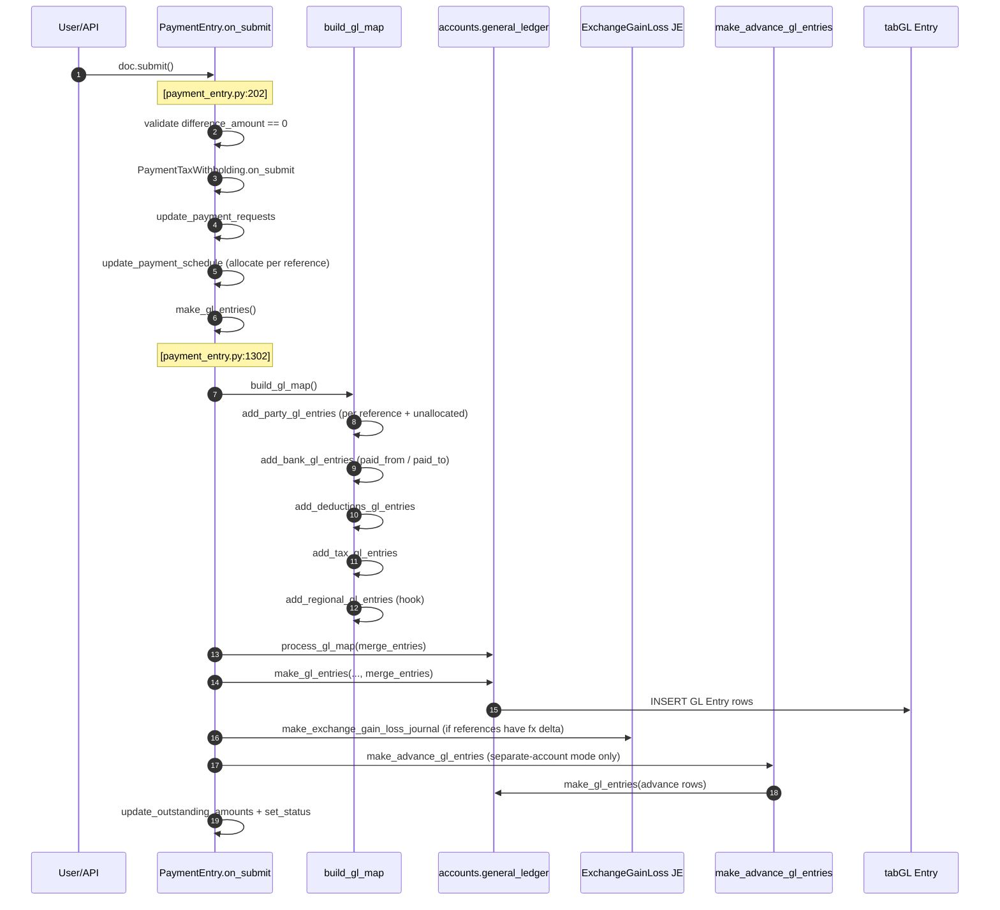

# Payments Flow — Payment Entry, Reconciliation, Schedules, FX

> **TL;DR:** [`Payment Entry`](erpnext/accounts/doctype/payment_entry/payment_entry.py:1) is the one-stop voucher for receiving or paying cash/bank against invoices, orders, advances, or journals. Its submit builds a GL map from five composers (party + bank + deductions + taxes + regional), funnels through the universal [`make_gl_entries`](erpnext/accounts/general_ledger.py:28) pipeline, emits an optional exchange-gain-loss Journal Entry, and runs a second pass ([`make_advance_gl_entries`](erpnext/accounts/doctype/payment_entry/payment_entry.py:1442)) when the company books advances in a separate party account. Every invoice also carries a [`payment_schedule`](erpnext/controllers/accounts_controller.py:2519) built from `Payment Terms Template` or upstream order terms. Unlinked or ambiguous allocations are resolved post-submit via [`Payment Reconciliation`](erpnext/accounts/doctype/payment_reconciliation/payment_reconciliation.py:27).

## Key files

- [`erpnext/accounts/doctype/payment_entry/payment_entry.py`](erpnext/accounts/doctype/payment_entry/payment_entry.py:1) — the PE controller.
- [`erpnext/accounts/doctype/payment_reconciliation/payment_reconciliation.py`](erpnext/accounts/doctype/payment_reconciliation/payment_reconciliation.py:1) — reconciliation tool.
- [`erpnext/accounts/doctype/payment_request/payment_request.py`](erpnext/accounts/doctype/payment_request/payment_request.py:1) — upstream payment-request DocType.
- [`erpnext/accounts/doctype/payment_terms_template/payment_terms_template.py`](erpnext/accounts/doctype/payment_terms_template/payment_terms_template.py:1) — template definition consumed by [`set_payment_schedule`](erpnext/controllers/accounts_controller.py:2519).
- [`erpnext/controllers/accounts_controller.py`](erpnext/controllers/accounts_controller.py:2519) — [`set_payment_schedule`](erpnext/controllers/accounts_controller.py:2519), [`get_order_details`](erpnext/controllers/accounts_controller.py:2616), [`fetch_payment_terms_from_order`](erpnext/controllers/accounts_controller.py:1), [`update_invoice_status`](erpnext/hooks.py:465) daily job.
- [`erpnext/accounts/general_ledger.py`](erpnext/accounts/general_ledger.py:681) — [`make_reverse_gl_entries`](erpnext/accounts/general_ledger.py:681) with `partial_cancel=True` for advance unlinking.

## Payment Entry lifecycle

### `validate`

[`PaymentEntry.validate`](erpnext/accounts/doctype/payment_entry/payment_entry.py:172) runs a long ordered chain:

1. [`setup_party_account_field`](erpnext/accounts/doctype/payment_entry/payment_entry.py:153) picks `paid_from` for Receive and `paid_to` for Pay; stores `party_account`, `party_account_field`, `party_account_currency`.
2. `set_missing_values`, [`set_liability_account`](erpnext/accounts/doctype/payment_entry/payment_entry.py:229) — when `Company.book_advance_payments_in_separate_party_account=1` and the PE only references Sales Order / Purchase Order, the party account is swapped to the company's `default_advance_received_account` / `default_advance_paid_account`. This is the toggle that turns a PE into an *advance* in a separate liability/asset bucket.
3. [`set_missing_ref_details`](erpnext/accounts/doctype/payment_entry/payment_entry.py:1) refreshes each reference row from the live voucher (outstanding amount, account, exchange rate).
4. [`validate_payment_type`](erpnext/accounts/doctype/payment_entry/payment_entry.py:607), [`validate_party_details`](erpnext/accounts/doctype/payment_entry/payment_entry.py:611), [`set_exchange_rate`](erpnext/accounts/doctype/payment_entry/payment_entry.py:615), [`validate_mandatory`](erpnext/accounts/doctype/payment_entry/payment_entry.py:643).
5. [`validate_reference_documents`](erpnext/accounts/doctype/payment_entry/payment_entry.py:648) — every `references` row must point to a submitted SI/PI/SO/PO/JE owned by the same party; reverse Payment Entry references are supported as well.
6. [`set_amounts`](erpnext/accounts/doctype/payment_entry/payment_entry.py:951) → `set_received_amount`, `set_amounts_in_company_currency`, `set_total_allocated_amount` (fills `exchange_gain_loss` on each reference), `set_unallocated_amount`, `set_exchange_gain_loss`, `set_difference_amount`.
7. [`validate_amounts`](erpnext/accounts/doctype/payment_entry/payment_entry.py:959) — `paid_amount >= received_amount` when currencies match.
8. [`apply_taxes`](erpnext/accounts/doctype/payment_entry/payment_entry.py:946) → `initialize_taxes` + `determine_exclusive_rate` + `calculate_taxes`. Uses the same math as [`controllers/taxes_and_totals.py`](erpnext/controllers/taxes_and_totals.py:258) but on `paid_amount` instead of items.
9. [`set_amounts_after_tax`](erpnext/accounts/doctype/payment_entry/payment_entry.py:975) — computes `paid_amount_after_tax`, `received_amount_after_tax`, `base_paid_amount_after_tax`, `base_received_amount_after_tax` from non-`included_in_paid_amount` tax rows, respecting `add_deduct_tax`.
10. [`clear_unallocated_reference_document_rows`](erpnext/accounts/doctype/payment_entry/payment_entry.py:1202) removes allocation rows with zero amount.
11. [`validate_transaction_reference`](erpnext/accounts/doctype/payment_entry/payment_entry.py:1220) demands `reference_no` and `reference_date` when the bank account's `account_type == "Bank"`.
12. [`validate_duplicate_entry`](erpnext/accounts/doctype/payment_entry/payment_entry.py:328), [`validate_payment_type_with_outstanding`](erpnext/accounts/doctype/payment_entry/payment_entry.py:355), [`validate_allocated_amount`](erpnext/accounts/doctype/payment_entry/payment_entry.py:363) (which in turn calls `validate_allocated_amount_as_per_payment_request` and `validate_allocated_amount_with_latest_data`).
13. [`validate_paid_invoices`](erpnext/accounts/doctype/payment_entry/payment_entry.py:723), [`ensure_supplier_is_not_blocked`](erpnext/accounts/doctype/payment_entry/payment_entry.py:1).
14. `PaymentTaxWithholding(self).on_validate()`, `set_status`, `set_total_in_words`.

### `on_submit`

Call-site references:

- Dispatcher: [`on_submit`](erpnext/accounts/doctype/payment_entry/payment_entry.py:202).
- `make_gl_entries`: [`payment_entry.py:1302`](erpnext/accounts/doctype/payment_entry/payment_entry.py:1302). Calls [`process_gl_map`](erpnext/accounts/general_ledger.py:188) **before** [`make_gl_entries`](erpnext/accounts/general_ledger.py:28) because it wants to merge identical-account rows from the party composer (`merge_similar_account_heads` is a `Accounts Settings` toggle). The outer `make_gl_entries` still runs its own merge only when `merge_entries=True` is passed through.
- `build_gl_map`: [`payment_entry.py:1289`](erpnext/accounts/doctype/payment_entry/payment_entry.py:1289). Five composers in strict order: party, bank, deductions, taxes, regional.
- `make_exchange_gain_loss_journal` is invoked right after the main GL write (non-cancel branch at [`payment_entry.py:1312`](erpnext/accounts/doctype/payment_entry/payment_entry.py:1312)).
- `make_advance_gl_entries(cancel=cancel)` at [`payment_entry.py:1314`](erpnext/accounts/doctype/payment_entry/payment_entry.py:1314) is the second pass for the separate-party-account mode.

### Composers

| Composer | Path | What it writes |
| --- | --- | --- |
| [`add_party_gl_entries`](erpnext/accounts/doctype/payment_entry/payment_entry.py:1316) | per-reference row | Debit/credit on `party_account` for each `allocated_amount`, keyed by `against_voucher` (the SI/PI/SO/PO/JE). Flips `dr_or_cr` on negative allocations of opposite-sign party types (Credit Note against Payable, etc.). An extra row for `unallocated_amount` is appended at [`payment_entry.py:1408`](erpnext/accounts/doctype/payment_entry/payment_entry.py:1408) — for separate-account mode it is self-referenced (`against_voucher = self.name`). |
| [`add_bank_gl_entries`](erpnext/accounts/doctype/payment_entry/payment_entry.py:1563) | `paid_from` / `paid_to` | Bank-side leg. `Pay` and `Internal Transfer` emit a credit on `paid_from`; `Receive` and `Internal Transfer` emit a debit on `paid_to`. Sets `post_net_value=True` so the row nets with any offsetting tax lines on the same account (see [`toggle_debit_credit_if_negative`](erpnext/accounts/general_ledger.py:363)). |
| [`add_tax_gl_entries`](erpnext/accounts/doctype/payment_entry/payment_entry.py:1600) | per `taxes` row | One GL row per tax (debit/credit direction derived from `payment_type` + `add_deduct_tax`). For non-`included_in_paid_amount` rows, a second offsetting row is written on the party account to keep the payment-leg balanced; FX-adjusted when the party account is not in company currency. All tax accounts must be in company currency ([`payment_entry.py:1603`](erpnext/accounts/doctype/payment_entry/payment_entry.py:1603)). |
| [`add_deductions_gl_entries`](erpnext/accounts/doctype/payment_entry/payment_entry.py:1665) | per `deductions` row | One debit on each deduction account. Deductions accounts must be in company currency. |
| [`add_regional_gl_entries`](erpnext/accounts/doctype/payment_entry/payment_entry.py:3576) | hook | Decorated with `@erpnext.allow_regional`; default no-op. Overridden via `regional_overrides`. |

### `on_cancel`

[`PaymentEntry.on_cancel`](erpnext/accounts/doctype/payment_entry/payment_entry.py:295) sets `ignore_linked_doctypes` (GL, SL, Payment Ledger, Repost docs, Unreconcile docs, Advance Payment Ledger, Tax Withholding Entry), calls `super().on_cancel()` (unlinks references from `AccountsController`), then `PaymentTaxWithholding.on_cancel`, `update_payment_requests(cancel=True)`, `update_payment_schedule(cancel=1)`, `make_gl_entries(cancel=1)` (which hits [`make_reverse_gl_entries`](erpnext/accounts/general_ledger.py:681) via the general-ledger module and also calls `cancel_exchange_gain_loss_journal`), `update_outstanding_amounts`, [`delink_advance_entry_references`](erpnext/accounts/doctype/payment_entry/payment_entry.py:1), `set_status`.

### `on_update_after_submit` — immutable repost

[`on_update_after_submit`](erpnext/accounts/doctype/payment_entry/payment_entry.py:216) bails when `flags.ignore_reposting_on_reconciliation` is set (Payment Reconciliation already reposts). Otherwise it calls [`check_if_fields_updated`](erpnext/controllers/accounts_controller.py:1) on `references`, `taxes`, `deductions`; when any of those child tables change it runs `validate_for_repost` + `repost_accounting_entries` to re-emit the GL without cancelling the voucher.

## Exchange-gain-loss handling

Two levers:

1. **Per-reference delta.** [`calculate_base_allocated_amount_for_reference`](erpnext/accounts/doctype/payment_entry/payment_entry.py:1017) computes each reference's base amount using the payment's source/target exchange rate. For advance-payment doctypes (SO/PO, see [`get_advance_payment_doctypes`](erpnext/controllers/accounts_controller.py:1) + `advance_payment_receivable_doctypes`/`advance_payment_payable_doctypes` at [`hooks.py:525`](erpnext/hooks.py:525)), `exchange_gain_loss` is not booked — SOs/POs aren't expected to hold FX. For invoices, `d.exchange_gain_loss = base_allocated_amount - (allocated_amount × reference.exchange_rate)` is attached to the reference row for display ([`payment_entry.py:1055`](erpnext/accounts/doctype/payment_entry/payment_entry.py:1055)).
2. **Realized gain/loss JE.** [`make_exchange_gain_loss_journal`](erpnext/accounts/doctype/payment_entry/payment_entry.py:1) is called right after the main GL write ([`payment_entry.py:1312`](erpnext/accounts/doctype/payment_entry/payment_entry.py:1312)). It inserts a `Journal Entry` of `voucher_type = "Exchange Gain Or Loss"` for each reference whose `exchange_gain_loss != 0`. These JEs are explicitly *exempt* from the zero-amount filter in [`merge_similar_entries`](erpnext/accounts/general_ledger.py:317) so they survive even when both sides round to zero after merge. Cancelling the PE calls [`cancel_exchange_gain_loss_journal`](erpnext/accounts/doctype/payment_entry/payment_entry.py:1) which cancels the paired JE.

Company-level accounts for realized gain/loss come from `Company.exchange_gain_loss_account` and `Company.default_cost_center`.

## Advances and separate party accounts

[`Company.book_advance_payments_in_separate_party_account`](erpnext/accounts/doctype/payment_entry/payment_entry.py:240) toggles a major branch. When on, [`set_liability_account`](erpnext/accounts/doctype/payment_entry/payment_entry.py:229) rewrites `paid_from` (or `paid_to`) on the PE from the regular receivable/payable to `default_advance_received_account` / `default_advance_paid_account`. This only fires when references are exclusively SO / PO (or none at all); mixed references revert to a normal PE.

[`make_advance_gl_entries`](erpnext/accounts/doctype/payment_entry/payment_entry.py:1442) then runs a second GL pass:

- **Non-cancel:** reads every reference pointing to SI/PI/JE/PE and emits advance-account debit/credit pairs via [`add_advance_gl_for_reference`](erpnext/accounts/doctype/payment_entry/payment_entry.py:1492). The dr/cr sign comes from [`get_dr_and_account_for_advances`](erpnext/accounts/doctype/payment_entry/payment_entry.py:1472) — which flips based on `reference_doctype` and (for reverse-PE references) on `account_type` + `payment_type`.
- **Cancel / partial-cancel:** calls [`make_reverse_gl_entries`](erpnext/accounts/general_ledger.py:681) with `partial_cancel=True`, scoping the reversal to the exact `voucher_detail_no` of the unlinked reference. This is the only known call path using the partial-cancel branch.

Outstanding bookkeeping for these advances uses the `Advance Payment Ledger Entry` DocType (see [accounts module](../modules/accounts.md#gl-entry-and-payment-ledger-entry)).

## Taxes on Payment Entry

Payment Entry has its own tax pipeline — *not* the same class instance as [`controllers/taxes_and_totals.py`](erpnext/controllers/taxes_and_totals.py:26) but using the same algorithm against a different data shape:

- [`apply_taxes`](erpnext/accounts/doctype/payment_entry/payment_entry.py:946) wires [`initialize_taxes`](erpnext/accounts/doctype/payment_entry/payment_entry.py:1733), [`determine_exclusive_rate`](erpnext/accounts/doctype/payment_entry/payment_entry.py:1748), [`calculate_taxes`](erpnext/accounts/doctype/payment_entry/payment_entry.py:1) (PE's own).
- Inclusive-vs-exclusive is driven by `tax.included_in_paid_amount` rather than `included_in_print_rate`.
- `paid_amount_after_tax` / `received_amount_after_tax` at [`set_amounts_after_tax`](erpnext/accounts/doctype/payment_entry/payment_entry.py:975) feed subsequent `difference_amount` calculation.
- Posting tax is a two-row event: one on `tax.account_head`, one offsetting on the party/bank account ([`add_tax_gl_entries`](erpnext/accounts/doctype/payment_entry/payment_entry.py:1638) — the `if not d.included_in_paid_amount` branch).

## Deductions

[`deductions`](erpnext/accounts/doctype/payment_entry/payment_entry.py:1665) child table holds discount or bank-charge offsets. Each row must use a company-currency account. Amount is written as a *debit* unconditionally — the offset happens against the party account in the party composer when the PE's `difference_amount` is used as a deduction via [`set_gain_or_loss`](erpnext/accounts/doctype/payment_entry/payment_entry.py:1714).

## Payment Schedule

[`AccountsController.set_payment_schedule`](erpnext/controllers/accounts_controller.py:2519) is called during `validate` on Sales Invoice, Purchase Invoice, Sales Order, and Purchase Order via their shared `validate` chain. Behaviour:

1. POS invoices and opening entries bail early — they don't have a schedule.
2. Resolves `party_account_currency` if unset.
3. Computes `base_grand_total` / `grand_total` minus write-off and advance for the non-SO path ([`accounts_controller.py:2544`](erpnext/controllers/accounts_controller.py:2544)).
4. If the doc lacks `payment_schedule` rows:
   - When `Accounts Settings.automatically_fetch_payment_terms=1` and the linked order has payment terms, [`fetch_payment_terms_from_order`](erpnext/controllers/accounts_controller.py:1) copies terms from the SO/PO/Quotation.
   - Else when the doc has a `payment_terms_template`, [`get_payment_terms`](erpnext/controllers/accounts_controller.py:1) expands the template into individual `Payment Schedule` rows.
   - Otherwise a single row with `invoice_portion=100`, `payment_amount=grand_total`, `due_date=due_date or posting_date` is appended (Purchase Receipt is exempt at [`accounts_controller.py:2577`](erpnext/controllers/accounts_controller.py:2577)).
5. For every row, `payment_amount` / `base_payment_amount` / `outstanding` / `base_outstanding` are recomputed from `invoice_portion` × `grand_total`. If the template opts into "allocate payment based on payment terms" and the upstream order has matching terms, the numbers come straight from the order instead.

### Updating the schedule from Payment Entry

On submit, [`update_payment_schedule`](erpnext/accounts/doctype/payment_entry/payment_entry.py:207) walks the PE's `references` and subtracts each `allocated_amount` from the matching invoice-line's schedule-row `outstanding`. On cancel, [`update_payment_schedule(cancel=1)`](erpnext/accounts/doctype/payment_entry/payment_entry.py:312) puts it back.

### Overdue tracking

[`update_invoice_status`](erpnext/hooks.py:465) runs daily (`daily_maintenance`). It compares each schedule row's `due_date` to today and flips the voucher's `status` to `Overdue` (or `Overdue and Discounted`, etc.).

## Payment Reconciliation

[`Payment Reconciliation`](erpnext/accounts/doctype/payment_reconciliation/payment_reconciliation.py:27) is a *non-submittable* (virtual) DocType used as a UI for bulk matching. Key methods:

- [`get_unreconciled_entries`](erpnext/accounts/doctype/payment_reconciliation/payment_reconciliation.py:130) — pulls unallocated Payment Entries, Journal Entries, and credit/debit notes against the selected party + company + account, filtered by date, dimensions, and optional payment-limit.
- [`allocate_entries`](erpnext/accounts/doctype/payment_reconciliation/payment_reconciliation.py:450) — produces the `allocation` child table by matching invoices to payments FIFO-style (or by specific voucher pair when the user drags).
- [`reconcile`](erpnext/accounts/doctype/payment_reconciliation/payment_reconciliation.py:559) — the commit. For each allocation, either:
  - attaches a new `references` row to the existing Payment Entry and reposts it (setting `ignore_reposting_on_reconciliation` to bypass the repost-dedupe guard in [`PaymentEntry.on_update_after_submit`](erpnext/accounts/doctype/payment_entry/payment_entry.py:216)), or
  - creates a Journal Entry to link an invoice with a credit note via [`reconcile_dr_cr_note`](erpnext/accounts/doctype/payment_reconciliation/payment_reconciliation.py:800).
- [`validate_entries`](erpnext/accounts/doctype/payment_reconciliation/payment_reconciliation.py:620) + [`validate_allocation`](erpnext/accounts/doctype/payment_reconciliation/payment_reconciliation.py:716) guard allocation amounts against live outstanding numbers.

Unreconcile lives in the separate `Unreconcile Payment` DocType and is cited in the `ignore_linked_doctypes` lists on PE / JE / Invoice cancel paths to prevent cascade cancellation.

## Dunning and write-offs

- [`Dunning`](erpnext/accounts/doctype/dunning/dunning.py:1) emits late-fee JE entries against overdue invoices. Registered in `period_closing_doctypes` at [`hooks.py:328`](erpnext/hooks.py:328).
- Invoice write-off is driven by `write_off_account` + `write_off_amount` fields on SI/PI. [`calculate_write_off_amount`](erpnext/controllers/taxes_and_totals.py:1115) computes it when `write_off_outstanding_amount_automatically=1`. GL rows are booked via [`make_write_off_gl_entry`](erpnext/accounts/doctype/sales_invoice/sales_invoice.py:1600).

## Related

- [Accounting flow](accounting-flow.md) — `make_gl_entries` pipeline, repost, cancel semantics.
- [Taxes and totals](taxes-and-totals.md) — the shared inclusive/exclusive/actual math (PE uses its own subclass with `included_in_paid_amount` instead of `included_in_print_rate`).
- [Accounts module](../modules/accounts.md) — Payment Ledger and Advance Payment Ledger.
- [Accounts DocType reference cards](../modules/accounts-doctypes.md) — PE card with all call-site citations.
- [Regional overrides](../patterns/regional-overrides.md) — `add_regional_gl_entries` on PE.
- [Controller hierarchy](../architecture/controllers.md) — PE extends `AccountsController` directly.

## Changelog

- `2026-04-17` — initial version (commit `fbe976fb3b`, branch `feat/setting-claude`).
