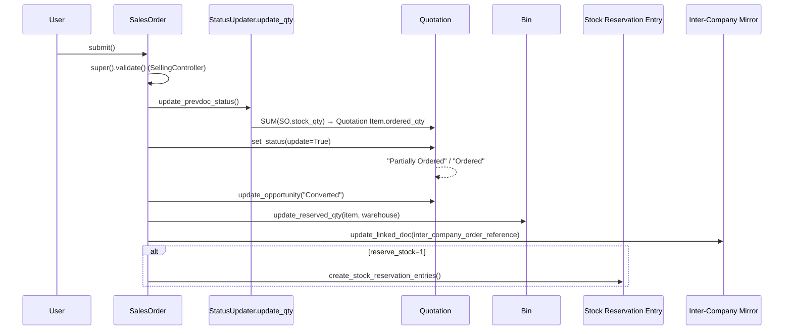
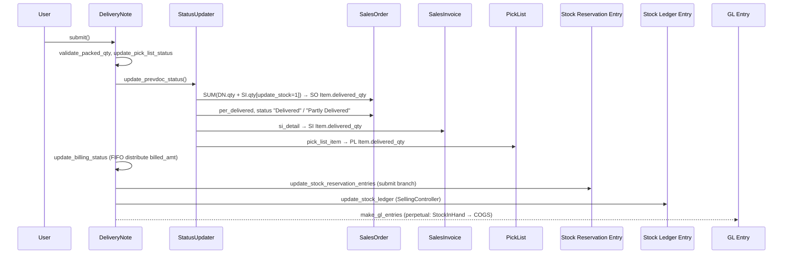
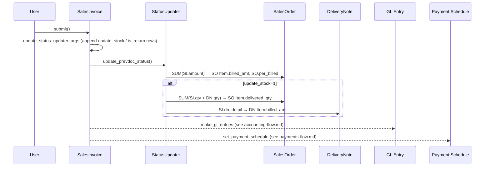
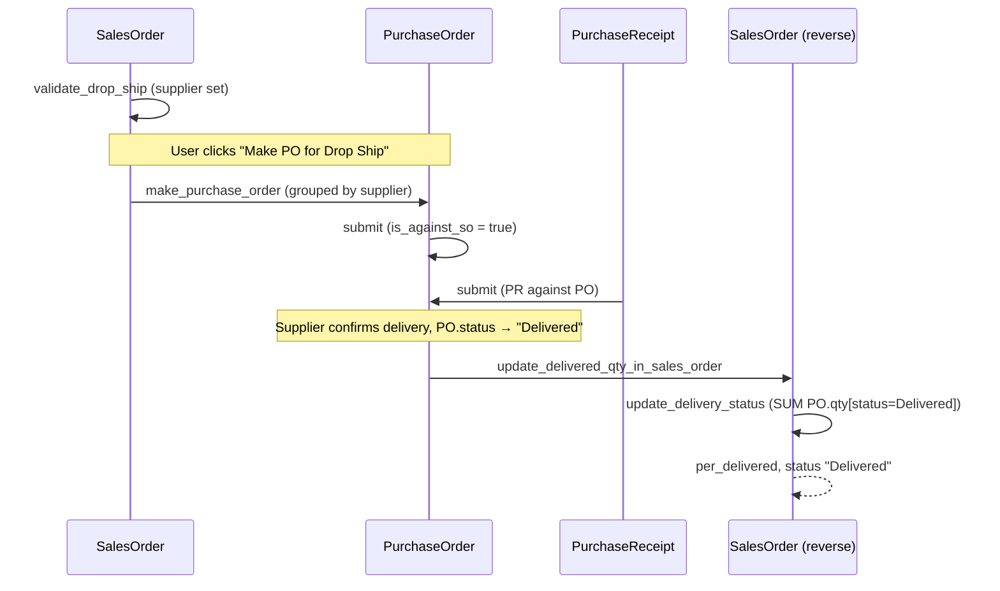

# Selling Flow: Quotation → Sales Order → Delivery Note → Sales Invoice

> **TL;DR:** The selling cascade threads qty / amount completion state across four DocTypes using the `status_updater[]` contract from [StatusUpdater](../../erpnext/controllers/status_updater.py:180). On each downstream submit / cancel, `update_prevdoc_status` (qty roll-up via [StatusUpdater.update_qty](../../erpnext/controllers/status_updater.py:494)) and `update_billing_status` (amount roll-up, custom per DocType) walk the chain backwards, refreshing `ordered_qty`, `delivered_qty`, `billed_amt`, and the parent `per_delivered` / `per_billed` fields. SLE and GL side-effects run **only** at Delivery Note and Sales Invoice submit (see [flows/stock-flow.md](./stock-flow.md), [flows/accounting-flow.md](./accounting-flow.md)). Special variants: Drop Ship (SO → PO → PR, with `update_delivery_status` as the reverse lane), Stock Reservation (SO → SRE → DN consumption via [SellingController.update_stock_reservation_entries](../../erpnext/controllers/selling_controller.py:895)), and inter-company (mirrored SO ↔ PO and SI ↔ PI via `validate_inter_company_party` / `update_linked_doc`).

## Scope of this document

This page only documents **the selling cascade itself**. For the per-stage side effects, cross-link to:

- GL writes on SI submit / cancel → [flows/accounting-flow.md](./accounting-flow.md).
- Tax + totals math at every stage → [flows/taxes-and-totals.md](./taxes-and-totals.md).
- SLE writes on DN submit / cancel (and SI with `update_stock=1`) → [flows/stock-flow.md](./stock-flow.md).
- Payment Entry / `set_payment_schedule` on SO and SI → [flows/payments-flow.md](./payments-flow.md).
- Per-DocType method cards → [modules/selling-doctypes.md](../modules/selling-doctypes.md).
- `SellingController` inheritance → [architecture/controllers.md](../architecture/controllers.md).

## Key files

- [selling_controller.py](../../erpnext/controllers/selling_controller.py:18) — `SellingController` base for QTN / SO / DN / SI.
- [status_updater.py](../../erpnext/controllers/status_updater.py:180) — `StatusUpdater.update_qty` + `validate_qty` core of the cascade.
- [quotation.py](../../erpnext/selling/doctype/quotation/quotation.py:18) — QTN lifecycle (`on_submit` → opportunity update; scheduler-driven expiry).
- [sales_order.py](../../erpnext/selling/doctype/sales_order/sales_order.py:55) — SO with its `status_updater` pointing back to Quotation Item.
- [delivery_note.py](../../erpnext/stock/doctype/delivery_note/delivery_note.py:26) — DN with two `status_updater` rows (SO and SI) + Pick List row.
- [sales_invoice.py](../../erpnext/accounts/doctype/sales_invoice/sales_invoice.py:59) — SI with SO billing; `update_stock` extends to delivery.
- [make_sales_order](../../erpnext/selling/doctype/quotation/quotation.py:360) — QTN → SO mapper.
- [make_delivery_note](../../erpnext/selling/doctype/sales_order/sales_order.py:1156) — SO → DN mapper.
- [make_sales_invoice (from DN)](../../erpnext/stock/doctype/delivery_note/delivery_note.py:855) — DN → SI mapper.
- [make_purchase_order (drop-ship)](../../erpnext/selling/doctype/sales_order/sales_order.py:1598) — SO → PO for drop-ship items.
- [update_billed_amount_based_on_so](../../erpnext/stock/doctype/delivery_note/delivery_note.py:717) — DN `billed_amt` redistribution (FIFO over DNs when SI bills against SO directly).
- [validate_inter_company_party](../../erpnext/accounts/doctype/sales_invoice/sales_invoice.py:2330) + [update_linked_doc](../../erpnext/accounts/doctype/sales_invoice/sales_invoice.py:2372) — inter-company linkage.

## The `status_updater` contract

Each transactional selling DocType declares one or more `status_updater` dicts in `__init__`. At submit, `StatusUpdater.update_prevdoc_status` → `update_qty` ([status_updater.py:191](../../erpnext/controllers/status_updater.py:191), [status_updater.py:494](../../erpnext/controllers/status_updater.py:494)) walks the list and:

1. Per `source_dt` child row, SUMs `source_field` across all submitted parents (`docstatus=1`) into `target_field` on the `target_dt` child identified by `join_field` ([status_updater.py:511-561](../../erpnext/controllers/status_updater.py:511)).
2. If a `percent_join_field` / `target_parent_field` is provided, aggregates per `target_parent_dt` and recomputes `per_*` ([status_updater.py:563-641](../../erpnext/controllers/status_updater.py:563)).
3. `validate_qty` checks overflow with the allowance from Item / Stock Settings / Accounts Settings ([status_updater.py:388-428](../../erpnext/controllers/status_updater.py:388)); role override via `role_allowed_to_over_deliver_receive` (qty) or `role_allowed_to_over_bill` (amount).

The canonical chain for selling:

| From (source_dt) | To (target_dt) | join_field | target_field | Location |
|---|---|---|---|---|
| Sales Order Item | Quotation Item | `quotation_item` | `ordered_qty` | [sales_order.py:202](../../erpnext/selling/doctype/sales_order/sales_order.py:202) |
| Delivery Note Item | Sales Order Item | `so_detail` | `delivered_qty` + `per_delivered` | [delivery_note.py:166](../../erpnext/stock/doctype/delivery_note/delivery_note.py:166) |
| Delivery Note Item | Sales Invoice Item | `si_detail` | `delivered_qty` | [delivery_note.py:186](../../erpnext/stock/doctype/delivery_note/delivery_note.py:186) |
| Delivery Note Item | Pick List Item | `pick_list_item` | `delivered_qty` + `per_delivered` | [delivery_note.py:198](../../erpnext/stock/doctype/delivery_note/delivery_note.py:198) |
| Sales Invoice Item | Sales Order Item | `so_detail` | `billed_amt` + `per_billed` | [sales_invoice.py:257](../../erpnext/accounts/doctype/sales_invoice/sales_invoice.py:257) |
| Sales Invoice Item (update_stock=1) | Sales Order Item | `so_detail` | `delivered_qty` | [sales_invoice.py:669](../../erpnext/accounts/doctype/sales_invoice/sales_invoice.py:669) |

Cancel reverses the effect: `update_qty` re-sums with `parent != <self.name>` ([status_updater.py:504](../../erpnext/controllers/status_updater.py:504)), dropping the cancelling voucher out of the aggregate.

## Quotation → Sales Order

### Mapper

[_make_sales_order](../../erpnext/selling/doctype/quotation/quotation.py:377) uses `frappe.model.mapper.get_mapped_doc` to clone `Quotation → Sales Order`, `Quotation Item → Sales Order Item` (with `parent → prevdoc_docname`, `name → quotation_item` field map at [quotation.py:470](../../erpnext/selling/doctype/quotation/quotation.py:470)), resets taxes, preserves Sales Team. Alternative-item rows ([quotation.py:201](../../erpnext/selling/doctype/quotation/quotation.py:201)) are filtered out unless selected.

Validity gate: `allow_sales_order_creation_for_expired_quotation` in Selling Settings ([quotation.py:363](../../erpnext/selling/doctype/quotation/quotation.py:363)). Expired quotations throw unless the flag is set.

### Cascade on SO submit

[SalesOrder.on_submit](../../erpnext/selling/doctype/sales_order/sales_order.py:498):

1. `super().update_prevdoc_status()` — walks `status_updater[0]` to set `Quotation Item.ordered_qty` (from all SO items with matching `quotation_item`).
2. `check_credit_limit` — [customer.py:599](../../erpnext/selling/doctype/customer/customer.py:599) via `check_credit_limit(customer, company)`.
3. `update_reserved_qty` — bumps `Bin.reserved_qty` for each item × warehouse ([sales_order.py:628](../../erpnext/selling/doctype/sales_order/sales_order.py:628)).
4. `update_prevdoc_status("submit")` — SO-specific override at [sales_order.py:483](../../erpnext/selling/doctype/sales_order/sales_order.py:483): for each unique `prevdoc_docname` (Quotation), runs `set_status(update=True)` on the Quotation (flips to `Partially Ordered` / `Ordered` via `status_map["Quotation"]` at [status_updater.py:34](../../erpnext/controllers/status_updater.py:34)) and `update_opportunity("Converted")`.
5. `update_blanket_order` — updates `Blanket Order Item.ordered_qty` if `against_blanket_order` is set.
6. `update_linked_doc` — if `inter_company_order_reference` points to another SO (typically from the partner company's PO), writes back the mirror reference.
7. `create_stock_reservation_entries` — only if `reserve_stock=1` and `Stock Settings.enable_stock_reservation=1` ([sales_order.py:518](../../erpnext/selling/doctype/sales_order/sales_order.py:518)). Creates SREs that later consume during DN submit.

### Cascade on SO cancel

[SalesOrder.on_cancel](../../erpnext/selling/doctype/sales_order/sales_order.py:528):

1. Sets `ignore_linked_doctypes = ("GL Entry", "Stock Ledger Entry", "Payment Ledger Entry", "Advance Payment Ledger Entry", "Unreconcile Payment", "Unreconcile Payment Entries")` so frappe's cascade skips the immutable ledgers.
2. Rejects cancel if status is `Closed` ([sales_order.py:540](../../erpnext/selling/doctype/sales_order/sales_order.py:540)) — must be unclosed first via `close_or_unclose_sales_orders` ([sales_order.py:986](../../erpnext/selling/doctype/sales_order/sales_order.py:986)).
3. `check_nextdoc_docstatus` ([sales_order.py:581](../../erpnext/selling/doctype/sales_order/sales_order.py:581)) — throws if any draft Sales Invoice references this SO.
4. `update_reserved_qty`, `update_prevdoc_status("cancel")` (flips linked Quotation back to `Quotation` status).
5. `cancel_stock_reservation_entries` — cancels SREs created at submit.
6. `unlink_inter_company_doc` — clears mirror reference on the paired Purchase Order, if any.

### Sequence diagram



## Sales Order → Delivery Note

### Mapper

[make_delivery_note](../../erpnext/selling/doctype/sales_order/sales_order.py:1156) maps SO items with `remaining_qty > 0`, excluding drop-ship rows (`delivered_by_supplier = 1`). Field maps: `so_detail → name`, `against_sales_order → parent` (for SO reference on DN lines). `Packed Item` rows are also copied. If `skip_delivery_note=1` on the SO, DN is skipped and SI is cut directly.

### Cascade on DN submit

[DeliveryNote.on_submit](../../erpnext/stock/doctype/delivery_note/delivery_note.py:466):

1. `validate_packed_qty` — if a submitted Packing Slip exists, `packed_qty == qty` is enforced ([delivery_note.py:604](../../erpnext/stock/doctype/delivery_note/delivery_note.py:604)).
2. `update_pick_list_status` — flips Pick List status via [pick_list.update_pick_list_status](../../erpnext/stock/doctype/delivery_note/delivery_note.py:621).
3. Authorization Control (approval limits).
4. **`update_prevdoc_status`** ([delivery_note.py:476](../../erpnext/stock/doctype/delivery_note/delivery_note.py:476)) — walks the 3-row `status_updater`:
   - `Sales Order Item.delivered_qty` = SUM(DN qty) + SUM(SI qty where `update_stock=1`) via `second_source_dt` ([delivery_note.py:179-185](../../erpnext/stock/doctype/delivery_note/delivery_note.py:179)).
   - `Sales Order.per_delivered` aggregated and status → `Delivered` / `Partly Delivered`.
   - `Sales Invoice Item.delivered_qty` updated if DN rows reference an SI row via `si_detail`.
   - `Pick List Item.delivered_qty` / `Pick List.per_delivered`.
5. **`update_billing_status`** ([delivery_note.py:668](../../erpnext/stock/doctype/delivery_note/delivery_note.py:668)) — for each DN item with `si_detail` (direct DN→SI link), sets `DeliveryNoteItem.billed_amt = amount`. For items with `so_detail` (SO→SI billing), calls [update_billed_amount_based_on_so](../../erpnext/stock/doctype/delivery_note/delivery_note.py:717) which redistributes `billed_amt` FIFO across DNs matching that SO line (so when SI bills directly against SO and not DN, each DN still reflects its share of billed amount).
6. `check_credit_limit` (non-return path).
7. `make_return_invoice` — if return DN + `issue_credit_note=1`, auto-cuts a return SI.
8. SABB creation for items / packed_items (`make_bundle_for_sales_purchase_return`, `make_bundle_using_old_serial_batch_fields`).
9. `validate_standalone_serial_nos_customer` ([selling_controller.py:77](../../erpnext/controllers/selling_controller.py:77)) — blocks standalone credit note for a SN assigned to a different customer.
10. **`update_stock_reservation_entries`** ([selling_controller.py:895](../../erpnext/controllers/selling_controller.py:895)) — for each DN item with `against_sales_order` + `so_detail`, finds still-open SREs ordered by creation and increments `delivered_qty` until the DN qty is consumed. Supports Serial / Batch-based SREs and regular qty-based SREs.
11. `update_stock_ledger` — SellingController SLE writer ([selling_controller.py:661](../../erpnext/controllers/selling_controller.py:661)). See [flows/stock-flow.md](./stock-flow.md).
12. `make_gl_entries` — perpetual-inventory GL: Stock-in-Hand (credit) → COGS (debit). See [flows/accounting-flow.md](./accounting-flow.md).
13. `repost_future_sle_and_gle` — if posting-date is older than the latest SLE for that item × warehouse.

The ordering of step 4 (update_prevdoc_status) **before** step 11 (update_stock_ledger) is enforced because Bin `reserved_qty` depends on the updated SO `delivered_qty` ([delivery_note.py:494-496](../../erpnext/stock/doctype/delivery_note/delivery_note.py:494)).

### Cascade on DN cancel

[DeliveryNote.on_cancel](../../erpnext/stock/doctype/delivery_note/delivery_note.py:500):

1. `super().on_cancel()` — AccountsController hooks.
2. `check_sales_order_on_hold_or_close("against_sales_order")` ([selling_controller.py:471](../../erpnext/controllers/selling_controller.py:471)) — throws if a linked SO is `Closed` or `On Hold` (unless return).
3. `check_next_docstatus` ([delivery_note.py:628](../../erpnext/stock/doctype/delivery_note/delivery_note.py:628)) — rejects cancel if any submitted SI references this DN.
4. `update_prevdoc_status` + `update_billing_status` — re-runs the SUMs without this DN, decrementing SO `delivered_qty` and distributing `billed_amt` back.
5. `update_stock_reservation_entries` — decrements SRE `delivered_qty` (cancel branch at [selling_controller.py:976](../../erpnext/controllers/selling_controller.py:976)).
6. `update_stock_ledger` — reverse SLE.
7. `cancel_packing_slips` ([delivery_note.py:647](../../erpnext/stock/doctype/delivery_note/delivery_note.py:647)) — cascade-cancels linked Packing Slips.
8. `make_gl_entries_on_cancel` + `repost_future_sle_and_gle`.
9. `ignore_linked_doctypes = ("GL Entry", "Stock Ledger Entry", "Repost Item Valuation", "Serial and Batch Bundle")`.
10. `delete_auto_created_batches`.

### Sequence diagram



## Delivery Note → Sales Invoice

### Mapper

[make_sales_invoice (from DN)](../../erpnext/stock/doctype/delivery_note/delivery_note.py:855):

- Computes `pending_qty = qty - invoiced_qty - returned_qty` ([delivery_note.py:895](../../erpnext/stock/doctype/delivery_note/delivery_note.py:895)).
- Only rows with positive pending qty (non-return) / negative (return) are mapped.
- Field maps: `name → dn_detail`, `parent → delivery_note`, `so_detail → so_detail`, `against_sales_order → sales_order`, preserves `cost_center`.
- If payment-terms auto-fetch is enabled, pulls terms from the linked SO ([delivery_note.py:963](../../erpnext/stock/doctype/delivery_note/delivery_note.py:963)).

Alternative mapper: [_make_sales_invoice (from QTN)](../../erpnext/selling/doctype/quotation/quotation.py:517) skips the SO / DN steps entirely — Quotation → direct SI.

### Cascade on SI submit

[SalesInvoice.on_submit](../../erpnext/accounts/doctype/sales_invoice/sales_invoice.py:450) is covered in [flows/accounting-flow.md](./accounting-flow.md). From the **selling-cascade** perspective:

1. SI `__init__` seeds `status_updater[0]` targeting `Sales Order Item.billed_amt` / `Sales Order.per_billed` ([sales_invoice.py:257](../../erpnext/accounts/doctype/sales_invoice/sales_invoice.py:257)).
2. `update_status_updater_args` ([sales_invoice.py:665](../../erpnext/accounts/doctype/sales_invoice/sales_invoice.py:665)) — if `update_stock=1`, **appends** a second entry that bumps `Sales Order Item.delivered_qty` (aggregated with DN qty via `second_source_dt`). Return invoices append a third for `returned_qty`.
3. During submit, `update_prevdoc_status` walks the list(s) — SO `per_billed` is refreshed, and if `update_stock=1` the DN-equivalent delivery SUM is refreshed as well.
4. `status_updater = []` branch at [sales_invoice.py:462](../../erpnext/accounts/doctype/sales_invoice/sales_invoice.py:462) (consolidated invoice from POS) — skips the cascade entirely because the POS-invoice children already drove it.

### Cascade on SI cancel

Symmetric: `update_prevdoc_status` re-sums without this SI, SO `per_billed` drops. If `update_stock=1`, SLEs are reversed and DN `delivered_qty` decrements via the second `status_updater` entry. `unlink_inter_company_doc` ([sales_invoice.py:634](../../erpnext/accounts/doctype/sales_invoice/sales_invoice.py:634)) clears the mirror reference on the partner PI.

### Sequence diagram



## SO close / hold / re-open

[close_or_unclose_sales_orders](../../erpnext/selling/doctype/sales_order/sales_order.py:986) — bulk action that flips SO `status` to `Closed` (only if `per_delivered < 100` or `per_billed < 100`) or resets to `Draft`. The status is then recomputed by `status_map["Sales Order"]` ([status_updater.py:42](../../erpnext/controllers/status_updater.py:42)) which has explicit `Closed` / `On Hold` literals that override the percentage-based literals.

[SalesOrder.update_status](../../erpnext/selling/doctype/sales_order/sales_order.py:603) — single-SO flow. On re-open (status → Draft while `docstatus==1`), `check_credit_limit` is re-run (after the `Closed`/`On Hold` mask is cleared), `update_reserved_qty` is refreshed, and linked Subcontracting Inward Order status is updated ([sales_order.py:615](../../erpnext/selling/doctype/sales_order/sales_order.py:615)).

Effects while Closed / On Hold:

- DN, SI (and SI with `update_stock`) submit against a Closed / On Hold SO throws via [SellingController.check_sales_order_on_hold_or_close](../../erpnext/controllers/selling_controller.py:471).
- `update_reserved_qty` on a Closed SO throws `InvalidStatusError` ([selling_controller.py:491](../../erpnext/controllers/selling_controller.py:491)) — so the DN/SI cancel path also blocks until the SO is unclosed.

## Drop ship: SO → PO → PR → DN-equivalent

Drop ship uses `delivered_by_supplier=1` + `supplier` on the Sales Order Item row. `validate_drop_ship` ([sales_order.py:493](../../erpnext/selling/doctype/sales_order/sales_order.py:493)) enforces that a supplier is set.

### PO creation

[make_purchase_order (from SO)](../../erpnext/selling/doctype/sales_order/sales_order.py:1598) groups SO items by supplier, maps each group to a separate PO:

- `sales_order_item → name`, `sales_order → parent`, `delivery_date → schedule_date` ([sales_order.py:1712](../../erpnext/selling/doctype/sales_order/sales_order.py:1712)).
- Supplier-default price list + payment terms applied.
- If any `delivered_by_supplier=1`, the PO's `shipping_address` is set to the SO's shipping address, and customer contact fields are copied ([sales_order.py:1642](../../erpnext/selling/doctype/sales_order/sales_order.py:1642)).
- Items where `ordered_qty >= stock_qty` are filtered out (`filter_items` at [sales_order.py:1671](../../erpnext/selling/doctype/sales_order/sales_order.py:1671)).

### PR → SO delivery status (reverse lane)

Drop ship does **not** create a Delivery Note; the PR at the supplier flows delivery status back to the SO. The trigger is on the **PO** side:

[PurchaseOrder.update_delivered_qty_in_sales_order](../../erpnext/buying/doctype/purchase_order/purchase_order.py:556) — called from PO's `on_submit` / `on_cancel`:

```
for po_item where delivered_by_supplier=1:
  SO = po_item.sales_order
  SO.update_delivery_status()  # [sales_order.py:681]
  SO.set_status(update=True)
```

[SalesOrder.update_delivery_status](../../erpnext/selling/doctype/sales_order/sales_order.py:681) — for each drop-ship SO item, SUMs qty across all PO Items with `po.status='Delivered'` and writes `delivered_qty` + `per_delivered` directly on the SO. Note: PO `status='Delivered'` is the trigger, **not** PR submit — PR only flips the PO status (see [buying module](../../erpnext/buying/doctype/purchase_order/purchase_order.py:424) for the `delivered_by_supplier` skip in the regular received-qty path).

### Drop-ship diagram



## Stock Reservation cascade

Optional feature gated by `Stock Settings.enable_stock_reservation`. Flow:

1. **SO submit** — if `reserve_stock=1`, `create_stock_reservation_entries` ([sales_order.py:839](../../erpnext/selling/doctype/sales_order/sales_order.py:839)) creates one or more `Stock Reservation Entry` docs with `voucher_type='Sales Order'`, `voucher_no=so.name`, `voucher_detail_no=so_item.name`. `Bin.reserved_stock` is bumped ([stock_reservation_entry.py:523](../../erpnext/stock/doctype/stock_reservation_entry/stock_reservation_entry.py:523)).
2. **DN submit** — `update_stock_reservation_entries` ([selling_controller.py:895](../../erpnext/controllers/selling_controller.py:895)) matches DN items to open SREs by `(voucher_no=against_sales_order, voucher_detail_no=so_detail, warehouse)`, ordered by creation, and consumes qty into `sre.delivered_qty`. For Serial/Batch-based SREs, walks `sb_entries` to mark each serial_no / batch_no as delivered.
3. **DN cancel** — reverses the consumption ([selling_controller.py:976](../../erpnext/controllers/selling_controller.py:976)).
4. **SO cancel** — `cancel_stock_reservation_entries` ([sales_order.py:859](../../erpnext/selling/doctype/sales_order/sales_order.py:859)) cancels all SREs and decrements Bin.

SI with `update_stock=1` follows the same path ([selling_controller.py:902](../../erpnext/controllers/selling_controller.py:902) uses `sales_order` as the so_field for SI).

See [modules/stock-doctypes.md#stock-reservation-entry](../modules/stock-doctypes.md#stock-reservation-entry) for the SRE shape.

## Inter-company

Fields: `is_internal_customer` on Customer, `represents_company` linking back. `inter_company_order_reference` (on SO) and `inter_company_invoice_reference` (on SI) hold the mirror doc name.

- [validate_inter_company_party](../../erpnext/accounts/doctype/sales_invoice/sales_invoice.py:2330) — at SO / SI validate, checks that the customer's `represents_company` matches and, if a reference is set, that the mirror doc belongs to the right company.
- [update_linked_doc](../../erpnext/accounts/doctype/sales_invoice/sales_invoice.py:2372) — on submit, writes the current doc's name back into the mirror's `inter_company_*_reference`.
- [unlink_inter_company_doc](../../erpnext/accounts/doctype/sales_invoice/sales_invoice.py:2382) — on cancel, clears the mirror reference.
- [make_inter_company_purchase_invoice](../../erpnext/accounts/doctype/sales_invoice/sales_invoice.py:2587) / [make_inter_company_transaction](../../erpnext/accounts/doctype/sales_invoice/sales_invoice.py:2596) — action buttons that mirror SI → PI (or SO → PO, via the selling-side analogue).

Typical flow: Customer-A's **Sales Invoice** in Company-A is mirrored as a **Purchase Invoice** in Company-B (a buying-side Supplier representing Company-A). Target warehouse validation and internal-transfer SLE / valuation logic live in `SellingController.validate_target_warehouse` ([selling_controller.py:872](../../erpnext/controllers/selling_controller.py:872)) and `set_incoming_rate` ([selling_controller.py:501](../../erpnext/controllers/selling_controller.py:501)) (the `is_internal_transfer` branch).

## Return flow

Return variants:

- **Return Sales Order** — not supported as a direct doc; `is_return=1` + `return_against` on DN / SI is how returns propagate.
- **Return Delivery Note** ([delivery_note.py:212](../../erpnext/stock/doctype/delivery_note/delivery_note.py:212)) — when `is_return=1`, two additional `status_updater` rows are appended: one bumps `Sales Order Item.returned_qty` (with SI returns counted too) and one bumps `Delivery Note Item.returned_qty` on the original DN (via `percent_join_field_parent=return_against`).
- **Return Sales Invoice** ([sales_invoice.py:691](../../erpnext/accounts/doctype/sales_invoice/sales_invoice.py:691)) — appends a third `status_updater` row to bump SO `returned_qty`.
- **Auto-credit-note from DN** — `issue_credit_note=1` on return DN triggers `make_return_invoice` ([delivery_note.py:682](../../erpnext/stock/doctype/delivery_note/delivery_note.py:682)).

`Sales Return` status propagates to the parent (original) DN / SI via `per_returned` percentage calculation.

## Gotchas

- **`self.status_updater = []` at runtime.** `SalesInvoice.on_submit` clears the list in the consolidated-POS case ([sales_invoice.py:462](../../erpnext/accounts/doctype/sales_invoice/sales_invoice.py:462)); `on_cancel` clears it similarly ([sales_invoice.py:595](../../erpnext/accounts/doctype/sales_invoice/sales_invoice.py:595)). The cascade is silently skipped.
- **`update_stock=1` on SI** — extends the selling cascade with DN-equivalent qty tracking. It also engages the full SLE write path via `SellingController.update_stock_ledger`. See [flows/stock-flow.md](./stock-flow.md) for SLE handling and [selling_controller.py:529](../../erpnext/controllers/selling_controller.py:529) for the `is_internal_transfer` / `update_stock` gate.
- **Order of operations at DN submit**: `update_prevdoc_status` **must** precede `update_stock_ledger` (reserved_qty depends on delivered_qty). The comment at [delivery_note.py:494](../../erpnext/stock/doctype/delivery_note/delivery_note.py:494) is load-bearing.
- **Quotation `set_expired_status`** — scheduler job at [hooks.py:480](../../erpnext/hooks.py:480) (daily) runs a SQL update that skips Quotations with a submitted SO against them, to avoid reverting status.
- **`maintain_same_sales_rate`** — Selling Settings flag ([sales_order.py:472](../../erpnext/selling/doctype/sales_order/sales_order.py:472)) enforces that SO rate matches the linked Quotation rate. Same flag is consulted for DN / SI later (via `validate_rate_with_reference_doc`).
- **Over-delivery / over-billing allowances** — resolved per-item first, then company-global. Qty uses `over_delivery_receipt_allowance`; amount uses `over_billing_allowance`. Overrides via `role_allowed_to_over_deliver_receive` (Stock Settings) / `role_allowed_to_over_bill` (Accounts Settings).
- **Drop-ship items are invisible to the SLE layer** — `update_reserved_qty` skips rows with `delivered_by_supplier=1` ([sales_order.py:642](../../erpnext/selling/doctype/sales_order/sales_order.py:642)), the DN mapper filters them out, and the SO's delivery status comes exclusively from the PO.

## Related

- [selling module](../modules/selling.md) — `SellingController` responsibilities, selling-specific validations, scheduler jobs.
- [selling doctype cards](../modules/selling-doctypes.md) — per-DocType reference sheet.
- [accounting-flow.md](./accounting-flow.md) — GL writes on SI submit / cancel.
- [stock-flow.md](./stock-flow.md) — SLE writes on DN submit, reposting.
- [taxes-and-totals.md](./taxes-and-totals.md) — `calculate_taxes_and_totals` at every stage.
- [payments-flow.md](./payments-flow.md) — Payment Entry against SO / SI, payment schedule.
- [architecture/controllers.md](../architecture/controllers.md) — controller hierarchy.
- [architecture/doctype-lifecycle.md](../architecture/doctype-lifecycle.md) — `validate → on_submit → on_cancel` event order.

## Changelog

- `2026-04-17` — initial version.
