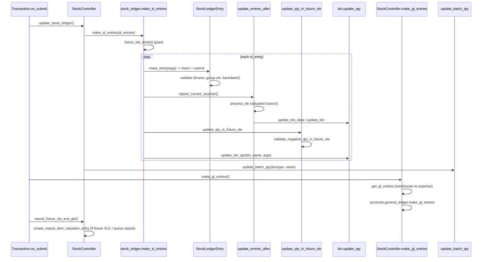
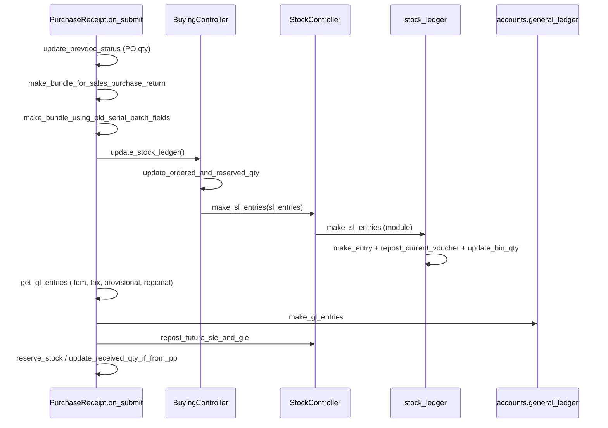
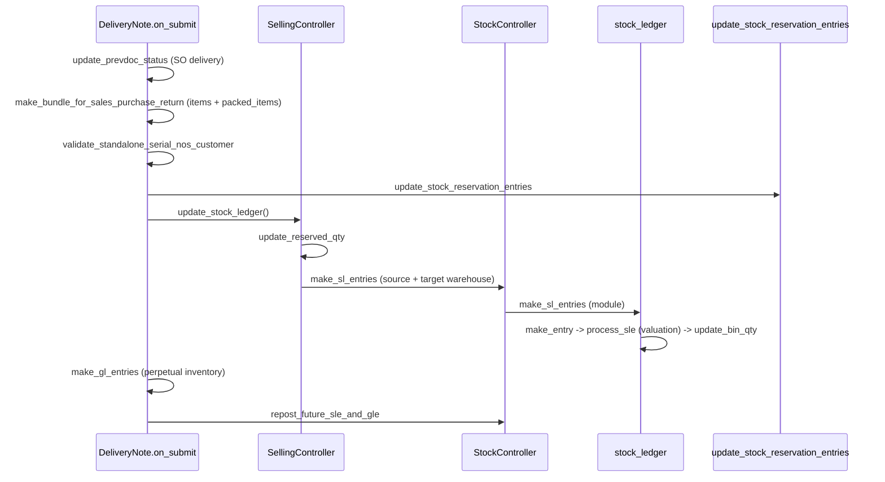
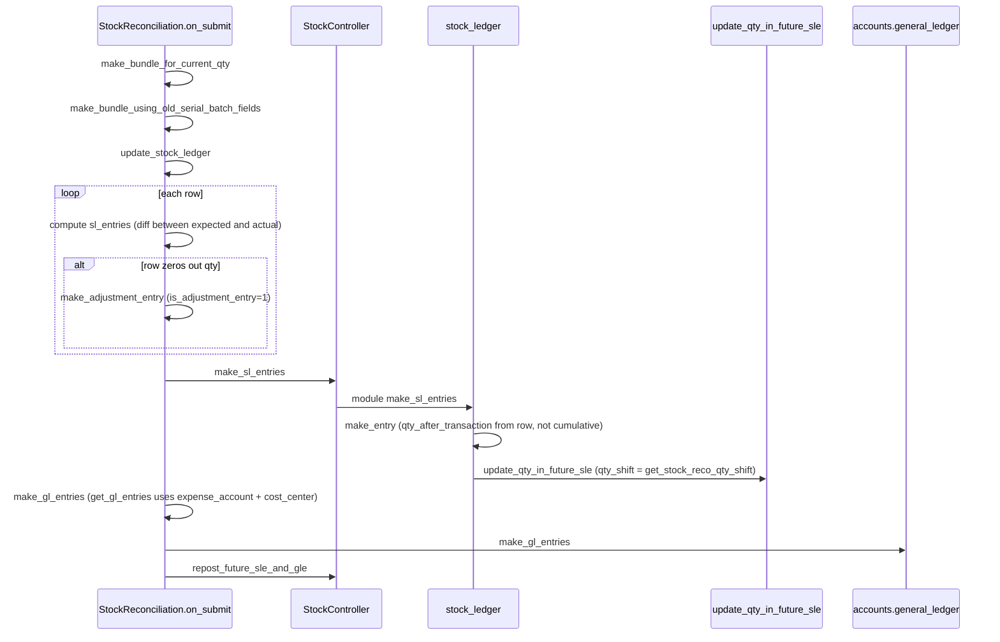

# Stock Flow

> **TL;DR:** Every stock movement is projected into one row of `Stock Ledger Entry` (SLE) per item/warehouse. `StockController.make_sl_entries` batches entries, hands them to the module-level `stock_ledger.make_sl_entries`, which inserts the SLE via `make_entry`, then re-projects running balances through `update_entries_after.process_sle` (valuation by method), walks forward future SLEs through `update_qty_in_future_sle`, and finally snaps the `Bin` with `update_bin_qty`. For perpetual-inventory companies, `StockController.make_gl_entries` calls `StockController.get_gl_entries` afterwards to translate each SLE's `stock_value_difference` into a paired warehouse/expense GL row. Backdated postings trigger `repost_future_sle_and_gle`, which enqueues a `Repost Item Valuation` job.

## Key files

- [stock_controller.py](erpnext/controllers/stock_controller.py:1232) — `StockController.make_sl_entries` facade called by every transaction `update_stock_ledger`.
- [stock_ledger.py](erpnext/stock/stock_ledger.py:57) — module-level `make_sl_entries`: cancellation inversion, negative-stock gate, future-SLE validator, per-row dispatch.
- [stock_ledger.py](erpnext/stock/stock_ledger.py:119) — `repost_current_voucher`: wraps the current voucher's SLE through `update_entries_after` and `update_qty_in_future_sle`.
- [stock_ledger.py](erpnext/stock/stock_ledger.py:197) — `make_entry`: inserts the SLE document (ignore_permissions, submit).
- [stock_ledger.py](erpnext/stock/stock_ledger.py:448) — `update_entries_after`: per-(item, warehouse) valuation re-projection; the core of all valuation math.
- [stock_ledger.py](erpnext/stock/stock_ledger.py:838) — `process_sle`: valuation branch dispatch (serial, batch, FIFO/LIFO queue, Moving Average).
- [stock_ledger.py](erpnext/stock/stock_ledger.py:1760) — `update_bin`: snap `Bin.actual_qty`, `stock_value`, `valuation_rate` per (item, warehouse) after reposting.
- [stock_ledger.py](erpnext/stock/stock_ledger.py:2075) — `update_qty_in_future_sle`: shift `qty_after_transaction` in all subsequent SLEs by `qty_shift`, bounded by next Stock Reconciliation.
- [stock_ledger.py](erpnext/stock/stock_ledger.py:2195) — `validate_negative_qty_in_future_sle`: `NegativeStockError` gate applied after the qty shift.
- [stock_ledger.py](erpnext/stock/stock_ledger.py:214) — `repost_future_sle`: background entry point used by `Repost Item Valuation`.
- [stock_controller.py](erpnext/controllers/stock_controller.py:1745) — `StockController.repost_future_sle_and_gle`: enqueues a `Repost Item Valuation` when future SLEs exist.
- [stock_controller.py](erpnext/controllers/stock_controller.py:685) — `StockController.get_gl_entries`: perpetual-inventory GL bridge — warehouse account debit, expense account credit, rounding diff for internal transfers.
- [stock_controller.py](erpnext/controllers/stock_controller.py:256) — `StockController.make_gl_entries`: runs `get_gl_entries` then `make_gl_entries` from `accounts.general_ledger`.
- [stock_controller.py](erpnext/controllers/stock_controller.py:1344) — `make_gl_entries_on_cancel`: reverse GL via `make_reverse_gl_entries`.
- [stock_controller.py](erpnext/controllers/stock_controller.py:1023) — `get_sl_entries`: builds one SLE dict from an item row; called from every `update_stock_ledger`.
- [valuation.py](erpnext/stock/valuation.py:55) — `FIFOValuation` queue; [`LIFOValuation`](erpnext/stock/valuation.py:162) stack.
- [serial_batch_bundle.py](erpnext/stock/serial_batch_bundle.py:624) — `SerialNoValuation`; [`BatchNoValuation`](erpnext/stock/serial_batch_bundle.py:792); [`SerialBatchBundle`](erpnext/stock/serial_batch_bundle.py:17) (post-SLE side-effects on Serial/Batch masters).
- [bin.py](erpnext/stock/doctype/bin/bin.py:260) — `update_qty`: final snap of `Bin.actual_qty`/`projected_qty`/reservation columns.
- [stock_ledger_entry.py](erpnext/stock/doctype/stock_ledger_entry/stock_ledger_entry.py:86) — `StockLedgerEntry.validate`: stock-frozen date, group-warehouse guard, backdated-entry auth.

## Entry points into the flow

Every transaction ends up in `StockController.make_sl_entries`. The immediate callers:

| Caller | Method | Line |
|---|---|---|
| Purchase Receipt `on_submit` | `BuyingController.update_stock_ledger` | [buying_controller.py:736](erpnext/controllers/buying_controller.py:736) |
| Delivery Note / Sales Invoice (with `update_stock`) `on_submit` | `SellingController.update_stock_ledger` | [selling_controller.py:661](erpnext/controllers/selling_controller.py:661) |
| Stock Entry `on_submit` | `StockEntry.update_stock_ledger` | [stock_entry.py:1808](erpnext/stock/doctype/stock_entry/stock_entry.py:1808) |
| Stock Reconciliation `on_submit` | `StockReconciliation.update_stock_ledger` | [stock_reconciliation.py:745](erpnext/stock/doctype/stock_reconciliation/stock_reconciliation.py:745) |
| Stock Reconciliation `on_cancel` | `StockReconciliation.make_sle_on_cancel` | [stock_reconciliation.py:928](erpnext/stock/doctype/stock_reconciliation/stock_reconciliation.py:928) |

All of these accumulate a list of `sl_entries` dicts (each built by `StockController.get_sl_entries`) and call `self.make_sl_entries(sl_entries, allow_negative_stock=...)` ([stock_controller.py:1232](erpnext/controllers/stock_controller.py:1232)).

## Diagram — submit path



Reference: `on_submit` ordering for Purchase Receipt ([purchase_receipt.py:385](erpnext/stock/doctype/purchase_receipt/purchase_receipt.py:385)), Delivery Note ([delivery_note.py:466](erpnext/stock/doctype/delivery_note/delivery_note.py:466)), Stock Entry ([stock_entry.py:445](erpnext/stock/doctype/stock_entry/stock_entry.py:445)), Stock Reconciliation ([stock_reconciliation.py:108](erpnext/stock/doctype/stock_reconciliation/stock_reconciliation.py:108)).

## Inside `stock_ledger.make_sl_entries`

Steps, in order ([stock_ledger.py:57](erpnext/stock/stock_ledger.py:57)):

1. **Cancellation normalization** — if `sl_entries[0].is_cancelled` then `validate_cancellation` ([line 160](erpnext/stock/stock_ledger.py:160)) checks there is no in-flight `Repost Item Valuation`, and `set_as_cancel` ([line 188](erpnext/stock/stock_ledger.py:188)) flips `is_cancelled=1` on already-posted SLEs via raw SQL. Each entry's `actual_qty` is then negated and its `incoming_rate`/`outgoing_rate` is back-filled from `get_incoming_outgoing_rate_for_cancel` ([utils.py:513](erpnext/stock/utils.py:513)).
2. **Future-SLE guard** — `future_sle_exists(args, sl_entries)` ([stock_controller.py:2178](erpnext/controllers/stock_controller.py:2178)) scans for conflicting future entries and raises if any are pending (these are handled by reposting, not by the current voucher).
3. **Per-row loop** — for each `sle` dict:
   - `make_entry` ([line 197](erpnext/stock/stock_ledger.py:197)) does `frappe.get_doc(...).submit()` on a `Stock Ledger Entry`. `SerialBatchBundle` post-processing is triggered from `StockLedgerEntry.on_submit` ([stock_ledger_entry.py:174](erpnext/stock/doctype/stock_ledger_entry/stock_ledger_entry.py:174)).
   - `get_or_make_bin` ([utils.py:216](erpnext/stock/utils.py:216)) ensures `Bin(item_code, warehouse)` exists before projection.
   - `repost_current_voucher` ([line 119](erpnext/stock/stock_ledger.py:119)) calls `update_entries_after` to compute `qty_after_transaction`, `valuation_rate`, `stock_value`, `stock_value_difference` for the freshly inserted SLE, then `update_qty_in_future_sle` to shift subsequent balances.
   - `update_bin_qty` ([bin.py:260](erpnext/stock/doctype/bin/bin.py:260)) snaps `Bin` columns.
4. Non-stock items are skipped with a `msgprint` ([line 114](erpnext/stock/stock_ledger.py:114)).

After the loop, the transaction's `make_sl_entries` wrapper ([stock_controller.py:1232](erpnext/controllers/stock_controller.py:1232)) calls `update_batch_qty` on the bundle and `validate_reserved_batches` ([stock_controller.py:1243](erpnext/controllers/stock_controller.py:1243)).

## Valuation branches in `process_sle`

`update_entries_after.process_sle` ([stock_ledger.py:838](erpnext/stock/stock_ledger.py:838)) dispatches on item / entry type:

| Condition | Method | Notes |
|---|---|---|
| `sle.serial_and_batch_bundle` | `calculate_valuation_for_serial_batch_bundle` ([line 1084](erpnext/stock/stock_ledger.py:1084)) | Delegates to `SerialNoValuation` / `BatchNoValuation` in [serial_batch_bundle.py:624](erpnext/stock/serial_batch_bundle.py:624). |
| Legacy `sle.serial_no` on a reposted SLE | `get_serialized_values` ([line 1013](erpnext/stock/stock_ledger.py:1013)) | Weighted average across serial-no purchase rates. |
| `sle.batch_no` with `Batch.use_batchwise_valuation` | `update_batched_values` ([line 1628](erpnext/stock/stock_ledger.py:1628)) | Uses `BatchNoValuation.get_incoming_rate` as outgoing rate. |
| Stock Reconciliation (non-batch, no dimensions) | inline assertion | Sets `valuation_rate`, `qty_after_transaction`, `stock_queue = [[qty, rate]]`. |
| Item's valuation method = `Moving Average` | `get_moving_average_values` ([line 1532](erpnext/stock/stock_ledger.py:1532)) | Weighted running average. |
| Item's valuation method = `FIFO` / `LIFO` | `update_queue_values` ([line 1571](erpnext/stock/stock_ledger.py:1571)) | Uses `FIFOValuation` queue or `LIFOValuation` stack from [valuation.py:55](erpnext/stock/valuation.py:55). |

Valuation method is resolved per (item, company) by `get_valuation_method` ([utils.py:352](erpnext/stock/utils.py:352)).

After valuation, `process_sle` writes `qty_after_transaction`, `valuation_rate`, `stock_value`, `stock_queue`, and `stock_value_difference` back into the SLE with `db_update()` ([line 993](erpnext/stock/stock_ledger.py:993)). If the SLE is an adjustment entry that zeros out qty, `stock_value_difference` is recomputed from `get_stock_value_difference` ([line 2420](erpnext/stock/stock_ledger.py:2420)).

### FIFO / LIFO queue mechanics

- `FIFOValuation.add_stock` ([valuation.py:78](erpnext/stock/valuation.py:78)) appends `[qty, rate]`; merges bins sharing the same rate.
- `FIFOValuation.remove_stock` ([valuation.py:102](erpnext/stock/valuation.py:102)) consumes from the front. If the queue goes negative, it keeps a single `[-qty, outgoing_rate]` bin — this is how ERPNext represents negative stock without losing valuation continuity.
- `LIFOValuation` ([valuation.py:162](erpnext/stock/valuation.py:162)) is the same data structure but consumes from the end.
- `round_off_if_near_zero` ([valuation.py:260](erpnext/stock/valuation.py:260)) collapses rounding noise below `1/10^precision`.

### Serial / Batch valuation

`SerialNoValuation.calculate_stock_value_change` ([serial_batch_bundle.py:632](erpnext/stock/serial_batch_bundle.py:632)) reads per-serial purchase rates. `BatchNoValuation.calculate_avg_rate` ([serial_batch_bundle.py:804](erpnext/stock/serial_batch_bundle.py:804)) keeps a per-batch moving average based on the batch's stock ledger history. Both are called from `calculate_valuation_for_serial_batch_bundle` ([stock_ledger.py:1084](erpnext/stock/stock_ledger.py:1084)) — so Serial and Batch Bundle is the canonical valuation path; `get_serialized_values` and the old batch paths exist only for legacy SLEs.

## Negative-stock validation

Two gates:

1. **Pre-insert**, inside `process_sle`, `validate_negative_stock` ([stock_ledger.py:1204](erpnext/stock/stock_ledger.py:1204)) is called when the item is serialized or `allow_negative_stock` is false. On failure it populates `self.exceptions` and skips the row; accumulated exceptions are raised by `raise_exceptions` ([line 1702](erpnext/stock/stock_ledger.py:1702)) after the loop.
2. **Post-projection**, `update_qty_in_future_sle` ([line 2075](erpnext/stock/stock_ledger.py:2075)) shifts future `qty_after_transaction` by `qty_shift` and then `validate_negative_qty_in_future_sle` ([line 2195](erpnext/stock/stock_ledger.py:2195)) scans for any future SLE whose balance is now negative using `get_future_sle_with_negative_qty` ([line 2259](erpnext/stock/stock_ledger.py:2259)) / `get_future_sle_with_negative_batch_qty` ([line 2281](erpnext/stock/stock_ledger.py:2281)). `is_negative_with_precision` ([line 2243](erpnext/stock/stock_ledger.py:2243)) rounds to default float precision to avoid spurious `-0.0001` failures. On a true deficit, raises `NegativeStockError` ([line 49](erpnext/stock/stock_ledger.py:49)).

Reserved stock conflicts raise separately via `validate_reserved_stock` ([line 2307](erpnext/stock/stock_ledger.py:2307)), `validate_reserved_serial_nos` ([line 2324](erpnext/stock/stock_ledger.py:2324)), `validate_reserved_batch_nos` ([line 2340](erpnext/stock/stock_ledger.py:2340)).

`is_negative_stock_allowed` ([line 2369](erpnext/stock/stock_ledger.py:2369)) short-circuits when the item or Stock Settings allow it.

## `update_qty_in_future_sle` — shifting running balances

When a new SLE is inserted (or an existing one cancelled), every SLE for the same (item, warehouse) after the posting datetime needs its `qty_after_transaction` bumped. `update_qty_in_future_sle` ([line 2075](erpnext/stock/stock_ledger.py:2075)) runs a single raw SQL:

```
UPDATE `tabStock Ledger Entry`
SET qty_after_transaction = qty_after_transaction + <qty_shift>
WHERE item_code = %s AND warehouse = %s AND is_cancelled = 0
  AND posting_datetime > %s
  <AND datetime_limit_condition>
```

The `datetime_limit_condition` is computed by `get_datetime_limit_condition` ([line 2182](erpnext/stock/stock_ledger.py:2182)) after `get_next_stock_reco` ([line 2141](erpnext/stock/stock_ledger.py:2141)) — future shifts stop at the next Stock Reconciliation, because the reconciliation itself overrides the balance.

For Stock Reconciliation vouchers, `qty_shift` is computed specially by `get_stock_reco_qty_shift` ([line 2111](erpnext/stock/stock_ledger.py:2111)).

## Backdated posting — `repost_future_sle_and_gle`

Every transaction's `on_submit` and `on_cancel` end with `self.repost_future_sle_and_gle()` ([stock_controller.py:1745](erpnext/controllers/stock_controller.py:1745)). If `future_sle_exists` is true, `docstatus == 2`, or `repost_required_for_queue` ([line 2079](erpnext/controllers/stock_controller.py:2079)) detects a FIFO/LIFO queue rewrite is needed:

- `Stock Reposting Settings.item_based_reposting` → `create_item_wise_repost_entries` ([stock_controller.py:2297](erpnext/controllers/stock_controller.py:2297)) creates one `Repost Item Valuation` per (item, warehouse).
- Otherwise → `create_repost_item_valuation_entry` ([stock_controller.py:2276](erpnext/controllers/stock_controller.py:2276)) creates one per voucher.

`Repost Item Valuation` is picked up by the scheduler's `run_parallel_reposting` (every 30 min) and `repost_entries` (hourly maintenance) — registered at [hooks.py:438](erpnext/hooks.py:438) and [hooks.py:453](erpnext/hooks.py:453). Its `repost_sl_entries` ([repost_item_valuation.py:450](erpnext/stock/doctype/repost_item_valuation/repost_item_valuation.py:450)) calls `repost_future_sle` ([stock_ledger.py:214](erpnext/stock/stock_ledger.py:214)) to iterate all SLEs after the pivot and re-run `update_entries_after`. `repost_gl_entries` ([repost_item_valuation.py:477](erpnext/stock/doctype/repost_item_valuation/repost_item_valuation.py:477)) then re-posts affected stock vouchers' GL via `repost_gle_for_stock_vouchers` (in `accounts.general_ledger`).

See [patterns/patches.md](../patterns/patches.md) and [flows/accounting-flow.md](accounting-flow.md) for how this interacts with accounts.

## Perpetual GL bridge — `StockController.get_gl_entries`

When `erpnext.is_perpetual_inventory_enabled(company)` (or the doc has fixed assets, or provisional accounting is enabled), `StockController.make_gl_entries` ([stock_controller.py:256](erpnext/controllers/stock_controller.py:256)) builds the GL list via `get_gl_entries` ([line 685](erpnext/controllers/stock_controller.py:685)):

1. `get_stock_ledger_details` ([line 882](erpnext/controllers/stock_controller.py:882)) groups SLEs by `voucher_detail_no`.
2. For each item row, for each SLE:
   - Look up the warehouse inventory account via `get_inventory_account_dict` ([line 216](erpnext/controllers/stock_controller.py:216)). For companies with `enable_item_wise_inventory_account`, it's per-(item) via `get_item_wise_inventory_account_map` ([line 201](erpnext/controllers/stock_controller.py:201)); otherwise from `erpnext.stock.get_warehouse_account_map` ([stock/__init__.py:19](erpnext/stock/__init__.py:19)).
   - **Debit** the warehouse account with `sle.stock_value_difference`.
   - **Credit** the expense account (`target_warehouse` account for internal transfers, else `item.expense_account`) with the same amount.
3. **Rounding diff for internal transfers** ([line 759](erpnext/controllers/stock_controller.py:759)): after summing per-item SLE `stock_value_difference`s, if the net is non-zero (above `1/10^precision`) and `is_internal_transfer()` is true, a compensating entry is booked against `Company.default_expense_account` with remark `Rounding gain/loss Entry for Stock Transfer`. This reconciles the outgoing and incoming legs of a same-company transfer when their valuations drift.
4. `process_gl_map` ([accounts.general_ledger](erpnext/accounts/general_ledger.py)) merges and rounds; `precision` comes from `get_debit_field_precision` ([line 824](erpnext/controllers/stock_controller.py:824)).

Purchase Receipt overrides `get_gl_entries` ([purchase_receipt.py:496](erpnext/stock/doctype/purchase_receipt/purchase_receipt.py:496)) to add tax GL, provisional accounting, and `update_regional_gl_entries` — see [flows/accounting-flow.md](accounting-flow.md) for the GL write side.

## Diagram — Purchase Receipt submit



Reference: [purchase_receipt.py:385-409](erpnext/stock/doctype/purchase_receipt/purchase_receipt.py:385), [buying_controller.py:736](erpnext/controllers/buying_controller.py:736).

## Diagram — Delivery Note submit



Reference: [delivery_note.py:466-498](erpnext/stock/doctype/delivery_note/delivery_note.py:466), [selling_controller.py:661](erpnext/controllers/selling_controller.py:661). For returns, source/target ordering flips — see the `is_return` branches at [selling_controller.py:676](erpnext/controllers/selling_controller.py:676).

## Diagram — Stock Reconciliation submit



Reference: [stock_reconciliation.py:108-126](erpnext/stock/doctype/stock_reconciliation/stock_reconciliation.py:108), [stock_reconciliation.py:745](erpnext/stock/doctype/stock_reconciliation/stock_reconciliation.py:745), adjustment at [stock_reconciliation.py:814](erpnext/stock/doctype/stock_reconciliation/stock_reconciliation.py:814), `get_gl_entries` override at [stock_reconciliation.py:973](erpnext/stock/doctype/stock_reconciliation/stock_reconciliation.py:973).

Notable: Stock Reconciliation writes `qty_after_transaction` directly on the SLE (not incrementally). `get_stock_reco_qty_shift` ([stock_ledger.py:2111](erpnext/stock/stock_ledger.py:2111)) computes the delta between the reco balance and the previous SLE balance, and that delta is what shifts downstream SLEs. Cancelling a reco uses the preserved `previous_qty_after_transaction` to reverse the shift.

## Diagram — cancel path

```mermaid
sequenceDiagram
    participant Doc as Transaction.on_cancel
    participant SC as StockController
    participant SL as stock_ledger
    participant GL as accounts.general_ledger

    Doc->>SC: update_stock_ledger (docstatus=2)
    SC->>SC: get_sl_entries with actual_qty negated (-1 * stock_qty)
    SC->>SL: make_sl_entries(is_cancelled=1)
    SL->>SL: validate_cancellation (no in-flight RIV)
    SL->>SL: set_as_cancel (raw SQL flag)
    loop each sle
      SL->>SL: invert actual_qty; backfill in/out rate from get_incoming_outgoing_rate_for_cancel
      SL->>SL: make_entry + repost_current_voucher + update_bin_qty
    end
    Doc->>SC: make_gl_entries_on_cancel
    SC->>GL: make_reverse_gl_entries (voucher_type, voucher_no)
    Doc->>SC: repost_future_sle_and_gle (force=True when docstatus==2)
    Doc->>Doc: delete_auto_created_batches
    Doc->>Doc: set ignore_linked_doctypes (GL Entry, SLE, RIV, SABB)
```

Reference: cancellation inversion at [stock_ledger.py:80-93](erpnext/stock/stock_ledger.py:80); `set_as_cancel` SQL at [stock_ledger.py:188](erpnext/stock/stock_ledger.py:188); `make_gl_entries_on_cancel` at [stock_controller.py:1344](erpnext/controllers/stock_controller.py:1344); `ignore_linked_doctypes` at [purchase_receipt.py:478](erpnext/stock/doctype/purchase_receipt/purchase_receipt.py:478), [delivery_note.py:520](erpnext/stock/doctype/delivery_note/delivery_note.py:520), [stock_entry.py:489](erpnext/stock/doctype/stock_entry/stock_entry.py:489), [stock_reconciliation.py:117](erpnext/stock/doctype/stock_reconciliation/stock_reconciliation.py:117).

Ledger immutability: `GL Entry`, `Stock Ledger Entry`, `Payment Ledger Entry`, `Advance Payment Ledger Entry`, `Account Closing Balance` are in `auto_cancel_exempted_doctypes` ([hooks.py:418](erpnext/hooks.py:418)). Cancel never deletes SLEs — it flips `is_cancelled=1` and creates compensating entries with inverted `actual_qty`.

## `StockLedgerEntry` validation gates

At insert (`make_entry`) `StockLedgerEntry.validate` ([stock_ledger_entry.py:86](erpnext/stock/doctype/stock_ledger_entry/stock_ledger_entry.py:86)) runs:

- `set_posting_datetime` — combines `posting_date + posting_time` via `get_combine_datetime` ([utils.py:661](erpnext/stock/utils.py:661)).
- `validate_mandatory` — all five of warehouse/posting_date/voucher_type/voucher_no/company required.
- `validate_batch` — blocks expired batch posting outside sales/purchase contexts ([line 278](erpnext/stock/doctype/stock_ledger_entry/stock_ledger_entry.py:278)).
- `validate_disabled_warehouse` + `validate_warehouse_company` ([utils.py:408](erpnext/stock/utils.py:408)).
- `validate_and_set_fiscal_year` — reuses `accounts.utils.get_fiscal_year`.
- `block_transactions_against_group_warehouse` — calls `is_group_warehouse` ([utils.py:417](erpnext/stock/utils.py:417)).
- `validate_with_last_transaction_posting_time` — backdated entries limited to the role in `Stock Settings.role_allowed_to_create_edit_back_dated_transactions`; raises `BackDatedStockTransaction` ([line 24](erpnext/stock/doctype/stock_ledger_entry/stock_ledger_entry.py:24)).
- `validate_inventory_dimension_negative_stock` — per-dimension pre-sum guard for dimensions with `validate_negative_stock=1`; raises `InventoryDimensionNegativeStockError` ([line 28](erpnext/stock/doctype/stock_ledger_entry/stock_ledger_entry.py:28)).

`on_submit` ([line 174](erpnext/stock/doctype/stock_ledger_entry/stock_ledger_entry.py:174)): `check_stock_frozen_date` ([line 246](erpnext/stock/doctype/stock_ledger_entry/stock_ledger_entry.py:246)) against `Stock Settings.stock_frozen_upto`/`stock_frozen_upto_days`; invokes `SerialBatchBundle(sle=...)` ([serial_batch_bundle.py:17](erpnext/stock/serial_batch_bundle.py:17)) which triggers bundle post-processing, serial-no status updates, batch qty refresh.

`on_cancel` forbids direct cancellation ([line 345](erpnext/stock/doctype/stock_ledger_entry/stock_ledger_entry.py:345)) — SLEs are only marked cancelled through voucher-level cancellation.

## Bin update

`Bin` is the pre-aggregated per-(item, warehouse) cache. Written in three places:

- `update_entries_after.update_bin` ([stock_ledger.py:1760](erpnext/stock/stock_ledger.py:1760)) — from reposting: writes `actual_qty`, `stock_value`, `valuation_rate` for every warehouse seen during the reposting walk.
- `update_qty` in [bin.py:260](erpnext/stock/doctype/bin/bin.py:260) — called from `stock_ledger.make_sl_entries` after each SLE insert to bump `ordered_qty`/`reserved_qty`/`indented_qty`/`planned_qty` and recompute `projected_qty`. Uses `get_actual_qty` ([bin.py:303](erpnext/stock/doctype/bin/bin.py:303)) (last SLE's `qty_after_transaction`) when backdated.
- `Bin.before_save` ([bin.py:61](erpnext/stock/doctype/bin/bin.py:61)) — `set_projected_qty` recomputes `projected_qty = actual + ordered + indented + planned - reserved - reserved_for_production - reserved_for_subcontract - reserved_for_production_plan`.

Uniqueness enforced at the DB level by `Bin.on_doctype_update` ([bin.py:238](erpnext/stock/doctype/bin/bin.py:238)) which adds `unique(item_code, warehouse)`.

## Return entries

- Purchase returns / sales returns use the same controller chain but with `is_return=1`. Selling-side source/target ordering flips inside `SellingController.update_stock_ledger` ([selling_controller.py:676-689](erpnext/controllers/selling_controller.py:676)). Buying-side flips in `BuyingController.update_stock_ledger` ([buying_controller.py:749-798](erpnext/controllers/buying_controller.py:749)).
- Serial-batch bundles for returns are created by `make_bundle_for_sales_purchase_return` ([stock_controller.py:407](erpnext/controllers/stock_controller.py:407)) calling into `sales_and_purchase_return.make_serial_batch_bundle_for_return`.
- Outgoing rate for return rows is taken from the original voucher by `get_rate_for_return` (selling) / branch in `BuyingController.update_stock_ledger`.

## Internal transfers (same-company)

Trigger: `is_internal_customer=1` / `is_internal_supplier=1` on the transaction. Behaviours:

- `StockController.validate_internal_transfer` ([stock_controller.py:1522](erpnext/controllers/stock_controller.py:1522)) forces multi-currency = company currency, requires `target_warehouse` (Sales side) or `from_warehouse` (Purchase side), blocks packed items, and — on `docstatus == 1` with `is_internal_supplier` — runs `validate_internal_transfer_qty` ([line 1567](erpnext/controllers/stock_controller.py:1567)) to cap received qty against transferred qty from the paired document.
- The warehouse asset account and the expense account coincide (target warehouse account on the receiver side, source warehouse account on the sender side). Any residual `stock_value_difference` after pairing is posted to `Company.default_expense_account` as rounding gain/loss — see `get_gl_entries` rounding-diff branch at [stock_controller.py:759](erpnext/controllers/stock_controller.py:759).
- Incoming rate for an internal transfer purchase side comes from `get_incoming_rate_for_inter_company_transfer` ([stock_ledger.py:2377](erpnext/stock/stock_ledger.py:2377)) — it reads the source-side SLE's valuation rate.

## Stock reservation interaction

Stock Reservation Entry is an optional feature gated by `Stock Settings.enable_stock_reservation`.

- `update_entries_after.get_reserved_stock` ([stock_ledger.py:505](erpnext/stock/stock_ledger.py:505)) aggregates `reserved_qty - (delivered + transferred + consumed)` at the posting datetime and is checked during negative-stock messages.
- `StockController.validate_reserved_batches` ([stock_controller.py:1243](erpnext/controllers/stock_controller.py:1243)) runs for Delivery Note / Sales Invoice / Stock Entry on `make_sl_entries` completion and blocks batch reuse across concurrent reserved vouchers.
- `SellingController` and `StockEntry` call `update_stock_reservation_entries` ([stock_controller.py:1811](erpnext/controllers/stock_controller.py:1811)) to decrement `delivered_qty` / `transferred_qty` / `consumed_qty` on the matching SREs.

See [modules/stock-doctypes.md](../modules/stock-doctypes.md) for the Stock Reservation Entry reference card.

## Related

- [Controller hierarchy](../architecture/controllers.md) — how `StockController` sits between `AccountsController` and `SellingController` / `BuyingController`.
- [DocType lifecycle](../architecture/doctype-lifecycle.md) — which methods `validate`/`on_submit`/`on_cancel` call in what order.
- [Accounting flow](accounting-flow.md) — the GL side of `make_gl_entries`.
- [Stock module overview](../modules/stock.md) — directory layout and cross-cutting concerns.
- [Stock DocType cards](../modules/stock-doctypes.md) — per-doctype reference.
- [Patches](../patterns/patches.md) — how SLE / GL reposting migrations are sequenced.

## Changelog

- `2026-04-17` — initial version.
