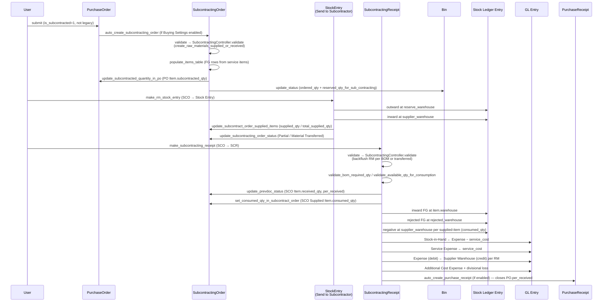
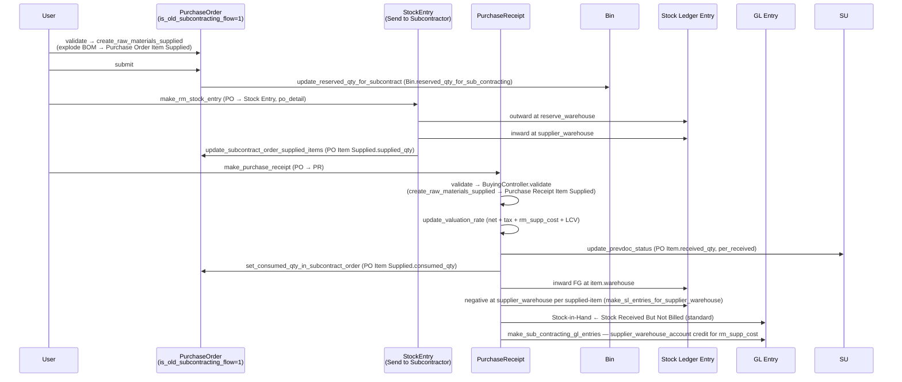
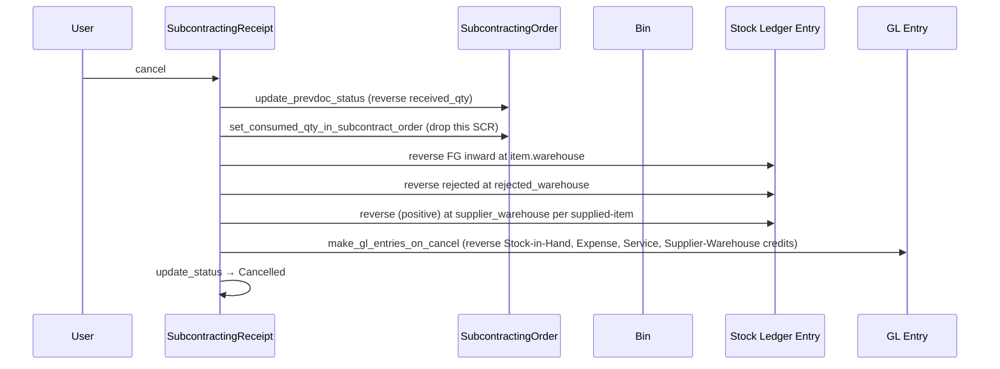
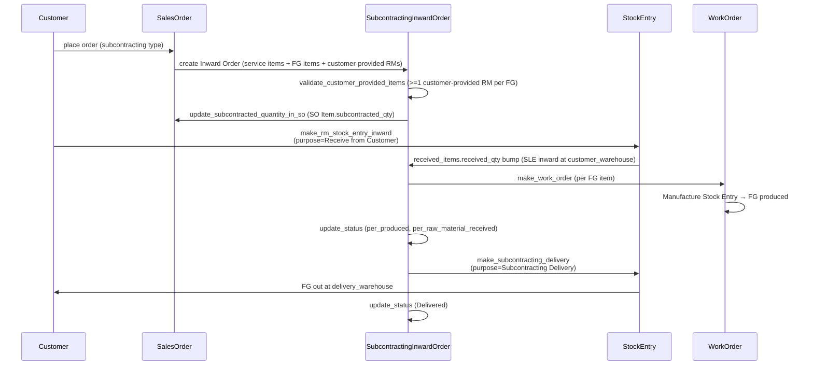

# Subcontracting Flow: Two coexisting pipelines (legacy PO/PR + new SCO/SCR)

> **TL;DR:** ERPNext v15+ ships **two** subcontracting pipelines that coexist. The **legacy flow** (`is_old_subcontracting_flow=1`) embeds raw-material tracking directly on `Purchase Order` / `Purchase Receipt` via `Purchase Order Item Supplied` + `Purchase Receipt Item Supplied` child tables; the FG and its supplied-items cost resolve inside `PurchaseReceipt`'s stock + GL write path. The **new flow** (`is_old_subcontracting_flow=0`) separates the service/cost contract (PO) from the execution document (`Subcontracting Order` → `Subcontracting Receipt`) and uses its own `Subcontracting Order Supplied Item` / `Subcontracting Receipt Supplied Item` children, driven by the shared [SubcontractingController](../../erpnext/controllers/subcontracting_controller.py:26) that sits between `StockController` and `BuyingController`. Raw-material movement to the supplier is **always** a `Stock Entry` with `purpose="Send to Subcontractor"`. A third branch, **Subcontracting Inward Order** (customer-provided inward subcontracting), mirrors the new flow for the subcontractor side via [SubcontractingInwardController](../../erpnext/controllers/subcontracting_inward_controller.py:1).

## Scope of this document

This page threads the two subcontracting cascades end-to-end. For overlapping subsystems, cross-link:

- `BuyingController.validate` / PR SLE + GL base path → [flows/buying-flow.md](./buying-flow.md).
- SLE writer (`update_stock_ledger`) and Bin updates → [flows/stock-flow.md](./stock-flow.md).
- GL composition at SCR / PR submit (Stock In Hand ← Expense, supplier-warehouse credit, service cost, divisional loss, LCV, additional cost) → [flows/accounting-flow.md](./accounting-flow.md).
- Per-DocType method cards → [modules/subcontracting-doctypes.md](../modules/subcontracting-doctypes.md).
- `SubcontractingController` method-level responsibilities → [modules/subcontracting.md](../modules/subcontracting.md).
- Controller inheritance (`StockController → SubcontractingController → BuyingController`) → [architecture/controllers.md](../architecture/controllers.md).

## Key files

- [subcontracting_controller.py](../../erpnext/controllers/subcontracting_controller.py:26) — shared base for legacy + new subcontracting; `subcontract_data` dispatch at [:27](../../erpnext/controllers/subcontracting_controller.py:27), `validate` at [:67](../../erpnext/controllers/subcontracting_controller.py:67), BOM explosion at [:573](../../erpnext/controllers/subcontracting_controller.py:573), `create_raw_materials_supplied_or_received` at [:1112](../../erpnext/controllers/subcontracting_controller.py:1112), `update_stock_ledger` at [:1197](../../erpnext/controllers/subcontracting_controller.py:1197), `make_rm_stock_entry` at [:1381](../../erpnext/controllers/subcontracting_controller.py:1381), `get_materials_from_supplier` at [:1572](../../erpnext/controllers/subcontracting_controller.py:1572).
- [subcontracting_inward_controller.py](../../erpnext/controllers/subcontracting_inward_controller.py:1) — parallel controller for the customer-provided inward subcontracting flow.
- [subcontracting_order.py](../../erpnext/subcontracting/doctype/subcontracting_order/subcontracting_order.py:20) — new-flow execution order: `validate` at [:116](../../erpnext/subcontracting/doctype/subcontracting_order/subcontracting_order.py:116), `on_submit` at [:125](../../erpnext/subcontracting/doctype/subcontracting_order/subcontracting_order.py:125), `populate_items_table` at [:230](../../erpnext/subcontracting/doctype/subcontracting_order/subcontracting_order.py:230), `update_status` at [:292](../../erpnext/subcontracting/doctype/subcontracting_order/subcontracting_order.py:292), `update_subcontracted_quantity_in_po` at [:326](../../erpnext/subcontracting/doctype/subcontracting_order/subcontracting_order.py:326), `reserve_raw_materials` at [:347](../../erpnext/subcontracting/doctype/subcontracting_order/subcontracting_order.py:347), `make_subcontracting_receipt` mapper at [:433](../../erpnext/subcontracting/doctype/subcontracting_order/subcontracting_order.py:433).
- [subcontracting_receipt.py](../../erpnext/subcontracting/doctype/subcontracting_receipt/subcontracting_receipt.py:28) — new-flow FG receipt: `__init__.status_updater` at [:101](../../erpnext/subcontracting/doctype/subcontracting_receipt/subcontracting_receipt.py:101), `on_submit` at [:164](../../erpnext/subcontracting/doctype/subcontracting_receipt/subcontracting_receipt.py:164), `calculate_items_qty_and_amount` at [:467](../../erpnext/subcontracting/doctype/subcontracting_receipt/subcontracting_receipt.py:467), `validate_bom_required_qty` at [:601](../../erpnext/subcontracting/doctype/subcontracting_receipt/subcontracting_receipt.py:601), `get_gl_entries` at [:701](../../erpnext/subcontracting/doctype/subcontracting_receipt/subcontracting_receipt.py:701), `make_item_gl_entries` at [:713](../../erpnext/subcontracting/doctype/subcontracting_receipt/subcontracting_receipt.py:713), `auto_create_purchase_receipt` at [:954](../../erpnext/subcontracting/doctype/subcontracting_receipt/subcontracting_receipt.py:954), `make_purchase_receipt` mapper at [:984](../../erpnext/subcontracting/doctype/subcontracting_receipt/subcontracting_receipt.py:984).
- [subcontracting_bom.py](../../erpnext/subcontracting/doctype/subcontracting_bom/subcontracting_bom.py:10) — mapping `finished_good → service_item + finished_good_bom`: `validate_finished_good` at [:38](../../erpnext/subcontracting/doctype/subcontracting_bom/subcontracting_bom.py:38), `validate_is_active` at [:70](../../erpnext/subcontracting/doctype/subcontracting_bom/subcontracting_bom.py:70), `get_subcontracting_boms_for_finished_goods` at [:86](../../erpnext/subcontracting/doctype/subcontracting_bom/subcontracting_bom.py:86).
- [subcontracting_inward_order.py](../../erpnext/subcontracting/doctype/subcontracting_inward_order/subcontracting_inward_order.py:14) — customer-provided inward subcontracting: `update_status` at [:80](../../erpnext/subcontracting/doctype/subcontracting_inward_order/subcontracting_inward_order.py:80), `populate_items_table` at [:165](../../erpnext/subcontracting/doctype/subcontracting_inward_order/subcontracting_inward_order.py:165), `make_rm_stock_entry_inward` at [:325](../../erpnext/subcontracting/doctype/subcontracting_inward_order/subcontracting_inward_order.py:325), `make_subcontracting_delivery` at [:429](../../erpnext/subcontracting/doctype/subcontracting_inward_order/subcontracting_inward_order.py:429).
- [purchase_order.py](../../erpnext/buying/doctype/purchase_order/purchase_order.py:196) — PO flags `is_subcontracted` and `is_old_subcontracting_flow`; `validate_fg_item_for_subcontracting` at [:340](../../erpnext/buying/doctype/purchase_order/purchase_order.py:340), legacy `create_raw_materials_supplied` at [:217](../../erpnext/buying/doctype/purchase_order/purchase_order.py:217), `set_service_items_for_finished_goods` at [:601](../../erpnext/buying/doctype/purchase_order/purchase_order.py:601), `auto_create_subcontracting_order` at [:646](../../erpnext/buying/doctype/purchase_order/purchase_order.py:646), `make_subcontracting_order` mapper at [:915](../../erpnext/buying/doctype/purchase_order/purchase_order.py:915), `get_mapped_subcontracting_order` at [:958](../../erpnext/buying/doctype/purchase_order/purchase_order.py:958).
- [purchase_receipt.py](../../erpnext/stock/doctype/purchase_receipt/purchase_receipt.py:677) — legacy-flow GL: `make_sub_contracting_gl_entries` debits nothing / credits `supplier_warehouse` account for `rm_supp_cost`; consumed-qty writeback at [:407](../../erpnext/stock/doctype/purchase_receipt/purchase_receipt.py:407).
- [buying_controller.py](../../erpnext/controllers/buying_controller.py:60) — legacy-flow `validate_for_subcontracting` at [:628](../../erpnext/controllers/buying_controller.py:628), PR/PI `validate` hook triggering `create_raw_materials_supplied` at [:62](../../erpnext/controllers/buying_controller.py:62), valuation-rate formula branch at [:477](../../erpnext/controllers/buying_controller.py:477), `make_sl_entries_for_supplier_warehouse` at [:871](../../erpnext/controllers/buying_controller.py:871).
- [stock_entry.py](../../erpnext/stock/doctype/stock_entry/stock_entry.py:133) — purpose literal includes `Send to Subcontractor`, `Receive from Customer`, `Return Raw Material to Customer`, `Subcontracting Delivery`, `Subcontracting Return`; `update_subcontract_order_supplied_items` at [:3532](../../erpnext/stock/doctype/stock_entry/stock_entry.py:3532), `update_subcontracting_order_status` at [:3731](../../erpnext/stock/doctype/stock_entry/stock_entry.py:3731), `reserve_stock_for_subcontracting` at [:2150](../../erpnext/stock/doctype/stock_entry/stock_entry.py:2150).
- [buying_settings.json](../../erpnext/buying/doctype/buying_settings/buying_settings.json:92) — subcontracting-tab knobs: `backflush_raw_materials_of_subcontract_based_on`, `over_transfer_allowance`, `validate_consumed_qty`, `auto_create_subcontracting_order`, `auto_create_purchase_receipt`.

## Two flows at a glance

| Aspect | Legacy (`is_old_subcontracting_flow=1`) | New (`is_old_subcontracting_flow=0`) |
|---|---|---|
| Service contract | Purchase Order (FG items + BOM, `is_subcontracted=1`) | Purchase Order (service items + `fg_item`, `is_subcontracted=1`) |
| Execution doc | Purchase Receipt | Subcontracting Order → Subcontracting Receipt |
| Supplied-items child table on order | `Purchase Order Item Supplied` ([purchase_order_item_supplied.py:8](../../erpnext/buying/doctype/purchase_order_item_supplied/purchase_order_item_supplied.py:8)) | `Subcontracting Order Supplied Item` ([subcontracting_order_supplied_item.py:8](../../erpnext/subcontracting/doctype/subcontracting_order_supplied_item/subcontracting_order_supplied_item.py:8)) |
| Supplied-items child table on receipt | `Purchase Receipt Item Supplied` ([purchase_receipt_item_supplied.py](../../erpnext/buying/doctype/purchase_receipt_item_supplied/purchase_receipt_item_supplied.py)) | `Subcontracting Receipt Supplied Item` ([subcontracting_receipt_supplied_item.py:8](../../erpnext/subcontracting/doctype/subcontracting_receipt_supplied_item/subcontracting_receipt_supplied_item.py:8)) |
| RM-Stock-Entry `order_field` | `purchase_order` | `subcontracting_order` |
| RM-Stock-Entry rm-detail field | `po_detail` | `sco_rm_detail` |
| Valuation-rate formula | `net + tax + rm_supp_cost + LCV` ([buying_controller.py:478](../../erpnext/controllers/buying_controller.py:478)) | `net + tax + LCV + amount_difference_with_purchase_invoice` ([buying_controller.py:486](../../erpnext/controllers/buying_controller.py:486)) — RM cost handled via SCR supplied-items GL |
| Supplier-warehouse SLE | `make_sl_entries_for_supplier_warehouse` on PR ([buying_controller.py:871](../../erpnext/controllers/buying_controller.py:871)) | `make_sl_entries_for_supplier_warehouse` on SCR ([subcontracting_controller.py:1179](../../erpnext/controllers/subcontracting_controller.py:1179)) |
| Supplier-warehouse GL credit | `make_sub_contracting_gl_entries` on PR ([purchase_receipt.py:677](../../erpnext/stock/doctype/purchase_receipt/purchase_receipt.py:677)) | `make_item_gl_entries` on SCR (supplier-warehouse-account credit block at [subcontracting_receipt.py:794-825](../../erpnext/subcontracting/doctype/subcontracting_receipt/subcontracting_receipt.py:794)) |
| Service cost GL split | Folded into `item.rate` via `rm_supp_cost` | Explicit service-expense credit in SCR GL ([subcontracting_receipt.py:779](../../erpnext/subcontracting/doctype/subcontracting_receipt/subcontracting_receipt.py:779)) |
| Raw-material transfer | Stock Entry `Send to Subcontractor`, `purchase_order` field set | Stock Entry `Send to Subcontractor`, `subcontracting_order` field set |
| Driver flag | `PurchaseOrder.is_old_subcontracting_flow` (sticky at creation) | — (default) |

Both flows share: `SubcontractingController` as the supplied-items orchestrator, the shared `make_rm_stock_entry` at [subcontracting_controller.py:1381](../../erpnext/controllers/subcontracting_controller.py:1381) (parameterised on `order_doctype`), the backflush semantics, supplier-warehouse mechanics, and `validate_rejected_warehouse`.

## `is_old_subcontracting_flow` dispatch (`subcontract_data`)

[SubcontractingController.__init__](../../erpnext/controllers/subcontracting_controller.py:27) decides at object-construction time which set of field names to use for the rest of the lifecycle. It binds `self.subcontract_data` to a `frappe._dict` carrying five keys — `order_doctype`, `order_field`, `rm_detail_field`, `receipt_supplied_items_field`, `order_supplied_items_field` — and three branches:

1. `is_old_subcontracting_flow` → `Purchase Order / purchase_order / po_detail / Purchase Receipt Item Supplied / Purchase Order Item Supplied`.
2. `Subcontracting Inward Order` (customer-provided inward flow) → `Subcontracting Inward Order / subcontracting_inward_order / scio_detail` (no receipt-supplied / order-supplied pair — it uses `received_items`).
3. Default (new outward flow) → `Subcontracting Order / subcontracting_order / sco_rm_detail / Subcontracting Receipt Supplied Item / Subcontracting Order Supplied Item`.

Every downstream method (`__get_transferred_items`, `__get_received_items`, `__get_consumed_items`, `__add_supplied_or_received_item`, `update_ordered_and_reserved_qty`, etc.) pulls the field names off `subcontract_data`, so the two flows share the core supplied-items machinery.

## New flow — end-to-end

### 1. Purchase Order with `is_subcontracted=1`

Precondition: `Item.is_sub_contracted_item=1` on each FG item; a `Subcontracting BOM` (or the Item's `default_bom`) is active for each FG.

- PO items carry `fg_item` (the finished good) + `item_code` (the service item, resolved via `set_service_items_for_finished_goods` at [purchase_order.py:601](../../erpnext/buying/doctype/purchase_order/purchase_order.py:601)). The service item must be non-stock ([subcontracting_bom.py:58](../../erpnext/subcontracting/doctype/subcontracting_bom/subcontracting_bom.py:58)).
- `validate_fg_item_for_subcontracting` at [purchase_order.py:340](../../erpnext/buying/doctype/purchase_order/purchase_order.py:340) enforces that each row carries a valid `fg_item` with a BOM.
- `can_update_items` at [purchase_order.py:620](../../erpnext/buying/doctype/purchase_order/purchase_order.py:620) blocks PO-item edits once a non-cancelled Subcontracting Order exists.

### 2. Purchase Order → Subcontracting Order

Two trigger paths:

- **Automatic**: `PurchaseOrder.on_submit` ([purchase_order.py:451](../../erpnext/buying/doctype/purchase_order/purchase_order.py:451)) calls `auto_create_subcontracting_order` ([:646](../../erpnext/buying/doctype/purchase_order/purchase_order.py:646)) which, gated by `Buying Settings.auto_create_subcontracting_order`, invokes the `make_subcontracting_order` whitelisted mapper with `save=True, notify=True`.
- **Manual**: user triggers "Create Subcontracting Order" from the PO form; the same [make_subcontracting_order](../../erpnext/buying/doctype/purchase_order/purchase_order.py:915) runs. Both paths first call `is_po_fully_subcontracted` at [:948](../../erpnext/buying/doctype/purchase_order/purchase_order.py:948) — throws if every PO item row has `qty == subcontracted_qty`.

`get_mapped_subcontracting_order` at [:958](../../erpnext/buying/doctype/purchase_order/purchase_order.py:958) maps PO header + PO-Item rows (`qty != subcontracted_qty`) into SCO header + `Subcontracting Order Service Item` rows. The `post_process` callback then calls [SubcontractingOrder.populate_items_table](../../erpnext/subcontracting/doctype/subcontracting_order/subcontracting_order.py:230), which:

1. For each service-item row, resolves the FG via its active Subcontracting BOM (or `Item.default_bom`).
2. Computes available qty = `PO Item.qty - PO Item.subcontracted_qty`.
3. Appends to `items` table with `item_code = fg_item`, `qty = available_qty / conversion_factor`, `bom = finished_good_bom`, linking back to `purchase_order_item`.
4. Calls `set_missing_values` → `calculate_additional_costs` + `calculate_service_costs` + `calculate_supplied_items_qty_and_amount` + `calculate_items_qty_and_amount`.

### 3. Subcontracting Order validate + submit

[SubcontractingOrder.validate](../../erpnext/subcontracting/doctype/subcontracting_order/subcontracting_order.py:116):

1. `super().validate()` → [SubcontractingController.validate](../../erpnext/controllers/subcontracting_controller.py:67) branches on `doctype in [Subcontracting Order, Subcontracting Receipt, Subcontracting Inward Order]` and runs `validate_items` + `create_raw_materials_supplied_or_received(raw_material_table="supplied_items")` + `set_valuation_rate_for_rm`. The BOM-explosion happens inside `create_raw_materials_supplied_or_received` → `set_materials_for_subcontracted_items` → `__prepare_supplied_or_received_items` → `__set_supplied_or_received_items` — see [modules/subcontracting.md](../modules/subcontracting.md) for the method-level walk-through.
2. `validate_purchase_order_for_subcontracting` ([:134](../../erpnext/subcontracting/doctype/subcontracting_order/subcontracting_order.py:134)) — rejects legacy-flow POs, non-submitted POs, fully-received POs.
3. `validate_items`, `validate_service_items`, `validate_supplied_items` — FG items must be stock + subcontracted; service items must be non-stock; `supplier_warehouse ≠ reserve_warehouse`.
4. `set_missing_values` — recomputes `rm_cost_per_qty`, `service_cost_per_qty`, `additional_cost_per_qty`, then `item.rate = rm_cost_per_qty + service_cost_per_qty + additional_cost_per_qty` at [subcontracting_order.py:200](../../erpnext/subcontracting/doctype/subcontracting_order/subcontracting_order.py:200).

[SubcontractingOrder.on_submit](../../erpnext/subcontracting/doctype/subcontracting_order/subcontracting_order.py:125):

1. `update_status` — flips `Draft → Open`; also refreshes `Bin.ordered_qty` + `Bin.reserved_qty_for_sub_contracting` per FG-item warehouse and RM reserve warehouse ([:292](../../erpnext/subcontracting/doctype/subcontracting_order/subcontracting_order.py:292)).
2. `update_subcontracted_quantity_in_po` — increments `Purchase Order Item.subcontracted_qty` by the SCO service-item qty for each linked PO row ([:326](../../erpnext/subcontracting/doctype/subcontracting_order/subcontracting_order.py:326)).
3. `reserve_raw_materials` — optional; only when `reserve_stock=1`. Creates `Stock Reservation Entry` rows per supplied-item against the RM's reserve warehouse; supports Production Plan transfer-reservation handoff ([:347](../../erpnext/subcontracting/doctype/subcontracting_order/subcontracting_order.py:347)).

### 4. Subcontracting Order → Send-to-Subcontractor Stock Entry

[make_rm_stock_entry](../../erpnext/controllers/subcontracting_controller.py:1381) is the whitelisted entry point (invoked from the "Transfer Materials to Supplier" action on SCO). It builds a `Stock Entry` with `purpose="Send to Subcontractor"`, `subcontracting_order=<SCO name>`, source = RM reserve warehouse, target = SCO.supplier_warehouse, one child row per supplied-item. `over_transfer_allowance` from Buying Settings gates repeat transfers ([:1422](../../erpnext/controllers/subcontracting_controller.py:1422)).

`StockEntry.on_submit` ([stock_entry.py:445](../../erpnext/stock/doctype/stock_entry/stock_entry.py:445)) then:

1. `update_stock_ledger` → SLE outward at reserve warehouse, SLE inward at supplier warehouse.
2. `reserve_stock_for_subcontracting` ([stock_entry.py:2150](../../erpnext/stock/doctype/stock_entry/stock_entry.py:2150)) — if SCO `reserve_stock=1`, calls `SubcontractingOrder.reserve_raw_materials(items=..., stock_entry=self.name)` to transform the reserve-warehouse SREs into supplier-warehouse SREs.
3. `update_subcontract_order_supplied_items` ([stock_entry.py:3532](../../erpnext/stock/doctype/stock_entry/stock_entry.py:3532)) — aggregates `Send to Subcontractor` + return Stock Entries into each `Subcontracting Order Supplied Item.supplied_qty / returned_qty / total_supplied_qty`; recomputes `Bin.reserved_qty_for_sub_contracting` per RM at its reserve warehouse.
4. `update_subcontracting_order_status` ([stock_entry.py:3731](../../erpnext/stock/doctype/stock_entry/stock_entry.py:3731)) — calls the SCO's `update_status`. Status ladder: `Open → Partial Material Transferred → Material Transferred` (based on total_supplied_qty vs total_required_qty aggregate).

Return path: `make_return_stock_entry_for_subcontract` at [subcontracting_controller.py:1525](../../erpnext/controllers/subcontracting_controller.py:1525) + `get_materials_from_supplier` whitelisted wrapper at [:1572](../../erpnext/controllers/subcontracting_controller.py:1572). Returns create a `Stock Entry` with `purpose="Material Transfer"` + `is_return=1`, pulling unused RM back from `supplier_warehouse`.

### 5. Subcontracting Order → Subcontracting Receipt

[make_subcontracting_receipt](../../erpnext/subcontracting/doctype/subcontracting_order/subcontracting_order.py:433) — mapper. Each SCR line carries `subcontracting_order`, `subcontracting_order_item`, inherited `bom`; `target.qty = items.get(source.name) or (flt(source.qty) - flt(source.received_qty))`. `bom.process_loss_percentage` splits `process_loss_qty` from `qty` ([:444](../../erpnext/subcontracting/doctype/subcontracting_order/subcontracting_order.py:444)).

### 6. Subcontracting Receipt submit

[SubcontractingReceipt.__init__.status_updater](../../erpnext/subcontracting/doctype/subcontracting_receipt/subcontracting_receipt.py:101) seeds one row: `Subcontracting Receipt Item.received_qty → Subcontracting Order Item.received_qty + Subcontracting Order.per_received`.

`before_validate` at [:122](../../erpnext/subcontracting/doctype/subcontracting_receipt/subcontracting_receipt.py:122): `validate_items_qty`, `set_items_bom` (copy BOM from SCO or return-against), `set_items_cost_center`, `set_service_expense_account`, `set_expense_account_for_subcontracted_items`.

`validate` at [:135](../../erpnext/subcontracting/doctype/subcontracting_receipt/subcontracting_receipt.py:135):

1. `reset_supplied_items` — if `backflush_raw_materials_of_subcontract_based_on="BOM"` and no serial/batch bundle / batch_no / serial_no was set on any supplied row, clears the child table to let the BOM re-explosion repopulate it ([:332](../../erpnext/subcontracting/doctype/subcontracting_receipt/subcontracting_receipt.py:332)).
2. `validate_posting_time`, optional `validate_inspection`, `posting_date ≤ today`.
3. `super().validate()` → [SubcontractingController.validate](../../erpnext/controllers/subcontracting_controller.py:67) → `validate_items` + `create_raw_materials_supplied_or_received` + `set_valuation_rate_for_rm`. The last repulls the raw-material rate via `get_incoming_rate` on `supplier_warehouse` for each supplied row ([subcontracting_controller.py:79](../../erpnext/controllers/subcontracting_controller.py:79)).
4. `get_secondary_items` (scrap/by-product items) on first save, driven by `BOM.secondary_items` ([:347](../../erpnext/subcontracting/doctype/subcontracting_receipt/subcontracting_receipt.py:347)).
5. On `_action=submit`: `validate_secondary_items`, `validate_accepted_warehouse`, `validate_rejected_warehouse`.
6. `set_missing_values` → `set_available_qty_for_consumption` (reads `SCO Supplied Item.total_supplied_qty - consumed_qty`) + `calculate_additional_costs` + `calculate_items_qty_and_amount` (reruns the FG rate composition).

[SubcontractingReceipt.on_submit](../../erpnext/subcontracting/doctype/subcontracting_receipt/subcontracting_receipt.py:164):

1. `validate_closed_subcontracting_order` — throws if the SCO is `Closed`.
2. `validate_available_qty_for_consumption` — when backflush mode = `Material Transferred for Subcontract`, throws if `consumed_qty > available_qty_for_consumption` on any supplied row ([:575](../../erpnext/subcontracting/doctype/subcontracting_receipt/subcontracting_receipt.py:575)).
3. `validate_bom_required_qty` — when backflush mode = `BOM` (or `validate_consumed_qty=1`), re-explodes each FG BOM and throws if `rm_dict[rm_item_code] < required` ([:601](../../erpnext/subcontracting/doctype/subcontracting_receipt/subcontracting_receipt.py:601)).
4. `update_status_updater_args` — on `is_return=1`, appends two status-updater rows for SCO Item `returned_qty` and SCR Item `returned_qty + per_returned` ([:649](../../erpnext/subcontracting/doctype/subcontracting_receipt/subcontracting_receipt.py:649)).
5. `update_prevdoc_status` — rolls SCR `received_qty` up into SCO Item.
6. `set_subcontracting_order_status(update_bin=False)` — deferred; `update_stock_ledger` will handle Bin.
7. `set_consumed_qty_in_subcontract_order` — writes `Subcontracting Order Supplied Item.consumed_qty` per supplied row ([subcontracting_controller.py:1137](../../erpnext/controllers/subcontracting_controller.py:1137)).
8. `make_bundle_using_old_serial_batch_fields` on `items` + `supplied_items` tables — builds `Serial and Batch Bundle` records for non-bundle rows.
9. `update_stock_reservation_entries` — consumes / deletes SREs as FG is received.
10. **`update_stock_ledger`** ([subcontracting_controller.py:1197](../../erpnext/controllers/subcontracting_controller.py:1197)):
    - `update_ordered_and_reserved_qty` → refreshes `Bin.ordered_qty` on SCO-item warehouses + `Bin.reserved_qty_for_sub_contracting` on RM reserve warehouses.
    - Inward SLE per FG item at `item.warehouse` with `incoming_rate = item.rate`.
    - Rejected-qty SLE at `item.rejected_warehouse`.
    - `make_sl_entries_for_supplier_warehouse(sl_entries)` — negative SLE per supplied-item at `supplier_warehouse` for `consumed_qty` (positive on return).
11. **`make_gl_entries`** → `SubcontractingReceipt.get_gl_entries` ([:701](../../erpnext/subcontracting/doctype/subcontracting_receipt/subcontracting_receipt.py:701)) → `make_item_gl_entries` ([:713](../../erpnext/subcontracting/doctype/subcontracting_receipt/subcontracting_receipt.py:713)):
    - Per FG item with rate × qty:
      - **Accepted Warehouse Account (Debit)** = `stock_value_diff` from SLE (Stock In Hand).
      - **Expense Account (Credit)** = `stock_value_diff - service_cost`.
      - **Service Expense Account (Credit)** = `service_cost_per_qty * qty`.
      - Per supplied-item under this FG row: **Supplier Warehouse Account (Credit)** = `rm_item.amount` ↔ **Expense Account (Debit)** = `rm_item.amount`.
      - **Additional Cost Expense (Debit)** = `qty * additional_cost_per_qty` (if any).
      - **Divisional Loss** = `item.amount - stock_value_diff` posted as (Stock Adjustment Credit ↔ Expense Debit).
    - Per `additional_costs` row: `expense_account` (Credit) — taxes/insurance/freight.
    - `make_item_gl_entries_for_lcv` ([:903](../../erpnext/subcontracting/doctype/subcontracting_receipt/subcontracting_receipt.py:903)) — Landed Cost Voucher contra entries.
12. `repost_future_sle_and_gle` — backdate-guard.
13. `update_status` — `Draft → Completed` (or `Return` on `is_return=1`; `Return Issued` when `per_returned==100`).
14. `auto_create_purchase_receipt` ([:954](../../erpnext/subcontracting/doctype/subcontracting_receipt/subcontracting_receipt.py:954)) — gated by `Buying Settings.auto_create_purchase_receipt`. Invokes `make_purchase_receipt` at [:984](../../erpnext/subcontracting/doctype/subcontracting_receipt/subcontracting_receipt.py:984) (maps SCR → PR for the service-items side of the PO so the PO's `per_received` lands in sync).
15. `update_job_card` — bumps linked Job Card `manufactured_qty`.

### New-flow sequence diagram

## Legacy flow — end-to-end

### 1. Purchase Order with `is_subcontracted=1` + `is_old_subcontracting_flow=1`

`is_old_subcontracting_flow` is set at doc creation and persisted (sticky). Legacy POs carry the FG as `item_code` directly (no `fg_item`), with a `bom` per item row; the `supplied_items` child table is `Purchase Order Item Supplied`.

[PurchaseOrder.validate](../../erpnext/buying/doctype/purchase_order/purchase_order.py:196) calls `create_raw_materials_supplied` at [:217-219](../../erpnext/buying/doctype/purchase_order/purchase_order.py:217) only when `is_old_subcontracting_flow`. This routes through [SubcontractingController.create_raw_materials_supplied_or_received](../../erpnext/controllers/subcontracting_controller.py:1112) with `raw_material_table="supplied_items"` — the BOM is exploded and `Purchase Order Item Supplied` rows (with `required_qty`, `reserve_warehouse`, `rate`, `amount`) are built.

[PurchaseOrder.on_submit](../../erpnext/buying/doctype/purchase_order/purchase_order.py:451):

- `update_reserved_qty_for_subcontract` at [:584](../../erpnext/buying/doctype/purchase_order/purchase_order.py:584) — walks each supplied-item row and bumps `Bin.reserved_qty_for_sub_contracting` at its `reserve_warehouse`.
- `update_requested_qty` runs only when `not is_subcontracted or is_old_subcontracting_flow` at [:461](../../erpnext/buying/doctype/purchase_order/purchase_order.py:461) — i.e., legacy PO still updates MR requested qty; new flow defers this to SCO.
- `auto_create_subcontracting_order` at [:476](../../erpnext/buying/doctype/purchase_order/purchase_order.py:476) is a no-op for legacy (the guard at [:647](../../erpnext/buying/doctype/purchase_order/purchase_order.py:647) requires `not is_old_subcontracting_flow`).

### 2. Send-to-Subcontractor Stock Entry (legacy)

Same shape as the new flow, but the Stock Entry carries `purchase_order` (instead of `subcontracting_order`). [make_rm_stock_entry](../../erpnext/controllers/subcontracting_controller.py:1381) branches on `order_doctype == "Purchase Order"` → uses `po_detail` as the rm-detail-field. Supplied-items tracking is on `Purchase Order Item Supplied` ([stock_entry.py:3532](../../erpnext/stock/doctype/stock_entry/stock_entry.py:3532) `update_subcontract_order_supplied_items` works the same because it reads `self.subcontract_data.order_supplied_items_field`).

### 3. Purchase Receipt submit (legacy)

[BuyingController.validate](../../erpnext/controllers/buying_controller.py:40) — when `is_old_subcontracting_flow=1` and doctype is PR or PI with `update_stock=1`:

- `validate_for_subcontracting` at [:628](../../erpnext/controllers/buying_controller.py:628) requires `supplier_warehouse` on the PR/PI header, and `bom` on each sub-contracted FG item row.
- `create_raw_materials_supplied()` re-invokes the BOM-explosion / backflush logic, this time writing to `Purchase Receipt Item Supplied` on the PR.

[PurchaseReceipt.on_submit](../../erpnext/stock/doctype/purchase_receipt/purchase_receipt.py:385):

- Standard BuyingController PR cascade (see [flows/buying-flow.md](./buying-flow.md#purchase-order--purchase-receipt)), plus:
- `update_stock_ledger` at [buying_controller.py:736](../../erpnext/controllers/buying_controller.py:736) — invokes `make_sl_entries_for_supplier_warehouse` at [:871](../../erpnext/controllers/buying_controller.py:871) when `is_old_subcontracting_flow`: one negative SLE per supplied-item at `supplier_warehouse` for `consumed_qty` (positive on return).
- `make_gl_entries` on the PR includes `make_sub_contracting_gl_entries` at [purchase_receipt.py:677](../../erpnext/stock/doctype/purchase_receipt/purchase_receipt.py:677) for each FG item with `rm_supp_cost`: credit `supplier_warehouse` warehouse-account, offset into the standard stock-in-hand / SRBNB pair via `rm_supp_cost` included in the valuation formula ([buying_controller.py:478](../../erpnext/controllers/buying_controller.py:478)).
- `set_consumed_qty_in_subcontract_order` at [purchase_receipt.py:407](../../erpnext/stock/doctype/purchase_receipt/purchase_receipt.py:407) — for legacy, this writes `Purchase Order Item Supplied.consumed_qty` back on the originating PO.
- `update_ordered_and_reserved_qty` at [buying_controller.py:906](../../erpnext/controllers/buying_controller.py:906) — for legacy, calls `po_obj.update_reserved_qty_for_subcontract()` at [:930](../../erpnext/controllers/buying_controller.py:930) in addition to the regular PO `update_ordered_qty`.

### Legacy-flow sequence diagram

## Cancellation

### SCR cancel

[SubcontractingReceipt.on_cancel](../../erpnext/subcontracting/doctype/subcontracting_receipt/subcontracting_receipt.py:189):

1. `ignore_linked_doctypes = ("GL Entry", "Stock Ledger Entry", "Repost Item Valuation", "Serial and Batch Bundle")`.
2. `validate_closed_subcontracting_order`.
3. `update_status_updater_args` + `update_prevdoc_status` — reverse SCO Item `received_qty` aggregate.
4. `set_consumed_qty_in_subcontract_order` — re-aggregates without this SCR (drops it out of `SCO Supplied Item.consumed_qty`).
5. `set_subcontracting_order_status(update_bin=False)`.
6. `update_stock_ledger` — reverse SLEs at FG warehouse, rejected warehouse, and positive supplier-warehouse write-back of `consumed_qty`.
7. `update_stock_reservation_entries` — restores SREs.
8. `make_gl_entries_on_cancel` — posts reversing GL entries (ledger immutability).
9. `repost_future_sle_and_gle`.
10. `update_status` → `Cancelled`.
11. `delete_auto_created_batches`.
12. `update_job_card`.

### PR cancel (legacy)

[PurchaseReceipt.on_cancel](../../erpnext/stock/doctype/purchase_receipt/purchase_receipt.py:456) — same as the normal PR cancel (see [flows/buying-flow.md](./buying-flow.md#cascade-on-pr-cancel)) but also reverses the `make_sub_contracting_gl_entries` supplier-warehouse credit (automatic via `make_gl_entries_on_cancel`) and the supplier-warehouse negative SLEs (via reversed `update_stock_ledger`).

### SCR cancel sequence diagram

## Backflush modes (`backflush_raw_materials_of_subcontract_based_on`)

`Buying Settings.backflush_raw_materials_of_subcontract_based_on` ([buying_settings.json:98](../../erpnext/buying/doctype/buying_settings/buying_settings.json:98)) — two modes, **only applicable to the new flow**. The legacy flow is forced to `"Material Transferred for Subcontract"` semantics regardless ([subcontracting_controller.py:282](../../erpnext/controllers/subcontracting_controller.py:282) `__get_backflush_based_on`).

| Mode | Behaviour | Guard |
|---|---|---|
| `BOM` (default) | On SCR create / `reset_raw_materials`, supplied-items are rebuilt by exploding the FG BOM at `qty_consumed_per_unit × received_qty × conversion_factor`. Serial/batch auto-pulled from available materials at `supplier_warehouse`. `over_transfer_allowance` ([buying_settings.json:106](../../erpnext/buying/doctype/buying_settings/buying_settings.json:106)) bounds how much extra RM the user may transfer. | `validate_bom_required_qty` ([subcontracting_receipt.py:601](../../erpnext/subcontracting/doctype/subcontracting_receipt/subcontracting_receipt.py:601)) throws if any RM `consumed_qty < BOM-required`. Skipped when `BOM.allow_alternative_item=1`. |
| `Material Transferred for Subcontract` | Supplied-items are built from actual Stock-Entry-transferred qty. `__get_transferred_items` ([subcontracting_controller.py:321](../../erpnext/controllers/subcontracting_controller.py:321)) queries `Stock Entry Detail` where `purpose="Send to Subcontractor"` or `purpose="Material Transfer" + is_return=1`, then `__get_qty_based_on_material_transfer` ([:924](../../erpnext/controllers/subcontracting_controller.py:924)) prorates remaining transferred qty against pending-to-receive FG qty. | `validate_available_qty_for_consumption` ([subcontracting_receipt.py:575](../../erpnext/subcontracting/doctype/subcontracting_receipt/subcontracting_receipt.py:575)) throws when `consumed_qty > total_supplied_qty - already_consumed`. `validate_consumed_qty=1` toggle re-enables the BOM-required check as an extra guard. |

Both modes feed `__validate_supplied_or_received_items` ([:1085](../../erpnext/controllers/subcontracting_controller.py:1085)) which validates batch_no / serial_no rows match the actually transferred set (skipped when mode = `BOM`).

## Subcontracting BOM (service item ↔ FG item mapping)

`Subcontracting BOM` ([subcontracting_bom.py:10](../../erpnext/subcontracting/doctype/subcontracting_bom/subcontracting_bom.py:10)) is a singleton per (active) `finished_good`. It carries:

| Field | Purpose |
|---|---|
| `finished_good` | The manufactured subcontracted item. Must be `is_stock_item=1`, `is_sub_contracted_item=1`, and have a `default_bom` ([:38](../../erpnext/subcontracting/doctype/subcontracting_bom/subcontracting_bom.py:38)). |
| `finished_good_bom` | The BOM used to explode RM at SCO creation. Defaults to `Item.default_bom` when missing on the SCBOM. |
| `finished_good_qty`, `finished_good_uom` | FG production lot reference. |
| `service_item` | The non-stock item that appears on the Purchase Order as the service line ([:58](../../erpnext/subcontracting/doctype/subcontracting_bom/subcontracting_bom.py:58)). |
| `service_item_qty`, `service_item_uom` | Service-item charging lot. |
| `conversion_factor` | Auto-computed `service_item_qty / finished_good_qty` in `before_save` ([:82](../../erpnext/subcontracting/doctype/subcontracting_bom/subcontracting_bom.py:82)). |
| `is_active` | Only one active SCBOM per `finished_good` — enforced at validate ([:70](../../erpnext/subcontracting/doctype/subcontracting_bom/subcontracting_bom.py:70)). |

Helpers:

- `get_subcontracting_boms_for_finished_goods(fg_items)` at [:86](../../erpnext/subcontracting/doctype/subcontracting_bom/subcontracting_bom.py:86) — used by [PurchaseOrder.set_service_items_for_finished_goods](../../erpnext/buying/doctype/purchase_order/purchase_order.py:601) to auto-fill the service item on a PO.
- `get_subcontracting_boms_for_service_item(service_item)` at [:105](../../erpnext/subcontracting/doctype/subcontracting_bom/subcontracting_bom.py:105) — reverse lookup for FG resolution from a service line.

If no active SCBOM exists for an FG, [SubcontractingOrder.populate_items_table](../../erpnext/subcontracting/doctype/subcontracting_order/subcontracting_order.py:254) falls back to `Item.default_bom`.

## Subcontracting Inward Order (customer-provided inward)

[SubcontractingInwardOrder](../../erpnext/subcontracting/doctype/subcontracting_inward_order/subcontracting_inward_order.py:14) mirrors the **subcontractor side** of subcontracting: the **customer** ships raw material to **us**, we manufacture the FG, deliver back. It is a child of [SubcontractingInwardController](../../erpnext/controllers/subcontracting_inward_controller.py:1) (parallel to `SubcontractingController`), so it does **not** reuse the outward supplied-items infrastructure directly.

Key differences:

- Parent document is `Sales Order`, not `Purchase Order`.
- Raw-material child table is `received_items` (typed `Subcontracting Inward Order Received Item`), not `supplied_items`.
- Items require at least one `is_customer_provided_item=1` RM per FG row ([:220](../../erpnext/subcontracting/doctype/subcontracting_inward_order/subcontracting_inward_order.py:220)).
- Stock-Entry purposes used: `Receive from Customer`, `Return Raw Material to Customer`, `Subcontracting Delivery`, `Subcontracting Return` (see [make_rm_stock_entry_inward](../../erpnext/subcontracting/doctype/subcontracting_inward_order/subcontracting_inward_order.py:325), [make_rm_return](../../erpnext/subcontracting/doctype/subcontracting_inward_order/subcontracting_inward_order.py:388), [make_subcontracting_delivery](../../erpnext/subcontracting/doctype/subcontracting_inward_order/subcontracting_inward_order.py:429), [make_subcontracting_return](../../erpnext/subcontracting/doctype/subcontracting_inward_order/subcontracting_inward_order.py:507)).
- Work Orders drive production — `make_work_order` at [:237](../../erpnext/subcontracting/doctype/subcontracting_inward_order/subcontracting_inward_order.py:237) constructs one per FG row.
- Status ladder ([:80](../../erpnext/subcontracting/doctype/subcontracting_inward_order/subcontracting_inward_order.py:80)): `Draft → Open → Ongoing → Produced → Delivered → Returned` (or `Closed` / `Cancelled`). Six percent-fields track each checkpoint: `per_raw_material_received`, `per_raw_material_returned`, `per_produced`, `per_process_loss`, `per_delivered`, `per_returned`.
- `update_subcontracted_quantity_in_so` at [:133](../../erpnext/subcontracting/doctype/subcontracting_inward_order/subcontracting_inward_order.py:133) — writes `Sales Order Item.subcontracted_qty` on submit / cancel.

This path is orthogonal to the outward PO→SCO→SCR cascade and does not share the backflush modes or supplier-warehouse SLE. Its `SubcontractingController.__init__` branch (`doctype=="Subcontracting Inward Order"` at [subcontracting_controller.py:39](../../erpnext/controllers/subcontracting_controller.py:39)) only sets `order_doctype`, `order_field`, `rm_detail_field` — no supplied-items field pair, because the `received_items` table sits on the order itself and there is no corresponding "receipt" doctype on this branch.

### Inward sequence diagram

## Buying Settings that gate subcontracting

| Setting | Used by | Effect |
|---|---|---|
| `backflush_raw_materials_of_subcontract_based_on` ([json:98](../../erpnext/buying/doctype/buying_settings/buying_settings.json:98)) | [subcontracting_controller.py:276](../../erpnext/controllers/subcontracting_controller.py:276) | `BOM` vs `Material Transferred for Subcontract` — see the modes table above. New flow only. |
| `over_transfer_allowance` ([json:106](../../erpnext/buying/doctype/buying_settings/buying_settings.json:106)) | [subcontracting_controller.py:1422](../../erpnext/controllers/subcontracting_controller.py:1422) | `%` cap for excess RM transfer vs BOM-required (when backflush = `BOM`). |
| `validate_consumed_qty` ([json:279](../../erpnext/buying/doctype/buying_settings/buying_settings.json:279)) | [subcontracting_receipt.py:601](../../erpnext/subcontracting/doctype/subcontracting_receipt/subcontracting_receipt.py:601) | Re-adds the BOM-required check in `Material Transferred for Subcontract` mode. |
| `auto_create_subcontracting_order` ([json:202](../../erpnext/buying/doctype/buying_settings/buying_settings.json:202)) | [purchase_order.py:648](../../erpnext/buying/doctype/purchase_order/purchase_order.py:648) | Auto-cuts an SCO on PO submit (new flow only). |
| `auto_create_purchase_receipt` ([json:209](../../erpnext/buying/doctype/buying_settings/buying_settings.json:209)) | [subcontracting_receipt.py:955](../../erpnext/subcontracting/doctype/subcontracting_receipt/subcontracting_receipt.py:955) | Auto-cuts a PR on SCR submit so PO `per_received` stays aligned (new flow only). |
| `over_delivery_receipt_allowance` (Stock Settings) | [subcontracting_order.py:99](../../erpnext/subcontracting/doctype/subcontracting_order/subcontracting_order.py:99) onload | Inherited from Stock Settings; tolerance for FG over-receipt on SCR vs SCO. |

## Scheduler jobs touching subcontracting

No scheduler jobs in [hooks.py](../../erpnext/hooks.py:1) touch subcontracting DocTypes directly. The subcontracting module has no daily / hourly hook registrations. `TODO(verify)` if future versions add cleanup (e.g. auto-close SCO past schedule date).

## Regional overrides touching subcontracting

No `regional_overrides` in [hooks.py:608](../../erpnext/hooks.py:608) target subcontracting methods. The `@erpnext.allow_regional` decorator is not used on `SubcontractingController`, `SubcontractingOrder`, `SubcontractingReceipt`, or `SubcontractingInwardController`. Country-specific tax overrides still reach subcontracting indirectly via [taxes-and-totals.md](./taxes-and-totals.md) — but no method-level subcontracting override exists in core.

## Return flow

Two orthogonal return paths:

- **Return RM to supplier** (before SCR is made): [get_materials_from_supplier](../../erpnext/controllers/subcontracting_controller.py:1572) → `make_return_stock_entry_for_subcontract` at [:1525](../../erpnext/controllers/subcontracting_controller.py:1525) creates a `Stock Entry` with `purpose="Material Transfer"` + `is_return=1`, pulling available materials back from `supplier_warehouse`. `__update_consumed_materials` subtracts these from the aggregate at `__get_transferred_items` time (negative qty branch at [:337-339](../../erpnext/controllers/subcontracting_controller.py:337)).
- **Return SCR** (after FG has been received): [make_subcontract_return](../../erpnext/subcontracting/doctype/subcontracting_receipt/subcontracting_receipt.py:977) + [make_subcontract_return_against_rejected_warehouse](../../erpnext/subcontracting/doctype/subcontracting_receipt/subcontracting_receipt.py:970) use the shared `make_return_doc` at [sales_and_purchase_return.py](../../erpnext/controllers/sales_and_purchase_return.py) to create a **return SCR** (`is_return=1`, `return_against` link). On submit, the return SCR reverses FG SLE + GL and restores supplier-warehouse RM via the positive side of `make_sl_entries_for_supplier_warehouse`.

## Gotchas

- **`is_old_subcontracting_flow` is sticky.** Set at PO creation and persisted; cannot be toggled mid-lifecycle. Legacy POs keep writing to `Purchase Order Item Supplied`; new-flow POs never populate that table. The two branches **coexist** in the same database.
- **`can_update_items` locks the PO once an SCO exists.** [purchase_order.py:620](../../erpnext/buying/doctype/purchase_order/purchase_order.py:620) — new flow. Editing PO items after SCO submit requires cancelling the SCO first.
- **`is_po_fully_subcontracted` throws on double-mapping.** [purchase_order.py:948](../../erpnext/buying/doctype/purchase_order/purchase_order.py:948) — `make_subcontracting_order` refuses to map if every PO-item row has `qty == subcontracted_qty`. Partial SCOs are allowed.
- **`reset_raw_materials` is destructive.** [subcontracting_receipt.py:209](../../erpnext/subcontracting/doctype/subcontracting_receipt/subcontracting_receipt.py:209) clears the `supplied_items` child table on the SCR, then re-explodes. Any manually-overridden RM row is lost. The method is whitelisted, so it's exposed to client code.
- **Backflush mode toggle persists across docs.** The onload surfaces the current `backflush_based_on` ([subcontracting_order.py:102](../../erpnext/subcontracting/doctype/subcontracting_order/subcontracting_order.py:102), [subcontracting_receipt.py:118](../../erpnext/subcontracting/doctype/subcontracting_receipt/subcontracting_receipt.py:118)). Changing Buying Settings mid-flow changes validation semantics at the next save — use with caution on in-flight orders.
- **Supplier warehouse SLE is negative on submit, positive on cancel / return.** [subcontracting_controller.py:1179-1195](../../erpnext/controllers/subcontracting_controller.py:1179) — consumed RM qty is deducted at the supplier warehouse when FG is received, unwound on SCR cancel. Rate stays 0 on consumption; `item.rate` only kicks in for returns.
- **Service item must be non-stock.** Enforced at Subcontracting BOM validate and at [SubcontractingOrder.validate_service_items](../../erpnext/subcontracting/doctype/subcontracting_order/subcontracting_order.py:163). Using a stock item as service line throws.
- **Process loss is qty-valued, not amount-valued.** `BOM.process_loss_percentage` splits `target.qty` and `target.process_loss_qty` on the SCR-from-SCO mapper ([subcontracting_order.py:444](../../erpnext/subcontracting/doctype/subcontracting_order/subcontracting_order.py:444)); `calculate_items_qty_and_amount` recombines them via `BOM.cost_allocation_per` ([subcontracting_receipt.py:523](../../erpnext/subcontracting/doctype/subcontracting_receipt/subcontracting_receipt.py:523)).
- **`auto_create_purchase_receipt` silently maps SCR → PR on SCR submit.** [subcontracting_receipt.py:954](../../erpnext/subcontracting/doctype/subcontracting_receipt/subcontracting_receipt.py:954) — the PR is a draft; its purpose is to close PO `per_received`, not to re-post stock. Only one side of this wiring (SCR → PR) exists; the reverse (PR → SCR) is not automatic.
- **`rm_supp_cost` only populates in the legacy flow.** [buying_controller.py:478](../../erpnext/controllers/buying_controller.py:478). New-flow SCRs carry per-row `rm_cost_per_qty` instead ([subcontracting_receipt.py:498](../../erpnext/subcontracting/doctype/subcontracting_receipt/subcontracting_receipt.py:498)), and `rm_supp_cost` on SCR Items is used only as a GL-side roll-up ([:497](../../erpnext/subcontracting/doctype/subcontracting_receipt/subcontracting_receipt.py:497)).
- **Inward flow has no receipt DocType.** `Subcontracting Inward Order` is both the order and the execution container — receipts are driven entirely via Work Orders and Stock Entries. No "Subcontracting Inward Receipt" exists in core.

## Related

- [modules/subcontracting.md](../modules/subcontracting.md) — module overview + `SubcontractingController` method-level reference.
- [modules/subcontracting-doctypes.md](../modules/subcontracting-doctypes.md) — per-DocType reference cards.
- [flows/buying-flow.md](./buying-flow.md) — Purchase Order cascade that kicks off subcontracting.
- [flows/stock-flow.md](./stock-flow.md) — SLE write path used by Send-to-Subcontractor Stock Entries, SCRs, and PR legacy backflush.
- [flows/accounting-flow.md](./accounting-flow.md) — GL composition at SCR / PR submit.
- [modules/stock-doctypes.md](../modules/stock-doctypes.md) — Stock Entry reference card (subcontracting purposes).
- [modules/buying-doctypes.md](../modules/buying-doctypes.md) — legacy `Purchase Order Item Supplied` / `Purchase Receipt Item Supplied` cards.
- [architecture/controllers.md](../architecture/controllers.md) — `StockController → SubcontractingController → BuyingController` hierarchy.
- [architecture/doctype-lifecycle.md](../architecture/doctype-lifecycle.md) — lifecycle event order.

## Changelog

- `2026-04-17` — initial version.
