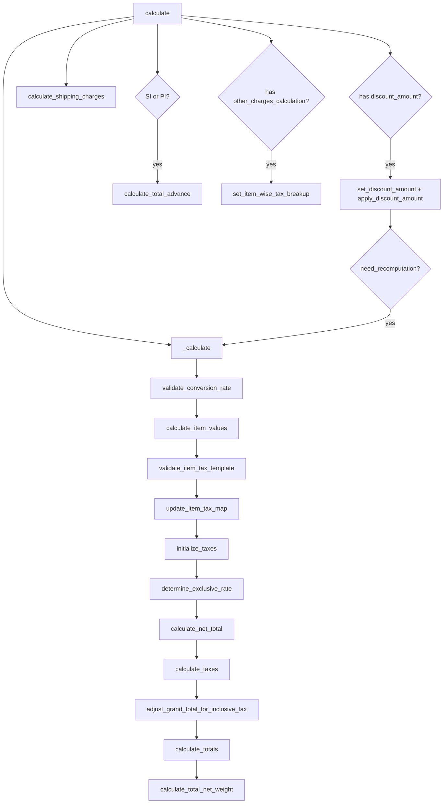

# Taxes and Totals — Calculation Lifecycle

> **TL;DR:** Every tax-bearing transaction (Quotation, Sales/Purchase Order, Delivery Note, Purchase Receipt, Sales/Purchase Invoice, POS Invoice) computes `net_total`, `tax_amount`, `grand_total`, `rounded_total`, `outstanding_amount` and the item-wise tax breakup through [`calculate_taxes_and_totals` in `erpnext/controllers/taxes_and_totals.py`](erpnext/controllers/taxes_and_totals.py:26). The class is instantiated from [`AccountsController.calculate_taxes_and_totals`](erpnext/controllers/accounts_controller.py:734) during `validate` and whenever totals must be refreshed. Each `Sales Taxes and Charges` / `Purchase Taxes and Charges` row feeds [`make_tax_gl_entries`](erpnext/accounts/doctype/sales_invoice/sales_invoice.py:1648) at submit time — one GL row per tax row.

## Key files

- [`erpnext/controllers/taxes_and_totals.py`](erpnext/controllers/taxes_and_totals.py:1) — the whole calculation class.
- [`erpnext/controllers/accounts_controller.py`](erpnext/controllers/accounts_controller.py:734) — [`calculate_taxes_and_totals`](erpnext/controllers/accounts_controller.py:734) dispatcher, [`validate_taxes_and_charges`](erpnext/controllers/accounts_controller.py:1) row-level checks, [`validate_inclusive_tax`](erpnext/controllers/accounts_controller.py:2246) inclusive-rule checks.
- [`erpnext/accounts/doctype/sales_invoice/sales_invoice.py`](erpnext/accounts/doctype/sales_invoice/sales_invoice.py:1648) — [`make_tax_gl_entries`](erpnext/accounts/doctype/sales_invoice/sales_invoice.py:1648).
- [`erpnext/accounts/doctype/purchase_invoice/purchase_invoice.py`](erpnext/accounts/doctype/purchase_invoice/purchase_invoice.py:1405) — [`make_tax_gl_entries`](erpnext/accounts/doctype/purchase_invoice/purchase_invoice.py:1405), [`make_gl_entries_for_tax_withholding`](erpnext/accounts/doctype/purchase_invoice/purchase_invoice.py:1522).
- [`erpnext/accounts/doctype/sales_taxes_and_charges/sales_taxes_and_charges.py`](erpnext/accounts/doctype/sales_taxes_and_charges/sales_taxes_and_charges.py:1) — tax-row child table.
- [`erpnext/stock/get_item_details.py`](erpnext/stock/get_item_details.py:1) — [`get_item_tax_map`](erpnext/controllers/taxes_and_totals.py:22), [`_get_item_tax_template`](erpnext/controllers/taxes_and_totals.py:22) helpers.

## Entry point

[`AccountsController.calculate_taxes_and_totals`](erpnext/controllers/accounts_controller.py:734) instantiates the class unconditionally on every qualifying doctype:

```python
def calculate_taxes_and_totals(self):
    from erpnext.controllers.taxes_and_totals import calculate_taxes_and_totals
    calculate_taxes_and_totals(self)

    if self.doctype in ("Sales Order", "Delivery Note", "Sales Invoice", "POS Invoice"):
        self.calculate_commission()
        self.calculate_contribution()
```

The constructor [`calculate_taxes_and_totals.__init__`](erpnext/controllers/taxes_and_totals.py:27) snapshots two global flags:

- `frappe.flags.round_off_applicable_accounts` — list of tax accounts that should round to whole units (fed by [`get_round_off_applicable_accounts`](erpnext/controllers/taxes_and_totals.py:30)).
- `frappe.flags.round_row_wise_tax` — from `Accounts Settings`. Toggles whether `current_tax_amount` and `current_net_amount` are rounded at each per-item step ([`taxes_and_totals.py:445`](erpnext/controllers/taxes_and_totals.py:445)).

For Quotations, only non-`is_alternative` rows are considered (see [`filter_rows`](erpnext/controllers/taxes_and_totals.py:37)); every other doctype uses all item rows.

## The pipeline

[`calculate`](erpnext/controllers/taxes_and_totals.py:42) / [`_calculate`](erpnext/controllers/taxes_and_totals.py:74) execute this sequence:



### 1. Conversion rate

[`validate_conversion_rate`](erpnext/controllers/taxes_and_totals.py:146) forces `conversion_rate = 1.0` when `currency` matches `Company.default_currency`; otherwise runs [`validate_conversion_rate`](erpnext/controllers/accounts_controller.py:1) to require a non-zero rate.

### 2. Item values

[`calculate_item_values`](erpnext/controllers/taxes_and_totals.py:162) normalizes each line:

- Applies `discount_percentage` / `discount_amount` against `price_list_rate` to derive `rate`.
- Calls [`calculate_margin`](erpnext/controllers/taxes_and_totals.py:1127) for Quotation / SO / DN / SI / POS / PO / PI / PR items — sets `margin_type` and `rate_with_margin` from either pricing rules or raw rate-delta.
- Computes `amount = rate * qty` (purchase items optionally include rejected qty — see [`taxes_and_totals.py:168`](erpnext/controllers/taxes_and_totals.py:168) flag from **Buying Settings**).
- Seeds `net_amount` and `base_net_amount` from `amount` × `conversion_rate`.
- `valuation_rate` and `incoming_rate` are exempt from the precision rounding pass ([`taxes_and_totals.py:171`](erpnext/controllers/taxes_and_totals.py:171)).

### 3. Item tax template validation + resolution

[`validate_item_tax_template`](erpnext/controllers/taxes_and_totals.py:87) walks up the `Item Group` ancestry for each item, collecting `Item Tax` templates from both the `Item` and its group chain, then calls [`_get_item_tax_template`](erpnext/stock/get_item_details.py:1) with an [`ItemDetailsCtx`](erpnext/stock/get_item_details.py:1) constructed from `tax_category`, `posting_date`, `bill_date`, `transaction_date`, `company`. If the item currently uses an out-of-validity template, the code silently swaps to the first valid one and flags `need_recomputation=True` when a Grand-Total discount is in play — triggering a recursive [`calculate`](erpnext/controllers/taxes_and_totals.py:56) pass with `ignore_tax_template_validation=True`.

[`update_item_tax_map`](erpnext/controllers/taxes_and_totals.py:138) then writes `item.item_tax_rate` as a JSON blob of `{account: rate}` via [`get_item_tax_map`](erpnext/stock/get_item_details.py:1).

### 4. Initialize tax rows

[`initialize_taxes`](erpnext/controllers/taxes_and_totals.py:258) resets per-tax fields (`tax_amount`, `total`, `tax_amount_after_discount_amount`, `tax_amount_for_current_item`, `grand_total_for_current_item`, `tax_fraction_for_current_item`, `grand_total_fraction_for_current_item`, `net_amount`) — but only for tax rows not flagged `dont_recompute_tax`. Initial validation: [`validate_taxes_and_charges`](erpnext/controllers/accounts_controller.py:1) and [`validate_inclusive_tax`](erpnext/controllers/accounts_controller.py:2246) enforce the inclusive-tax rules (e.g. a tax row with `included_in_print_rate=1` must be `charge_type in ("On Net Total", "On Previous Row Amount", "On Previous Row Total", "On Item Quantity")`).

[`reset_item_wise_tax_details`](erpnext/controllers/taxes_and_totals.py:284) zeroes the per-item running totals used during item-tax distribution. Rows with `dont_recompute_tax=1` retain their prior breakup.

### 5. Inclusive-tax exclusive rate

[`determine_exclusive_rate`](erpnext/controllers/taxes_and_totals.py:307) only runs when at least one tax row has `included_in_print_rate=1`. For each item it computes `cumulated_tax_fraction` from every inclusive tax:

- `On Net Total` → `rate/100` fraction directly.
- `On Previous Row Amount` → `(rate/100) * previous_tax.tax_fraction_for_current_item`.
- `On Previous Row Total` → `(rate/100) * previous_tax.grand_total_fraction_for_current_item`.
- `On Item Quantity` → per-quantity additive amount rather than a fraction.

`Deduct`-direction taxes flip the sign ([`taxes_and_totals.py:377`](erpnext/controllers/taxes_and_totals.py:377)). Then:

```
item.net_amount = (item.amount - total_inclusive_tax_amount_per_qty) / (1 + cumulated_tax_fraction)
item.net_rate   = item.net_amount / item.qty
```

This is the mathematical core of inclusive-tax handling — the printed rate contains tax, so the pre-tax net amount is recovered by dividing out the cumulated fraction.

### 6. Net total

[`calculate_net_total`](erpnext/controllers/taxes_and_totals.py:389) sums `amount`, `base_amount`, `net_amount`, `base_net_amount`, `qty` across `self._items`. Purchase Receipt uses `qty + rejected_qty` when the **Buying Settings** `bill_for_rejected_quantity_in_purchase_invoice` flag is set ([`taxes_and_totals.py:401`](erpnext/controllers/taxes_and_totals.py:401)).

### 7. `calculate_taxes` — the heart

[`calculate_taxes`](erpnext/controllers/taxes_and_totals.py:421) is an outer loop over items, inner over tax rows.

For each `(item, tax)` pair it calls [`get_current_tax_and_net_amount`](erpnext/controllers/taxes_and_totals.py:592) which dispatches on `charge_type`:

| `charge_type` | `current_net_amount` | `current_tax_amount` |
| --- | --- | --- |
| `Actual` | `item.net_amount` | `item.net_amount × tax.tax_amount / doc.net_total` (proportional split of the flat actual) |
| `On Net Total` | `item.net_amount` if item is in tax map else 0 | `rate/100 × item.net_amount` |
| `On Previous Row Amount` | `prev_tax.tax_amount_for_current_item` | `rate/100 × prev_tax.tax_amount_for_current_item` |
| `On Previous Row Total` | `prev_tax.grand_total_for_current_item` | `rate/100 × prev_tax.grand_total_for_current_item` |
| `On Item Quantity` | 0 | `rate × item.qty` |

Key loop behaviours at [`taxes_and_totals.py:438-515`](erpnext/controllers/taxes_and_totals.py:438):

- **Divisional-loss adjustment for `Actual`.** The raw `tax.tax_amount` is tracked in `actual_tax_dict` keyed by `tax.idx`. After the proportional split for all items, any rounding residual is dumped on the last item ([`taxes_and_totals.py:450-453`](erpnext/controllers/taxes_and_totals.py:450)). This guarantees the sum of split amounts exactly equals the input.
- **Accumulation.** Non-`Actual` rows accumulate `current_tax_amount` into `tax.tax_amount`, `tax.net_amount`, and `tax.tax_amount_after_discount_amount`. `tax_amount_for_current_item` is stored so subsequent `On Previous Row Amount` / `On Previous Row Total` entries can reference it.
- **Valuation-only.** [`get_tax_amount_if_for_valuation_or_deduction`](erpnext/controllers/taxes_and_totals.py:569) zeroes `current_tax_amount` when `tax.category == "Valuation"` (the charge affects landed cost / valuation only, not the transaction total). For Purchase transactions, `add_deduct_tax == "Deduct"` rows flip the sign.
- **`grand_total_for_current_item`.** For `i == 0`, equals `item.net_amount + current_tax_amount`. Otherwise equals `previous_tax.grand_total_for_current_item + current_tax_amount`. This is the cumulative-tax base that `On Previous Row Total` depends on.
- **Discount-on-grand-total re-pass.** When `discount_amount_applied` and `apply_discount_on == "Grand Total"`, `tax.tax_amount` is *not* re-accumulated; `tax_amount_after_discount_amount` is what the discounted entry uses, and `set_cumulative_total` is called again to produce correct `tax.total`.
- **Round-off applicable accounts.** [`round_off_totals`](erpnext/controllers/taxes_and_totals.py:662) rounds `tax.tax_amount`, `tax.tax_amount_after_discount_amount` to whole units when `tax.account_head` is in `frappe.flags.round_off_applicable_accounts`.
- **Item-wise breakup with error diffusion.** [`set_item_wise_tax`](erpnext/controllers/taxes_and_totals.py:622) uses running accumulators (`_running_txn_tax_total`, `_running_base_tax_total`, `_running_txn_taxable_total`, `_running_base_taxable_total`) to derive each item's base tax amount as a delta of the cumulative total — so the sum of item-wise amounts always equals `base_tax_amount_after_discount_amount` exactly. [`adjust_rounding_in_item_wise_tax_details`](erpnext/controllers/taxes_and_totals.py:517) applies any residual (≤ 0.5) to the last breakup row; anything larger throws an "Item Wise Tax Details do not match" error.

### 8. Adjust grand total for inclusive tax

[`adjust_grand_total_for_inclusive_tax`](erpnext/controllers/taxes_and_totals.py:689) recomputes the tiny rounding discrepancy that shows up when some rows are inclusive. Stores the delta in `self.grand_total_diff` if `|diff| ≤ 5 / 10^precision`, otherwise zero. The legacy name [`manipulate_grand_total_for_inclusive_tax`](erpnext/controllers/taxes_and_totals.py:685) is marked `@deprecated` and delegates to this function.

### 9. Totals

[`calculate_totals`](erpnext/controllers/taxes_and_totals.py:720):

- `grand_total = last_tax.total + grand_total_diff` (or `net_total` if no taxes).
- `total_taxes_and_charges = grand_total - net_total - grand_total_diff`.
- For Sales-side doctypes, `base_grand_total = grand_total × conversion_rate` only if taxes are present; otherwise `base_grand_total = base_net_total`.
- For Purchase-side doctypes, `taxes_and_charges_added` / `taxes_and_charges_deducted` split by `tax.add_deduct_tax` for rows with `category in ("Valuation and Total", "Total")` ([`taxes_and_totals.py:752`](erpnext/controllers/taxes_and_totals.py:752)).
- Finally calls [`set_rounded_total`](erpnext/controllers/taxes_and_totals.py:780), which uses `round_based_on_smallest_currency_fraction(grand_total, currency, precision)` and stores the difference in `rounding_adjustment`. When `Company.disable_rounded_total` is true the rounded total is zeroed.

### 10. Discount re-pass

If the doctype has a `discount_amount` field (not Purchase Receipt, not Quotation), [`calculate`](erpnext/controllers/taxes_and_totals.py:52) runs [`set_discount_amount`](erpnext/controllers/taxes_and_totals.py:801) + `apply_discount_amount`. When `need_recomputation=True` from earlier tax-template changes, `calculate` recurses once with `ignore_tax_template_validation=True` to stabilize.

After all that, for Sales Invoice and Purchase Invoice only, [`calculate_total_advance`](erpnext/controllers/taxes_and_totals.py:946) sums allocated advances, validates `total_advance <= invoice_total`, then triggers [`calculate_outstanding_amount`](erpnext/controllers/taxes_and_totals.py:995) + [`calculate_write_off_amount`](erpnext/controllers/taxes_and_totals.py:1115).

## Inclusive vs exclusive rules

- **Exclusive.** Default. `rate` on each item is pre-tax; `tax_amount` adds on top.
- **Inclusive.** `tax.included_in_print_rate = 1`. `rate` already includes the tax; `net_rate` is derived by dividing out `cumulated_tax_fraction`. Only valid for `charge_type` in `On Net Total`, `On Previous Row Amount`, `On Previous Row Total`, `On Item Quantity` — enforced by [`validate_inclusive_tax`](erpnext/controllers/accounts_controller.py:2246). Mixing inclusive and exclusive rows is allowed; inclusive rows contribute to `cumulated_tax_fraction`, exclusive rows are appended afterwards to `grand_total`.
- **`Actual` + inclusive is forbidden.** An `Actual` charge has no `rate`, so there's nothing to divide out. [`validate_inclusive_tax`](erpnext/controllers/accounts_controller.py:2246) enforces this.

## Item-wise tax vs cumulative tax

Every tax row can participate in two views:

1. **Accumulated amount** (`tax.tax_amount` and `tax.tax_amount_after_discount_amount`) — used by [`make_tax_gl_entries`](erpnext/accounts/doctype/sales_invoice/sales_invoice.py:1648) to post a single GL line per tax row.
2. **Item-wise breakup** (`doc._item_wise_tax_details` / `doc.item_wise_tax_details`) — per-item rate, taxable amount, tax amount, stored as a child table on the parent. Built by [`set_item_wise_tax`](erpnext/controllers/taxes_and_totals.py:622) with error diffusion, then reconciled by [`adjust_rounding_in_item_wise_tax_details`](erpnext/controllers/taxes_and_totals.py:517). Used by [`set_item_wise_tax_breakup`](erpnext/controllers/taxes_and_totals.py:1169) → [`get_itemised_tax_breakup_html`](erpnext/controllers/taxes_and_totals.py:1) for the `other_charges_calculation` print-format block.

Regional overrides (e.g. Saudi Arabia VAT, UAE VAT, Italy IVA) replace [`update_itemised_tax_data`](erpnext/hooks.py:615) to add jurisdiction-specific columns — see [`regional_overrides` at `hooks.py:608`](erpnext/hooks.py:608) and [regional overrides pattern](../patterns/regional-overrides.md).

## Rounding model

Three rounding surfaces co-exist:

1. **Per-field precision** — Frappe precision on each currency/float field, honoured by `flt(..., precision)` calls throughout.
2. **Row-wise tax rounding.** When `Accounts Settings.round_row_wise_tax = 1` ([`taxes_and_totals.py:32`](erpnext/controllers/taxes_and_totals.py:32)), `current_tax_amount` and `current_net_amount` are rounded at each per-item iteration ([`taxes_and_totals.py:445`](erpnext/controllers/taxes_and_totals.py:445)).
3. **Integer round-off for tagged accounts.** [`round_off_totals`](erpnext/controllers/taxes_and_totals.py:662) + [`round_off_base_values`](erpnext/controllers/taxes_and_totals.py:673) round tax amounts to whole units when the tax's `account_head` is in `frappe.flags.round_off_applicable_accounts` (populated per company).
4. **`rounded_total` and `rounding_adjustment`.** Final snapping of `grand_total` to the smallest currency fraction at [`set_rounded_total`](erpnext/controllers/taxes_and_totals.py:780). `rounding_adjustment = rounded_total - grand_total` becomes a booked GL line via [`make_gle_for_rounding_adjustment`](erpnext/accounts/doctype/sales_invoice/sales_invoice.py:1601) / the same method on Purchase Invoice.

## Tax row → GL entry mapping

At submit time, [`SalesInvoice.make_tax_gl_entries`](erpnext/accounts/doctype/sales_invoice/sales_invoice.py:1648) iterates `self.get("taxes")` and for each row with non-zero `base_tax_amount_after_discount_amount` appends one credit GL entry:

```python
gl_entries.append(
    self.get_gl_dict({
        "account": tax.account_head,
        "against": self.customer,
        "credit": flt(base_amount, ...),
        "credit_in_account_currency": ...,
        "credit_in_transaction_currency": flt(amount, ...),
        "cost_center": tax.cost_center,
    }, account_currency, item=tax)
)
```

`amount` / `base_amount` come from [`get_tax_amounts`](erpnext/accounts/doctype/sales_invoice/sales_invoice.py:1) which folds discount-accounting on or off based on **Selling Settings.enable_discount_accounting**.

Purchase Invoice mirrors this at [`purchase_invoice.py:1405`](erpnext/accounts/doctype/purchase_invoice/purchase_invoice.py:1405) with debit instead of credit. `category == "Valuation"` rows feed the landed-cost path via [`negative_expense_to_be_booked`](erpnext/accounts/doctype/purchase_invoice/purchase_invoice.py:870) rather than a direct GL entry. Tax-withholding postings go through the separate [`make_gl_entries_for_tax_withholding`](erpnext/accounts/doctype/purchase_invoice/purchase_invoice.py:1522) pass.

One nuance: the outer `make_gl_entries` call on SI/PI runs with `merge_entries=False` (see [`sales_invoice.py:1556`](erpnext/accounts/doctype/sales_invoice/sales_invoice.py:1556), [`purchase_invoice.py:820`](erpnext/accounts/doctype/purchase_invoice/purchase_invoice.py:820)) because the tax rows were already merged with every other row of the same account inside [`get_gl_entries`](erpnext/accounts/doctype/sales_invoice/sales_invoice.py:1595) via [`merge_similar_entries`](erpnext/accounts/general_ledger.py:273). Merging again would incorrectly collapse POS / loyalty / write-off additions that were appended *after* the first merge.

## Related

- [Accounting flow](accounting-flow.md) — the `make_gl_entries` pipeline that consumes these values.
- [Payments flow](payments-flow.md) — `calculate_total_advance` side-effects, tax-inclusive PE deductions.
- [Accounts module](../modules/accounts.md) — tax masters (`Sales/Purchase Taxes and Charges Template`, `Item Tax Template`, `Tax Category`, `Tax Rule`).
- [Accounts DocType reference cards](../modules/accounts-doctypes.md) — per-doctype call sites for `make_tax_gl_entries`.
- [Regional overrides](../patterns/regional-overrides.md) — `update_itemised_tax_data` country implementations.
- [Controller hierarchy](../architecture/controllers.md) — where `calculate_taxes_and_totals` is invoked.

## Changelog

- `2026-04-17` — initial version (commit `fbe976fb3b`, branch `feat/setting-claude`).
