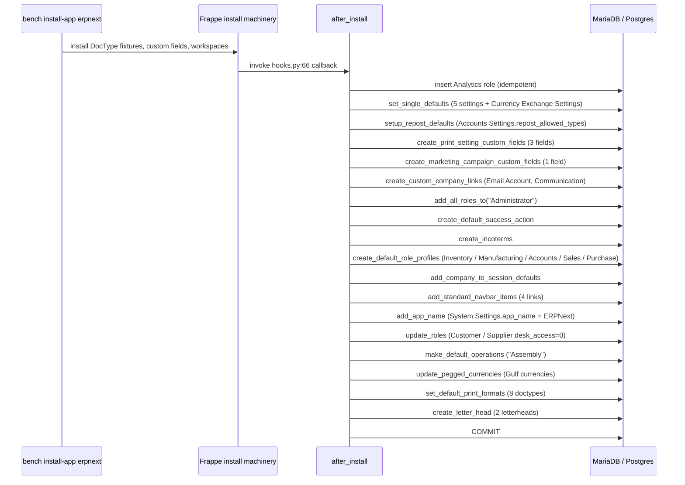

# `after_install` seed catalogue

> **TL;DR:** When `bench install-app erpnext` runs, it invokes the function registered in [hooks.py:66](../../erpnext/hooks.py:66) — `after_install = "erpnext.setup.install.after_install"`. That function ([install.py:20](../../erpnext/setup/install.py:20)) is a fixed sequence of 18 sub-calls executed in one transaction (`frappe.db.commit()` only at the end — [install.py:41](../../erpnext/setup/install.py:41)). This page enumerates every step with line citations: which roles, custom fields, default Singles, Incoterms, Role Profiles, navbar items, currency-exchange config, default operations, pegged currencies, default print formats and letter heads get seeded — and which steps are no-ops on re-run. The Company / CoA / Warehouses / Cost Centers / Departments / per-country tax templates are **not** seeded here — they are bootstrapped later by `Company.on_update` when the Setup Wizard inserts the first Company doc (see [modules/setup.md § Company DocType](../modules/setup.md)). Country-specific fixtures arrive via `install_country_fixtures` ([company.py:846](../../erpnext/setup/doctype/company/company.py:846)) — see [patterns/regional-overrides.md](../patterns/regional-overrides.md). The `Setup Wizard` itself (3 + 1 stages, optional demo) is documented in [modules/setup.md § Setup Wizard stages](../modules/setup.md).

## Key files

- [erpnext/hooks.py:66](../../erpnext/hooks.py:66) — `after_install = "erpnext.setup.install.after_install"`.
- [erpnext/setup/install.py](../../erpnext/setup/install.py:1) — full file, 393 lines. Single source of truth for this page.
- [erpnext/setup/install.py:20](../../erpnext/setup/install.py:20) — `def after_install():` entry point.
- [erpnext/setup/install.py:367-393](../../erpnext/setup/install.py:367) — `DEFAULT_ROLE_PROFILES` constant.
- [erpnext/setup/setup_wizard/operations/install_fixtures.py](../../erpnext/setup/setup_wizard/operations/install_fixtures.py:1) — the Setup-Wizard-time fixtures (separate codepath, **not** invoked by `after_install`).

## The full call list

[install.py:20-41](../../erpnext/setup/install.py:20):

```python
def after_install():
    if not frappe.db.exists("Role", "Analytics"):
        frappe.get_doc({"doctype": "Role", "role_name": "Analytics"}).insert()

    set_single_defaults()
    setup_repost_defaults()
    create_print_setting_custom_fields()
    create_marketing_campaign_custom_fields()
    create_custom_company_links()
    add_all_roles_to("Administrator")
    create_default_success_action()
    create_incoterms()
    create_default_role_profiles()
    add_company_to_session_defaults()
    add_standard_navbar_items()
    add_app_name()
    update_roles()
    make_default_operations()
    update_pegged_currencies()
    set_default_print_formats()
    create_letter_head()
    frappe.db.commit()
```

## Diagram



## Step 0 — Analytics role

[install.py:21-22](../../erpnext/setup/install.py:21):

```python
if not frappe.db.exists("Role", "Analytics"):
    frappe.get_doc({"doctype": "Role", "role_name": "Analytics"}).insert()
```

The first byte of work: ensure the `Analytics` role exists. Idempotent on re-run.

## Step 1 — `set_single_defaults` ([install.py:52-75](../../erpnext/setup/install.py:52))

For each of the 5 ERPNext Single settings — `Accounts Settings`, `Print Settings`, `Buying Settings`, `Selling Settings`, `Stock Settings` — read every `DocField.default` from the schema and write that value into the Single. Catches `frappe.ValidationError` silently if validation rejects the seeded value.

After the loop, calls `setup_currency_exchange()`.

### `setup_currency_exchange()` ([install.py:85-98](../../erpnext/setup/install.py:85))

Configures the Single `Currency Exchange Settings` to use the `frankfurter.dev` provider:

```python
ces.api_endpoint = "https://api.frankfurter.dev/v1/{transaction_date}"
ces.append("result_key", {"key": "rates"})
ces.append("result_key", {"key": "{to_currency}"})
ces.append("req_params", {"key": "base", "value": "{from_currency}"})
ces.append("req_params", {"key": "symbols", "value": "{to_currency}"})
```

Wraps in a `try / except frappe.ValidationError: pass` so a failure here does not abort install.

## Step 2 — `setup_repost_defaults` ([install.py:78-82](../../erpnext/setup/install.py:78))

Reads the `repost_allowed_doctypes` hook ([hooks.py:707-713](../../erpnext/hooks.py:707) — `Sales Invoice`, `Purchase Invoice`, `Journal Entry`, `Payment Entry`, `Purchase Receipt`) and appends each as a row in `Accounts Settings.repost_allowed_types`. This populates the multi-select that gates the Accounts Settings repost feature.

## Step 3 — `create_print_setting_custom_fields` ([install.py:101-128](../../erpnext/setup/install.py:101))

Adds 3 Custom Fields to `Print Settings`:

| Field | Type | Default | Insert after |
|---|---|---|---|
| `compact_item_print` | Check | `1` | `with_letterhead` |
| `print_uom_after_quantity` | Check | `0` | `compact_item_print` |
| `print_taxes_with_zero_amount` | Check | `0` | `allow_print_for_cancelled` |

## Step 4 — `create_marketing_campaign_custom_fields` ([install.py:131-144](../../erpnext/setup/install.py:131))

Adds 1 Custom Field to `UTM Campaign`:

| Field | Type | Options | Insert after |
|---|---|---|---|
| `crm_campaign` | Link | `Campaign` | `campaign_description` |

## Step 5 — `create_custom_company_links` ([install.py:154-184](../../erpnext/setup/install.py:154))

Adds a `company` Link field (options `Company`) to two Frappe-framework DocTypes so ERPNext can multi-tenant emails per company:

- `Email Account.company` — Link, after `email_id`.
- `Communication.company` — Link, after `email_account`, `read_only=1`, `fetch_from = email_account.company`.

Comment in the source explains the rationale ([install.py:155-160](../../erpnext/setup/install.py:155)): the parent DocTypes are owned by Frappe but ERPNext needs to scope them per company.

## Step 6 — `add_all_roles_to("Administrator")` ([install.py:29](../../erpnext/setup/install.py:29))

Calls Frappe's helper to grant every existing role to the `Administrator` user. Imported from `frappe.desk.page.setup_wizard.setup_wizard` ([install.py:9](../../erpnext/setup/install.py:9)).

## Step 7 — `create_default_success_action` ([install.py:147-151](../../erpnext/setup/install.py:147))

Walks `get_default_success_action()` (from [erpnext/setup/default_success_action.py](../../erpnext/setup/default_success_action.py:1)) and inserts a `Success Action` doc per `ref_doctype` if one does not already exist. Drives the "Document submitted!" follow-up actions on form submit.

## Step 8 — `create_incoterms()` ([install.py:31](../../erpnext/setup/install.py:31))

Imported from [erpnext/setup/doctype/incoterm/incoterm.py](../../erpnext/setup/doctype/incoterm/incoterm.py:1) (via [install.py:11](../../erpnext/setup/install.py:11)). Loads the full Incoterms master from [incoterms.csv](../../erpnext/setup/doctype/incoterm/incoterms.csv:1).

## Step 9 — `create_default_role_profiles` ([install.py:256-277](../../erpnext/setup/install.py:256))

Creates 5 `Role Profile` records driven by the `DEFAULT_ROLE_PROFILES` constant ([install.py:367-393](../../erpnext/setup/install.py:367)):

| Role Profile | Roles |
|---|---|
| Inventory | Stock User, Stock Manager, Item Manager |
| Manufacturing | Stock User, Manufacturing User, Manufacturing Manager |
| Accounts | Accounts User, Accounts Manager |
| Sales | Sales User, Stock User, Sales Manager |
| Purchase | Item Manager, Stock User, Purchase User, Purchase Manager |

For existing profiles, the function reconciles roles in-place (removes anything not in the canonical list, adds anything missing).

## Step 10 — `add_company_to_session_defaults` ([install.py:187-190](../../erpnext/setup/install.py:187))

Appends `Company` to `Session Default Settings.session_defaults`. This makes the desk's "Set Default" header switcher operate on Company.

## Step 11 — `add_standard_navbar_items` ([install.py:193-243](../../erpnext/setup/install.py:193))

Appends 4 standard items to `Navbar Settings.help_dropdown` (after preserving / restoring existing custom items):

| Label | Type | Route |
|---|---|---|
| Documentation | Route | `https://docs.erpnext.com/` |
| User Forum | Route | `https://discuss.frappe.io` |
| Frappe School | Route | `https://frappe.io/school?utm_source=in_app` |
| Report an Issue | Route | `https://github.com/frappe/erpnext/issues` |

The function clears `help_dropdown`, appends the new items, then re-appends the original custom items at the bottom — preserving user customisations.

The standalone navbar action `Delete Demo Data` is **not** seeded here; it ships from `hooks.py:222-228` ([hooks.py:220-229](../../erpnext/hooks.py:220)) and is conditional on `frappe.boot.sysdefaults.demo_company`.

## Step 12 — `add_app_name` ([install.py:246-247](../../erpnext/setup/install.py:246))

```python
frappe.db.set_single_value("System Settings", "app_name", "ERPNext")
```

## Step 13 — `update_roles` ([install.py:250-253](../../erpnext/setup/install.py:250))

Sets `desk_access = 0` on `Customer` and `Supplier` roles — so end-customers/suppliers logging into the portal cannot reach the desk UI.

## Step 14 — `make_default_operations` ([install.py:44-49](../../erpnext/setup/install.py:44))

Inserts at least one `Operation` row (`Assembly`). Idempotent. Used by Manufacturing module's BOM / Routing.

## Step 15 — `update_pegged_currencies` ([install.py:280-310](../../erpnext/setup/install.py:280))

Inserts pegged exchange-rate rows into the `Pegged Currencies` Single, but **only if** `USD` exists as a Currency:

| Source | Pegged against | Rate |
|---|---|---|
| AED | USD | 3.6725 |
| BHD | USD | 0.376 |
| JOD | USD | 0.709 |
| OMR | USD | 0.3845 |
| QAR | USD | 3.64 |
| SAR | USD | 3.75 |

Only sources that already exist as `Currency` rows are inserted ([install.py:296-305](../../erpnext/setup/install.py:296)).

## Step 16 — `set_default_print_formats` ([install.py:313-341](../../erpnext/setup/install.py:313))

For each of 8 transaction DocTypes (Sales Order, Sales Invoice, Delivery Note, Purchase Order, Purchase Invoice, POS Invoice, Quotation, Request for Quotation), if no `default_print_format` is set on the meta and the matching `<Doctype> with Item Image` print format exists, write a `Property Setter` setting it as default.

## Step 17 — `create_letter_head` ([install.py:344-364](../../erpnext/setup/install.py:344))

Inserts 2 letterheads from HTML templates under `erpnext/accounts/letterhead/`:

- `Company Letterhead` ← `company_letterhead.html`
- `Company Letterhead - Grey` ← `company_letterhead_grey.html` (also marked `is_default=1`).

## Step 18 — `frappe.db.commit()` ([install.py:41](../../erpnext/setup/install.py:41))

Final commit. Until this line, all 18 prior steps run inside the same transaction. If any step throws (other than the `frappe.ValidationError` swallowed inside `set_single_defaults` / `setup_currency_exchange`), the install rolls back and the site is left half-bootstrapped.

> **Recovery:** drop the site (`bench drop-site <site>`) and re-run `bench new-site` + `bench install-app erpnext`.

## What `after_install` does **not** do

The following bootstrapping is intentionally **not** part of `after_install` and runs later:

- **Company doc** — created either by the Setup Wizard ([setup_wizard.py:19-22](../../erpnext/setup/setup_wizard/setup_wizard.py:19) → `install_fixtures.install_company`) or via the Company form. Its insertion fires `Company.on_update` ([company.py:335](../../erpnext/setup/doctype/company/company.py:335)) which performs the cascade documented in [modules/setup.md § Company DocType](../modules/setup.md).
- **Chart of Accounts** — `Company.create_default_accounts()` ([company.py:414](../../erpnext/setup/doctype/company/company.py:414)) → `chart_of_accounts.create_charts(company, chart_of_accounts, existing_company)`.
- **5 default warehouses** (`Stores`, `Work In Progress`, `Finished Goods`, `Goods In Transit`, `All Warehouses`) — `Company.create_default_warehouses()` ([company.py:379](../../erpnext/setup/doctype/company/company.py:379)).
- **Default Cost Centers** (group + `Main`) — `Company.create_default_cost_center()` ([company.py:710](../../erpnext/setup/doctype/company/company.py:710)).
- **14-entry Department tree** — `Company.create_default_departments()` ([company.py:432](../../erpnext/setup/doctype/company/company.py:432)).
- **Per-country tax templates** — `Company.create_default_tax_template()` ([company.py:240](../../erpnext/setup/doctype/company/company.py:240)) → `setup_taxes_and_charges(self.name, self.country)` (in [taxes_setup.py](../../erpnext/setup/setup_wizard/operations/taxes_setup.py:1)).
- **Country fixtures** — `install_country_fixtures(company, country)` ([company.py:846-858](../../erpnext/setup/doctype/company/company.py:846)) imports `erpnext.regional.<country>.setup.setup` and invokes it. **Failing imports are silently swallowed** (the `except ImportError: pass` at [company.py:850-851](../../erpnext/setup/doctype/company/company.py:850)) — so countries like France that have only a stub `regional/france/utils.py` and no `setup/setup.py` produce zero error and zero seeded data. See [modules/regional.md](../modules/regional.md) for the per-country inventory.
- **Item / Customer / Supplier / Territory / Sales Person Group trees** — `install_fixtures.get_preset_records(country)` is run by the Setup Wizard's first stage (`stage_fixtures` → [install_fixtures.py:322](../../erpnext/setup/setup_wizard/operations/install_fixtures.py:322)), not by `after_install`.
- **Default UoMs (105+ entries)** — `add_uom_data()` at [install_fixtures.py:387](../../erpnext/setup/setup_wizard/operations/install_fixtures.py:387) runs from the Setup Wizard, sourced from [setup_wizard/data/uom_data.json](../../erpnext/setup/setup_wizard/data/uom_data.json) and [uom_conversion_data.json](../../erpnext/setup/setup_wizard/data/uom_conversion_data.json).
- **Demo data** — only when the wizard is run with `setup_demo=True` ([setup_wizard.py:33](../../erpnext/setup/setup_wizard/setup_wizard.py:33)). See [modules/setup.md § Demo loader](../modules/setup.md).

## Cross-references

- [Installation walkthrough](installation.md) — links into this page from "What `after_install` does" ([installation.md § Step 5](installation.md)).
- [Setup module](../modules/setup.md) — covers what runs **after** `after_install`: Setup Wizard stages, Company on_update, demo loader.
- [Setup DocType reference cards](../modules/setup-doctypes.md) — per-DocType cards.
- [Regional overrides](../patterns/regional-overrides.md) — `install_country_fixtures` mechanism + the silent ImportError gotcha.
- [Patches](../patterns/patches.md) — several patches re-invoke helpers from `install.py` (e.g. `patches/v13_0/update_exchange_rate_settings.py` re-runs `setup_currency_exchange`).

## Related

- [Installation](installation.md)
- [Development](development.md)
- [Setup module](../modules/setup.md)

## Changelog

- `2026-04-18` — initial version.
