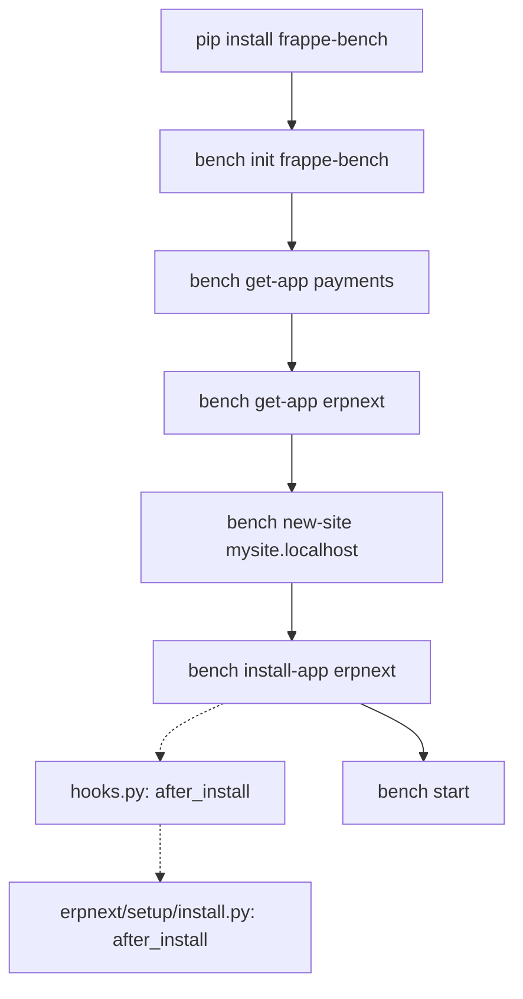

# Installation

> **TL;DR:** `bench init` creates a `frappe-bench/` working tree (virtualenv + `apps/frappe` + Procfile + sites). `bench get-app` clones an app into `apps/<app>` and installs its Python deps. `bench new-site` creates a database + `sites/<site>/` directory. `bench install-app erpnext` runs the DocType fixtures and ERPNext's `after_install` hook against that site.

## Key files

- [.github/helper/install.sh](../../.github/helper/install.sh:1) — canonical reference installer used by CI; mirrors what a local bring-up should do.
- [.github/helper/install.sh:11](../../.github/helper/install.sh:11) — `pip install frappe-bench`.
- [.github/helper/install.sh:25](../../.github/helper/install.sh:25) — `bench init --skip-assets --frappe-path ~/frappe --python "$(which python)" frappe-bench`.
- [.github/helper/install.sh:69-70](../../.github/helper/install.sh:69) — `bench get-app payments` then `bench get-app erpnext`.
- [.github/helper/site_config_mariadb.json](../../.github/helper/site_config_mariadb.json:1) — full `site_config.json` shape for a MariaDB site.
- [.github/helper/site_config_postgres.json](../../.github/helper/site_config_postgres.json:1) — same for Postgres (note `db_type` + `allow_tests`).
- [erpnext/hooks.py:66](../../erpnext/hooks.py:66) — `after_install = "erpnext.setup.install.after_install"`.
- [erpnext/setup/install.py:20](../../erpnext/setup/install.py:20) — `after_install()` entry point.

## Install flow diagram



Solid arrows are sync user-invoked commands. Dashed arrows are framework-driven callbacks registered by `hooks.py`.

## Step 1 — install bench

```bash
pip install frappe-bench
```

See [.github/helper/install.sh:11](../../.github/helper/install.sh:11). `frappe-bench` ships the `bench` CLI and pulls Click + a handful of small deps. Install it into the system Python (or a pyenv-managed 3.14) — **not** into a bench's own virtualenv.

## Step 2 — `bench init`

```bash
bench init --frappe-branch develop frappe-bench
cd frappe-bench
```

This creates a working tree roughly of the shape:

```
frappe-bench/
├── Procfile             # processes bench start runs (web, worker, schedule, watch, redis_*, socketio)
├── apps/
│   └── frappe/          # cloned by bench init
├── env/                 # Python virtualenv
├── sites/
│   ├── common_site_config.json
│   └── assets/
├── config/              # supervisor + nginx config lives here for production
└── logs/
```

CI uses additional flags — [.github/helper/install.sh:25](../../.github/helper/install.sh:25):

```bash
bench init --skip-assets --frappe-path ~/frappe --python "$(which python)" frappe-bench
```

- `--skip-assets` — skips the initial Node/Yarn asset build (CI runs `bench build --app frappe` later in parallel; see [.github/helper/install.sh:77](../../.github/helper/install.sh:77)).
- `--frappe-path ~/frappe` — use a pre-cloned Frappe checkout at `~/frappe` rather than fetching from GitHub.
- `--python "$(which python)"` — explicitly bind to the Python you want the virtualenv to use.

For local dev, drop `--skip-assets` and `--frappe-path` unless you are reproducing CI.

## Step 3 — pull apps

ERPNext has a hard runtime dependency on the `payments` app (payment-integration DocTypes live there and are referenced by Sales/Purchase Invoice payments).

```bash
bench get-app payments --branch develop
bench get-app erpnext
```

See [.github/helper/install.sh:69-70](../../.github/helper/install.sh:69). `bench get-app` does three things:

1. `git clone` the repo into `apps/<app>`.
2. Read its `pyproject.toml` and install the Python deps into the bench's `env/`.
3. Add the app to `sites/apps.txt`.

### Using a local clone of this repo

If you already have this repo checked out at `~/dev/double-entry-erp/`, point `bench get-app` at the filesystem path:

```bash
bench get-app erpnext ~/dev/double-entry-erp
```

This is exactly what CI does — see [.github/helper/install.sh:70](../../.github/helper/install.sh:70):

```bash
bench get-app erpnext "${GITHUB_WORKSPACE}"
```

The bench symlinks (or copies, depending on bench version) the directory into `apps/erpnext`.

## Step 4 — `bench new-site`

```bash
bench new-site mysite.localhost
```

This:

1. Creates a database (`tabSite` and friends) under the `db_name` derived from the site name.
2. Writes `sites/mysite.localhost/site_config.json` containing DB credentials.
3. Runs Frappe's own `after_install` (framework-level).
4. Sets the Administrator password (you are prompted interactively).

The bench falls back to credentials from `sites/common_site_config.json` for DB root access if present.

### `site_config.json` shape

CI ships a reference `site_config.json` per DB backend. Use these as a contract when crafting your own.

**MariaDB** — [.github/helper/site_config_mariadb.json](../../.github/helper/site_config_mariadb.json:1):

```json
{
 "db_host": "127.0.0.1",
 "db_port": 3306,
 "db_name": "test_frappe",
 "db_password": "test_frappe",
 "auto_email_id": "test@example.com",
 "mail_server": "smtp.example.com",
 "mail_login": "test@example.com",
 "mail_password": "test",
 "admin_password": "admin",
 "use_mysqlclient": 1,
 "root_login": "root",
 "root_password": "root",
 "host_name": "http://test_site:8000",
 "install_apps": ["payments", "erpnext"],
 "throttle_user_limit": 100
}
```

**Postgres** — [.github/helper/site_config_postgres.json](../../.github/helper/site_config_postgres.json:1):

```json
{
 "db_host": "127.0.0.1",
 "db_port": 5432,
 "db_name": "test_frappe",
 "db_password": "test_frappe",
 "db_type": "postgres",
 "allow_tests": true,
 "auto_email_id": "test@example.com",
 "mail_server": "smtp.example.com",
 "mail_login": "test@example.com",
 "mail_password": "test",
 "admin_password": "admin",
 "root_login": "postgres",
 "root_password": "travis",
 "host_name": "http://test_site:8000",
 "install_apps": ["erpnext"],
 "throttle_user_limit": 100
}
```

Key-by-key reference (same keys for both backends except as noted):

| Key | Meaning |
|---|---|
| `db_host`, `db_port` | DB server bind. `127.0.0.1` for local. |
| `db_name`, `db_password` | Per-site DB user + database (Frappe gives each site its own DB). |
| `db_type` | `mariadb` (default if absent) or `postgres` ([postgres config:6](../../.github/helper/site_config_postgres.json:6)). |
| `use_mysqlclient: 1` | Use the `mysqlclient` driver — the MariaDB default. |
| `root_login`, `root_password` | DB superuser for site creation/drop. Not used at runtime. |
| `admin_password` | `Administrator` user's password. |
| `host_name` | External URL of the site (used in email templates, webhooks). |
| `install_apps` | Apps to install when `bench new-site --install-app <...>` is not passed explicitly; order matters — `payments` must come before `erpnext`. |
| `allow_tests` | Postgres example sets this `true` ([site_config_postgres.json:7](../../.github/helper/site_config_postgres.json:7)) — lets `bench run-tests` execute. See [testing-and-quality.md](testing-and-quality.md). |
| `throttle_user_limit` | Concurrency guard. |
| `auto_email_id`, `mail_*` | Outbound-email config. |

For production, never commit `root_password` into `site_config.json` — use `bench set-config` or pull from a secret store.

## Step 5 — `bench install-app erpnext`

```bash
bench --site mysite.localhost install-app erpnext
```

This runs in this order:

1. Applies Frappe's own install machinery for the app — DocType fixtures, custom fields, roles, workspaces.
2. Invokes ERPNext's `after_install` hook, registered in [erpnext/hooks.py:66](../../erpnext/hooks.py:66):

```python
after_install = "erpnext.setup.install.after_install"
```

### What `after_install` does

[erpnext/setup/install.py:20](../../erpnext/setup/install.py:20) walks through a fixed list of one-time setup calls:

```python
def after_install():
	if not frappe.db.exists("Role", "Analytics"):
		frappe.get_doc({"doctype": "Role", "role_name": "Analytics"}).insert()

	set_single_defaults()
	setup_repost_defaults()
	create_print_setting_custom_fields()
	create_marketing_campaign_custom_fields()
	create_custom_company_links()
	add_all_roles_to("Administrator")
	create_default_success_action()
	create_incoterms()
	create_default_role_profiles()
	add_company_to_session_defaults()
	add_standard_navbar_items()
	add_app_name()
	update_roles()
	make_default_operations()
	update_pegged_currencies()
	set_default_print_formats()
	create_letter_head()
	frappe.db.commit()
```

Short guide to what matters:

- `set_single_defaults()` — iterates `Accounts Settings`, `Print Settings`, `Buying Settings`, `Selling Settings`, `Stock Settings` and stamps each field's declared default into the Singles ([install.py:52-75](../../erpnext/setup/install.py:52)).
- `setup_repost_defaults()` — seeds `Accounts Settings` with the DocTypes registered in the `repost_allowed_doctypes` hook ([install.py:78](../../erpnext/setup/install.py:78)).
- `create_incoterms()` — inserts the full Incoterms master data.
- `make_default_operations()` — inserts at least one default Operation (`Assembly`) for manufacturing.
- `add_all_roles_to("Administrator")` — grants every role to the Administrator user so the seeded site is usable.
- `frappe.db.commit()` at the end — atomic transactional install.

If `after_install` raises, the install does **not** automatically roll back; you will see half-seeded settings. The recovery path is to drop the site (`bench drop-site`) and re-run `new-site` + `install-app`.

## Step 6 — verify

```bash
bench --site mysite.localhost migrate   # should be a no-op on a fresh install
bench start                              # boot the dev stack
```

Open `http://mysite.localhost:8000`, login as `Administrator`. The ERPNext workspace should be visible. For the Procfile process list and what `bench start` actually runs, continue with [development.md](development.md).

## Removing / reinstalling

```bash
bench --site mysite.localhost uninstall-app erpnext    # uninstalls DocTypes, custom fields
bench drop-site mysite.localhost                       # drops the DB + site directory
```

CI uses `bench --site test_site reinstall --yes` in a single shot — see [.github/helper/install.sh:78](../../.github/helper/install.sh:78).

## Related

- [Prerequisites](prerequisites.md) — package versions you need before running `bench init`.
- [Development](development.md) — `bench start` and the Procfile.
- [Operations](operations.md) — `site_config` / `common_site_config` reference, backup/restore, migrate.
- [Patches](../patterns/patches.md) — what `bench migrate` runs after installation.

## Changelog

- `2026-04-18` — initial version.
