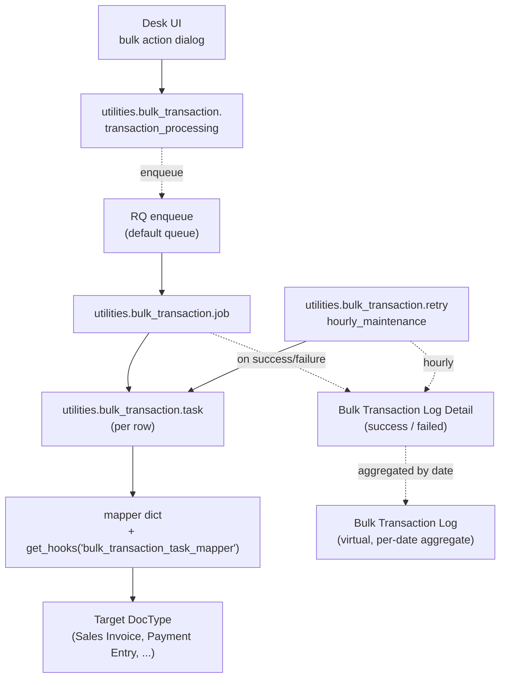

# Bulk Transaction

> **TL;DR:** A two-DocType log module ([erpnext/bulk_transaction/](../../erpnext/bulk_transaction/)) that **records** the outcome of every bulk doctype-conversion job dispatched by the UI. The actual conversion engine lives in **another module** at [erpnext/utilities/bulk_transaction.py](../../erpnext/utilities/bulk_transaction.py:1) — see [utilities.md §2](utilities.md). This module ships only `Bulk Transaction Log` (a virtual DocType that aggregates by date) and its child-detail DocType `Bulk Transaction Log Detail`. The single hook is the hourly retry scheduler `erpnext.utilities.bulk_transaction.retry` ([hooks.py:454](../../erpnext/hooks.py:454)) which scans Detail rows where `transaction_status='Failed' AND retried=0` and re-runs them with savepoint-isolation.

## Key files

- [erpnext/bulk_transaction/doctype/bulk_transaction_log/bulk_transaction_log.py](../../erpnext/bulk_transaction/doctype/bulk_transaction_log/bulk_transaction_log.py:1) — **virtual** DocType (`db_insert`, `db_update`, `delete` are all no-ops; `load_from_db` and `get_list` aggregate from Detail rows).
- [erpnext/bulk_transaction/doctype/bulk_transaction_log_detail/bulk_transaction_log_detail.py](../../erpnext/bulk_transaction/doctype/bulk_transaction_log_detail/bulk_transaction_log_detail.py:1) — plain `Document`, real table.
- [erpnext/utilities/bulk_transaction.py](../../erpnext/utilities/bulk_transaction.py:1) — the engine (entry point, dispatch, retry).
- [erpnext/hooks.py:454](../../erpnext/hooks.py:454) — `hourly_maintenance: erpnext.utilities.bulk_transaction.retry`.

## Diagram



Legend: solid = synchronous; dashed = enqueue / event / aggregation.

## 1. End-to-end lifecycle

1. **User triggers bulk action** in a list view (e.g. "Make Sales Invoice from selected Sales Orders") → desk JS calls `erpnext.utilities.bulk_transaction.transaction_processing` ([bulk_transaction.py:9](../../erpnext/utilities/bulk_transaction.py:9)).
2. **Permission gate** — `frappe.has_permission(from_doctype, "read")` and `(to_doctype, "create")` ([bulk_transaction.py:13-14](../../erpnext/utilities/bulk_transaction.py:13)).
3. **Skip-list** — rows with `status` in `("On Hold", "Closed")` are filtered out ([bulk_transaction.py:24-26](../../erpnext/utilities/bulk_transaction.py:24)).
4. **Enqueue** — `frappe.enqueue(job, deserialized_data, from_doctype, to_doctype, args)` ([bulk_transaction.py:48](../../erpnext/utilities/bulk_transaction.py:48)).
5. **Worker runs `job`** ([bulk_transaction.py:102-128](../../erpnext/utilities/bulk_transaction.py:102)) — for each row:
   - `frappe.db.savepoint("before_creation_state")`
   - `task(doc_name, from_doctype, to_doctype)`
   - On exception: `rollback(save_point=...)`; `create_log(..., status="Failed", error_description=traceback)`.
   - On success: `create_log(..., status="Success")`.
6. **`task`** ([bulk_transaction.py:131-192](../../erpnext/utilities/bulk_transaction.py:131)) — looks up `mapper[from_doctype][to_doctype]`, calls the mapping function (e.g. `sales_order.make_sales_invoice`), then inserts the returned doc with `flags.ignore_validate = True` and `insert(ignore_mandatory=True)`. The `frappe.flags.bulk_transaction = True` flag is set during the insert so consumers can short-circuit re-validation.
7. **`show_job_status`** ([bulk_transaction.py:209-235](../../erpnext/utilities/bulk_transaction.py:209)) — final UI message: "Successful" (green), "Partially successful" (orange), or "Failed" (red).

## 2. Mapper extension

[bulk_transaction.py:176-178](../../erpnext/utilities/bulk_transaction.py:176):

```python
hooks = frappe.get_hooks("bulk_transaction_task_mapper")
for hook in hooks:
    mapper.update(frappe.get_attr(hook)())
```

Custom apps can register their own DocType conversions by adding to `bulk_transaction_task_mapper` in their hooks. Each registered callable returns a dict of the same shape as the in-tree `mapper` (see [utilities.md §2.2](utilities.md) for the in-tree map).

## 3. Hourly retry scheduler

`retry(date=None)` at [bulk_transaction.py:57-79](../../erpnext/utilities/bulk_transaction.py:57) is wired to `hourly_maintenance` at [hooks.py:454](../../erpnext/hooks.py:454).

Logic:
- Defaults to `today()`.
- Pulls all `Bulk Transaction Log Detail` rows with `date=today AND transaction_status='Failed' AND retried=0`.
- Enqueues `retry_failed_transactions(failed_docs)` ([bulk_transaction.py:71-74](../../erpnext/utilities/bulk_transaction.py:71)).
- `retry_failed_transactions` ([bulk_transaction.py:82-92](../../erpnext/utilities/bulk_transaction.py:82)) — re-runs `task` per row, with savepoint isolation. On success: `update_log(name, "Success", retried=1)`. On failure: `update_log(name, "Failed", retried=1, traceback)`.
- **Each row is retried at most once** (the `retried=0` filter ensures already-retried rows are excluded on the next hour).

## 4. Open Questions

- `TODO(verify)` — the retry scheduler runs on `hourly_maintenance` cadence ([scheduler-jobs.md](../architecture/scheduler-jobs.md)) but only handles `today()`'s failures by default. Failures from past days are not auto-retried; a manual `retry(date=...)` call is needed.

## Related

- [Bulk Transaction DocTypes](bulk-transaction-doctypes.md)
- [Utilities module](utilities.md) — engine source.
- [Scheduler jobs](../architecture/scheduler-jobs.md) — `bulk_transaction.retry`.

## Changelog

- `2026-04-18` — initial version. Documented the two log DocTypes, the engine handoff to `utilities/bulk_transaction.py`, and the hourly retry scheduler.
