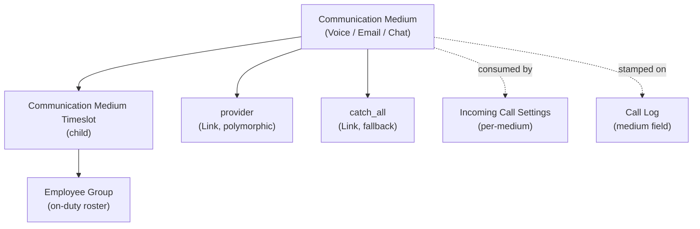

# Communication

> **TL;DR:** **Distinct from Frappe core's `Communication` DocType** ([erpnext/communication/](../../erpnext/communication/) ships only **two** DocTypes: `Communication Medium` and its child `Communication Medium Timeslot`. They are **configuration-only** records that define which mediums (Voice, Email, Chat) operate over which channels and which Employee Group is on duty during which timeslot. The actual `doc_events["Communication"]` wiring in [hooks.py:362-371](../../erpnext/hooks.py:362) does NOT live in this module — it dispatches into Support (SLA + Issue first-response) and CRM (link Communications to Prospect, update modified timestamp). This module has no scheduler jobs, no controllers, no GL impact.

## Key files

- [erpnext/communication/doctype/communication_medium/communication_medium.py](../../erpnext/communication/doctype/communication_medium/communication_medium.py:1) — 30 lines, plain `Document`. No methods.
- [erpnext/communication/doctype/communication_medium_timeslot/communication_medium_timeslot.py](../../erpnext/communication/doctype/communication_medium_timeslot/communication_medium_timeslot.py:1) — 28 lines, plain `Document` child table.

## Diagram



## 1. `Communication Medium` — what it is

[communication_medium.py:9-30](../../erpnext/communication/doctype/communication_medium/communication_medium.py:9) — fields:

- `communication_medium_type` — `DF.Literal["Voice", "Email", "Chat"]`. The fundamental classification.
- `communication_channel` — `DF.Literal` (no enumerated values in the auto-generated types — populated from a Link target or runtime list).
- `provider` — `DF.Link | None`. The integration / vendor providing the medium.
- `catch_all` — `DF.Link | None`. Fallback recipient when no schedule entry matches.
- `disabled` — `DF.Check`.
- `timeslots` — `DF.Table[CommunicationMediumTimeslot]`. When the medium is active.

**No `validate`, no `on_update`, no other lifecycle hooks.** The module is pure schema.

## 2. `Communication Medium Timeslot` — child table

[communication_medium_timeslot.py:9-27](../../erpnext/communication/doctype/communication_medium_timeslot/communication_medium_timeslot.py:9) — fields:

- `day_of_week` — `DF.Literal["Monday", ..., "Sunday"]`.
- `from_time`, `to_time` — `DF.Time`.
- `employee_group` — `DF.Link`. The on-duty group for this timeslot.
- Standard child-table linkage fields.

**No methods.**

## 3. Wiring — `doc_events["Communication"]`

For traceability: the `Communication` DocType in Frappe core has the following ERPNext-side wiring at [hooks.py:362-371](../../erpnext/hooks.py:362):

```python
"Communication": {
    "on_update": [
        "erpnext.support.doctype.service_level_agreement.service_level_agreement.on_communication_update",
        "erpnext.support.doctype.issue.issue.set_first_response_time",
    ],
    "after_insert": [
        "erpnext.crm.utils.link_communications_with_prospect",
        "erpnext.crm.utils.update_modified_timestamp",
    ],
},
```

**Important:** all four handlers live in **other modules** (Support and CRM), not in `erpnext/communication/`. This is the source of frequent confusion: the directory `erpnext/communication/` is for the *Communication Medium* DocType only.

See [support.md](support.md) and [crm.md](crm.md) for the consumer behaviour.

## 4. Consumers of `Communication Medium`

- [erpnext/telephony/doctype/call_log/call_log.py:35](../../erpnext/telephony/doctype/call_log/call_log.py:35) — `Call Log.medium` is a `DF.Data` field labelled with the medium name.
- [erpnext/telephony/doctype/call_log/call_log.py:100](../../erpnext/telephony/doctype/call_log/call_log.py:100) — `trigger_call_popup` calls `get_scheduled_employees_for_popup(self.medium)` (CRM utility) which reads the medium's `timeslots` table to pick on-duty employees for the current weekday + time.
- `Incoming Call Settings` ([erpnext/telephony/doctype/incoming_call_settings/](../../erpnext/telephony/doctype/incoming_call_settings/)) carries its own per-day routing schedule for Voice mediums; the two are complementary (the medium says "who can be on duty"; Incoming Call Settings says "what happens to a call right now").

## 5. What this module does **not** contain

- **The Frappe core `Communication` DocType** — that lives in Frappe, not ERPNext.
- **Any `doc_events`** — none registered for `Communication Medium` itself.
- **Scheduler jobs** — none.
- **Controllers** — none.
- **Regional overrides** — none.

## Open Questions

- `TODO(verify)` — `communication_channel` is declared as `DF.Literal` with no enumerated values in the auto-generated type stub at [communication_medium.py:23](../../erpnext/communication/doctype/communication_medium/communication_medium.py:23). The actual options live in the JSON schema; not inspected directly.

## Related

- [Communication DocTypes](communication-doctypes.md)
- [Support module](support.md) — `service_level_agreement.on_communication_update`, `issue.set_first_response_time` consume Communication on_update.
- [CRM module](crm.md) — `crm.utils.link_communications_with_prospect`, `update_modified_timestamp` consume Communication after_insert.
- [Telephony module](telephony.md) — Call Log carries a `medium` field; popup routing consumes Communication Medium timeslots.

## Changelog

- `2026-04-18` — initial version. Documented Communication Medium + child Timeslot, distinguished from Frappe core's Communication DocType, surfaced the cross-module `doc_events["Communication"]` wiring.
