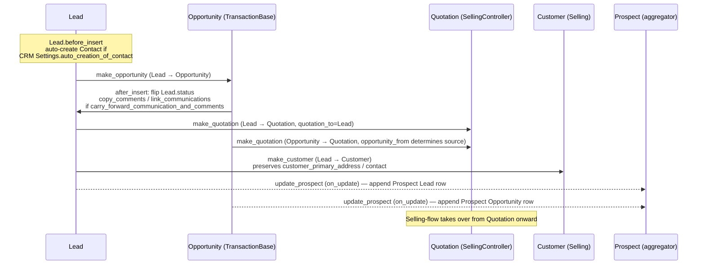
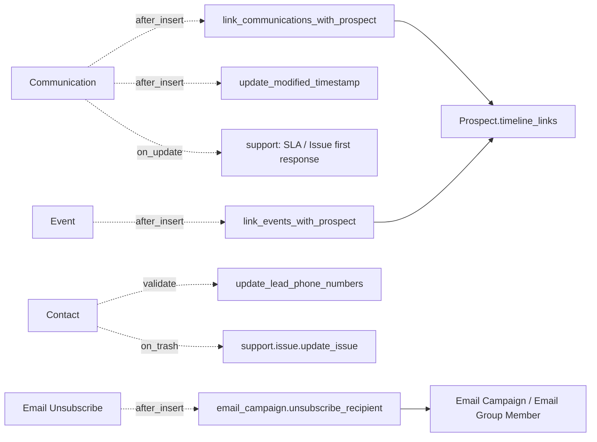

# CRM module

> **TL;DR:** CRM is the pre-sales funnel: `Lead → Opportunity → Quotation` (after which control passes to Selling). Two surprising controller choices anchor the module: `Lead` extends the full **`SellingController`** chain (so Lead carries items / pricing / taxes infrastructure even though it never books), while `Opportunity` extends the much lighter `TransactionBase` (no GL/SLE involvement). `Prospect` aggregates Leads + Opportunities under a single account-like umbrella. Five scheduler jobs, three `doc_events` registries (Communication / Event / Email Unsubscribe), and `user_privacy_documents` enrolment for GDPR scrubbing.

## Key files

- [erpnext/hooks.py:362-374](../../erpnext/hooks.py:362) — `doc_events["Communication"].after_insert` and `doc_events["Event"].after_insert` route into `crm.utils.link_communications_with_prospect` / `link_events_with_prospect` / `update_modified_timestamp`.
- [erpnext/hooks.py:401](../../erpnext/hooks.py:401) — `doc_events["Contact"].validate = "erpnext.crm.utils.update_lead_phone_numbers"`.
- [erpnext/hooks.py:403-405](../../erpnext/hooks.py:403) — `doc_events["Email Unsubscribe"].after_insert = "erpnext.crm.doctype.email_campaign.email_campaign.unsubscribe_recipient"`.
- [erpnext/hooks.py:464](../../erpnext/hooks.py:464) — `daily_maintenance` runs `opportunity.auto_close_opportunity`.
- [erpnext/hooks.py:473](../../erpnext/hooks.py:473) — `daily_maintenance` runs `contract.update_status_for_contracts`.
- [erpnext/hooks.py:478-479](../../erpnext/hooks.py:478) — `daily_maintenance` runs `email_campaign.send_email_to_leads_or_contacts` and `email_campaign.set_email_campaign_status`.
- [erpnext/hooks.py:490](../../erpnext/hooks.py:490) — `daily_maintenance` runs `crm.utils.open_leads_opportunities_based_on_todays_event`.
- [erpnext/hooks.py:622-633](../../erpnext/hooks.py:622) — `user_privacy_documents` registers Lead (`email_id` match field, scrubs `phone / mobile_no / fax / website / lead_name`) and Opportunity (`contact_email` match field, scrubs `contact_mobile / contact_display / customer_name`).
- [erpnext/hooks.py:659-660](../../erpnext/hooks.py:659) — Lead and Opportunity present in `global_search_doctypes`.
- [erpnext/crm/doctype/lead/lead.py:24](../../erpnext/crm/doctype/lead/lead.py:24) — `class Lead(SellingController, CRMNote)` — **Lead extends the full SellingController chain**.
- [erpnext/crm/doctype/lead/lead.py:97-103](../../erpnext/crm/doctype/lead/lead.py:97) — `validate` chain: `set_full_name`, `set_lead_name`, `set_title`, `set_status`, `check_email_id_is_unique`, `validate_email_id`.
- [erpnext/crm/doctype/lead/lead.py:105-122](../../erpnext/crm/doctype/lead/lead.py:105) — `before_insert` auto-creates Contact when `CRM Settings.auto_creation_of_contact = 1`; reuses existing Contact when `utm_source = "Existing Customer"`.
- [erpnext/crm/doctype/lead/lead.py:319-362](../../erpnext/crm/doctype/lead/lead.py:319) — `make_customer` mapper (Lead → Customer).
- [erpnext/crm/doctype/lead/lead.py:366-392](../../erpnext/crm/doctype/lead/lead.py:366) — `make_opportunity` mapper (Lead → Opportunity, sets `opportunity_from = "Lead"`).
- [erpnext/crm/doctype/lead/lead.py:396-413](../../erpnext/crm/doctype/lead/lead.py:396) — `make_quotation` mapper (Lead → Quotation, sets `quotation_to = "Lead"`).
- [erpnext/crm/doctype/opportunity/opportunity.py:28](../../erpnext/crm/doctype/opportunity/opportunity.py:28) — `class Opportunity(TransactionBase, CRMNote)` — **plain TransactionBase**, no AccountsController/StockController/SellingController chain.
- [erpnext/crm/doctype/opportunity/opportunity.py:121-129](../../erpnext/crm/doctype/opportunity/opportunity.py:121) — `after_insert` flips Lead status; optionally copies comments + Communications when `CRM Settings.carry_forward_communication_and_comments = 1`.
- [erpnext/crm/doctype/opportunity/opportunity.py:508-526](../../erpnext/crm/doctype/opportunity/opportunity.py:508) — `auto_close_opportunity` daily scheduler.
- [erpnext/crm/utils.py:8-31](../../erpnext/crm/utils.py:8) — `update_lead_phone_numbers(contact, method)` — Contact `validate` callback.
- [erpnext/crm/utils.py:69-84](../../erpnext/crm/utils.py:69) — `link_communications_with_prospect(communication, method)` — appends `Prospect` to `Communication.timeline_links` whenever a Communication's reference is a Prospect-attached Lead/Opportunity.
- [erpnext/crm/utils.py:87-98](../../erpnext/crm/utils.py:87) — `update_modified_timestamp(communication, method)` — bumps the parent's `modified` (without bumping `update_modified`) when `CRM Settings.update_timestamp_on_new_communication = 1`.
- [erpnext/crm/utils.py:118-160](../../erpnext/crm/utils.py:118) — `link_events_with_prospect(event, method)` — Event `after_insert` callback.
- [erpnext/crm/utils.py:222-240](../../erpnext/crm/utils.py:222) — `open_leads_opportunities_based_on_todays_event` — daily scheduler that flips Lead/Opportunity to `Open` when an Event is scheduled today.
- [erpnext/crm/utils.py:243-263](../../erpnext/crm/utils.py:243) — `CRMNote(Document)` mixin — `add_note / edit_note / delete_note` shared by Lead and Opportunity.
- [erpnext/crm/doctype/email_campaign/email_campaign.py:93-130](../../erpnext/crm/doctype/email_campaign/email_campaign.py:93) — `send_email_to_leads_or_contacts` daily scheduler.
- [erpnext/crm/doctype/email_campaign/email_campaign.py:206-222](../../erpnext/crm/doctype/email_campaign/email_campaign.py:206) — `unsubscribe_recipient` Email Unsubscribe `after_insert` callback.
- [erpnext/crm/doctype/contract/contract.py:11](../../erpnext/crm/doctype/contract/contract.py:11) — `Contract(Document)`. Submittable (`amended_from` field present).
- [erpnext/crm/doctype/contract/contract.py:129](../../erpnext/crm/doctype/contract/contract.py:129) — `update_status_for_contracts()` daily scheduler.
- [erpnext/crm/doctype/crm_settings/crm_settings.json](../../erpnext/crm/doctype/crm_settings/crm_settings.json) — Single. Module-wide knobs (see below).
- [erpnext/crm/frappe_crm_api.py](../../erpnext/crm/frappe_crm_api.py) — bridge to the standalone Frappe CRM app (separate product); not invoked by core ERPNext.

## Directory layout

```
erpnext/crm/
├── crm_dashboard/                       # dashboard config
├── dashboard_chart/                     # pre-canned charts
├── doctype/
│   ├── appointment/                     # /book_appointment portal target
│   ├── appointment_booking_settings/    # Single
│   ├── appointment_booking_slots/       # child of Appointment Booking Settings
│   ├── availability_of_slots/           # child of Appointment Booking Settings
│   ├── campaign/                        # Email Campaign parent (campaign + schedules)
│   ├── campaign_email_schedule/         # child of Campaign
│   ├── competitor/                      # master
│   ├── competitor_detail/               # TableMultiSelect on Opportunity
│   ├── contract/                        # submittable; document_type Quotation/Project/SO/PO/SI/PI
│   ├── contract_fulfilment_checklist/   # child of Contract
│   ├── contract_template/               # template Contract
│   ├── contract_template_fulfilment_terms/
│   ├── crm_note/                        # child mixin (CRMNote class) on Lead + Opportunity
│   ├── crm_settings/                    # Single
│   ├── email_campaign/
│   ├── lead/                            # extends SellingController
│   ├── lost_reason_detail/              # child on Quotation (Lost reasons)
│   ├── market_segment/                  # master
│   ├── opportunity/                     # extends TransactionBase
│   ├── opportunity_item/                # child of Opportunity
│   ├── opportunity_lost_reason/         # master
│   ├── opportunity_lost_reason_detail/  # TableMultiSelect on Opportunity
│   ├── opportunity_type/                # master
│   ├── prospect/                        # account-like aggregator over Leads + Opportunities
│   ├── prospect_lead/                   # child of Prospect
│   ├── prospect_opportunity/            # child of Prospect
│   └── sales_stage/                     # master (Opportunity.sales_stage)
├── frappe_crm_api.py                    # bridge to standalone Frappe CRM app
├── number_card/                         # KPI cards
├── report/                              # standard reports
├── utils.py                             # CRMNote mixin + 6 hook callbacks + helpers
└── workspace/
```

## Why Lead extends SellingController (and Opportunity does not)

[Lead](../../erpnext/crm/doctype/lead/lead.py:24) inherits from `SellingController` (the full chain `Document → StatusUpdater → AccountsController → StockController → SellingController`). This is **surprising** because Lead is non-submittable, has no items table, and never produces GL or SLE rows. The reason is structural: ERPNext routinely treats Lead as a `quotation_to` party (see [Quotation.quotation_to ∈ {Customer, Lead, Prospect}]) and as a default-source for tax / address / contact fetches via methods inherited from `SellingController` and `AccountsController` (`set_taxes`, `set_address_details`). The full chain is imported but most of its lifecycle hooks are no-ops on Lead because there are no `items`. See [controllers.md](../architecture/controllers.md) for the full hierarchy.

[Opportunity](../../erpnext/crm/doctype/opportunity/opportunity.py:28) by contrast extends `TransactionBase` (from `erpnext.utilities.transaction_base`) plus the `CRMNote` mixin. `TransactionBase` is a much thinner base that gives `validate_uom_is_integer`, `validate_with_previous_doc`, and similar utilities without pulling in the GL / SLE / status_updater pipeline. Opportunity has its own simple `calculate_totals` ([opportunity.py:170-180](../../erpnext/crm/doctype/opportunity/opportunity.py:170)) — no taxes-and-charges machinery, no stock checks, no payment scheduling.

`TODO(verify)` — whether `Lead`'s SellingController inheritance is intentional or historical (predates the controller split). Worth recording as an ADR if confirmed.

## Lead → Opportunity → Quotation conversion



After Quotation, control flows into the [Selling cascade](../flows/selling-flow.md) (`Quotation → Sales Order → Delivery Note → Sales Invoice`).

## Prospect — the CRM aggregator

`Prospect` is a unified account-like umbrella that groups one or more `Lead`s and `Opportunity`s under the same company-name / industry / website / market-segment context. The two child tables `Prospect Lead` and `Prospect Opportunity` are mirrors maintained by:

- [Lead.update_prospect](../../erpnext/crm/doctype/lead/lead.py:191-315) — `on_update` callback on Lead. Updates the existing `Prospect Lead` row (mirroring `lead_name / email / mobile_no / lead_owner / status`) **or** creates a new Prospect with this Lead as the first row when `company_name` is set.
- [Opportunity.update_prospect](../../erpnext/crm/doctype/opportunity/opportunity.py:182-204) — `on_update` callback on Opportunity. Copies `opportunity_amount / sales_stage / opportunity_owner / probability / expected_closing / currency / contact_person` to the matching `Prospect Opportunity` row.

`get_linked_prospect(reference_doctype, reference_name)` ([utils.py:101-115](../../erpnext/crm/utils.py:101)) is the inverse lookup used by `link_communications_with_prospect` to discover which Prospect a given Communication should be timeline-linked to.

## `doc_events` wiring (CRM as a passive consumer)



`update_lead_phone_numbers` ([utils.py:8-31](../../erpnext/crm/utils.py:8)) walks `Contact.phone_nos` after Contact validate; if the Contact is dynamically linked to a Lead, it db_sets the Lead's `phone` (preferring `is_primary_phone`) and `mobile_no` (preferring `is_primary_mobile_no`).

`link_communications_with_prospect` ([utils.py:69-84](../../erpnext/crm/utils.py:69)) is invoked on every Communication insert. Cost: one lookup against `Prospect Lead` / `Prospect Opportunity` to find the Prospect, then a `db_update` on the new `Communication Link` row. Idempotent — short-circuits if already linked.

`update_modified_timestamp` ([utils.py:87-98](../../erpnext/crm/utils.py:87)) is gated by `CRM Settings.update_timestamp_on_new_communication`. When set, every received Communication bumps the parent Lead/Opportunity `modified` column without a full save (so list views re-sort by recent activity).

## CRM Settings (the module-wide knob set)

[crm_settings.json](../../erpnext/crm/doctype/crm_settings/crm_settings.json) — Single, owned by System Manager / Sales Manager / Sales Master Manager.

| Field                                         | Default | Effect                                                                                                              |
|-----------------------------------------------|---------|---------------------------------------------------------------------------------------------------------------------|
| `campaign_naming_by`                          | -       | `Campaign Name` or `Naming Series`. Controls how `Campaign` is named.                                               |
| `allow_lead_duplication_based_on_emails`      | 0       | When unset, `Lead.check_email_id_is_unique` ([lead.py:153-170](../../erpnext/crm/doctype/lead/lead.py:153)) throws on duplicate `email_id`. |
| `auto_creation_of_contact`                    | 1       | Lead `before_insert` auto-creates a Contact (or reuses an existing one for Existing Customer leads).                |
| `close_opportunity_after_days`                | 15      | Threshold for `auto_close_opportunity` (Replied → Closed).                                                          |
| `default_valid_till`                          | -       | Default Quotation validity (consumed by Quotation defaults).                                                        |
| `carry_forward_communication_and_comments`    | 0       | Opportunity `after_insert` calls `copy_comments` + `link_communications` to inherit Lead's history.                 |
| `update_timestamp_on_new_communication`       | 0       | Drives `update_modified_timestamp` (see above).                                                                     |

## Contract — coexists with CRM but spans the cycle

[Contract](../../erpnext/crm/doctype/contract/contract.py:11) is a separate submittable Document with `document_type ∈ {Quotation, Project, Sales Order, Purchase Order, Sales Invoice, Purchase Invoice}` and `party_type ∈ {Customer, Supplier, Employee}`. Status flow: `Unsigned → Active → Inactive → Cancelled`, computed by `update_contract_status` from `is_signed` + `start_date` / `end_date`. Fulfilment status `N/A → Unfulfilled → Partially Fulfilled → Fulfilled → Lapsed` is computed from the `fulfilment_terms` checklist progress.

The daily `update_status_for_contracts` ([contract.py:129](../../erpnext/crm/doctype/contract/contract.py:129)) re-walks contracts whose date window crossed a boundary.

## Email Campaign

`Email Campaign` ([email_campaign.py:12](../../erpnext/crm/doctype/email_campaign/email_campaign.py:12)) targets a `Lead`, `Contact`, or `Email Group` and references a `Campaign` (which holds the per-day schedule of `Email Template` references).

- `set_email_campaign_status` (daily) re-evaluates `Scheduled / In Progress / Completed` from today's date vs `start_date` / `end_date`.
- `send_email_to_leads_or_contacts` (daily) walks every In-Progress campaign, finds today's scheduled entry by `(start_date + send_after_days)`, and dispatches via `frappe.sendmail` with `queue_separately=True`. Error logging via `frappe.log_error` per failure.
- `unsubscribe_recipient` (Email Unsubscribe `after_insert`) — for Email Group campaigns marks the matching `Email Group Member.unsubscribed = 1`; for Lead/Contact campaigns sets `Email Campaign.status = "Unsubscribed"`.

## Scheduler jobs

| Frequency         | Job                                                                                     | Effect                                                                                                  |
|-------------------|-----------------------------------------------------------------------------------------|---------------------------------------------------------------------------------------------------------|
| daily_maintenance | [opportunity.auto_close_opportunity](../../erpnext/crm/doctype/opportunity/opportunity.py:508) | Close `Replied` Opportunities older than `CRM Settings.close_opportunity_after_days`.                   |
| daily_maintenance | [contract.update_status_for_contracts](../../erpnext/crm/doctype/contract/contract.py:129) | Re-walk Contracts whose date window crossed a boundary today.                                           |
| daily_maintenance | [email_campaign.send_email_to_leads_or_contacts](../../erpnext/crm/doctype/email_campaign/email_campaign.py:93) | Dispatch today's scheduled campaign emails.                                                             |
| daily_maintenance | [email_campaign.set_email_campaign_status](../../erpnext/crm/doctype/email_campaign/email_campaign.py:226) | Re-evaluate campaign status (Scheduled / In Progress / Completed).                                      |
| daily_maintenance | [crm.utils.open_leads_opportunities_based_on_todays_event](../../erpnext/crm/utils.py:222) | Flip Lead/Opportunity to `Open` if an `Event` is scheduled for today.                                   |

See the consolidated [scheduler-jobs.md](../architecture/scheduler-jobs.md) for the catalogue.

## Privacy / GDPR

[user_privacy_documents](../../erpnext/hooks.py:622-633) registers Lead and Opportunity. When a Frappe-core privacy-doc deletion runs against a user, ERPNext-side it walks Leads matched by `email_id` and scrubs `phone / mobile_no / fax / website / lead_name`, and walks Opportunities matched by `contact_email` and scrubs `contact_mobile / contact_display / customer_name`. Matching is by exact email; the scrub never deletes the parent doc.

## Cross-module touch points

- **Selling.** Lead → Customer, Lead → Quotation, Opportunity → Quotation, Opportunity → Sales Order, Opportunity → Supplier Quotation. See [selling-flow.md](../flows/selling-flow.md).
- **Support.** Issue.lead foreign key (cleared on Lead.on_trash → [lead.py:130](../../erpnext/crm/doctype/lead/lead.py:130)).
- **Communication / Event (Frappe core).** All four wildcard-ish CRM hooks live here — see [hooks-catalogue.md](../architecture/hooks-catalogue.md).
- **Setup.** `Industry Type / Market Segment / Sales Stage` masters; `Territory / Department` for scoping.

## Open questions

- `TODO(verify)` — Lead's full SellingController inheritance vs Opportunity's TransactionBase inheritance — confirm whether this is intentional or historical, and whether an ADR is warranted.
- `TODO(verify)` — `frappe_crm_api.py` is a bridge file for the standalone Frappe CRM app; the in-tree consumer side is not exercised by core ERPNext at this commit. Need to confirm whether installation of Frappe CRM is a documented integration.

## Related

- [CRM DocTypes reference cards](crm-doctypes.md)
- [Selling flow](../flows/selling-flow.md) — what Quotation → SO does after Lead → Opportunity → Quotation.
- [Selling module](selling.md) — Quotation / Sales Order / Customer master.
- [Support module](support.md) — Issue.lead reverse FK.
- [Controllers](../architecture/controllers.md) — the `SellingController` chain Lead inherits.
- [Hooks catalogue](../architecture/hooks-catalogue.md)
- [Scheduler jobs](../architecture/scheduler-jobs.md)

## Changelog

- `2026-04-18` — initial version. Documented Lead/Opportunity controller-base difference, Lead → Opportunity → Quotation conversion, Prospect aggregator, doc_events wiring, CRM Settings knob set, Contract status machine, Email Campaign send pipeline, five scheduler jobs, GDPR registration.
