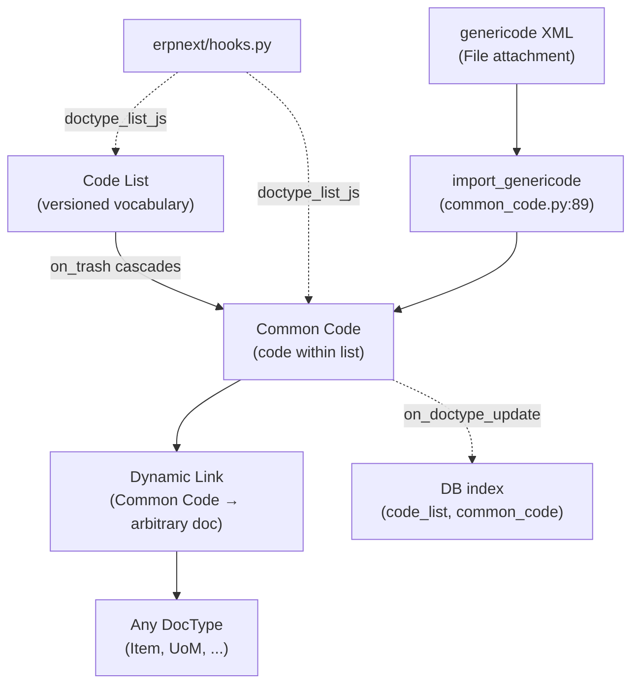

# EDI

> **TL;DR:** A new and intentionally narrow module ([erpnext/edi/](../../erpnext/edi/)) added in v17. Two DocTypes only: `Code List` (a versioned vocabulary, e.g. UN/CEFACT) and `Common Code` (a code-within-list with Dynamic Link references to arbitrary records). The single hook is `doctype_list_js` ([hooks.py:45-52](../../erpnext/hooks.py:45)) which injects `code_list_import.js` into both list views to render the genericode-XML import button. Both DocTypes carry minimal lifecycle (one `validate` and one `on_trash`) and three module-level helpers `get_codes_for` / `get_docnames_for` / `get_default_code` that callers use to resolve "what UN/CEFACT code applies to this Item" lookups. **Scope is narrow at this commit; revisit if v17 expands the e-invoicing surface.**

## Key files

- [erpnext/edi/doctype/code_list/code_list.py](../../erpnext/edi/doctype/code_list/code_list.py:1) — `CodeList(Document)`; `on_trash` cascade-deletes Common Codes; helper trio `get_codes_for` / `get_docnames_for` / `get_default_code`; `from_genericode(root)` for XML extraction.
- [erpnext/edi/doctype/common_code/common_code.py](../../erpnext/edi/doctype/common_code/common_code.py:1) — `CommonCode(Document)`; `validate` enforces distinct-link uniqueness; `from_genericode` per-row extraction; module-level `import_genericode` consumer; `on_doctype_update` adds composite index.
- [erpnext/edi/doctype/code_list/code_list_import.js](../../erpnext/edi/doctype/code_list/code_list_import.js) — list-view JS injected via `doctype_list_js`.
- [erpnext/hooks.py:45-52](../../erpnext/hooks.py:45) — `doctype_list_js = {"Code List": [...], "Common Code": [...]}`.

## Diagram



Legend: dashed = registration / event; solid = synchronous.

## 1. `Code List` — the vocabulary

[code_list.py:14-79](../../erpnext/edi/doctype/code_list/code_list.py:14) defines `class CodeList(Document)`. Fields:

- `title` — `DF.Data | None` (extracted from genericode `<ShortName>`).
- `version` — `DF.Data | None`.
- `canonical_uri` — `DF.Data | None`.
- `description` — `DF.SmallText | None` (`<LongName>`).
- `publisher` — `DF.Data | None` (`<Agency/ShortName>` or `<LongName>`).
- `publisher_id` — `DF.Data | None` (`<Agency/Identifier>`).
- `url` — `DF.Data | None` (`<LocationUri>`).
- `default_common_code` — `DF.Link | None` (the fallback code).

**Lifecycle:**

- `on_trash` ([line 33-35](../../erpnext/edi/doctype/code_list/code_list.py:33)) — unless `frappe.flags.in_bulk_delete`, calls `__delete_linked_docs` ([line 37-47](../../erpnext/edi/doctype/code_list/code_list.py:37)) which:
  1. Sets `default_common_code = None` to break the FK before the cascade.
  2. Deletes every `Common Code` with `code_list = self.name`.

**Methods:**

- `get_codes_for(doctype, name)` ([line 49](../../erpnext/edi/doctype/code_list/code_list.py:49)) — instance wrapper around module-level `get_codes_for`.
- `get_docnames_for(doctype, code)` ([line 53](../../erpnext/edi/doctype/code_list/code_list.py:53)) — instance wrapper.
- `get_default_code()` ([line 57](../../erpnext/edi/doctype/code_list/code_list.py:57)) — resolves `default_common_code` → its `common_code` value.
- `from_genericode(root)` ([line 65-78](../../erpnext/edi/doctype/code_list/code_list.py:65)) — populates `title` / `version` / `canonical_uri` / `description` / `publisher` / `publisher_id` / `url` from a genericode XML `Element`. Uses `escape_html` on text nodes.

## 2. Module-level helpers (Code List)

- `get_codes_for(code_list, doctype, name) -> tuple[str]` ([line 81-100](../../erpnext/edi/doctype/code_list/code_list.py:81)) — joins `tabCommon Code` to `tabDynamic Link` to find every `Common Code.common_code` whose Dynamic Link points to `(doctype, name)` within the named code list. Returns distinct values, ordered by `common_code`.
- `get_docnames_for(code_list, doctype, code) -> tuple[str]` ([line 103-122](../../erpnext/edi/doctype/code_list/code_list.py:103)) — inverse: returns all docnames of `doctype` mapped to `code` within `code_list`. Ordered by `idx`.
- `get_default_code(code_list)` ([line 125-128](../../erpnext/edi/doctype/code_list/code_list.py:125)) — module-level wrapper for the Single's `default_common_code` resolver.

## 3. `Common Code` — the per-code record

[common_code.py:15-82](../../erpnext/edi/doctype/common_code/common_code.py:15) defines `class CommonCode(Document)`. Fields:

- `code_list` — `DF.Link` to `Code List`. Required.
- `common_code` — `DF.Data`. Required.
- `title` — `DF.Data`. Required.
- `description` — `DF.SmallText | None`.
- `canonical_uri` — `DF.Data | None`.
- `additional_data` — `DF.Code | None` (raw genericode XML for the row, pretty-printed).
- `applies_to` — `DF.Table[DynamicLink]` (Dynamic Links to the records this code applies to).

**Lifecycle:**

- `validate` ([line 34-35](../../erpnext/edi/doctype/common_code/common_code.py:34)) → `validate_distinct_references` ([line 37-59](../../erpnext/edi/doctype/common_code/common_code.py:37)). For each row in `applies_to`, refuses if another `Common Code` in the same `code_list` already links to the same `(link_doctype, link_name)` pair.

**Methods:**

- `from_genericode(column_map, xml_element)` ([line 61-82](../../erpnext/edi/doctype/common_code/common_code.py:61)) — populates `common_code`, `title`, `description` from XML `<Value ColumnRef="...">SimpleValue</Value>` nodes. Stores the full XML element in `additional_data` for round-trip.

## 4. Module-level helpers (Common Code)

- `import_genericode(code_list, file_name, column_map, filters=None)` ([common_code.py:89-113](../../erpnext/edi/doctype/common_code/common_code.py:89)):
  1. Loads the `File` doc, checks read permission.
  2. Parses with `parse_genericode_content` ([erpnext/edi/doctype/code_list/code_list_import.py](../../erpnext/edi/doctype/code_list/code_list_import.py)).
  3. Builds an XPath expression over `.//SimpleCodeList/Row` with optional column-equality filters.
  4. For each matching `Row` element: instantiates a fresh `CommonCode`, calls `from_genericode`, saves.
  5. Publishes progress via `frappe.publish_progress` per row.
- `simple_hash(input_string, length=6)` ([line 85-86](../../erpnext/edi/doctype/common_code/common_code.py:85)) — `blake2b` hash helper.
- `on_doctype_update()` ([line 116-117](../../erpnext/edi/doctype/common_code/common_code.py:116)) — adds composite index `(code_list, common_code)` so per-list code lookups are fast. Frappe core invokes this on schema sync.

## 5. The `doctype_list_js` hook

[hooks.py:45-52](../../erpnext/hooks.py:45):

```python
doctype_list_js = {
    "Code List": ["edi/doctype/code_list/code_list_import.js"],
    "Common Code": ["edi/doctype/code_list/code_list_import.js"],
}
```

The same JS file is injected into both list views — it adds the genericode-XML import dialog to the list-view toolbar. Both DocTypes share the import flow.

## 6. What this module does **not** contain

- **No GL or SLE impact.** Pure metadata.
- **No scheduler jobs.**
- **No `doc_events`.** Both DocTypes' lifecycle is local (`validate`, `on_trash`).
- **No regional overrides.** Even though e-invoicing per country (Italy FatturaPA, etc.) uses code lists conceptually, the regional implementations (in `erpnext/regional/`) do not consume EDI's DocTypes at this commit.
- **No `on_doctype_class` overrides** of any other DocType.

## Open Questions

- `TODO(verify)` — whether the EDI module is intended to expand to e-invoicing pipelines in v17. At this commit it is a vocabulary store with import tooling; no consumer (other than potentially future EDI document DocTypes) reads `Common Code.applies_to` for transactional purposes.

## Related

- [EDI DocTypes](edi-doctypes.md)
- [Hooks & overrides](../architecture/hooks-and-overrides.md)
- [Regional module](regional.md) — country-specific e-invoicing layers (Italy FatturaPA) that may eventually integrate with EDI.

## Changelog

- `2026-04-18` — initial version. Documented Code List + Common Code, the genericode import flow, the `doctype_list_js` registration, and the explicit "narrow scope" framing.
