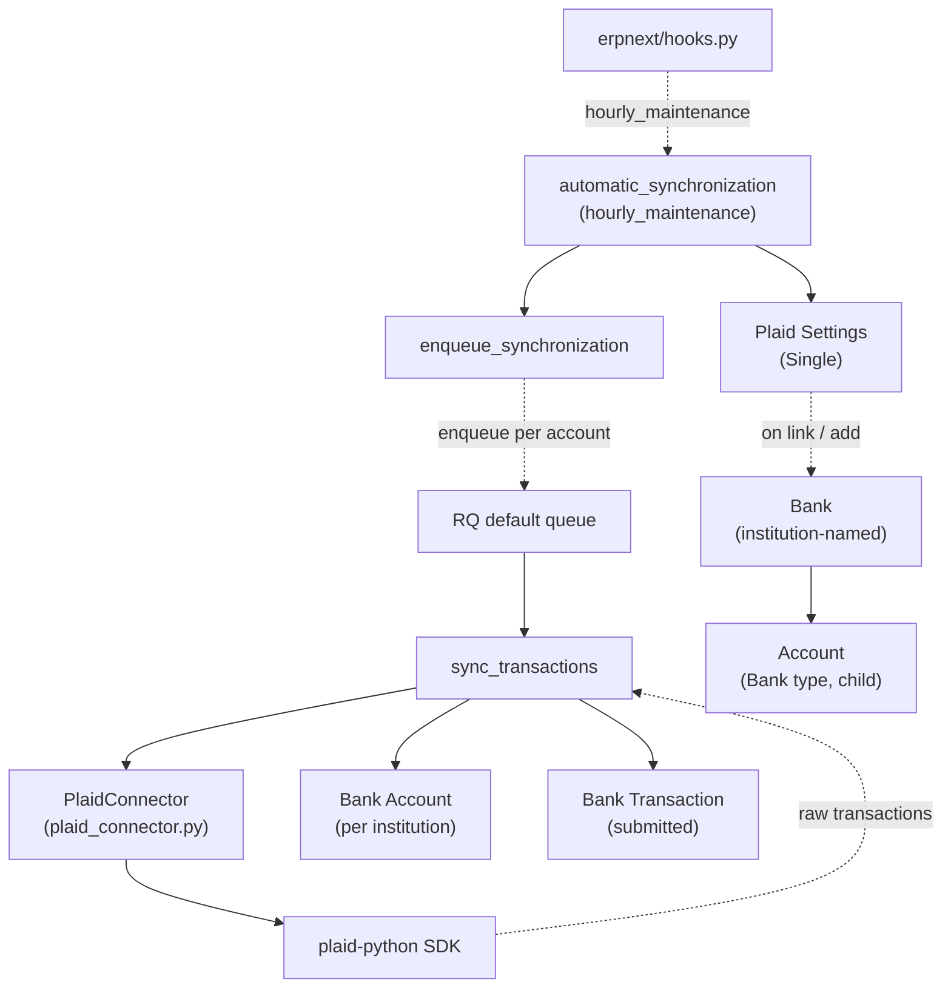

# ERPNext Integrations

> **TL;DR:** A thin module ([erpnext/erpnext_integrations/](../../erpnext/erpnext_integrations/)) whose only first-party integration today is **Plaid bank-feed sync**. Ships one DocType (`Plaid Settings`, Single), one helper module ([utils.py](../../erpnext/erpnext_integrations/utils.py:1)) with two reusable functions (`validate_webhooks_request`, `get_webhook_address`, `get_tracking_url`), one customisation file ([custom/contact.json](../../erpnext/erpnext_integrations/custom/contact.json)) that adds Plaid-related fields to the Contact form, and one scheduler job (`automatic_synchronization` on `hourly_maintenance`, [hooks.py:457](../../erpnext/hooks.py:457)). The Plaid sync uses the official `plaid-python` SDK (`from plaid.errors import ItemError` at [plaid_settings.py:11](../../erpnext/erpnext_integrations/doctype/plaid_settings/plaid_settings.py:11)) and posts new transactions into the standard `Bank Transaction` DocType (Accounts module).

## Key files

- [erpnext/erpnext_integrations/doctype/plaid_settings/plaid_settings.py](../../erpnext/erpnext_integrations/doctype/plaid_settings/plaid_settings.py:1) — `PlaidSettings(Document)` Single + `add_institution`, `add_bank_accounts`, `sync_transactions`, `get_transactions`, `new_bank_transaction`, `automatic_synchronization`, `enqueue_synchronization`, `get_link_token_for_update`, `update_bank_account_ids`.
- [erpnext/erpnext_integrations/doctype/plaid_settings/plaid_connector.py](../../erpnext/erpnext_integrations/doctype/plaid_settings/plaid_connector.py) — `PlaidConnector` wrapper (token / API client lifecycle).
- [erpnext/erpnext_integrations/utils.py](../../erpnext/erpnext_integrations/utils.py:1) — generic helpers (HMAC webhook validation, tracking URL formatter).
- [erpnext/erpnext_integrations/custom/contact.json](../../erpnext/erpnext_integrations/custom/contact.json) — Customize Form fixture for Contact (one extra section/fields).
- [erpnext/hooks.py:457](../../erpnext/hooks.py:457) — `hourly_maintenance: erpnext.erpnext_integrations.doctype.plaid_settings.plaid_settings.automatic_synchronization`.

## Diagram



Legend: solid = synchronous; dashed = enqueue / event / external API.

## 1. Plaid Settings — the Single

[plaid_settings.py:16-37](../../erpnext/erpnext_integrations/doctype/plaid_settings/plaid_settings.py:16) defines `class PlaidSettings(Document)`. Fields (auto-generated types):

- `enabled` — `DF.Check` (master switch).
- `automatic_sync` — `DF.Check` (gates the hourly scheduler).
- `enable_european_access` — `DF.Check`.
- `plaid_client_id` — `DF.Data | None`.
- `plaid_secret` — `DF.Password | None`.
- `plaid_env` — `DF.Literal["sandbox", "development", "production"]`.

**Lifecycle:** none beyond `Document`. (No `validate`, no `on_update`.)

**API surface:**
- `get_link_token` ([static method, line 33](../../erpnext/erpnext_integrations/doctype/plaid_settings/plaid_settings.py:33)) — returns a Plaid Link token for the front-end.

## 2. The hourly scheduler

`automatic_synchronization()` at [plaid_settings.py:316-319](../../erpnext/erpnext_integrations/doctype/plaid_settings/plaid_settings.py:316):

```python
def automatic_synchronization():
    settings = frappe.get_doc("Plaid Settings", "Plaid Settings")
    if settings.enabled == 1 and settings.automatic_sync == 1:
        enqueue_synchronization()
```

Wired to `hourly_maintenance` at [hooks.py:457](../../erpnext/hooks.py:457). Both flags must be on for any work to happen.

`enqueue_synchronization()` at [plaid_settings.py:322-333](../../erpnext/erpnext_integrations/doctype/plaid_settings/plaid_settings.py:322) — pulls every Bank Account whose `integration_id` is set (i.e. linked to Plaid) and enqueues one `sync_transactions(bank, bank_account)` job per account.

## 3. `sync_transactions` — the per-account worker

[plaid_settings.py:198-227](../../erpnext/erpnext_integrations/doctype/plaid_settings/plaid_settings.py:198):

1. Reads `Bank Account.last_integration_date` ([line 201](../../erpnext/erpnext_integrations/doctype/plaid_settings/plaid_settings.py:201)). If unset, falls back to **12 months ago** ([line 205](../../erpnext/erpnext_integrations/doctype/plaid_settings/plaid_settings.py:205)).
2. Calls `get_transactions(bank, bank_account, start_date, end_date=today)` ([line 209](../../erpnext/erpnext_integrations/doctype/plaid_settings/plaid_settings.py:209)) → `PlaidConnector.get_transactions` (in `plaid_connector.py`).
3. For each returned transaction (in **reverse chronological order**, [line 215](../../erpnext/erpnext_integrations/doctype/plaid_settings/plaid_settings.py:215)) calls `new_bank_transaction(transaction)` ([line 257](../../erpnext/erpnext_integrations/doctype/plaid_settings/plaid_settings.py:257)).
4. Updates `Bank Account.last_integration_date` to the **most recent** transaction's date ([line 225](../../erpnext/erpnext_integrations/doctype/plaid_settings/plaid_settings.py:225)).

Failure handling: any exception is logged via `frappe.log_error(traceback, "Plaid transactions sync error")` ([line 227](../../erpnext/erpnext_integrations/doctype/plaid_settings/plaid_settings.py:227)) — the scheduler tick does not raise.

`ItemError(code='ITEM_LOGIN_REQUIRED')` is special-cased ([line 248-252](../../erpnext/erpnext_integrations/doctype/plaid_settings/plaid_settings.py:248)) — logs a Plaid Link Refresh Required message and silently skips (the bank user must re-authenticate via the Plaid Link UI).

## 4. `new_bank_transaction` — Plaid → Bank Transaction

[plaid_settings.py:257-313](../../erpnext/erpnext_integrations/doctype/plaid_settings/plaid_settings.py:257):

- Skips when `transaction_id` already exists in `tabBank Transaction` OR the Plaid record is `pending=true` ([line 278-280](../../erpnext/erpnext_integrations/doctype/plaid_settings/plaid_settings.py:278)).
- Sign convention: positive amount → `withdrawal`, negative amount → `deposit` ([line 263-268](../../erpnext/erpnext_integrations/doctype/plaid_settings/plaid_settings.py:263)).
- Inserts `Bank Transaction` with `transaction_type = transaction_code or payment_method`, `reference_number = check_number or reference_number or name`, `description = name`.
- **`new_transaction.submit()`** ([line 303](../../erpnext/erpnext_integrations/doctype/plaid_settings/plaid_settings.py:303)) — every imported transaction is submitted (status `Pending` in Bank Transaction terms; Bank Reconciliation will mark it `Reconciled` later).
- Adds Plaid category tags via `frappe.desk.doctype.tag.tag.add_tag` ([line 305](../../erpnext/erpnext_integrations/doctype/plaid_settings/plaid_settings.py:305)).

## 5. `add_institution` and `add_bank_accounts` — onboarding

[plaid_settings.py:53-78](../../erpnext/erpnext_integrations/doctype/plaid_settings/plaid_settings.py:53) — `add_institution(token, response)`:

- Exchanges the Plaid public token for a permanent access token via `PlaidConnector.get_access_token`.
- Inserts a `Bank` doc named after the Plaid institution, storing `plaid_access_token` on it. If a Bank with that name already exists, just updates the token.

[plaid_settings.py:81-181](../../erpnext/erpnext_integrations/doctype/plaid_settings/plaid_settings.py:81) — `add_bank_accounts(response, bank, company)`:

- Requires a group `Account` with `account_type='Bank'` to exist for the company ([line 92-99](../../erpnext/erpnext_integrations/doctype/plaid_settings/plaid_settings.py:92)) — otherwise throws.
- For each Plaid account in the link response:
  - Auto-creates `Bank Account Type` and `Bank Account Subtype` records if missing ([lines 102-109](../../erpnext/erpnext_integrations/doctype/plaid_settings/plaid_settings.py:102)).
  - Inserts a child `Account` (under the bank group) named `<account.name> - <institution>`.
  - Inserts a `Bank Account` ([line 127-141](../../erpnext/erpnext_integrations/doctype/plaid_settings/plaid_settings.py:127)) wired to the new GL Account, carrying `integration_id = account['id']`. The `integration_id` is what `enqueue_synchronization` filters on later.
  - On `frappe.UniqueValidationError`, emits a soft msgprint and continues; on any other exception, throws.

## 6. `utils.py` — generic integration helpers

[erpnext/erpnext_integrations/utils.py:10-27](../../erpnext/erpnext_integrations/utils.py:10) — `validate_webhooks_request(doctype, hmac_key, secret_key="secret")`:

A decorator factory. Validates that the inbound webhook's `frappe.request.data` matches the HMAC-SHA256 of the request body keyed by the secret stored on the named DocType. Sets `frappe.set_user(settings.modified_by)` on success so the webhook runs as the integration owner. **Skips validation when `frappe.in_test`.**

[erpnext/erpnext_integrations/utils.py:30-47](../../erpnext/erpnext_integrations/utils.py:30) — `get_webhook_address(connector_name, method, exclude_uri=False, force_https=False)`:

Builds `https://<host>/api/method/erpnext.erpnext_integrations.connectors.<connector>.<method>`. Note: `connectors/` directory is not present at this commit — the helper is set up for a connector subpackage that isn't shipped here.

[erpnext/erpnext_integrations/utils.py:50-56](../../erpnext/erpnext_integrations/utils.py:50) — `get_tracking_url(carrier, tracking_number)`:

Renders `Parcel Service.url_reference` with the tracking number. Used by Delivery Note / Shipment tracking links.

## 7. `custom/contact.json` — Contact form customisation

[erpnext/erpnext_integrations/custom/contact.json](../../erpnext/erpnext_integrations/custom/contact.json) is a Customize Form fixture installed during `bench migrate`. It adds Plaid-related fields to the Contact form (the exact field set is defined in the JSON; this is a fixture, not Python code).

## 8. What this module does **not** contain

- **No GL impact** of its own — sync writes to `Bank Transaction` (Accounts module), which is later reconciled by Bank Reconciliation Tool to produce Payment Entries that *do* hit the GL.
- **No additional doc_events** in `hooks.py` — the only registration is the scheduler job.
- **No connectors/ subpackage** at this commit — `get_webhook_address` references a path that does not currently exist on disk.

## Open Questions

- `TODO(verify)` — `connectors/` subpackage hinted at by `get_webhook_address` ([utils.py:31](../../erpnext/erpnext_integrations/utils.py:31)) is not present in-tree. Either out-of-tree apps are expected to provide it, or the helper is leftover from an earlier integration set.

## Related

- [ERPNext Integrations DocTypes](erpnext-integrations-doctypes.md)
- [Accounts module](accounts.md) — Bank Transaction, Bank Reconciliation Tool, Payment Entry.
- [Scheduler jobs](../architecture/scheduler-jobs.md) — `plaid_settings.automatic_synchronization`.
- [Hooks & overrides](../architecture/hooks-and-overrides.md)

## Changelog

- `2026-04-18` — initial version. Documented Plaid Settings, the hourly sync scheduler chain (automatic_synchronization → enqueue_synchronization → sync_transactions → new_bank_transaction), `utils.py` helpers, and the `custom/contact.json` fixture.
