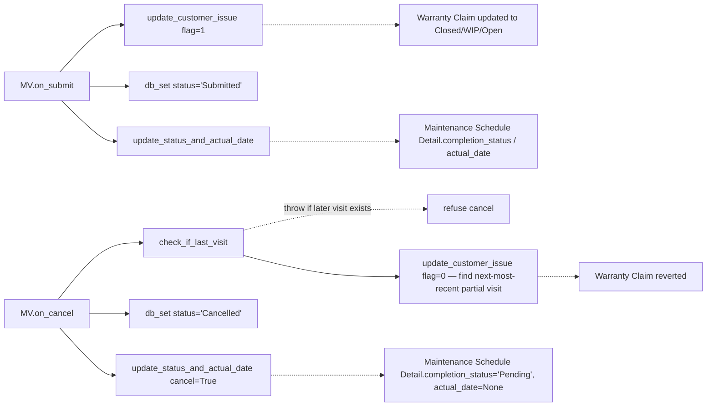

# Maintenance module

> **TL;DR:** The post-sale field-service surface: a `Maintenance Schedule` declares periodic visits (per-item × per-serial-no, with periodicity-based date generation and Sales-Person calendar Event creation), and a submittable `Maintenance Visit` records the actual on-site call (with completion status that writes back to both the Schedule's `Maintenance Schedule Detail` row and any linked `Warranty Claim`). Two top-level DocTypes, three child tables, no scheduler jobs of its own (`Serial No.update_maintenance_status` lives in Stock, `asset.update_maintenance_status` lives in Assets — both unrelated). Both top-level DocTypes extend `TransactionBase`.

## Key files

- [erpnext/hooks.py:674-676](../../erpnext/hooks.py:674) — `global_search_doctypes` lists `Maintenance Schedule`, `Maintenance Visit`, `Warranty Claim`.
- [erpnext/maintenance/doctype/maintenance_schedule/maintenance_schedule.py:13](../../erpnext/maintenance/doctype/maintenance_schedule/maintenance_schedule.py:13) — `MaintenanceSchedule(TransactionBase)`. Submittable.
- [erpnext/maintenance/doctype/maintenance_schedule/maintenance_schedule.py:48-69](../../erpnext/maintenance/doctype/maintenance_schedule/maintenance_schedule.py:48) — `generate_schedule()` (whitelisted) — fans out `Maintenance Schedule Item` rows into per-visit `Maintenance Schedule Detail` rows by calling `create_schedule_list`.
- [erpnext/maintenance/doctype/maintenance_schedule/maintenance_schedule.py:71-100](../../erpnext/maintenance/doctype/maintenance_schedule/maintenance_schedule.py:71) — `validate_end_date_visits()` (whitelisted) — back-fills `end_date` from `start_date + no_of_visits × periodicity_days` (`Weekly=7 / Monthly=30 / Quarterly=91 / Half Yearly=182 / Yearly=365`).
- [erpnext/maintenance/doctype/maintenance_schedule/maintenance_schedule.py:102-158](../../erpnext/maintenance/doctype/maintenance_schedule/maintenance_schedule.py:102) — `on_submit` — validates serial-nos, validates schedule, then for each scheduled date creates a `frappe.Event` (Private, 10:00) attributed to the Sales Person's User if available.
- [erpnext/maintenance/doctype/maintenance_schedule/maintenance_schedule.py:160-200](../../erpnext/maintenance/doctype/maintenance_schedule/maintenance_schedule.py:160) — `create_schedule_list` + `validate_schedule_date_for_holiday_list` — pull-back-by-one-day loop to dodge holidays.
- [erpnext/maintenance/doctype/maintenance_visit/maintenance_visit.py:12](../../erpnext/maintenance/doctype/maintenance_visit/maintenance_visit.py:12) — `MaintenanceVisit(TransactionBase)`. Submittable.
- [erpnext/maintenance/doctype/maintenance_visit/maintenance_visit.py:97-100](../../erpnext/maintenance/doctype/maintenance_visit/maintenance_visit.py:97) — `validate` chain: `validate_serial_no`, `validate_maintenance_date`, `validate_purpose_table`.
- [erpnext/maintenance/doctype/maintenance_visit/maintenance_visit.py:102-130](../../erpnext/maintenance/doctype/maintenance_visit/maintenance_visit.py:102) — `update_status_and_actual_date(cancel=False)` — writes `completion_status` + `actual_date` back to the matching `Maintenance Schedule Detail` row.
- [erpnext/maintenance/doctype/maintenance_visit/maintenance_visit.py:132-172](../../erpnext/maintenance/doctype/maintenance_visit/maintenance_visit.py:132) — `update_customer_issue(flag)` — when a Visit Purpose's `prevdoc_doctype = "Warranty Claim"`, writes `resolution_date / resolved_by / resolution_details / status` back to the Warranty Claim. Status mapping: `Fully Completed → Closed`, `Partially Completed → Work In Progress`, otherwise `Open`.
- [erpnext/maintenance/doctype/maintenance_visit/maintenance_visit.py:174-196](../../erpnext/maintenance/doctype/maintenance_visit/maintenance_visit.py:174) — `check_if_last_visit()` — refuses cancel if a later non-cancelled Maintenance Visit exists against the same `prevdoc_docname`.
- [erpnext/maintenance/doctype/maintenance_visit/maintenance_visit.py:198-206](../../erpnext/maintenance/doctype/maintenance_visit/maintenance_visit.py:198) — `on_submit` / `on_cancel` — flip `status`, propagate to `Maintenance Schedule Detail`, propagate to `Warranty Claim`.

## Directory layout

```
erpnext/maintenance/
├── doctype/
│   ├── maintenance_schedule/           # submittable; generates per-visit detail rows
│   ├── maintenance_schedule_detail/    # child of Maintenance Schedule (one row per visit)
│   ├── maintenance_schedule_item/      # child of Maintenance Schedule (per item × periodicity)
│   ├── maintenance_visit/              # submittable; records the actual visit
│   └── maintenance_visit_purpose/      # child of Maintenance Visit
└── report/
```

No `workspace/`, no `web_form/`, no `dashboard_chart/` — Maintenance is desk-only and report-light.

## Lifecycle — Maintenance Schedule → Maintenance Visit

```mermaid
sequenceDiagram
    participant U as User
    participant MS as Maintenance Schedule (draft)
    participant MSI as Maintenance Schedule Item rows
    participant MSD as Maintenance Schedule Detail rows
    participant E as frappe.Event
    participant MV as Maintenance Visit
    participant MVP as Maintenance Visit Purpose
    participant SN as Serial No
    participant WC as Warranty Claim

    U->>MS: insert / pick items + start_date + no_of_visits + periodicity + serial_and_batch_bundle
    U->>MS: click "Generate Schedule" (validate_end_date_visits + generate_schedule)
    MS->>MSI: walk each item row
    MS->>MSD: append no_of_visits child rows<br/>(scheduled_date computed via add_days, holiday-skipped)
    U->>MS: submit
    MS->>SN: validate_serial_no + update_amc_date<br/>(per-item from Serial and Batch Bundle)
    MS->>E: per scheduled_date — create Event<br/>(owner = Sales Person's User; Private; 10:00)

    Note over MV,WC: Field engineer logs visit
    U->>MV: insert (link to Maintenance Schedule + maintenance_schedule_detail)
    U->>MV: append Maintenance Visit Purpose rows (per item / serial_no)
    U->>MV: pick prevdoc_docname = Warranty Claim (optional)
    U->>MV: validate (date in MS window, serial nos exist, purposes non-empty)
    U->>MV: submit
    MV->>MSD: db_set completion_status + actual_date<br/>(Pending → Partially / Fully Completed)
    MV->>WC: db_set resolution_date / resolved_by / resolution_details / status<br/>(Fully Completed → Closed)
```

### How `generate_schedule` distributes visits over time

[generate_schedule](../../erpnext/maintenance/doctype/maintenance_schedule/maintenance_schedule.py:48-69) walks each `Maintenance Schedule Item` and calls [create_schedule_list](../../erpnext/maintenance/doctype/maintenance_schedule/maintenance_schedule.py:160-177):

```python
add_by = (end_date - start_date).days / no_of_visits
for _visit in range(no_of_visits):
    start_date_copy += add_by                       # Float-day stride
    schedule_date = validate_schedule_date_for_holiday_list(start_date_copy, sales_person)
    if schedule_date > end_date:
        schedule_date = end_date                    # Clamp final visit
    schedule_list.append(schedule_date)
```

`validate_schedule_date_for_holiday_list` ([maintenance_schedule.py:179-200](../../erpnext/maintenance/doctype/maintenance_schedule/maintenance_schedule.py:179)) iterates *backwards* one day at a time until a non-holiday is found, capped by the count of holidays in the list (so it cannot run away). The Sales Person's `Employee → Holiday List` is preferred; falls back to `Company.default_holiday_list`.

### Calendar Event creation on submit

For each `(Maintenance Schedule Item, scheduled_date)` pair, [on_submit](../../erpnext/maintenance/doctype/maintenance_schedule/maintenance_schedule.py:141-156) creates a private `frappe.Event` at 10:00 with the Maintenance Schedule as a participant. The event owner is the Sales Person's User (resolved via `Sales Person.get_email_id()`); when the Sales Person has no User, the Schedule's own owner is used and a `msgprint` warns the operator. Cleanup on cancel goes through `delete_events` (imported from `erpnext.utilities.transaction_base`).

### Serial-no AMC date update

When a `Maintenance Schedule Item` references a `Serial and Batch Bundle`, the on_submit pulls the serial nos from the bundle and calls `update_amc_date(serial_nos, end_date)` ([maintenance_schedule.py:117](../../erpnext/maintenance/doctype/maintenance_schedule/maintenance_schedule.py:117)) — propagating the schedule end date as the AMC expiry on each `Serial No` master. This is the bridge to [Stock](stock.md)'s `Serial No.update_maintenance_status` daily scheduler ([hooks.py:468](../../erpnext/hooks.py:468)) which uses `amc_expiry_date` to flip serial-no status.

### Maintenance Visit submit / cancel writeback



The cancel path's `update_customer_issue(flag=0)` ([maintenance_visit.py:146-160](../../erpnext/maintenance/doctype/maintenance_visit/maintenance_visit.py:146)) is the most surgical part of the module: it queries for the next-most-recent `Partially Completed` Maintenance Visit against the same Warranty Claim and reverts the claim's `resolution_date / resolved_by / resolution_details / status` to that prior visit's values. If no such prior visit exists, the claim reverts to `Open` with empty resolution fields.

`check_if_last_visit` ([maintenance_visit.py:174-196](../../erpnext/maintenance/doctype/maintenance_visit/maintenance_visit.py:174)) refuses cancel when *any* later submitted Maintenance Visit references the same `prevdoc_docname` (typically a Sales Order or Warranty Claim). The user is told to cancel the later visits first.

## Cross-module touch points

- **Support.** Warranty Claim → Maintenance Visit handoff is the canonical inbound for serial-no fault tracking. See [support.md](support.md#warranty-claim--the-support-side-of-post-sale-fault-tracking) and [support-doctypes.md](support-doctypes.md).
- **Stock.** Maintenance Schedule Item references `Serial and Batch Bundle` and propagates `amc_expiry_date` on Serial No masters. The daily `Serial No.update_maintenance_status` ([hooks.py:468](../../erpnext/hooks.py:468)) consumes that date. See [stock-doctypes.md](stock-doctypes.md).
- **Selling.** Maintenance Visit Purpose's `prevdoc_doctype` typically points back to a Sales Order (the originating sale) or to a Warranty Claim derived from one.
- **Setup.** Sales Person + Holiday List + Company.default_holiday_list drive the schedule date generation and Event ownership.
- **Frappe core.** `frappe.Event` (calendar) is created on Schedule submit; `frappe.Comment` is used for audit trails on the Visit.

## Scheduler jobs

**None.** Confirmed by `grep -n maintenance erpnext/hooks.py` — the only matches in `scheduler_events` are:
- `erpnext.stock.doctype.serial_no.serial_no.update_maintenance_status` (Stock-owned).
- `erpnext.assets.doctype.asset.asset.update_maintenance_status` (Assets-owned).
- `erpnext.assets.doctype.asset_maintenance_log.asset_maintenance_log.update_asset_maintenance_log_status` (Assets-owned).

The Maintenance module relies entirely on user-driven actions (submit/cancel) plus the `frappe.Event` calendar for visit reminders.

## Open questions

- `TODO(verify)` — `MaintenanceSchedule.create_schedule_list` uses a *float*-day stride (`add_by = date_diff / no_of_visits`) and forwards via `add_days(start_date_copy, add_by)` ([maintenance_schedule.py:164-168](../../erpnext/maintenance/doctype/maintenance_schedule/maintenance_schedule.py:164)). For non-integer strides this rounds idiosyncratically — confirm whether this matches business expectations on quarterly schedules.
- `TODO(verify)` — `MaintenanceVisit.maintenance_schedule_detail` (header link) and `MaintenanceVisitPurpose.maintenance_schedule_detail` (per-row link) are both supported in `update_status_and_actual_date` ([maintenance_visit.py:109-130](../../erpnext/maintenance/doctype/maintenance_visit/maintenance_visit.py:109)). The header-link path skips the per-purpose loop. Need to confirm both paths produce identical writeback semantics on multi-item visits.

## Related

- [Maintenance DocTypes reference cards](maintenance-doctypes.md)
- [Support module — Warranty Claim](support.md)
- [Stock DocTypes — Serial No](stock-doctypes.md)
- [Hooks catalogue](../architecture/hooks-catalogue.md)

## Changelog

- `2026-04-18` — initial version. Documented Maintenance Schedule generation + Event creation + Serial No AMC bridge, Maintenance Visit submit/cancel writeback to Schedule Detail and Warranty Claim, no-scheduler-jobs confirmation.
