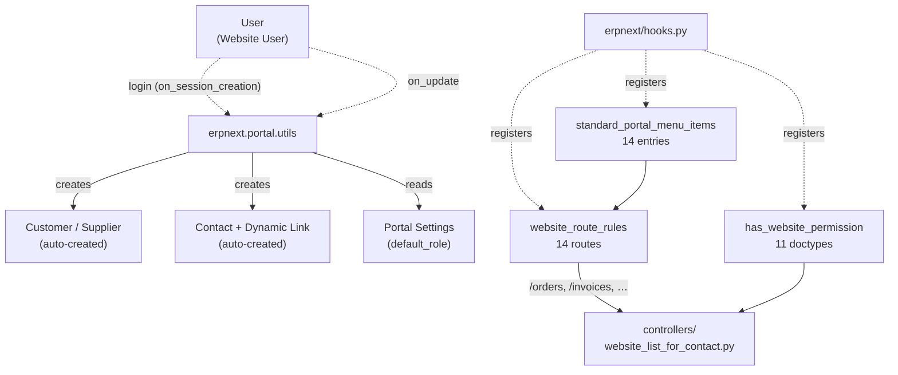

# Portal

> **TL;DR:** The Portal module is **the customer/supplier self-service surface**. Its three load-bearing entry points all sit in `erpnext/hooks.py`: `on_session_creation` ([hooks.py:75](../../erpnext/hooks.py:75)) auto-provisions a Customer or Supplier record on first login of a Website User; `standard_portal_menu_items` ([hooks.py:231-297](../../erpnext/hooks.py:231)) defines the 14-item portal sidebar; `website_route_rules` ([hooks.py:121-218](../../erpnext/hooks.py:121)) maps every public URL (`/orders`, `/invoices`, `/quotations`, …) onto a back-end DocType. The module's own DocTypes ([erpnext/portal/doctype/](../../erpnext/portal/doctype/)) are tiny — only **two** child tables (`Website Attribute`, `Website Filter Field`) used by Products Settings filtering. All the heavy lifting is in `portal/utils.py` and the configuration registries in `hooks.py`.

## Key files

- [erpnext/portal/utils.py](../../erpnext/portal/utils.py:1) — 96-line module that holds both `set_default_role` (User on_update) and `create_customer_or_supplier` (on_session_creation).
- [erpnext/portal/doctype/website_attribute/website_attribute.py](../../erpnext/portal/doctype/website_attribute/website_attribute.py:1) — child-table DocType, plain `Document`.
- [erpnext/portal/doctype/website_filter_field/website_filter_field.py](../../erpnext/portal/doctype/website_filter_field/website_filter_field.py:1) — child-table DocType, plain `Document`.
- [erpnext/hooks.py:75](../../erpnext/hooks.py:75) — `on_session_creation = "erpnext.portal.utils.create_customer_or_supplier"`.
- [erpnext/hooks.py:121-218](../../erpnext/hooks.py:121) — `website_route_rules` (14 entries; `/orders`, `/invoices`, `/quotations`, `/shipments`, `/supplier-quotations`, `/purchase-orders`, `/purchase-invoices`, `/rfq`, `/addresses`, `/boms`, `/timesheets`, `/material-requests`, `/project`, `/tasks`).
- [erpnext/hooks.py:231-297](../../erpnext/hooks.py:231) — `standard_portal_menu_items` (14 menu rows mapping route → reference DocType → required role).
- [erpnext/hooks.py:307-319](../../erpnext/hooks.py:307) — `has_website_permission` registry (11 transactional DocTypes routed to a single permission resolver in `controllers/website_list_for_contact.py`).
- [erpnext/hooks.py:357-361](../../erpnext/hooks.py:357) — `doc_events["User"]` wires `on_update` to `portal.utils.set_default_role`.
- [erpnext/hooks.py:109](../../erpnext/hooks.py:109) — `webform_list_context = "erpnext.controllers.website_list_for_contact.get_webform_list_context"` (governs Web Form list views for portal users).
- [erpnext/controllers/website_list_for_contact.py](../../erpnext/controllers/website_list_for_contact.py) — referenced by both `has_website_permission` and `webform_list_context`; the canonical permission/list handler for the portal-side transaction views.

## Diagram

Legend: `-.->` registration / event; `-->` synchronous call.

## 1. `on_session_creation` — auto-provision party

`on_session_creation = "erpnext.portal.utils.create_customer_or_supplier"` ([hooks.py:75](../../erpnext/hooks.py:75)) fires **on every login**. The handler at [erpnext/portal/utils.py:22-59](../../erpnext/portal/utils.py:22) does:

1. Reads `frappe.session.user` and short-circuits unless `User.user_type == "Website User"` ([utils.py:28](../../erpnext/portal/utils.py:28)).
2. Reads the `Portal Settings` Single ([utils.py:32-33](../../erpnext/portal/utils.py:32)) — only `default_role` values of `Customer` or `Supplier` proceed; other defaults short-circuit at [utils.py:35-36](../../erpnext/portal/utils.py:35).
3. Verifies the user actually carries the role ([utils.py:39](../../erpnext/portal/utils.py:39)) and that no Contact already linked to that doctype exists for this email (`party_exists` at [utils.py:88-96](../../erpnext/portal/utils.py:88)).
4. Calls `create_party(doctype, fullname)` ([utils.py:62-76](../../erpnext/portal/utils.py:62)) which inserts a new Customer or Supplier with `<doctype>_type = "Individual"` and `flags.ignore_mandatory = True`.
5. If a party of the **opposite** doctype also exists for this email, suffixes the contact name with `-Customer` or `-Supplier` to avoid duplicate Contact names ([utils.py:54-56](../../erpnext/portal/utils.py:54)).
6. Calls `create_party_contact` ([utils.py:79-85](../../erpnext/portal/utils.py:79)) to insert a Contact carrying both the party Dynamic Link and the user email row.

**Side-effect blast radius:** every Website User login may write up to two new docs (Customer/Supplier + Contact). The function ignores permissions on insert ([utils.py:74](../../erpnext/portal/utils.py:74), [utils.py:85](../../erpnext/portal/utils.py:85)). It does **not** check whether the Customer/Supplier doctype's mandatory fields are satisfiable from the Website User profile — `flags.ignore_mandatory = True` makes the insert succeed regardless.

## 2. `set_default_role` — User on_update

`doc_events["User"].on_update` is wired to `erpnext.portal.utils.set_default_role` ([hooks.py:360](../../erpnext/hooks.py:360)). The handler at [erpnext/portal/utils.py:4-19](../../erpnext/portal/utils.py:4) walks the User's email to find a Contact, then iterates the Contact's `links` table and adds `Customer` / `Supplier` roles to the User wherever a matching link doctype is present.

Two flag guards short-circuit:

- `frappe.flags.setting_role` — set within the loop itself ([utils.py:15](../../erpnext/portal/utils.py:15)) before adding a role; the next call in the same request is silenced.
- `frappe.flags.in_migrate` — silenced during `bench migrate` ([utils.py:6-7](../../erpnext/portal/utils.py:6)).

This handler **complements** `create_customer_or_supplier`: the latter creates the party + contact on first login, this one keeps role assignment in sync any time the User doc itself is saved (e.g. an admin links the Contact to a Customer record manually after the user already has an account).

## 3. `website_route_rules` — public URL → DocType

[hooks.py:121-218](../../erpnext/hooks.py:121) declares 14 route blocks. Pattern: a list rule plus a detail rule per DocType.

| URL prefix | DocType | Detail template | Notes |
|------------|---------|-----------------|-------|
| `/orders`, `/orders/<name>` | Sales Order | `order` | Customer-facing |
| `/invoices`, `/invoices/<name>` | Sales Invoice | `order` | Customer-facing |
| `/supplier-quotations[/<name>]` | Supplier Quotation | `order` | Supplier-facing |
| `/purchase-orders[/<name>]` | Purchase Order | `order` | Supplier-facing — declared **twice** at [hooks.py:146-162](../../erpnext/hooks.py:146); benign duplication, last write wins |
| `/purchase-invoices[/<name>]` | Purchase Invoice | `order` | Supplier-facing |
| `/quotations[/<name>]` | Quotation | `order` | Customer-facing |
| `/shipments[/<name>]` | Delivery Note | `order` | Customer-facing |
| `/rfq[/<name>]` | Request for Quotation | `rfq` | Supplier-facing; bespoke template |
| `/addresses[/<name>]` | Address | `addresses` | Both roles |
| `/boms` | BOM | (list only) | Public BOM browse |
| `/timesheets` | Timesheet | (list only) | Customer-facing |
| `/material-requests[/<name>]` | Material Request | `material_request_info` | Customer-facing |
| `/project` | Project | (list only) | Customer-facing |
| `/tasks` | Task | (list only) | Customer-facing |

The detail templates (`order`, `rfq`, `addresses`, `material_request_info`) live in [erpnext/templates/pages/](../../erpnext/templates/pages/). The list views are rendered by Frappe core's webform / list-for-contact infrastructure, gated by `has_website_permission` (next section).

> Note: the duplicate `/purchase-orders/<name>` block at [hooks.py:155-162](../../erpnext/hooks.py:155) is identical to the preceding one. `TODO(verify)` — likely an editing artefact; the second registration silently overwrites the first.

## 4. `has_website_permission` — portal access gate

[hooks.py:307-319](../../erpnext/hooks.py:307) routes 11 DocTypes to a **single** resolver: `erpnext.controllers.website_list_for_contact.has_website_permission`.

Covered DocTypes: Sales Order, Quotation, Sales Invoice, Supplier Quotation, Purchase Order, Purchase Invoice, Material Request, Delivery Note, Timesheet, Project, plus Issue (routed to `support.doctype.issue.issue.has_website_permission` instead).

The resolver in [controllers/website_list_for_contact.py](../../erpnext/controllers/website_list_for_contact.py) walks the requesting user's Contact links, finds the Customer / Supplier ID(s), and gates record visibility by matching the doc's `customer` / `supplier` field. This is what scopes `/orders`, `/invoices`, etc. to the logged-in customer's own records.

The same module also exports `get_webform_list_context` ([hooks.py:109](../../erpnext/hooks.py:109)) which is the analogous gate for any Web Form using the portal.

## 5. `standard_portal_menu_items` — sidebar definition

[hooks.py:231-297](../../erpnext/hooks.py:231) declares 14 sidebar entries:

| Entry | Route | Reference DocType | Role |
|-------|-------|-------------------|------|
| Projects | `/project` | Project | Customer |
| Request for Quotations | `/rfq` | Request for Quotation | Supplier |
| Supplier Quotation | `/supplier-quotations` | Supplier Quotation | Supplier |
| Purchase Orders | `/purchase-orders` | Purchase Order | Supplier |
| Purchase Invoices | `/purchase-invoices` | Purchase Invoice | Supplier |
| Quotations | `/quotations` | Quotation | Customer |
| Orders | `/orders` | Sales Order | Customer |
| Invoices | `/invoices` | Sales Invoice | Customer |
| Shipments | `/shipments` | Delivery Note | Customer |
| Issues | `/issues` | Issue | Customer |
| Addresses | `/addresses` | Address | Customer |
| Timesheets | `/timesheets` | Timesheet | Customer |
| Newsletter | `/newsletters` | Newsletter | _(no role gate)_ |
| Material Request | `/material-requests` | Material Request | Customer |
| Appointment Booking | `/book_appointment` | _(none)_ | _(public)_ |

Frappe core renders the sidebar by joining the entry's `role` against the logged-in user's roles, so a Customer-only login sees the customer subset and a Supplier-only login sees the supplier subset. Newsletter and Appointment Booking are visible to all.

## 6. Portal-side DocTypes (the 2 in `portal/doctype/`)

Both are tiny Document subclasses with no methods; they exist purely as **child tables** consumed by other DocTypes (notably `Products Settings` for storefront filter configuration). See [portal-doctypes.md](portal-doctypes.md) for the per-card reference.

- `Website Attribute` ([erpnext/portal/doctype/website_attribute/](../../erpnext/portal/doctype/website_attribute/)) — links an Item Attribute as a filterable facet.
- `Website Filter Field` ([erpnext/portal/doctype/website_filter_field/](../../erpnext/portal/doctype/website_filter_field/)) — selects an Item field as a filterable facet.

The remaining customer/supplier-master Portal User row that the front-end shows on the Customer / Supplier form lives **outside this module** at [erpnext/utilities/doctype/portal_user/](../../erpnext/utilities/doctype/portal_user/) — see [utilities-doctypes.md](utilities-doctypes.md).

## 7. What this module does **not** contain

For traceability when a portal feature seems "missing":

- **Portal Settings** (the Single that drives `default_role`) lives in **Frappe core**, not this module.
- **Web Forms** are Frappe core; the only ERPNext-side wiring is `webform_list_context` ([hooks.py:109](../../erpnext/hooks.py:109)).
- **Shopping Cart** has its own near-empty module at [erpnext/shopping_cart/](../../erpnext/shopping_cart/) — see [shopping-cart.md](shopping-cart.md).
- **Customer-facing Jinja templates** (`order.html`, `rfq.html`, `material_request_info.html`, `addresses.html`) live under [erpnext/templates/pages/](../../erpnext/templates/pages/) — see [www-and-templates.md](www-and-templates.md).
- **Public chat / support widget**, **support article browser** — under [erpnext/www/support/](../../erpnext/www/support/) (overview-only) and the `Support` module respectively.
- **Appointment Booking** — Setup / Setup Wizard module owns the DocType; the public `/book_appointment` endpoint is the consumer.

## Related

- [Customer-portal flow](../flows/customer-portal-flow.md) — end-to-end login → role assignment → menu rendering → route resolution.
- [Hooks catalogue](../architecture/hooks-catalogue.md) — `treeviews`, `calendars`, `website_generators`, `additional_timeline_content` and the other registries this module's behaviour piggybacks on.
- [Boot session](../architecture/boot-session.md) — what bootinfo data the desk receives; portal pages render via Jinja and do not consume bootinfo.
- [Portal DocType reference cards](portal-doctypes.md) — per-DocType cards.
- [Selling DocTypes](selling-doctypes.md) — Customer, Quotation, Sales Order, Sales Invoice, Delivery Note (the customer-portal record set).
- [Buying DocTypes](buying-doctypes.md) — Supplier, Supplier Quotation, Purchase Order, Purchase Invoice, RFQ (the supplier-portal record set).
- [Setup DocTypes](setup-doctypes.md) — Address (cross-cutting; portal-routed at `/addresses`).

## Changelog

- `2026-04-18` — initial version. Documented `on_session_creation`, `set_default_role`, `website_route_rules` (14), `standard_portal_menu_items` (14), `has_website_permission` (11), and the 2 portal-side child-table DocTypes.
