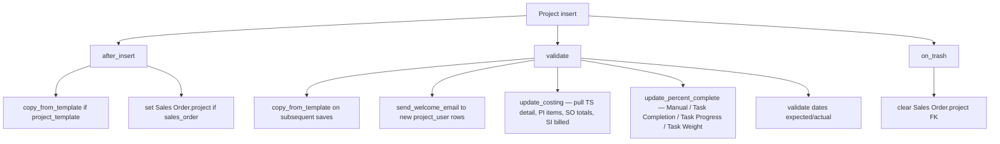
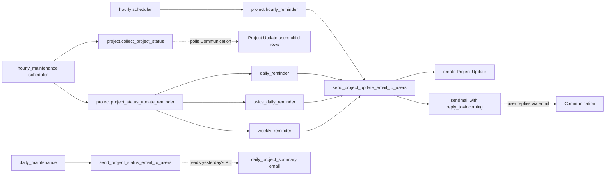

# Projects module

> **TL;DR:** Projects owns three concerns: a top-level `Project` aggregator with a NestedSet `Task` tree underneath, a submittable `Timesheet` (with its `Timesheet Detail` time-log child) that flows into `Sales Invoice` and rolls cost back up the project, and a `Project Update` self-reporting cycle wired through six scheduler jobs (hourly + daily). Plain `Document` everywhere — no transaction-controller chain. Project / Task / Timesheet ride on `calendars` and `accounting_dimension_doctypes` registries; Project / Task hang off `Sales Order` and `Sales Invoice` for cost roll-up.

## Key files

- [erpnext/hooks.py:111](../../erpnext/hooks.py:111) — `calendars = ["Task", "Work Order", "Sales Order", "Holiday List", "ToDo"]` — Task is calendar-renderable.
- [erpnext/hooks.py:206](../../erpnext/hooks.py:206) — `website_route_rules` registers `/timesheets`.
- [erpnext/hooks.py:216-217](../../erpnext/hooks.py:216) — `website_route_rules` registers `/project` and `/tasks`.
- [erpnext/hooks.py:232,284,318-319](../../erpnext/hooks.py:232) — `standard_portal_menu_items` exposes Project + Timesheet to the Customer role; `has_website_permission` uses the shared contact-based check.
- [erpnext/hooks.py:449](../../erpnext/hooks.py:449) — `hourly` scheduler runs `project.hourly_reminder`.
- [erpnext/hooks.py:455-456](../../erpnext/hooks.py:455) — `hourly_maintenance` runs `project.collect_project_status` and `project.project_status_update_reminder`.
- [erpnext/hooks.py:467](../../erpnext/hooks.py:467) — `daily_maintenance` runs `task.set_tasks_as_overdue`.
- [erpnext/hooks.py:474-475](../../erpnext/hooks.py:474) — `daily_maintenance` runs `project.update_project_sales_billing` and `project.send_project_status_email_to_users`.
- [erpnext/hooks.py:553,555,665-668](../../erpnext/hooks.py:553) — `accounting_dimension_doctypes` includes Project- and Task-impacting items: `Sales Order Item`, `Material Request Item`, `Stock Entry Detail`, plus Project / Task / Timesheet are listed in `global_search_doctypes`.
- [erpnext/projects/doctype/project/project.py:20](../../erpnext/projects/doctype/project/project.py:20) — `Project` extends `Document` directly.
- [erpnext/projects/doctype/project/project.py:92-99](../../erpnext/projects/doctype/project/project.py:92) — `validate` chain: `copy_from_template`, `send_welcome_email`, `update_costing`, `update_percent_complete`, dual `validate_from_to_dates`.
- [erpnext/projects/doctype/project/project.py:270-298](../../erpnext/projects/doctype/project/project.py:270) — `update_costing` aggregates Timesheet Detail + purchase + sales + billed amounts and computes gross margin.
- [erpnext/projects/doctype/project/project.py:489-552](../../erpnext/projects/doctype/project/project.py:489) — `hourly_reminder` + `daily_reminder` + `twice_daily_reminder` + `weekly_reminder` — the four scheduler entry points consolidated under `project_status_update_reminder`.
- [erpnext/projects/doctype/project/project.py:625-658](../../erpnext/projects/doctype/project/project.py:625) — `collect_project_status` reads inbound `Communication` rows on `Project Update` records and folds replies into the `users` child table.
- [erpnext/projects/doctype/project/project.py:660-679](../../erpnext/projects/doctype/project/project.py:660) — `send_project_status_email_to_users` mails the previous day's `Project Update` digest to the project users.
- [erpnext/projects/doctype/project/project.py:682-691](../../erpnext/projects/doctype/project/project.py:682) — `update_project_sales_billing` re-saves every non-cancelled Project so the Sales Invoice billed-amount roll-up refreshes; honours `Selling Settings.sales_update_frequency`.
- [erpnext/projects/doctype/task/task.py:25](../../erpnext/projects/doctype/task/task.py:25) — `Task` extends `NestedSet` (`nsm_parent_field = "parent_task"`).
- [erpnext/projects/doctype/task/task.py:84-92](../../erpnext/projects/doctype/task/task.py:84) — `validate` enforces parent-task date bounds, dependency completion, completed-on date, status / template coupling, parent-is-group rule.
- [erpnext/projects/doctype/task/task.py:209-215](../../erpnext/projects/doctype/task/task.py:209) — `on_update` runs NestedSet update, recursion check, dependent reschedule, project roll-up, ToDo unassign, parent depends-on backfill.
- [erpnext/projects/doctype/task/task.py:269-294](../../erpnext/projects/doctype/task/task.py:269) — `reschedule_dependent_tasks` cascades end-date shifts to dependants.
- [erpnext/projects/doctype/task/task.py:373-383](../../erpnext/projects/doctype/task/task.py:373) — `set_tasks_as_overdue` (daily scheduler) walks all non-Cancelled / non-Completed tasks, calling `update_status` to flip past-due rows to `Overdue`.
- [erpnext/projects/doctype/timesheet/timesheet.py:25](../../erpnext/projects/doctype/timesheet/timesheet.py:25) — `Timesheet` extends `Document`. Submittable.
- [erpnext/projects/doctype/timesheet/timesheet.py:154-156](../../erpnext/projects/doctype/timesheet/timesheet.py:154) — `on_submit` validates rows and calls `update_task_and_project`.
- [erpnext/projects/doctype/timesheet/timesheet.py:169-191](../../erpnext/projects/doctype/timesheet/timesheet.py:169) — `update_task_and_project` rolls every Timesheet Detail line up to its Task (`update_time_and_costing`) and Project (`update_project`).
- [erpnext/projects/doctype/timesheet/timesheet.py:417-467](../../erpnext/projects/doctype/timesheet/timesheet.py:417) — `make_sales_invoice(source_name, item_code, customer, currency)` — the canonical Timesheet → Sales Invoice mapper. Throws if `total_billable_hours == 0` or already fully billed; back-fills `target.timesheets` child rows.
- [erpnext/projects/doctype/projects_settings/projects_settings.json:1-72](../../erpnext/projects/doctype/projects_settings/projects_settings.json:1) — Single. Toggles: `ignore_workstation_time_overlap`, `ignore_user_time_overlap`, `ignore_employee_time_overlap`, `fetch_timesheet_in_sales_invoice`.

## Directory layout

```
erpnext/projects/
├── doctype/
│   ├── activity_cost/                  # per-employee × activity rate override
│   ├── activity_type/                  # billing/costing rate master
│   ├── dependent_task/                 # child table for Project Template tasks
│   ├── project/                        # the aggregator
│   ├── project_template/               # task-list template
│   ├── project_template_task/          # child of project_template
│   ├── project_type/                   # flat master
│   ├── project_update/                 # daily/weekly/hourly status snapshot
│   ├── project_user/                   # child table on Project (users + welcome email flag)
│   ├── projects_settings/              # Single
│   ├── task/                           # NestedSet
│   ├── task_depends_on/                # child table on Task
│   ├── task_type/                      # flat master
│   ├── timesheet/                      # submittable
│   └── timesheet_detail/               # child of Timesheet — the actual time logs
├── dashboard_chart/                    # pre-canned charts
├── module_onboarding/                  # onboarding deck
├── number_card/                        # pre-canned KPI cards
├── projects_dashboard/                 # dashboard config
├── report/                             # standard reports
├── utils.py                            # helpers (qb queries for project sums)
├── web_form/
│   └── tasks/                          # /tasks portal
└── workspace/
```

## Project lifecycle



**`update_percent_complete` modes** ([project.py:211-268](../../erpnext/projects/doctype/project/project.py:211)):

| `percent_complete_method` | Formula                                                                                  |
|---------------------------|------------------------------------------------------------------------------------------|
| Manual                    | Stored value, set 100 when status flips to Completed.                                    |
| Task Completion (default) | `count(Task where status in ('Cancelled','Completed')) / total`.                         |
| Task Progress             | `sum(Task.progress) / total`.                                                            |
| Task Weight               | `sum(Task.progress × (Task.task_weight / sum(task_weight)))`.                            |

After computing, `status` flips to `Completed` if `percent_complete == 100` (unless explicitly `Cancelled`).

**`update_costing` aggregates** ([project.py:270-298](../../erpnext/projects/doctype/project/project.py:270)):
- `total_costing_amount` ← `sum(Timesheet Detail.base_costing_amount where docstatus=1)`.
- `total_billable_amount` ← `sum(Timesheet Detail.base_billing_amount where docstatus=1)`.
- `actual_time` ← `sum(Timesheet Detail.hours)`.
- `total_purchase_cost` ← `sum(Purchase Invoice Item.base_net_amount where project=… and docstatus=1)` ([project.py:739-749](../../erpnext/projects/doctype/project/project.py:739)).
- `total_sales_amount` ← `sum(Sales Order.base_net_total where project=… and docstatus=1)`.
- `total_billed_amount` ← `sum(Sales Invoice Item.base_net_amount where project=… and docstatus=1)` (parent + child sources merged in [project.py:329-351](../../erpnext/projects/doctype/project/project.py:329)).
- `gross_margin` ← `total_billed_amount − (total_costing_amount + total_purchase_cost + total_consumed_material_cost)`.

## Task — the NestedSet under Project

`Task` is a NestedSet (`lft` / `rgt` / `parent_task` / `is_group`). The recursion guard ([task.py:248-267](../../erpnext/projects/doctype/task/task.py:248)) caps depth at 15 hops to prevent stack-overflow on circular `Task Depends On` chains.

Status options: `Open / Working / Pending Review / Overdue / Template / Completed / Cancelled` ([task.py:65-67](../../erpnext/projects/doctype/task/task.py:65)).

Three lifecycle effects worth highlighting:

1. **Dependant rescheduling** — [reschedule_dependent_tasks](../../erpnext/projects/doctype/task/task.py:269) walks every Task whose `Task Depends On.task` matches `self`. If the dependant's `exp_start_date < end_date`, it shifts both `exp_start_date` and `exp_end_date` forward, preserving duration. Recurses with `flags.ignore_recursion_check = True`.
2. **Project roll-up** — [update_project](../../erpnext/projects/doctype/task/task.py:244) calls `Project.update_project()` (which re-runs `update_percent_complete` + `update_costing` and `db_update`s). Skipped when `flags.from_project = True` to avoid mutual recursion when Project is iterating its tasks.
3. **Daily overdue sweep** — [set_tasks_as_overdue](../../erpnext/projects/doctype/task/task.py:373) runs from `daily_maintenance`. For Pending-Review tasks past their `review_date` it skips (waiting for review); otherwise it calls `task.update_status` which `db_set("status", "Overdue")` if `exp_end_date < now`.

## Timesheet → Sales Invoice flow

```mermaid
sequenceDiagram
    participant U as User
    participant TS as Timesheet (draft)
    participant TD as Timesheet Detail rows
    participant T as Task
    participant P as Project
    participant SI as Sales Invoice (target)
    participant MS as make_sales_invoice

    U->>TS: validate + submit
    TS->>TD: calculate_hours / update_billing_hours / update_time_rates
    TS->>T: update_time_and_costing per task
    TS->>P: update_project per project
    TS->>TS: set_status (Draft → Submitted; Billed if per_billed=100)
    Note over TS,TD: per_billed = total_billed_amount / total_billable_amount
    U->>MS: trigger from Timesheet form
    MS->>TS: load source
    MS->>MS: throw if total_billable_hours==0 or fully billed
    MS->>SI: new_doc, copy company/project/customer
    MS->>SI: append items (qty=hours, rate=billing_rate)
    MS->>SI: append timesheets child rows (timesheet_detail FK)
    MS->>SI: run_method calculate_billing_amount_for_timesheet
    MS->>SI: run_method set_missing_values
    MS-->>U: return un-saved SI doc
```

After the user saves & submits the Sales Invoice, the SI's own logic stamps `Timesheet Detail.sales_invoice` on each linked row, which then re-flows through `Timesheet.set_status` on the next save (`Submitted → Partially Billed → Billed → Completed`).

**`Projects Settings.fetch_timesheet_in_sales_invoice`** ([projects_settings.json:38-44](../../erpnext/projects/doctype/projects_settings/projects_settings.json:38)) is the converse switch: when set, picking a Project on a fresh Sales Invoice auto-pulls the open billable Timesheets.

## Project Update — the daily/weekly/hourly status cycle

`Project Update` is the snapshot DocType created automatically by [send_project_update_email_to_users](../../erpnext/projects/doctype/project/project.py:594) on each scheduler tick. The frequency is controlled by `Project.frequency` (`Hourly / Twice Daily / Daily / Weekly`) and the per-frequency time fields (`from_time`/`to_time` for hourly, `daily_time_to_send`, `first_email`/`second_email`, `day_to_send`/`weekly_time_to_send`).



`collect_project_status` polls the `Communication` table for replies whose `reference_doctype = "Project Update"` and folds the body (parsed by `EmailReplyParser`) into `Project Update.users[]` ([project.py:625-658](../../erpnext/projects/doctype/project/project.py:625)).

`send_project_status_email_to_users` (daily_maintenance) sends a digest of yesterday's still-unsent updates using the `daily_project_summary` email template, then `db_set("sent", 1)`.

`update_project_sales_billing` (daily_maintenance) honours `Selling Settings.sales_update_frequency`:
- `Each Transaction` → no-op (Sales Invoice + Sales Order already keep Project totals fresh on save).
- `Monthly` → only runs on day 1 of the month.
- otherwise → runs daily, re-saving every non-cancelled Project to refresh the billed-amount roll-up.

## Cross-module touch points

| Other module        | Touch point                                                                                                                                           |
|---------------------|--------------------------------------------------------------------------------------------------------------------------------------------------------|
| **Selling**         | `Sales Order.project` and `Sales Invoice.project` (header) + `Sales Invoice Item.project` and `Sales Order Item.project` (line). Project totals roll up from both. See [selling-flow.md](../flows/selling-flow.md) and [selling.md](selling.md). |
| **Buying**          | `Purchase Invoice Item.project` aggregates into `Project.total_purchase_cost`.                                                                         |
| **Stock**           | `Stock Entry Detail.project` carries dimensions; `Material Request Item.project` for project-driven requisitions.                                      |
| **Manufacturing**   | `Work Order` lives on the Task calendar (`calendars` registry) and can carry a Project link.                                                           |
| **Support**         | `Issue.project` ties tickets to projects; `Task.issue` reverse link allows a Task to spawn from an Issue. See [support.md](support.md).                |
| **Setup**           | `Holiday List` is consumed by `Project.holiday_list` and Task date validations through `setup.doctype.holiday_list.holiday_list.is_holiday`.           |

## Scheduler jobs

| Frequency         | Job                                                                                       | Effect                                                                                                  |
|-------------------|-------------------------------------------------------------------------------------------|---------------------------------------------------------------------------------------------------------|
| hourly            | [project.hourly_reminder](../../erpnext/projects/doctype/project/project.py:489)          | For Hourly-frequency Projects, mails the project users when `nowtime()` is inside the `from/to` window. |
| hourly_maintenance| [project.collect_project_status](../../erpnext/projects/doctype/project/project.py:625)   | Folds incoming Communication replies into today's `Project Update.users` child rows.                    |
| hourly_maintenance| [project.project_status_update_reminder](../../erpnext/projects/doctype/project/project.py:500) | Dispatches `daily_reminder` + `twice_daily_reminder` + `weekly_reminder` (each filters by frequency).   |
| daily_maintenance | [task.set_tasks_as_overdue](../../erpnext/projects/doctype/task/task.py:373)              | Flips past-due open Tasks to `Overdue`.                                                                 |
| daily_maintenance | [project.update_project_sales_billing](../../erpnext/projects/doctype/project/project.py:682) | Re-saves Projects so the SI/SO billed-amount roll-up refreshes.                                         |
| daily_maintenance | [project.send_project_status_email_to_users](../../erpnext/projects/doctype/project/project.py:660) | Mails yesterday's `Project Update` digest using the `daily_project_summary` template.                   |

See the consolidated [scheduler-jobs.md](../architecture/scheduler-jobs.md) for the catalogue.

## Portal / website surface

- **Routes** ([hooks.py:206,216-217](../../erpnext/hooks.py:206)): `/timesheets`, `/project`, `/tasks`.
- **Web form**: `erpnext/projects/web_form/tasks/`.
- **Permission**: `has_website_permission["Project"]` and `["Timesheet"]` use the shared contact-based check from `controllers/website_list_for_contact.py`.
- **Project list context**: [project.get_list_context](../../erpnext/projects/doctype/project/project.py:437-453) renders `templates/includes/projects/project_row.html`.
- **Task webform-permission shortcut**: [task.has_webform_permission](../../erpnext/projects/doctype/task/task.py:296-301) lets any `Project User` of the parent Project edit the Task via the webform regardless of doctype perms.
- **Customer portal menu** ([hooks.py:232,284](../../erpnext/hooks.py:232)) — `Projects` and `Timesheets`.

## Open questions

- `TODO(verify)` — `Project.copy_from_template` is invoked twice per save: once in `validate` (when not `is_new()`) and once in `after_insert` ([project.py:93-94, 203-206](../../erpnext/projects/doctype/project/project.py:93)). The `frappe.db.get_all("Task", dict(project=self.name), limit=1)` guard prevents duplicate task creation on resave; needs verification that the second call is intentional rather than legacy.
- `TODO(verify)` — `update_project_sales_billing` re-saves *every* non-cancelled Project on the daily tick. On a tenant with thousands of Projects this is O(N) `doc.save()` calls — performance implications not measured here.

## Related

- [Projects DocTypes reference cards](projects-doctypes.md)
- [Selling flow](../flows/selling-flow.md) — project link on SO/SI lines.
- [Selling module](selling.md) — `sales_update_frequency` setting.
- [Support module](support.md) — Issue.project + Task.issue relationship.
- [Scheduler jobs](../architecture/scheduler-jobs.md)
- [Hooks catalogue](../architecture/hooks-catalogue.md)

## Changelog

- `2026-04-18` — initial version. Documented Project lifecycle + percent-complete modes + cost roll-up, Task NestedSet + dependant reschedule, Timesheet → Sales Invoice mapper, Project Update reminder cycle, six scheduler jobs.
