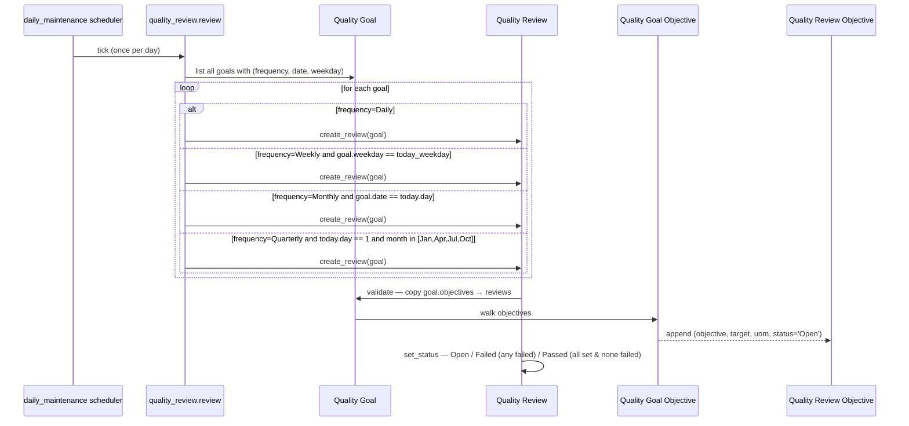
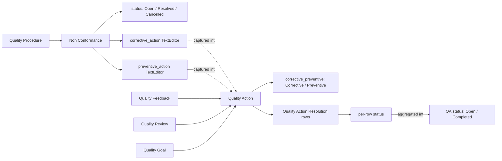

# Quality Management module

> **TL;DR:** ISO-style quality system: a NestedSet of `Quality Procedure` rooted at the org, attached `Quality Goal` rows with measurable `Quality Goal Objective` targets, periodic `Quality Review` audits (driven by a daily scheduler), `Non Conformance` findings, and `Quality Action` corrective/preventive workflows. `Quality Meeting` (with agenda + minutes) and `Quality Feedback` (multi-parameter ratings) close the loop. **All seven primary DocTypes extend plain `Document`** — there is no transaction-controller chain, no GL/SLE involvement, and no submittable workflow. The only scheduler job is `quality_review.review` (daily). Note that `Quality Inspection` lives in [Stock module](stock-doctypes.md), not here, despite the name.

## Key files

- [erpnext/hooks.py:476](../../erpnext/hooks.py:476) — `daily_maintenance` runs `quality_review.review`.
- [erpnext/quality_management/doctype/quality_procedure/quality_procedure.py:10](../../erpnext/quality_management/doctype/quality_procedure/quality_procedure.py:10) — `QualityProcedure(NestedSet)`. The only NestedSet in the module.
- [erpnext/quality_management/doctype/quality_goal/quality_goal.py:8](../../erpnext/quality_management/doctype/quality_goal/quality_goal.py:8) — `QualityGoal(Document)`. `frequency ∈ {None, Daily, Weekly, Monthly, Quarterly}`.
- [erpnext/quality_management/doctype/quality_review/quality_review.py:9](../../erpnext/quality_management/doctype/quality_review/quality_review.py:9) — `QualityReview(Document)`. `status ∈ {Open, Passed, Failed}`.
- [erpnext/quality_management/doctype/quality_review/quality_review.py:48-72](../../erpnext/quality_management/doctype/quality_review/quality_review.py:48) — `review()` daily scheduler + `create_review(goal)` helper.
- [erpnext/quality_management/doctype/quality_action/quality_action.py:8](../../erpnext/quality_management/doctype/quality_action/quality_action.py:8) — `QualityAction(Document)`. `corrective_preventive ∈ {Corrective, Preventive}`. Status auto-derived from `resolutions`.
- [erpnext/quality_management/doctype/non_conformance/non_conformance.py:9](../../erpnext/quality_management/doctype/non_conformance/non_conformance.py:9) — `NonConformance(Document)`. Empty-body class — schema-driven.
- [erpnext/quality_management/doctype/quality_meeting/quality_meeting.py:8](../../erpnext/quality_management/doctype/quality_meeting/quality_meeting.py:8) — `QualityMeeting(Document)`. `pass` body.
- [erpnext/quality_management/doctype/quality_feedback/quality_feedback.py:9](../../erpnext/quality_management/doctype/quality_feedback/quality_feedback.py:9) — `QualityFeedback(Document)`. Auto-templated parameters from `Quality Feedback Template`.
- [erpnext/hooks.py:333](../../erpnext/hooks.py:333) — note: **`Quality Management` DocTypes do not appear in `period_closing_doctypes`**. Quality docs are not blocked by Accounting Period.
- [erpnext/hooks.py:418-431](../../erpnext/hooks.py:418) — none in `auto_cancel_exempted_doctypes` either; Quality docs are non-submittable so the question is moot.

## Directory layout

```
erpnext/quality_management/
├── dashboard_chart/
├── doctype/
│   ├── customer_feedback/                  # alias (TODO verify) — see notes below
│   ├── non_conformance/                    # finding records
│   ├── quality_action/                     # corrective/preventive workflow
│   ├── quality_action_resolution/          # child of Quality Action
│   ├── quality_feedback/                   # multi-parameter rating capture
│   ├── quality_feedback_parameter/         # child of Quality Feedback
│   ├── quality_feedback_template/          # template
│   ├── quality_feedback_template_parameter/# child of template
│   ├── quality_goal/                       # measurable goal with frequency
│   ├── quality_goal_objective/             # child of Quality Goal (target + uom)
│   ├── quality_meeting/                    # meeting record (agenda + minutes)
│   ├── quality_meeting_agenda/             # child of Quality Meeting
│   ├── quality_meeting_minutes/            # child of Quality Meeting
│   ├── quality_procedure/                  # NestedSet
│   ├── quality_procedure_process/          # child of Quality Procedure (steps + sub-procedures)
│   ├── quality_review/                     # periodic audit instance
│   └── quality_review_objective/           # child of Quality Review (target + actual + status)
├── report/
└── workspace/
```

## Why no transaction-controller chain

Every DocType in this module extends `Document` directly (or `NestedSet` for `Quality Procedure`). None are submittable. None produce GL Entries, Stock Ledger Entries, or trigger any of the cross-cutting registries:
- Not in `period_closing_doctypes` ([hooks.py:322-341](../../erpnext/hooks.py:322)).
- Not in `auto_cancel_exempted_doctypes` ([hooks.py:418-431](../../erpnext/hooks.py:418)).
- Not in `accounting_dimension_doctypes` ([hooks.py:537-590](../../erpnext/hooks.py:537)).
- Not in `repost_allowed_doctypes` ([hooks.py:707-713](../../erpnext/hooks.py:707)).
- Not in `subscription_doctypes` / `invoice_doctypes` / `bank_reconciliation_doctypes`.

This is consistent with the module's purpose: it records *meta-information about the organization* (procedures, audits, findings) rather than transactions. The only cross-tree wiring is the daily `review()` scheduler.

`TODO(verify)` — there is a `customer_feedback/` directory under `erpnext/quality_management/doctype/` whose JSON labels suggest it is the same DocType as `Quality Feedback`. The Frappe naming convention (folder = lowercased DocType name) suggests these may be a `Customer Feedback` DocType distinct from `Quality Feedback`. Both folders exist in the tree — the cards file enumerates both, but the relationship between them was not investigated in this pass.

## Quality Procedure — the NestedSet

`QualityProcedure` ([quality_procedure.py:10](../../erpnext/quality_management/doctype/quality_procedure/quality_procedure.py:10)) extends `NestedSet` with `nsm_parent_field = "parent_quality_procedure"`. Each procedure carries a `processes` child table whose rows can either describe an inline step or link to another `Quality Procedure` (forming the tree).

The lifecycle is dominated by parent / child synchronization:

- `before_save` → `check_for_incorrect_child` ([quality_procedure.py:59-73](../../erpnext/quality_management/doctype/quality_procedure/quality_procedure.py:59)): if any process row references another procedure as its sub-step, the parent flips to `is_group=1`. Refuses to nest a procedure that already has a different parent.
- `on_update` → `NestedSet.on_update` (re-balance `lft`/`rgt`) + four reciprocal-link methods: `set_parent`, `remove_parent_from_old_child`, `add_child_to_parent`, `remove_child_from_old_parent` ([quality_procedure.py:75-120](../../erpnext/quality_management/doctype/quality_procedure/quality_procedure.py:75)).
- `after_insert` → `set_parent` + `add_child_to_parent`.
- `on_trash` → wipe the back-link from any `Quality Procedure Process.procedure` rows referencing this procedure, then `NestedSet.on_trash(allow_root_deletion=True)`.

## Quality Goal → Quality Review (the daily scheduler)



[`review()`](../../erpnext/quality_management/doctype/quality_review/quality_review.py:48) walks every `Quality Goal` and creates a `Quality Review` matching today's day-of-month / day-of-week / quarter-month rule. The new Review's `validate` ([quality_review.py:30-36](../../erpnext/quality_management/doctype/quality_review/quality_review.py:30)) auto-populates the `reviews` child rows from `Quality Goal.objectives` if empty.

`set_status` ([quality_review.py:38-45](../../erpnext/quality_management/doctype/quality_review/quality_review.py:38)) is a three-way state machine:
- Any child row in `Open` → parent stays `Open`.
- Any child row in `Failed` (and none `Open`) → parent → `Failed`.
- All child rows non-Open and none `Failed` → parent → `Passed`.

`Quality Goal.frequency = "None"` means no automatic review creation — manual reviews only.

## Non Conformance → Quality Action workflow



`Non Conformance` ([non_conformance.py:9](../../erpnext/quality_management/doctype/non_conformance/non_conformance.py:9)) is an empty-body class — fields are schema-driven. It carries `subject`, `procedure` (Link → Quality Procedure, required), `process_owner`, `details`, `corrective_action`, `preventive_action`, `status`. No automation beyond schema.

`Quality Action` ([quality_action.py:8](../../erpnext/quality_management/doctype/quality_action/quality_action.py:8)) auto-derives its parent status from the child `resolutions` table: any row `Open` → parent `Open`, otherwise `Completed` ([quality_action.py:31-32](../../erpnext/quality_management/doctype/quality_action/quality_action.py:31)). Optional links: `feedback`, `goal`, `procedure`, `review`. `corrective_preventive` is the discriminator.

## Quality Feedback — multi-parameter rating

`Quality Feedback` ([quality_feedback.py:9](../../erpnext/quality_management/doctype/quality_feedback/quality_feedback.py:9)) supports two `document_type` targets: `User` (defaulting to `frappe.session.user` when omitted) and `Customer`. The `template` (Link → `Quality Feedback Template`) supplies the parameter list, which is auto-cloned into the local `parameters` child table on first save (each row defaulting to `rating=1`):

```python
def set_parameters(self):
    if self.template and not getattr(self, "parameters", []):
        for d in frappe.get_doc("Quality Feedback Template", self.template).parameters:
            self.append("parameters", dict(parameter=d.parameter, rating=1))
```

Self-rating is supported: when `document_name` is empty, `validate` stamps `document_type = "User"` and `document_name = session.user`.

## Quality Meeting

`Quality Meeting` ([quality_meeting.py:8](../../erpnext/quality_management/doctype/quality_meeting/quality_meeting.py:8)) is a pure record container — an empty `pass` body. Carries:
- `agenda` (Table → Quality Meeting Agenda)
- `minutes` (Table → Quality Meeting Minutes)
- `status ∈ {Open, Closed}`

## Scheduler jobs

| Frequency         | Job                                                                                        | Effect                                                  |
|-------------------|--------------------------------------------------------------------------------------------|---------------------------------------------------------|
| daily_maintenance | [quality_review.review](../../erpnext/quality_management/doctype/quality_review/quality_review.py:48) | Create Quality Reviews for goals whose frequency matches today. |

That is the entire scheduler footprint of the module. See [scheduler-jobs.md](../architecture/scheduler-jobs.md) for the catalogue.

## Cross-module touch points

- **Stock.** `Quality Inspection` (in Stock, not here) is the per-item runtime check. Quality Management is the meta-layer above it. See [stock-doctypes.md](stock-doctypes.md).
- **Setup.** `User` and `Customer` masters are the only foreign references (via `Quality Feedback.document_type`).
- **No accounting / stock impact.** None of the Quality Management DocTypes appear in `period_closing_doctypes`, `accounting_dimension_doctypes`, or `subscription_doctypes`.

## Open questions

- `TODO(verify)` — relationship between `customer_feedback/` and `quality_feedback/` directories under `erpnext/quality_management/doctype/`. Both folders exist but the user-facing distinction was not investigated.
- `TODO(verify)` — `Quality Goal.frequency = "Quarterly"` only fires on day 1 of January / April / July / October ([quality_review.py:63-64](../../erpnext/quality_management/doctype/quality_review/quality_review.py:63)). Goals created on day 2+ of a quarter month wait three months for the next review — is this intentional?

## Related

- [Quality Management DocTypes reference cards](quality-management-doctypes.md)
- [Stock module](stock.md) and [Stock DocTypes](stock-doctypes.md) — Quality Inspection (per-item) lives there.
- [Scheduler jobs](../architecture/scheduler-jobs.md)
- [Hooks catalogue](../architecture/hooks-catalogue.md)

## Changelog

- `2026-04-18` — initial version. Documented the all-plain-Document choice, Quality Procedure NestedSet sync, Quality Goal → Quality Review daily cycle, Non Conformance → Quality Action workflow, Quality Feedback multi-parameter rating.
