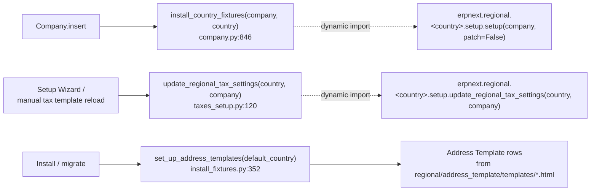
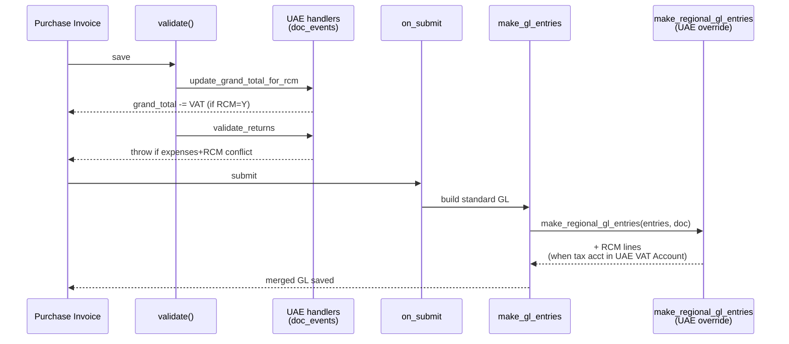
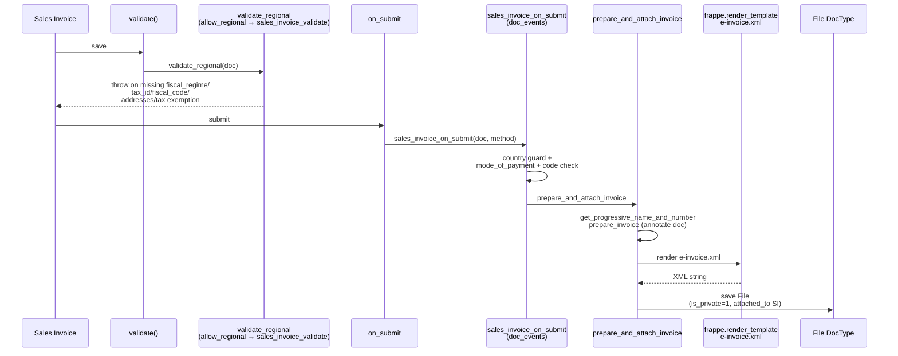
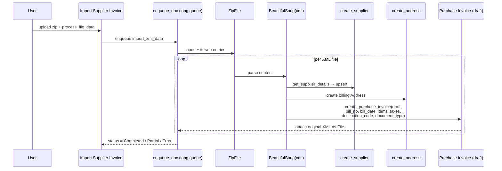

# Regional module

> **TL;DR:** `erpnext/regional/` is ERPNext's localization surface. It ships (a) country subdirectories with `setup.py` custom-field fixtures + a `utils.py` of replacement bodies for `@erpnext.allow_regional`-decorated core stubs, (b) country-agnostic regional DocTypes under `regional/doctype/` (`Lower Deduction Certificate`, `Import Supplier Invoice`, UAE/South Africa VAT account wrappers), (c) shared reports and print formats used by specific jurisdictions, and (d) address templates for countries that ship no code. The **mechanism** (`@erpnext.allow_regional` + `regional_overrides`) is documented in [patterns/regional-overrides.md](../patterns/regional-overrides.md); this page is the **inventory and per-country reference**.

## Key files

- [erpnext/regional/__init__.py](../../erpnext/regional/__init__.py:11) — defines `check_deletion_permission(doc, method)`, the only module-level callable; blocks deletion of submitted docs for Nepal and is wired as `Sales Invoice.on_trash` + `Payment Entry.on_trash` ([hooks.py:382](../../erpnext/hooks.py:382), [:391](../../erpnext/hooks.py:391)).
- [erpnext/hooks.py:375](../../erpnext/hooks.py:375), [:384](../../erpnext/hooks.py:384), [:393](../../erpnext/hooks.py:393) — regional `doc_events` (Italy SI / UAE PI / Italy Address).
- [erpnext/hooks.py:608](../../erpnext/hooks.py:608) — `regional_overrides` registry (France, UAE, Saudi Arabia, Italy).
- [erpnext/setup/doctype/company/company.py:846](../../erpnext/setup/doctype/company/company.py:846) — `install_country_fixtures(company, country)` dynamically imports `erpnext.regional.<scrubbed_country>.setup.setup` at company creation.
- [erpnext/setup/setup_wizard/operations/taxes_setup.py:120](../../erpnext/setup/setup_wizard/operations/taxes_setup.py:120) — `update_regional_tax_settings(country, company)` dynamically imports `erpnext.regional.<scrubbed_country>.setup.update_regional_tax_settings` during setup-wizard tax template creation.
- [erpnext/regional/address_template/setup.py:7](../../erpnext/regional/address_template/setup.py:7) — `set_up_address_templates(default_country)`, called once at install from [install_fixtures.py:352](../../erpnext/setup/setup_wizard/operations/install_fixtures.py:352); iterates HTML templates in [templates/](../../erpnext/regional/address_template/templates) (Croatia, Germany, Luxembourg, Sweden, Switzerland, Taiwan, United States).

## Directory tree

```
erpnext/regional/
  __init__.py               — check_deletion_permission (Nepal guard)
  address_template/
    templates/              — 7 country HTML templates
    setup.py                — Address Template importer
  doctype/
    import_supplier_invoice/      — Italy FatturaPA inbound parser
    lower_deduction_certificate/  — country-agnostic TDS/WHT certificate
    uae_vat_account/              — UAE VAT Settings child row
    uae_vat_settings/             — per-company UAE VAT account map
    south_africa_vat_settings/    — per-company South Africa VAT account map
  print_format/
    detailed_tax_invoice/, simplified_tax_invoice/, tax_invoice/  — UAE
    irs_1099_form/          — United States
    purchase_einvoice/      — Italy (for Import Supplier Invoice PIs)
  report/
    uae_vat_201/            — UAE monthly VAT return
    vat_audit_report/       — South Africa VAT audit
    electronic_invoice_register/  — Italy
    irs_1099/               — United States
  italy/
    __init__.py             — fiscal_regimes, tax_exemption_reasons,
                              mode_of_payment_codes, state_codes
    setup.py                — custom fields + report enablement + permissions
    utils.py                — 20+ functions driving SI e-invoice
    e-invoice.xml           — FatturaPA Jinja template
  united_arab_emirates/
    __init__.py             — empty
    setup.py                — custom fields (Emirate, TRN, reverse_charge, ...)
    utils.py                — RCM GL + VAT itemisation + grand total adjustment
  south_africa/
    __init__.py             — empty
    setup.py                — is_zero_rated + permissions
  united_states/
    __init__.py             — empty
    setup.py                — irs_1099 + exempt_from_sales_tax custom fields
    test_united_states.py
  australia/
    setup.py                — no fixtures; update_regional_tax_settings only
  turkey/
    __init__.py             — empty
    setup.py                — `def setup(...): pass`
```

> **No `france/` directory** ships in the repo, even though [hooks.py:609](../../erpnext/hooks.py:609) registers `"France": {"erpnext.tests.test_regional.test_method": "erpnext.regional.france.utils.test_method"}`. That registration is dead / test-only — loading it at runtime would `ImportError`. Confirmed by `ls erpnext/regional/` and by the fact `install_country_fixtures` swallows `ImportError` at [company.py:850](../../erpnext/setup/doctype/company/company.py:850). See [France](#france-registered-but-no-directory) below.

> **No `saudi_arabia/` or `nepal/` directory.** Saudi Arabia borrows UAE's `update_itemised_tax_data` at [hooks.py:614](../../erpnext/hooks.py:614). Nepal appears only in `check_deletion_permission` ([regional/__init__.py:13](../../erpnext/regional/__init__.py:13)).

## `regional_overrides` catalogue

Full declaration at [hooks.py:608](../../erpnext/hooks.py:608). Purposes below; for the dispatch mechanism see [patterns/regional-overrides.md](../patterns/regional-overrides.md).

| Country | Core path (stub) | Replacement | Purpose |
|---|---|---|---|
| France | `erpnext.tests.test_regional.test_method` | `erpnext.regional.france.utils.test_method` | Test-only registration; no `france/` dir exists — dangling. |
| United Arab Emirates | `erpnext.controllers.taxes_and_totals.update_itemised_tax_data` | `erpnext.regional.united_arab_emirates.utils.update_itemised_tax_data` | Recomputes per-item `tax_rate` / `tax_amount` / `total_amount` with export detection via customer Address country; sets `is_zero_rated` for exports. [utils.py:9](../../erpnext/regional/united_arab_emirates/utils.py:9). |
| United Arab Emirates | `erpnext.accounts.doctype.purchase_invoice.purchase_invoice.make_regional_gl_entries` | `erpnext.regional.united_arab_emirates.utils.make_regional_gl_entries` | Appends RCM (reverse charge) GL entries on PI when `reverse_charge == "Y"` and tax account is in `UAE VAT Account`. [utils.py:146](../../erpnext/regional/united_arab_emirates/utils.py:146). |
| Saudi Arabia | `erpnext.controllers.taxes_and_totals.update_itemised_tax_data` | `erpnext.regional.united_arab_emirates.utils.update_itemised_tax_data` | Reuses UAE implementation. No dedicated `saudi_arabia/` code. [hooks.py:614](../../erpnext/hooks.py:614). |
| Italy | `erpnext.controllers.taxes_and_totals.update_itemised_tax_data` | `erpnext.regional.italy.utils.update_itemised_tax_data` | Recomputes item tax data; explicitly **skips Purchase Invoice**. [italy/utils.py:14](../../erpnext/regional/italy/utils.py:14). |
| Italy | `erpnext.controllers.accounts_controller.validate_regional` | `erpnext.regional.italy.utils.sales_invoice_validate` | E-invoice preflight: company address, Fiscal Regime, Tax ID + Fiscal Code, customer fiscal info, address presence, non-empty taxes, tax exemption reasons, mode-of-payment codes. [italy/utils.py:220](../../erpnext/regional/italy/utils.py:220). |

Registered at company-level only. Dispatch happens via `get_region()` returning `Company.country` inside the `@erpnext.allow_regional` wrapper ([erpnext/__init__.py:135](../../erpnext/__init__.py:135)).

## `doc_events` catalogue (regional)

Regional-scoped entries in `doc_events` at [hooks.py:348](../../erpnext/hooks.py:348):

| DocType | Event | Handler | Country guard | Location |
|---|---|---|---|---|
| Sales Invoice | `on_submit` | `erpnext.regional.italy.utils.sales_invoice_on_submit` | internal (checks `company.country`) | [hooks.py:377](../../erpnext/hooks.py:377), [italy/utils.py:304](../../erpnext/regional/italy/utils.py:304) |
| Sales Invoice | `on_cancel` | `erpnext.regional.italy.utils.sales_invoice_on_cancel` | internal | [hooks.py:380](../../erpnext/hooks.py:380), [italy/utils.py:371](../../erpnext/regional/italy/utils.py:371) |
| Sales Invoice | `on_trash` | `erpnext.regional.check_deletion_permission` | internal (Nepal) | [hooks.py:382](../../erpnext/hooks.py:382) |
| Purchase Invoice | `validate` | `erpnext.regional.united_arab_emirates.utils.update_grand_total_for_rcm` | internal | [hooks.py:386](../../erpnext/hooks.py:386), [uae/utils.py:91](../../erpnext/regional/united_arab_emirates/utils.py:91) |
| Purchase Invoice | `validate` | `erpnext.regional.united_arab_emirates.utils.validate_returns` | internal | [hooks.py:387](../../erpnext/hooks.py:387), [uae/utils.py:186](../../erpnext/regional/united_arab_emirates/utils.py:186) |
| Payment Entry | `on_trash` | `erpnext.regional.check_deletion_permission` | internal (Nepal) | [hooks.py:391](../../erpnext/hooks.py:391) |
| Address | `validate` | `erpnext.regional.italy.utils.set_state_code` | internal (Italy country name match) | [hooks.py:395](../../erpnext/hooks.py:395), [italy/utils.py:460](../../erpnext/regional/italy/utils.py:460) |

All regional `doc_events` handlers early-`return` when the active company's country doesn't match — they are registered globally but filter at runtime. There is no `override_doctype_class` registration for any regional controller; ERPNext uses function-level overrides exclusively.

## `@erpnext.allow_regional` stubs (override slots)

Stubs declared in core that *could* be replaced via `regional_overrides`. Currently only the 4 entries in the [catalogue above](#regional_overrides-catalogue) have registrations; the rest are waiting for external localization apps (e.g., `india_compliance`) to hook in.

| Stub path | Default body | File:line |
|---|---|---|
| `erpnext.controllers.accounts_controller.validate_regional` | `pass` | [accounts_controller.py:4314](../../erpnext/controllers/accounts_controller.py:4314) |
| `erpnext.controllers.accounts_controller.validate_einvoice_fields` | `pass` | [accounts_controller.py:4319](../../erpnext/controllers/accounts_controller.py:4319) |
| `erpnext.controllers.accounts_controller.update_gl_dict_with_regional_fields` | `pass` | [accounts_controller.py:4324](../../erpnext/controllers/accounts_controller.py:4324) |
| `erpnext.controllers.accounts_controller.get_advance_payment_entries_for_regional` | proxies to `get_advance_payment_entries` | [accounts_controller.py:3359](../../erpnext/controllers/accounts_controller.py:3359) |
| `erpnext.controllers.taxes_and_totals.get_regional_round_off_accounts` | `pass` | [taxes_and_totals.py:1239](../../erpnext/controllers/taxes_and_totals.py:1239) |
| `erpnext.controllers.taxes_and_totals.update_itemised_tax_data` | `pass` | [taxes_and_totals.py:1244](../../erpnext/controllers/taxes_and_totals.py:1244) |
| `erpnext.controllers.taxes_and_totals.get_itemised_tax_breakup_header` | returns generic `[Item, Taxable Amount, *accounts]` | [taxes_and_totals.py:1250](../../erpnext/controllers/taxes_and_totals.py:1250) |
| `erpnext.controllers.taxes_and_totals.get_itemised_tax_breakup_data` | returns generic itemised tax | [taxes_and_totals.py:1255](../../erpnext/controllers/taxes_and_totals.py:1255) |
| `erpnext.controllers.buying_controller.update_regional_item_valuation_rate` | `pass` | [buying_controller.py:1258](../../erpnext/controllers/buying_controller.py:1258) |
| `erpnext.accounts.doctype.purchase_invoice.purchase_invoice.make_regional_gl_entries` | returns `gl_entries` unchanged | [purchase_invoice.py:1947](../../erpnext/accounts/doctype/purchase_invoice/purchase_invoice.py:1947) |
| `erpnext.accounts.doctype.sales_invoice.sales_invoice.make_regional_gl_entries` | returns `gl_entries` unchanged | [sales_invoice.py:2591](../../erpnext/accounts/doctype/sales_invoice/sales_invoice.py:2591) |
| `erpnext.accounts.doctype.payment_entry.payment_entry.add_regional_gl_entries` | `return` | [payment_entry.py:3575](../../erpnext/accounts/doctype/payment_entry/payment_entry.py:3575) |
| `erpnext.accounts.doctype.payment_reconciliation.payment_reconciliation.adjust_allocations_for_taxes` | `pass` | [payment_reconciliation.py:904](../../erpnext/accounts/doctype/payment_reconciliation/payment_reconciliation.py:904) |
| `erpnext.accounts.doctype.tax_withholding_category.tax_withholding_category.get_tax_id_for_party` | reads `<party>.tax_id` | [tax_withholding_category.py:253](../../erpnext/accounts/doctype/tax_withholding_category/tax_withholding_category.py:253) |
| `erpnext.accounts.party.get_regional_address_details` | `pass` | [party.py:291](../../erpnext/accounts/party.py:291) |
| `erpnext.stock.doctype.purchase_receipt.purchase_receipt.update_regional_gl_entries` | `return` | [purchase_receipt.py:1714](../../erpnext/stock/doctype/purchase_receipt/purchase_receipt.py:1714) |
| `erpnext.assets.doctype.asset.depreciation.cancel_depreciation_entries` | `pass` (comment: overridden by India Compliance) | [depreciation.py:488](../../erpnext/assets/doctype/asset/depreciation.py:488) |
| `WDVMethod.get_wdv_or_dd_depr_amount` | delegates to `calculate_wdv_or_dd_based_depreciation_amount` | [depreciation_methods.py:77](../../erpnext/assets/doctype/asset_depreciation_schedule/depreciation_methods.py:77) |

Stubs with *no* country registration in core (as of this commit): all except the four in the [catalogue above](#regional_overrides-catalogue). `update_regional_item_valuation_rate` in particular — called from `BuyingController.set_incoming_rate` at [buying_controller.py:495](../../erpnext/controllers/buying_controller.py:495) — is a no-op in stock ERPNext and is the override slot reserved for external apps (historically `india_compliance` used it for landed-cost adjustments).

## Company-setup entry points

Two dynamic-import pathways turn a country string on Company into fixtures:



Both `install_country_fixtures` and `update_regional_tax_settings` swallow `ImportError` silently — the absence of a country module is not an error.

## Country deep dives

### United Arab Emirates

- **Directory**: [erpnext/regional/united_arab_emirates/](../../erpnext/regional/united_arab_emirates/)
- **Company country trigger**: `United Arab Emirates`. Saudi Arabia borrows parts ([`update_itemised_tax_data`](#regional_overrides-catalogue) only).

**Setup fixtures** ([setup.py:10](../../erpnext/regional/united_arab_emirates/setup.py:10)) — `setup()` calls `make_custom_fields()` + `add_print_formats()` + `add_custom_roles_for_reports()` + `add_permissions()`:
- Item: `tax_code`, `is_zero_rated`, `is_exempt`.
- Address: `emirate` (Select: Abu Dhabi / Ajman / Dubai / Fujairah / Ras Al Khaimah / Sharjah / Umm Al Quwain).
- Customer: `customer_name_in_arabic`. Supplier: `supplier_name_in_arabic`.
- Purchase Invoice / Purchase Order / Purchase Receipt: `company_trn`, `supplier_name_in_arabic`, `recoverable_standard_rated_expenses`, `reverse_charge` (Y/N), `recoverable_reverse_charge` (%), `permit_no`, `vat_section` collapsible.
- Sales Invoice / POS Invoice / Sales Order / Delivery Note: `company_trn`, `customer_name_in_arabic`, `vat_emirate` (fetched from `company_address.emirate`), `tourist_tax_return`.
- Item rows (SI/POS/PI/SO/DN/Q/PO/PR/SQ): `tax_code`, `tax_rate`, `tax_amount`, `total_amount` — hidden numeric helpers.
- Print Formats enabled: Detailed Tax Invoice, Simplified Tax Invoice, Tax Invoice.

**Registered overrides**:
- `regional_overrides` ([hooks.py:610](../../erpnext/hooks.py:610)):
  - `update_itemised_tax_data` → [uae/utils.py:9](../../erpnext/regional/united_arab_emirates/utils.py:9). Iterates items, pulls `get_itemised_tax(doc)`, writes `tax_rate` + `tax_amount` + `total_amount` per row, sets `is_zero_rated` when the customer's Address country differs from the company's country (export detection via [uae/utils.py:19-38](../../erpnext/regional/united_arab_emirates/utils.py:19)).
  - `make_regional_gl_entries` → [uae/utils.py:146](../../erpnext/regional/united_arab_emirates/utils.py:146). On PI submit, for each Total/Valuation-and-Total tax row whose `account_head` is in `UAE VAT Account` for this company ([uae/utils.py:77](../../erpnext/regional/united_arab_emirates/utils.py:77)), emits an additional GL entry via `make_gl_entry` (credit when `add_deduct_tax == "Add"`, else debit). Only fires when `doc.reverse_charge == "Y"`. Account-currency aware via `get_account_currency` ([:60](../../erpnext/regional/united_arab_emirates/utils.py:60)).
- `doc_events` ([hooks.py:384](../../erpnext/hooks.py:384)): Purchase Invoice `validate` → two UAE handlers:
  - `update_grand_total_for_rcm` ([uae/utils.py:91](../../erpnext/regional/united_arab_emirates/utils.py:91)): when RCM applies, subtracts VAT tax from `taxes_and_charges_added`, `total_taxes_and_charges`, `grand_total`, then recomputes `rounded_total`, `rounding_adjustment`, `outstanding_amount`, `in_words`, `base_in_words`, and calls `doc.set_payment_schedule()` ([:143](../../erpnext/regional/united_arab_emirates/utils.py:143)).
  - `validate_returns` ([uae/utils.py:186](../../erpnext/regional/united_arab_emirates/utils.py:186)): throws if `reverse_charge == "Y"` and `recoverable_standard_rated_expenses != 0`.

**Shipping DocTypes**:
- `UAE VAT Settings` ([doctype/uae_vat_settings/uae_vat_settings.py:9](../../erpnext/regional/doctype/uae_vat_settings/uae_vat_settings.py:9)) — per-Company single, holds `uae_vat_accounts` child table.
- `UAE VAT Account` ([doctype/uae_vat_account/uae_vat_account.py:9](../../erpnext/regional/doctype/uae_vat_account/uae_vat_account.py:9)) — child: `account` Link. `get_tax_accounts(company)` filters by `parent == company` at [uae/utils.py:80](../../erpnext/regional/united_arab_emirates/utils.py:80).

**Reports**:
- `UAE VAT 201` ([report/uae_vat_201/uae_vat_201.py:9](../../erpnext/regional/report/uae_vat_201/uae_vat_201.py:9)) — monthly VAT return; splits sales by Emirate (via `append_vat_on_sales`), adds tourist tax refunds line, reverse-charge line.

**Print formats**: Detailed Tax Invoice, Simplified Tax Invoice, Tax Invoice ([setup.py:249](../../erpnext/regional/united_arab_emirates/setup.py:249)).

**Patches**:
- [v13_0/create_uae_pos_invoice_fields.py](../../erpnext/patches/v13_0/create_uae_pos_invoice_fields.py) — extends `make_custom_fields` to POS Invoice after reload (registered [patches.txt:184](../../erpnext/patches.txt:184)).
- [v13_0/setup_uae_vat_fields.py](../../erpnext/patches/v13_0/setup_uae_vat_fields.py) — reloads UAE VAT 201 report + UAE VAT Settings + UAE VAT Account DocTypes, then runs `setup()` ([patches.txt:192](../../erpnext/patches.txt:192)).
- [v15_0/update_uae_zero_rated_fetch.py](../../erpnext/patches/v15_0/update_uae_zero_rated_fetch.py) — re-runs `make_custom_fields()` so `is_zero_rated` fetch_from chain is re-applied.

**Scheduler jobs**: none specific.

**SI / PI submit path touchpoints**:
- PI `validate` — `update_grand_total_for_rcm` + `validate_returns` (see above).
- PI `on_submit` → `make_gl_entries` ([purchase_invoice.py:881](../../erpnext/accounts/doctype/purchase_invoice/purchase_invoice.py:881)) → `make_regional_gl_entries` (UAE override appends RCM lines).
- SI / PI `validate` → `calculate_taxes_and_totals` ([accounts_controller.py:301](../../erpnext/controllers/accounts_controller.py:301)) → eventually `update_itemised_tax_data` (UAE override rewrites per-row tax figures + export detection).

**Mermaid — UAE PI submit with RCM**:



### Italy

- **Directory**: [erpnext/regional/italy/](../../erpnext/regional/italy/)
- **Company country trigger**: `Italy` (also `Italia`, `Italian Republic`, `Repubblica Italiana` — matched inline in `sales_invoice_on_submit` / `on_cancel` / `set_state_code` via [italy/utils.py:306](../../erpnext/regional/italy/utils.py:306), [:372](../../erpnext/regional/italy/utils.py:372), [:469](../../erpnext/regional/italy/utils.py:469)).

**Module-level data** ([italy/__init__.py](../../erpnext/regional/italy/__init__.py)):
- `fiscal_regimes` ([:1](../../erpnext/regional/italy/__init__.py:1)) — 19 codes RF01–RF19.
- `tax_exemption_reasons` ([:22](../../erpnext/regional/italy/__init__.py:22)) — N1–N7.
- `mode_of_payment_codes` ([:32](../../erpnext/regional/italy/__init__.py:32)) — MP01–MP22.
- `vat_collectability_options` ([:57](../../erpnext/regional/italy/__init__.py:57)) — I-Immediata / D-Differita / S-Scissione.
- `state_codes` ([:59](../../erpnext/regional/italy/__init__.py:59)) — Italian province → 2-letter code map (+ San Marino, Vatican City).

**Setup fixtures** ([setup.py:19](../../erpnext/regional/italy/setup.py:19)) — `setup()` calls `make_custom_fields()` + `setup_report()` + `add_permissions()`:
- Company: `fiscal_regime`, `fiscal_code`, `vat_collectability`, `registrar_office_province`, `registration_number`, `share_capital_amount`, `no_of_members`, `liquidation_state`.
- Sales Taxes and Charges: `tax_exemption_reason`, `tax_exemption_law`.
- Customer: `fiscal_code`, `recipient_code` (default `0000000`), `pec`, `is_public_administration`, `first_name`, `last_name`.
- Mode of Payment + Payment Schedule: `mode_of_payment_code`, bank IBAN/BIC/account fetched.
- Sales Invoice: `vat_collectability`, `company_fiscal_code`, `company_fiscal_regime`, `customer_fiscal_code`, `type_of_document` (Select: TD01–TD27).
- Supplier: `fiscal_code`, `fiscal_regime`.
- Purchase Invoice: `document_type`, `destination_code`, `imported_grand_total` (populated by Import Supplier Invoice inbound).
- Purchase Taxes and Charges: `tax_rate` data field.
- Address: `country_code`, `state_code`.
- Sales Invoice Item (and every other transactional item row): `tax_rate`, `tax_amount`, `total_amount`, `customer_po_no`, `customer_po_date`.
- Report `Electronic Invoice Register` enabled + Custom Role assignment ([setup.py:467](../../erpnext/regional/italy/setup.py:467)).
- Import Supplier Invoice permissions ([setup.py:479](../../erpnext/regional/italy/setup.py:479)) — Accounts Manager / Accounts User / Purchase User / Auditor.

**Registered overrides**:
- `regional_overrides` ([hooks.py:617](../../erpnext/hooks.py:617)):
  - `update_itemised_tax_data` → [italy/utils.py:14](../../erpnext/regional/italy/utils.py:14). **Skips Purchase Invoice** explicitly ([:18](../../erpnext/regional/italy/utils.py:18)); computes per-item `tax_rate` / `tax_amount` / `total_amount` from `get_itemised_tax(doc)` (sum of tax rates across taxes that target the item).
  - `validate_regional` → `sales_invoice_validate` ([italy/utils.py:220](../../erpnext/regional/italy/utils.py:220)). Preflight for e-invoice export: company Address + validate_address(), Company.fiscal_regime (mandatory), Company.tax_id + Company.fiscal_code (both mandatory), Customer fiscal info (fiscal_code for Individual + public admin, tax_id for Company), customer Address, non-empty `taxes`, `tax_exemption_reason` on any zero-rate tax row, `mode_of_payment_code` on every `payment_schedule` row. Called from `AccountsController.validate_taxes_and_totals` at [accounts_controller.py:301](../../erpnext/controllers/accounts_controller.py:301) wrapped in `temporary_flag("company", self.company)`.
- `doc_events`:
  - Sales Invoice `on_submit` → `sales_invoice_on_submit` ([italy/utils.py:304](../../erpnext/regional/italy/utils.py:304)): validates payment-schedule `mode_of_payment` is set and has a registered `mode_of_payment_code`, then `prepare_and_attach_invoice(doc)`.
  - Sales Invoice `on_cancel` → `sales_invoice_on_cancel` ([italy/utils.py:371](../../erpnext/regional/italy/utils.py:371)): removes every e-invoice XML File attachment matching `<IT><tax_id>_*.xml` for this SI.
  - Address `validate` → `set_state_code` ([italy/utils.py:460](../../erpnext/regional/italy/utils.py:460)): upper-cases `country_code`; if Italian country, matches `state` (case-insensitive) against `state_codes` dict and writes `state_code`.

**Outbound e-invoice pipeline** (`sales_invoice_on_submit`):

1. **Country guard** — early return if `company.country` is not Italian.
2. **Payment validation** — every `payment_schedule` row must have `mode_of_payment` + resolvable `mode_of_payment_code`.
3. `prepare_and_attach_invoice(doc)` ([italy/utils.py:331](../../erpnext/regional/italy/utils.py:331)):
   - `get_progressive_name_and_number(doc, replace=False)` ([:446](../../erpnext/regional/italy/utils.py:446)) — generates `IT<tax_id>_<####>` via `make_autoname`.
   - `prepare_invoice(doc, progressive_number)` ([:48](../../erpnext/regional/italy/utils.py:48)) — annotates the doc in memory with `company_data`, `company_address_data`, `customer_data`, `customer_address_data`, `shipping_address_data`, `type_of_document` (auto `TD04` for credit note, else `TD01`), `transmission_format_code` (`FPA12` public admin / `FPR12` private), `e_invoice_items`, `tax_data` (via `get_invoice_summary` [:143](../../erpnext/regional/italy/utils.py:143) — iterates `taxes` skipping `charge_type == "Actual"`, aggregates by rate, folds "On Previous Row Total" / "On Previous Row Amount" tax rows into additional item rows via `append_row_as_charges` [:194](../../erpnext/regional/italy/utils.py:194)), `stamp_duty` (€2 Bollo) detection [:86](../../erpnext/regional/italy/utils.py:86).
   - `frappe.render_template("erpnext/regional/italy/e-invoice.xml", context={doc, item_meta})` — FatturaPA XML.
   - Creates a private `File` DocType row attached to the SI with name `<IT><tax_id>_<####>.xml`.
4. **Manual re-generation**: `@frappe.whitelist() generate_single_invoice(docname)` at [italy/utils.py:361](../../erpnext/regional/italy/utils.py:361) — permission-checks SI, then re-runs `prepare_and_attach_invoice(doc, replace=True)`.
5. **Bulk export**: `@frappe.whitelist() export_invoices(filters)` at [italy/utils.py:34](../../erpnext/regional/italy/utils.py:34) — collects SIs matching filters, gathers their XML attachments via `get_e_invoice_attachments` ([:388](../../erpnext/regional/italy/utils.py:388)), zips into `YYYYMMDD_HHMMSS-einvoices.zip`, streams via `frappe.local.response.filecontent`. UI entry: `Electronic Invoice Register` report ([report/electronic_invoice_register/electronic_invoice_register.py:9](../../erpnext/regional/report/electronic_invoice_register/electronic_invoice_register.py:9)) — proxies `sales_register._execute`.

**Mermaid — Italy SI submit outbound**:



**Inbound FatturaPA via `Import Supplier Invoice`** — resolves the TODO previously at `docs/modules/buying.md:316`:

The inbound path is **not** wired through `regional_overrides`. It lives as a standalone DocType at [erpnext/regional/doctype/import_supplier_invoice/import_supplier_invoice.py:19](../../erpnext/regional/doctype/import_supplier_invoice/import_supplier_invoice.py:19). The entry sequence:

1. User creates an `Import Supplier Invoice` and attaches a `zip_file` of FatturaPA XML invoices + fills `company`, `invoice_series`, `item_code` (default line item), `supplier_group`, `tax_account`, `default_buying_price_list`.
2. UI triggers the whitelisted `process_file_data` at [:158](../../erpnext/regional/doctype/import_supplier_invoice/import_supplier_invoice.py:158), which enqueues `import_xml_data` on the `long` queue (timeout 3600 s).
3. `import_xml_data` ([:46](../../erpnext/regional/doctype/import_supplier_invoice/import_supplier_invoice.py:46)) opens the ZIP, iterates XML files, calls `prepare_data_for_import(file_content, file_name, encoded_content)` ([:74](../../erpnext/regional/doctype/import_supplier_invoice/import_supplier_invoice.py:74)) per file.
4. `prepare_data_for_import` parses with BeautifulSoup `xml` (`lxml`), pulls `DatiGeneraliDocumento` → `TipoDocumento`/`Data`/`Numero`, `CedentePrestatore` → supplier via `get_supplier_details` ([:186](../../erpnext/regional/doctype/import_supplier_invoice/import_supplier_invoice.py:186)), `DatiTrasmissione` → `destination_code`, `DettaglioLinee` → items via `prepare_items_for_invoice` ([:113](../../erpnext/regional/doctype/import_supplier_invoice/import_supplier_invoice.py:113)), `DatiRiepilogo` → taxes via `get_taxes_from_file` ([:215](../../erpnext/regional/doctype/import_supplier_invoice/import_supplier_invoice.py:215)), `DettaglioPagamento` → payment terms via `get_payment_terms_from_file` ([:237](../../erpnext/regional/doctype/import_supplier_invoice/import_supplier_invoice.py:237)).
5. `create_supplier(supplier_group, supp_dict)` ([:270](../../erpnext/regional/doctype/import_supplier_invoice/import_supplier_invoice.py:270)) — upserts Supplier by `tax_id` or name, attaches Contact.
6. `create_address(supplier_name, supp_dict)` ([:315](../../erpnext/regional/doctype/import_supplier_invoice/import_supplier_invoice.py:315)) — appends Billing Address if no dedup match.
7. `create_purchase_invoice(supplier_name, file_name, invoices_args, name)` ([:355](../../erpnext/regional/doctype/import_supplier_invoice/import_supplier_invoice.py:355)) — builds a `Purchase Invoice` doc with `bill_no` = XML `Numero`, `bill_date` = XML `Data`, `items`, `taxes`, `destination_code`, `document_type`; applies grand-total discount if the XML advertised line discounts; writes imported payment schedule; sets `imported_grand_total` = sum of XML payment amounts. Saved in **draft** (`insert(ignore_mandatory=True)` — never submitted). On exception: status flips to `Error` and `log_error` records the failure; file count still increments.
8. The original XML is attached as a public `File` to the new PI ([:104](../../erpnext/regional/doctype/import_supplier_invoice/import_supplier_invoice.py:104)).
9. Final status: `File Import Completed` if `file_count == purchase_invoices_count`, else `Partially Completed - Check Error Log`.

Progress pushed via `frappe.publish_realtime("import_invoice_update", ...)` ([:163](../../erpnext/regional/doctype/import_supplier_invoice/import_supplier_invoice.py:163)), consumed by the form onload handler in [import_supplier_invoice.js:5](../../erpnext/regional/doctype/import_supplier_invoice/import_supplier_invoice.js:5) to render a dashboard progress bar. Print format for the produced PI: `Purchase eInvoice` ([regional/print_format/purchase_einvoice/](../../erpnext/regional/print_format/purchase_einvoice/)).

**Mermaid — FatturaPA inbound**:



**Patches**:
- [v11_0/make_italian_localization_fields.py](../../erpnext/patches/v11_0/make_italian_localization_fields.py) — calls `make_custom_fields()` + `setup_report()` for existing Italian companies; backfills `state_code` from `state_codes` dict and `country_code` from `tabCountry.code`; copies `customer_po_no` / `customer_po_date` from Sales Order to Sales Invoice Item (registered [patches.txt:65](../../erpnext/patches.txt:65)).
- [v12_0/set_italian_import_supplier_invoice_permissions.py](../../erpnext/patches/v12_0/set_italian_import_supplier_invoice_permissions.py) — re-runs `add_permissions()` if any Italian Company exists ([patches.txt:155](../../erpnext/patches.txt:155)).
- [v12_0/add_document_type_field_for_italy_einvoicing.py](../../erpnext/patches/v12_0/add_document_type_field_for_italy_einvoicing.py) — adds `document_type` / `destination_code` on PI ([patches.txt:196](../../erpnext/patches.txt:196)).

**Scheduler jobs**: none specific.

### United States

- **Directory**: [erpnext/regional/united_states/](../../erpnext/regional/united_states/)
- **Company country trigger**: `United States`.

**Setup fixtures** ([setup.py:8](../../erpnext/regional/united_states/setup.py:8)) — `setup()` only runs `setup_company_independent_fixtures` on **first** US company (`Company` count ≤ 1):
- Supplier: `irs_1099` Check (for 1099 reporting).
- Sales Invoice / Sales Order / Quotation / Customer: `exempt_from_sales_tax` Check.
- Print Format `IRS 1099 Form` enabled.

**Registered overrides**: none (no `utils.py`, no `regional_overrides` entry).

**Reports**:
- `IRS 1099` ([report/irs_1099/irs_1099.py:20](../../erpnext/regional/report/irs_1099/irs_1099.py:20)) — SQL-sums payments per Supplier flagged `irs_1099=1`, generates 1099 PDFs via `pypdf.PdfWriter` and the `IRS 1099 Form` print format. Early-returns empty when the company's country isn't `United States` ([:28](../../erpnext/regional/report/irs_1099/irs_1099.py:28)).

**Print formats**: `IRS 1099 Form` ([regional/print_format/irs_1099_form/](../../erpnext/regional/print_format/irs_1099_form/)).

**Address template**: `united_states.html` ([address_template/templates/united_states.html](../../erpnext/regional/address_template/templates/united_states.html)).

**Patches**:
- [v12_0/create_irs_1099_field_united_states.py](../../erpnext/patches/v12_0/create_irs_1099_field_united_states.py) ([patches.txt:123](../../erpnext/patches.txt:123)) — creates `Supplier.irs_1099`.

**Scheduler jobs**: none.

### South Africa

- **Directory**: [erpnext/regional/south_africa/](../../erpnext/regional/south_africa/)
- **Company country trigger**: `South Africa`.

**Setup fixtures** ([setup.py:10](../../erpnext/regional/south_africa/setup.py:10)) — `setup()` calls `make_custom_fields()` + `add_permissions()`:
- Item: `is_zero_rated`.
- Sales Invoice Item / Purchase Invoice Item: `is_zero_rated` (fetched from `item_code.is_zero_rated`).

**Registered overrides**: none — no `utils.py`, no `regional_overrides` entry.

**Shipping DocTypes**:
- `South Africa VAT Settings` ([doctype/south_africa_vat_settings/south_africa_vat_settings.py:8](../../erpnext/regional/doctype/south_africa_vat_settings/south_africa_vat_settings.py:8)) — per-Company single holding `vat_accounts` child. The `South Africa VAT Account` child lives under `erpnext/accounts/doctype/south_africa_vat_account/` (not in `regional/doctype/`).

**Reports**:
- `VAT Audit Report` ([report/vat_audit_report/vat_audit_report.py:12](../../erpnext/regional/report/vat_audit_report/vat_audit_report.py:12)) — joins Purchase Invoice + Sales Invoice with `South Africa VAT Account`-linked tax rows. Custom Role assignment in [south_africa/setup.py:51](../../erpnext/regional/south_africa/setup.py:51).

**Patches**:
- [v13_0/add_custom_field_for_south_africa.py](../../erpnext/patches/v13_0/add_custom_field_for_south_africa.py) ([patches.txt:211](../../erpnext/patches.txt:211)).

**Scheduler jobs**: none.

### Australia

- **Directory**: [erpnext/regional/australia/](../../erpnext/regional/australia/)
- **Company country trigger**: `Australia`.

**Setup fixtures**: `setup(company, patch)` is a no-op ([setup.py:5](../../erpnext/regional/australia/setup.py:5)). The country contributes only at setup-wizard time via `update_regional_tax_settings(country, company)` ([setup.py:9](../../erpnext/regional/australia/setup.py:9)), which creates six `Tax Rule` records binding Tax Categories to Purchase / Sales template titles (`AU Capital Purchase - GST`, `Import & GST-Free Purchase`, `AU Non Capital Purchase - GST`, `AU Sales - GST`, `Export Sales - GST Free`, `AU Sales - GST Free`). These template names must exist in the standard tax-template fixtures the wizard creates.

**Registered overrides**: none.

**Shipping DocTypes / reports / print formats**: none.

**Patches**: none.

**Scheduler jobs**: none.

### Turkey

- **Directory**: [erpnext/regional/turkey/](../../erpnext/regional/turkey/)
- **Company country trigger**: `Turkey`.

**Setup fixtures**: none — `setup()` is a bare `pass` ([setup.py:1](../../erpnext/regional/turkey/setup.py:1)).

**Registered overrides / DocTypes / reports / print formats / patches / schedulers**: none. Placeholder module.

### Saudi Arabia (no directory)

- **Directory**: does not exist.
- **Company country trigger**: `Saudi Arabia` — `install_country_fixtures` silently no-ops via `ImportError` catch ([company.py:850](../../erpnext/setup/doctype/company/company.py:850)).

**Registered overrides**: `regional_overrides["Saudi Arabia"]` at [hooks.py:614](../../erpnext/hooks.py:614) reuses `erpnext.regional.united_arab_emirates.utils.update_itemised_tax_data` — itemised tax recomputation + export detection. No RCM override for Saudi (the UAE-specific `make_regional_gl_entries` is not mapped under Saudi Arabia).

**Patches / DocTypes / reports / print formats / schedulers**: none of its own; piggybacks on UAE where applicable (e.g., [v13_0/create_uae_pos_invoice_fields.py](../../erpnext/patches/v13_0/create_uae_pos_invoice_fields.py) runs for both UAE and Saudi Arabia companies).

### France (registered but no directory)

- **Directory**: does not exist.
- **Company country trigger**: `France` — `install_country_fixtures` silently no-ops.

**Registered overrides**: `regional_overrides["France"]` at [hooks.py:609](../../erpnext/hooks.py:609) maps `erpnext.tests.test_regional.test_method` to `erpnext.regional.france.utils.test_method`. Since `erpnext/regional/france/` does not exist, invoking this path at runtime would `ImportError`. It is effectively **dead code** — preserved for the test at [erpnext/tests/test_regional.py:7](../../erpnext/tests/test_regional.py:7).

**Patches**:
- [v10_0/fichier_des_ecritures_comptables_for_france.py](../../erpnext/patches/v10_0/fichier_des_ecritures_comptables_for_france.py) ([patches.txt:13](../../erpnext/patches.txt:13)) — reloads `regional/report/fichier_des_ecritures_comptables_[fec]` (FEC report) and re-runs `install_country_fixtures` for every French Company. The FEC report currently does **not** live in `erpnext/regional/report/` in this tree (historically moved out; `TODO(verify)` — the patch would silently miss).

> **TODO(verify)**: locate the FEC (`Fichier des Ecritures Comptables`) report. Not present at `erpnext/regional/report/` in this commit; likely moved into `erpnext/accounts/report/` or extracted to a separate app. The v10 patch is idempotent and will no-op if the report doesn't exist.

### Nepal (reference only)

- **Directory**: does not exist.
- **Registered overrides**: none.
- **Sole reference**: [regional/__init__.py:13](../../erpnext/regional/__init__.py:13) — `check_deletion_permission` throws when a Sales Invoice or Payment Entry in `docstatus != 0` is deleted under a Nepalese Company. Used in `doc_events` ([hooks.py:382](../../erpnext/hooks.py:382), [:391](../../erpnext/hooks.py:391)). Intended to enforce audit-log immutability mandated by Nepal regulations.

## Shared regional DocTypes (country-agnostic)

Full reference cards in [modules/regional-doctypes.md](./regional-doctypes.md).

| DocType | File | Purpose |
|---|---|---|
| Lower Deduction Certificate | [regional/doctype/lower_deduction_certificate/lower_deduction_certificate.py](../../erpnext/regional/doctype/lower_deduction_certificate/lower_deduction_certificate.py) | Reduces withholding-tax rate for a Supplier for a window; overlap-validated. No country guard — historically India TDS, retained after India removal. |
| Import Supplier Invoice | [regional/doctype/import_supplier_invoice/import_supplier_invoice.py](../../erpnext/regional/doctype/import_supplier_invoice/import_supplier_invoice.py) | Italy FatturaPA inbound parser → draft Purchase Invoices. See [Italy](#italy). |
| UAE VAT Settings | [regional/doctype/uae_vat_settings/uae_vat_settings.py](../../erpnext/regional/doctype/uae_vat_settings/uae_vat_settings.py) | Per-Company single; `uae_vat_accounts` child table. Consumed by `get_tax_accounts()` in RCM override. |
| UAE VAT Account | [regional/doctype/uae_vat_account/uae_vat_account.py](../../erpnext/regional/doctype/uae_vat_account/uae_vat_account.py) | UAE VAT Settings child row (`account` Link). |
| South Africa VAT Settings | [regional/doctype/south_africa_vat_settings/south_africa_vat_settings.py](../../erpnext/regional/doctype/south_africa_vat_settings/south_africa_vat_settings.py) | Per-Company single; `vat_accounts` child (child DocType lives in `accounts/` not `regional/`). Consumed by VAT Audit Report. |

## Regional reports index

All live under [erpnext/regional/report/](../../erpnext/regional/report):

| Report | Country | Module |
|---|---|---|
| UAE VAT 201 | UAE | [uae_vat_201/uae_vat_201.py](../../erpnext/regional/report/uae_vat_201/uae_vat_201.py) |
| VAT Audit Report | South Africa | [vat_audit_report/vat_audit_report.py](../../erpnext/regional/report/vat_audit_report/vat_audit_report.py) |
| Electronic Invoice Register | Italy | [electronic_invoice_register/electronic_invoice_register.py](../../erpnext/regional/report/electronic_invoice_register/electronic_invoice_register.py) |
| IRS 1099 | United States | [irs_1099/irs_1099.py](../../erpnext/regional/report/irs_1099/irs_1099.py) |

## Regional print formats index

All live under [erpnext/regional/print_format/](../../erpnext/regional/print_format):

| Print Format | Consumer |
|---|---|
| Detailed Tax Invoice | UAE Sales Invoice |
| Simplified Tax Invoice | UAE POS Invoice |
| Tax Invoice | UAE generic |
| IRS 1099 Form | US 1099 report output |
| Purchase eInvoice | Italy inbound Purchase Invoice from Import Supplier Invoice |

## Address templates index

HTML under [erpnext/regional/address_template/templates/](../../erpnext/regional/address_template/templates): Croatia, Germany, Luxembourg, Sweden, Switzerland, Taiwan, United States. Loaded by `set_up_address_templates()` at install-time ([install_fixtures.py:352](../../erpnext/setup/setup_wizard/operations/install_fixtures.py:352)).

## Regional patches index

Cross-link [patterns/patches.md](../patterns/patches.md) for the `patches.txt` manifest. Patches tied to a regional country guard:

| Patch | Country | Purpose |
|---|---|---|
| [v10_0/fichier_des_ecritures_comptables_for_france](../../erpnext/patches/v10_0/fichier_des_ecritures_comptables_for_france.py) | France | Re-install FEC report + country fixtures. |
| [v11_0/make_italian_localization_fields](../../erpnext/patches/v11_0/make_italian_localization_fields.py) | Italy | Custom fields, state code backfill, SO→SI PO copy. |
| [v12_0/create_irs_1099_field_united_states](../../erpnext/patches/v12_0/create_irs_1099_field_united_states.py) | USA | `Supplier.irs_1099`. |
| [v12_0/set_italian_import_supplier_invoice_permissions](../../erpnext/patches/v12_0/set_italian_import_supplier_invoice_permissions.py) | Italy | Re-apply ISI permissions. |
| [v12_0/set_permission_einvoicing](../../erpnext/patches/v12_0/set_permission_einvoicing.py) | India (legacy) | E-Invoicing role/permissions; now effectively dormant post-India removal. |
| [v12_0/add_permission_in_lower_deduction](../../erpnext/patches/v12_0/add_permission_in_lower_deduction.py) | (neutral) | LDC permissions. |
| [v12_0/add_document_type_field_for_italy_einvoicing](../../erpnext/patches/v12_0/add_document_type_field_for_italy_einvoicing.py) | Italy | `document_type` on PI. |
| [v13_0/add_custom_field_for_south_africa](../../erpnext/patches/v13_0/add_custom_field_for_south_africa.py) | South Africa | `is_zero_rated` / permissions. |
| [v13_0/create_uae_pos_invoice_fields](../../erpnext/patches/v13_0/create_uae_pos_invoice_fields.py) | UAE + Saudi Arabia | POS Invoice custom fields. |
| [v13_0/setup_uae_vat_fields](../../erpnext/patches/v13_0/setup_uae_vat_fields.py) | UAE | Reload report/settings DocTypes, re-run `setup()`. |
| [v13_0/show_india_localisation_deprecation_warning](../../erpnext/patches/v13_0/show_india_localisation_deprecation_warning.py) | India | Deprecation notice (no DB change). |
| [v13_0/update_category_in_ltds_certificate](../../erpnext/patches/v13_0/update_category_in_ltds_certificate.py) | LDC migration | DocType rename cleanup. |
| [v14_0/remove_india_localisation](../../erpnext/patches/v14_0/remove_india_localisation.py) | India | Deletes GST DocTypes, print formats, reports; unlinks custom fields. One-shot decoupling when `india_compliance` app is not installed. |
| [v15_0/update_uae_zero_rated_fetch](../../erpnext/patches/v15_0/update_uae_zero_rated_fetch.py) | UAE | Re-run `make_custom_fields()` to refresh `is_zero_rated` fetch chain. |

## Cross-module touchpoints

- [flows/accounting-flow.md](../flows/accounting-flow.md) — PI GL build step calls `make_regional_gl_entries` at [purchase_invoice.py:881](../../erpnext/accounts/doctype/purchase_invoice/purchase_invoice.py:881); UAE RCM override rewrites GL. SI submit hits `make_regional_gl_entries` at [sales_invoice.py:2591](../../erpnext/accounts/doctype/sales_invoice/sales_invoice.py:2591) (no country registration in core).
- [flows/taxes-and-totals.md](../flows/taxes-and-totals.md) — `update_itemised_tax_data` is the single regional hook in the tax pipeline; UAE / Saudi / Italy each rewrite per-item `tax_rate`/`tax_amount`/`total_amount`. `get_itemised_tax_breakup_header` / `_data` are stubs.
- [flows/buying-flow.md](../flows/buying-flow.md) — PR valuation-rate composition ends with `update_regional_item_valuation_rate(self)` at [buying_controller.py:495](../../erpnext/controllers/buying_controller.py:495); **no core registration** (pure stub).
- [flows/selling-flow.md](../flows/selling-flow.md) — Italy `sales_invoice_on_submit` fires after the generic SI submit chain completes; SI cancel drops the XML attachment.
- [modules/accounts-doctypes.md](./accounts-doctypes.md) — Purchase Invoice RCM field reference.

## Open questions / gaps

- `TODO(verify)` — FEC report (`Fichier des Ecritures Comptables`) referenced by [v10_0/fichier_des_ecritures_comptables_for_france.py](../../erpnext/patches/v10_0/fichier_des_ecritures_comptables_for_france.py) is not present under `erpnext/regional/report/` at this commit. Likely moved into accounting reports or extracted; the patch is idempotent and will no-op otherwise.
- `France` `regional_overrides` entry is test-only and points to a non-existent module. Safe to leave (never resolved at runtime outside tests) but misleading — document-only.
- ZATCA Phase 2 e-invoicing for Saudi Arabia is **not** present in core. No QR-code generation, no XML signing, no invoice-hash chain. Saudi localization is limited to VAT itemisation reuse of UAE. If ZATCA is needed, it lives in an external app.

## Related

- [patterns/regional-overrides.md](../patterns/regional-overrides.md) — the `@erpnext.allow_regional` + `regional_overrides` dispatch mechanism.
- [patterns/patches.md](../patterns/patches.md) — how `patches.txt` sequences regional migrations.
- [architecture/hooks-and-overrides.md](../architecture/hooks-and-overrides.md) — full `hooks.py` tour including `doc_events` / `scheduler_events` / boot.
- [modules/regional-doctypes.md](./regional-doctypes.md) — reference cards for the regional DocTypes.
- [modules/accounts.md](./accounts.md), [modules/accounts-doctypes.md](./accounts-doctypes.md) — PI RCM + SI e-invoice fields.
- [flows/buying-flow.md](../flows/buying-flow.md), [flows/selling-flow.md](../flows/selling-flow.md) — where regional hooks attach.

## Changelog

- `2026-04-17` — initial version. Resolves `TODO(verify)` markers in `docs/modules/buying.md:316` (Italy FatturaPA inbound entry point → Import Supplier Invoice) and `docs/flows/buying-flow.md:549` (`update_regional_item_valuation_rate` has no core country registration).
