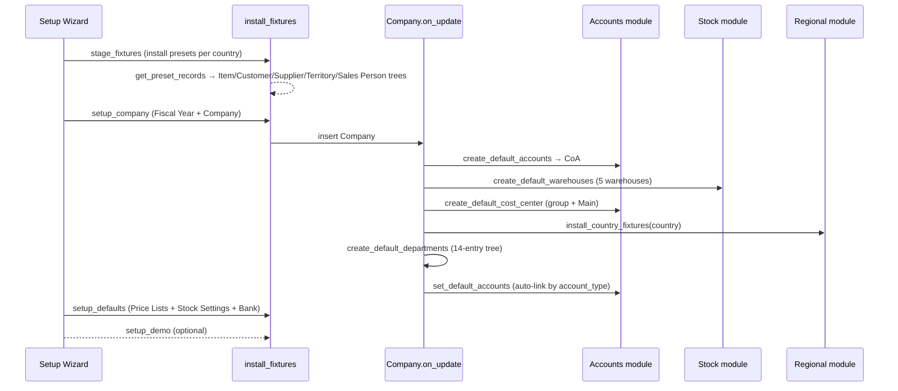

# Setup module

> **TL;DR:** The Setup module owns the bootstrap masters every other module depends on: **Company** (the multi-currency, NestedSet-tree root that auto-creates Accounts / Cost Centers / Warehouses / Departments + per-country fixtures on insert), the four `treeviews` master groups (**Item Group / Customer Group / Supplier Group / Sales Person / Territory / Department** — all `NestedSet`), the naming-series engine (`naming_series_variables` registry → `parse_naming_series_variable` in `accounts/utils.py`), the `Email Digest` daily report (`hooks.py` daily scheduler), `Currency Exchange` master + on-demand `Currency Exchange Settings` API (no daily refresh scheduler — see Open Questions), `Authorization Rule` (over-limit approval, consumed by `AuthorizationControl(TransactionBase)`), `Holiday List`, `Brand`, `Sales Partner`, `UOM` + `UOM Conversion Factor`, `Incoterm`, `Party Type`, `Terms and Conditions`, the `Vehicle / Driver / Driving License Category` triplet, the `Transaction Deletion Record` 6-task workflow plus its `doc_events["*"].validate` Redis-cache guard, the `setup_wizard_stages` (Installing presets / Setting up company / Setting defaults / [optional] Creating demo data), and the `User.validate` → `validate_employee_role` employee-role auto-strip. Demo loader lives in `erpnext/setup/demo.py` (runs `create_demo_company` + `process_masters` + `make_transactions` + `convert_order_to_invoices`). All of `after_install`'s seeding lives in `erpnext/setup/install.py` and is documented in [getting-started/after-install-seed.md](../getting-started/after-install-seed.md).

## Key files

- [erpnext/setup/install.py](../../erpnext/setup/install.py:1) — `after_install` orchestrator. Wired in [hooks.py:66](../../erpnext/hooks.py:66). Per-call walkthrough lives in [getting-started/after-install-seed.md](../getting-started/after-install-seed.md).
- [erpnext/setup/setup_wizard/setup_wizard.py](../../erpnext/setup/setup_wizard/setup_wizard.py:1) — `get_setup_stages` (3 stages + optional demo). Wired in [hooks.py:64](../../erpnext/hooks.py:64).
- [erpnext/setup/setup_wizard/operations/install_fixtures.py](../../erpnext/setup/setup_wizard/operations/install_fixtures.py:1) — `install(country)` / `install_company(args)` / `install_defaults(args)`. Source of preset Item / Customer / Supplier / Territory / Sales Person groups, Mode of Payment, Activity Type, Issue Priority, Party Type seeds, Item Attribute, Warehouse Type, etc.
- [erpnext/setup/demo.py](../../erpnext/setup/demo.py:1) — `setup_demo_data` + `clear_demo_data` (also reachable via the standard navbar `Delete Demo Data` action — [hooks.py:222-228](../../erpnext/hooks.py:222)).
- [erpnext/setup/doctype/company/company.py](../../erpnext/setup/doctype/company/company.py:1) — `Company(NestedSet)`, `validate` + `on_update` mass-setup, `on_trash` cleanup, plus `install_country_fixtures` regional bridge ([company.py:846-858](../../erpnext/setup/doctype/company/company.py:846)).
- [erpnext/setup/doctype/transaction_deletion_record/transaction_deletion_record.py](../../erpnext/setup/doctype/transaction_deletion_record/transaction_deletion_record.py:1) — 6-task ordered deletion workflow + `check_for_running_deletion_job` Redis-cache hook ([line 1108](../../erpnext/setup/doctype/transaction_deletion_record/transaction_deletion_record.py:1108)).
- [erpnext/setup/doctype/employee/employee.py](../../erpnext/setup/doctype/employee/employee.py:1) — `Employee(NestedSet)` + module-level `validate_employee_role` helper used by [hooks.py:359](../../erpnext/hooks.py:359).
- [erpnext/setup/doctype/email_digest/email_digest.py](../../erpnext/setup/doctype/email_digest/email_digest.py:1) — `EmailDigest(Document)` + `send` method invoked daily via [hooks.py:488](../../erpnext/hooks.py:488).
- [erpnext/setup/doctype/authorization_rule/authorization_rule.py](../../erpnext/setup/doctype/authorization_rule/authorization_rule.py:1) — over-limit approval rules (rule definition only; enforcement in `AuthorizationControl`).
- [erpnext/setup/doctype/authorization_control/authorization_control.py](../../erpnext/setup/doctype/authorization_control/authorization_control.py:1) — `AuthorizationControl(TransactionBase)` consumer with `get_appr_user_role` ([line 23](../../erpnext/setup/doctype/authorization_control/authorization_control.py:23)).
- [erpnext/accounts/utils.py:1598](../../erpnext/accounts/utils.py:1598) — `parse_naming_series_variable(doc, variable)`; the 9 supported variables enumerated in [hooks.py:412](../../erpnext/hooks.py:412) (`FY`, `TFY`, `ABBR`, `MM`, `DD`, `YY`, `YYYY`, `JJJ`, `WW`).
- [erpnext/hooks.py](../../erpnext/hooks.py:1) — central wiring file. See dedicated [hooks-and-overrides.md](../architecture/hooks-and-overrides.md) for the full registration tour.

## Directory layout (`erpnext/setup/`)

```
erpnext/setup/
├── install.py                    # after_install orchestrator (hooks.py:66)
├── default_success_action.py     # form-submit success-action presets (used by install.py:147)
├── demo.py                       # setup_demo_data / clear_demo_data
├── demo_data/                    # JSON seed for demo records (read by demo.py:246)
│   ├── customer.json / customer_group.json
│   ├── item.json / item_group.json
│   ├── purchase_order.json / sales_order.json
│   └── supplier.json / supplier_group.json
├── module_onboarding/            # workspace onboarding cards
├── onboarding_step/              # per-step descriptors
├── page/                         # standalone pages (e.g. permission-manager-shaped UIs)
├── setup_wizard/
│   ├── setup_wizard.py           # get_setup_stages (hooks.py:64)
│   ├── data/                     # uom_data.json, uom_conversion_data.json, country/sales-stage TXT lists
│   └── operations/
│       ├── company_setup.py      # 1-shot Company helper
│       ├── defaults_setup.py     # Single-doctype defaults
│       ├── install_fixtures.py   # get_preset_records, install_company, install_defaults, create_bank_account
│       └── taxes_setup.py        # setup_taxes_and_charges (per-country tax templates from setup_wizard/data/country_wise_tax)
├── utils.py                      # welcome_email (hooks.py:60), exchange-rate utility
├── workspace/                    # workspace JSON definitions
└── doctype/                      # 41 DocTypes (see modules/setup-doctypes.md)
```

## Company DocType — the central setup root

**File:** [erpnext/setup/doctype/company/company.py](../../erpnext/setup/doctype/company/company.py:33).
**Inheritance:** `class Company(NestedSet)` — Companies form a tree via `parent_company` ([company.py:104](../../erpnext/setup/doctype/company/company.py:104), `nsm_parent_field = "parent_company"` [company.py:136](../../erpnext/setup/doctype/company/company.py:136)).

### `validate` ([company.py:164](../../erpnext/setup/doctype/company/company.py:164))

Runs on every save:

| Step | Method | Purpose |
|---|---|---|
| 1 | `validate_abbr` ([228](../../erpnext/setup/doctype/company/company.py:228)) | Auto-derive abbreviation from company name initials; enforce uniqueness. |
| 2 | `validate_default_accounts` ([244](../../erpnext/setup/doctype/company/company.py:244)) | Each of the ~19 default-account links (Receivable, Payable, Bank, Cash, Expense, Income, Stock RBNB, Round Off, Disposal, Depreciation, …) must be (a) belong to **this** company, (b) not be a group account, (c) not be disabled, (d) match `default_currency`. |
| 3 | `validate_currency` ([319](../../erpnext/setup/doctype/company/company.py:319)) | Currency change blocked if any submitted txn exists. |
| 4 | `validate_advance_account_currency` ([296](../../erpnext/setup/doctype/company/company.py:296)) | Advance Received / Paid accounts must be in company currency. |
| 5 | `validate_coa_input` ([530](../../erpnext/setup/doctype/company/company.py:530)) | If `Existing Company` mode → require `existing_company`; else default to `Standard` template. |
| 6 | `validate_perpetual_inventory` ([542](../../erpnext/setup/doctype/company/company.py:542)) | Disabling perpetual inventory blocked when SLEs exist. |
| 7 | `validate_provisional_account_for_non_stock_items` ([565](../../erpnext/setup/doctype/company/company.py:565)) | Toggles a Property Setter on `Purchase Receipt.provisional_expense_account`. |
| 8 | `check_country_change` ([586](../../erpnext/setup/doctype/company/company.py:586)) | Sets `frappe.flags.country_change`; consumed by `on_update`. |
| 9 | `check_parent_changed` ([827](../../erpnext/setup/doctype/company/company.py:827)) | Sets `frappe.flags.parent_company_changed`; triggers NSM rebuild. |
| 10 | `set_chart_of_accounts` ([592](../../erpnext/setup/doctype/company/company.py:592)) | Inherit CoA from parent company. |
| 11 | `validate_parent_company` ([598](../../erpnext/setup/doctype/company/company.py:598)) | Parent must be group. |
| 12 | `set_reporting_currency` ([605](../../erpnext/setup/doctype/company/company.py:605)) | Reporting currency = parent's, else own default. |
| 13 | `validate_inventory_account_settings` ([211](../../erpnext/setup/doctype/company/company.py:211)) | Toggling `enable_item_wise_inventory_account` blocked once SLEs exist. |
| 14 | `cant_change_valuation_method` ([186](../../erpnext/setup/doctype/company/company.py:186)) | Valuation method change blocked if SLEs exist for items without an item-level method. |
| 15 | `validate_pending_reposts` ([613](../../erpnext/setup/doctype/company/company.py:613)) | If `accounts_frozen_till_date` advances, enforce `check_pending_reposting` first. |

### `on_update` ([company.py:335](../../erpnext/setup/doctype/company/company.py:335))

This is the heaviest mass-setup hook in the codebase. It runs after every save (so on first insert it bootstraps the entire chart of accounts, departments, warehouses, cost centers and per-country tax templates):

1. `NestedSet.on_update(self)` — re-compute lft/rgt.
2. If no `Account` exists for this company yet (and `frappe.local.flags.ignore_chart_of_accounts` is not set):
   - `sync_financial_report_templates(...)` — load standard Balance Sheet / P&L definitions.
   - `create_default_accounts()` ([414](../../erpnext/setup/doctype/company/company.py:414)) → calls `create_charts(self.name, self.chart_of_accounts, self.existing_company)` and stamps `default_receivable_account` + `default_payable_account`.
   - `create_default_warehouses()` ([379](../../erpnext/setup/doctype/company/company.py:379)) — creates the 5 warehouses: `All Warehouses` (group), `Stores`, `Work In Progress`, `Finished Goods`, `Goods In Transit` (with `warehouse_type = "Transit"`).
3. `create_default_cost_center()` ([710](../../erpnext/setup/doctype/company/company.py:710)) — creates `<company> - <abbr>` (group root) + `Main - <abbr>` (leaf), then stamps `cost_center` / `round_off_cost_center` / `depreciation_cost_center` to the leaf.
4. `frappe.flags.country_change` ⇒ `install_country_fixtures(self.name, self.country)` ([846](../../erpnext/setup/doctype/company/company.py:846)) + `create_default_tax_template()` ([240](../../erpnext/setup/doctype/company/company.py:240)). The first is the regional-overrides bridge — see [patterns/regional-overrides.md](../patterns/regional-overrides.md).
5. `create_default_departments()` ([432](../../erpnext/setup/doctype/company/company.py:432)) — 14-entry tree under `All Departments` (Accounts, Marketing, Sales, Purchase, Operations, Production, Dispatch, Customer Service, Human Resources, Management, Quality Management, Research & Development, Legal).
6. `set_default_accounts()` ([618](../../erpnext/setup/doctype/company/company.py:618)) — auto-link `default_cash_account`, `default_bank_account`, `round_off_account`, `accumulated_depreciation_account`, `depreciation_expense_account`, `capital_work_in_progress_account`, `asset_received_but_not_billed`, `default_expense_account` and (if perpetual) `stock_received_but_not_billed`, `default_inventory_account`, `stock_adjustment_account` from the freshly-built CoA by `account_type` lookup. Income / Write Off / Exchange Gain Loss / Disposal accounts are picked by `account_name` match.
7. `set_mode_of_payment_account()` ([697](../../erpnext/setup/doctype/company/company.py:697)) — appends a row to the `Cash` Mode of Payment for this company.
8. `frappe.flags.parent_company_changed` ⇒ `rebuild_tree("Company")`.
9. `frappe.clear_cache()`.

### `on_trash` ([company.py:752](../../erpnext/setup/doctype/company/company.py:752))

`NestedSet.validate_if_child_exists` first (you cannot delete a parent of a sub-company). Then, **only if no GL Entry exists** for the company, deletes Account / Cost Center / Budget / Party Account; if no SLE exists, deletes Warehouse. Always deletes BOMs, Mode of Payment Account rows, Item Default rows, Item Reorder rows, Employee, Department, Tax Withholding Account, Transaction Deletion Record, Sales / Purchase Taxes & Charges Templates, Item Tax Template, and (if no GL Entry) Process Deferred Accounting.

### Cross-module artefacts

- `period_closing_doctypes` ([hooks.py:322](../../erpnext/hooks.py:322)) — Company.accounts_frozen_till_date is the gate; see [modules/accounts.md](accounts.md).
- `update_company_current_month_sales` / `update_company_monthly_sales` / `cache_companies_monthly_sales_history` ([company.py:861-925](../../erpnext/setup/doctype/company/company.py:861)) — daily scheduler at [hooks.py:470](../../erpnext/hooks.py:470).
- `create_transaction_deletion_request(company)` ([company.py:1073](../../erpnext/setup/doctype/company/company.py:1073)) — whitelisted action surfaced from the Company UI to start a `Transaction Deletion Record` workflow.

## Setup Wizard stages

Registered: [hooks.py:64](../../erpnext/hooks.py:64) — `setup_wizard_stages = "erpnext.setup.setup_wizard.setup_wizard.get_setup_stages"`. Implementation: [setup_wizard.py:12](../../erpnext/setup/setup_wizard/setup_wizard.py:12).

1. **Installing presets** ([setup_wizard.py:13](../../erpnext/setup/setup_wizard/setup_wizard.py:13)) → `stage_fixtures(args)` → `install_fixtures.install(country)`. Inserts the preset records from `get_preset_records(country)` ([install_fixtures.py:26](../../erpnext/setup/setup_wizard/operations/install_fixtures.py:26)): root + leaf Item / Customer / Supplier Groups (under their respective `All …` roots), Territories (`All Territories` group + the chosen country leaf + `Rest Of The World`), Sales Person root, Stock Entry Types (the full purpose set), 5 Modes of Payment (Cheque/Check, Cash, Credit Card, Wire Transfer, Bank Draft), Activity Types, Item Attributes (`Size`, `Colour`), Issue Priorities (Low/Medium/High), Party Types (Customer / Supplier / Employee / Shareholder), Opportunity Types, Project Types, Print Headings (Credit/Debit Note), Share Types, Market Segments, `Warehouse Type=Transit`, four Workstation Operating Components (Electricity / Consumables / Rent / Wages). Plus the `Designation` / `Sales Stage` / `Industry Type` / `UTM Source` / `Sales Partner Type` text fixtures, the `Dispatch Notification` Email Template, default Supplier Scorecard records, address templates, Selling/Buying defaults (`update_selling_defaults` / `update_buying_defaults`), UOMs + UOM Conversion Factors from `uom_data.json` + `uom_conversion_data.json`, item-variant settings, global-search doctype list.
2. **Setting up company** ([setup_wizard.py:19](../../erpnext/setup/setup_wizard/setup_wizard.py:19)) → `setup_company(args)` → `install_fixtures.install_company(args)` ([install_fixtures.py:454](../../erpnext/setup/setup_wizard/operations/install_fixtures.py:454)). Creates the `Fiscal Year` row + the first `Company` doc with `enable_perpetual_inventory=1`, `chart_of_accounts=args.chart_of_accounts`. The Company `on_update` then triggers all the bootstrap from the previous section.
3. **Setting defaults** ([setup_wizard.py:24](../../erpnext/setup/setup_wizard/setup_wizard.py:24)) → `setup_defaults(args)` → `install_fixtures.install_defaults(args)` ([install_fixtures.py:480](../../erpnext/setup/setup_wizard/operations/install_fixtures.py:480)). Creates two Price Lists (`Standard Buying` / `Standard Selling`), enables the chosen currency, sets Stock Settings email footer, runs `set_global_defaults` (writes `default_currency`, `default_company`, `country` into `Global Defaults`), `update_stock_settings` (FIFO, default warehouse `Stores`, `stock_uom = "Nos"`, `auto_indent = 1`), then optionally creates the Bank Account.
4. **Creating demo data** (optional; only if `args.get("setup_demo")` — [setup_wizard.py:33](../../erpnext/setup/setup_wizard/setup_wizard.py:33)) → `setup_demo(args)` → `setup_demo_data(args.get("company_name"))` (see "Demo loader" below).

`setup_complete(args)` ([setup_wizard.py:62](../../erpnext/setup/setup_wizard/setup_wizard.py:62)) is the programmatic shorthand that runs the first three stages without the wizard UI.

## Naming Series engine

The Naming Series control field on every transaction DocType supports placeholder variables resolved at name-generation time. ERPNext registers 9 variables in [hooks.py:412-416](../../erpnext/hooks.py:412):

```python
naming_series_variables_list = ["FY", "TFY", "ABBR", "MM", "DD", "YY", "YYYY", "JJJ", "WW"]
naming_series_variables = {
    variable: "erpnext.accounts.utils.parse_naming_series_variable"
    for variable in naming_series_variables_list
}
```

Resolver: [erpnext/accounts/utils.py:1598](../../erpnext/accounts/utils.py:1598).

| Variable | Resolved to | Source |
|---|---|---|
| `FY` | Full fiscal year for the doc's `posting_date` / `transaction_date` (or today if no doc) | `get_fiscal_year(date, company)` ([utils.py:1606](../../erpnext/accounts/utils.py:1606)) |
| `TFY` | Truncated fiscal year (`truncate=True`) | same call with `truncate` flag |
| `ABBR` | `Company.abbr` for the doc's `company` (or `frappe.db.get_default("company")`) | [utils.py:1608-1614](../../erpnext/accounts/utils.py:1608) |
| `YY` | 2-digit year | `strftime("%y")` |
| `YYYY` | 4-digit year | `strftime("%Y")` |
| `MM` | 2-digit month | `strftime("%m")` |
| `DD` | 2-digit day-of-month | `strftime("%d")` |
| `JJJ` | 3-digit day-of-year (Julian) | `strftime("%j")` |
| `WW` | ISO week-of-year via `determine_consecutive_week_number(date)` | [utils.py:1630](../../erpnext/accounts/utils.py:1630) |

Date source: `posting_date` / `transaction_date` / `posting_datetime` from the document if `Global Defaults.use_posting_datetime_for_naming_documents` is set ([utils.py:1622-1629](../../erpnext/accounts/utils.py:1622)); otherwise `now_datetime()`. Special-case for `Batch` / `Serial No`: when `reference_doctype` + `reference_name` are set, the resolver substitutes the referenced document so the SABB/Batch inherits its parent doc's posting date ([utils.py:1619-1620](../../erpnext/accounts/utils.py:1619)).

## Authorization Rule + Authorization Control

`Authorization Rule` is the rule definition; `Authorization Control` is the enforcement consumer.

- [authorization_rule.py:11](../../erpnext/setup/doctype/authorization_rule/authorization_rule.py:11) — `class AuthorizationRule(Document)`. `validate` runs `check_duplicate_entry` + `validate_rule`. The `transaction` field is a fixed Literal of 7 values: Sales Order, Purchase Order, Quotation, Delivery Note, Sales Invoice, Purchase Invoice, Purchase Receipt ([authorization_rule.py:38-47](../../erpnext/setup/doctype/authorization_rule/authorization_rule.py:38)). The `based_on` Literal is one of: Grand Total, Average Discount, Customerwise Discount, Itemwise Discount, Item Group wise Discount, Not Applicable ([authorization_rule.py:22-30](../../erpnext/setup/doctype/authorization_rule/authorization_rule.py:22)). Discount-based rules are explicitly disallowed for Purchase-side transactions + Stock Entry ([authorization_rule.py:80-91](../../erpnext/setup/doctype/authorization_rule/authorization_rule.py:80)).
- [authorization_control.py:12](../../erpnext/setup/doctype/authorization_control/authorization_control.py:12) — `class AuthorizationControl(TransactionBase)`. The `get_appr_user_role(det, doctype_name, total, based_on, condition, master_name, company)` method ([line 23](../../erpnext/setup/doctype/authorization_control/authorization_control.py:23)) loads matching `Authorization Rule` rows by `(transaction, value, based_on, company)` and throws if neither the user nor any of their roles match the approving set. Calls into this method live in transaction controllers that opt into auth checks.

> **TODO(verify):** Locate the call sites that invoke `AuthorizationControl.get_appr_user_role` from the transaction controller chain — initial grep for `authorization_control` returned no `.py` consumers in `erpnext/`, suggesting the consumer is `frappe.client`-level or has been pruned in the current commit.

## Transaction Deletion Record

`Transaction Deletion Record` is the company-scoped data-deletion workflow.

- [transaction_deletion_record.py:113](../../erpnext/setup/doctype/transaction_deletion_record/transaction_deletion_record.py:113) — `TransactionDeletionRecord(Document)`. Six ordered tasks defined as an `OrderedDict` in `__init__` ([line 152](../../erpnext/setup/doctype/transaction_deletion_record/transaction_deletion_record.py:152)): `Delete Bins → Delete Leads and Addresses → Reset Company Values → Clear Notifications → Initialize Summary Table → Delete Transactions`. Submits enqueue `start_deletion_tasks`. Cancel flips `status=Cancelled` and clears the per-DocType Redis cache ([294-310](../../erpnext/setup/doctype/transaction_deletion_record/transaction_deletion_record.py:294)).
- **Protected core DocTypes** ([transaction_deletion_record.py:25-67](../../erpnext/setup/doctype/transaction_deletion_record/transaction_deletion_record.py:25)) — `frozenset` of DocTypes that can never be added to the to-delete list (DocType, DocField, Custom Field, Property Setter, DocPerm, User, Role, Has Role, User Permission, Module Def, Workflow, System Settings, File, Version, Activity Log, Error Log, Scheduled Job Type/Log, Server/Client Script, Data Import/Export, Report, Print Format, Email Template, Assignment Rule, Workspace, Dashboard, Access Log, Transaction Deletion Record, Company). All Singles are also auto-protected ([line 107-108](../../erpnext/setup/doctype/transaction_deletion_record/transaction_deletion_record.py:107)).
- **Ledger doctypes** ([transaction_deletion_record.py:15-21](../../erpnext/setup/doctype/transaction_deletion_record/transaction_deletion_record.py:15)) — `LEDGER_ENTRY_DOCTYPES = {"GL Entry", "Payment Ledger Entry", "Stock Ledger Entry"}` short-circuit out of the running-deletion guard so cancellation reverse entries are not blocked.
- **Cross-DocType validate hook** ([hooks.py:343-349](../../erpnext/hooks.py:343)) — `doc_events["*"].validate` includes `erpnext.setup.doctype.transaction_deletion_record.transaction_deletion_record.check_for_running_deletion_job`. Implementation at [transaction_deletion_record.py:1108](../../erpnext/setup/doctype/transaction_deletion_record/transaction_deletion_record.py:1108) reads `frappe.cache.get_value(f"deletion_running_doctype:{doc.doctype}")` and throws if a Transaction Deletion Record is currently deleting that DocType. Cache TTL is 4h (`DELETION_CACHE_TTL = 4 * 60 * 60` — [line 23](../../erpnext/setup/doctype/transaction_deletion_record/transaction_deletion_record.py:23)).

## Email Digest

`Email Digest` is the configurable per-company recurring report.

- [email_digest.py:32](../../erpnext/setup/doctype/email_digest/email_digest.py:32) — `class EmailDigest(Document)`. `frequency` is one of `Daily / Weekly / Monthly`. The `__init__` loads `from_date` / `to_date` from helpers and resolves the company's `default_currency` ([line 80-83](../../erpnext/setup/doctype/email_digest/email_digest.py:80)).
- **Daily scheduler** — [hooks.py:488](../../erpnext/hooks.py:488) — `erpnext.setup.doctype.email_digest.email_digest.send` runs in `daily_maintenance`. The module-level `send()` walks all enabled `Email Digest` rows and dispatches each digest's HTML to its `recipients` table.
- **Configurable sections** ([email_digest.py:44-75](../../erpnext/setup/doctype/email_digest/email_digest.py:44)) — Check fields toggle each section: `bank_balance`, `credit_balance`, `income`, `expenses_booked`, `income_year_to_date`, `expense_year_to_date`, `invoiced_amount`, `payables`, `sales_invoice`, `purchase_invoice`, `sales_order`, `purchase_order`, `pending_quotations`, `new_quotations`, `sales_orders_to_deliver`, `sales_orders_to_bill`, `purchase_orders_to_receive`, `purchase_orders_to_bill`, `purchase_orders_items_overdue`, `notifications`, `issue`, `project`, `calendar_events`, `todo_list`, `add_quote`.

## Currency Exchange master

- [erpnext/setup/doctype/currency_exchange/currency_exchange.py:12](../../erpnext/setup/doctype/currency_exchange/currency_exchange.py:12) — `class CurrencyExchange(Document)`. Composite name is `<yyyy-MM-dd>-<from_currency>-<to_currency>[-<purpose>]` where `purpose ∈ {Selling, Buying, Selling-Buying}` ([autoname](../../erpnext/setup/doctype/currency_exchange/currency_exchange.py:29)). `validate` enforces `exchange_rate > 0`, distinct currencies, and at least one of `for_buying` / `for_selling` set.
- **API endpoint config** — `Currency Exchange Settings` Single ([erpnext/accounts/doctype/currency_exchange_settings/currency_exchange_settings.py:32](../../erpnext/accounts/doctype/currency_exchange_settings/currency_exchange_settings.py:32)) supports three providers: `frankfurter.dev` (default), `exchangerate.host`, `Custom`. `setup_currency_exchange()` in `install.py` ([install.py:85](../../erpnext/setup/install.py:85)) seeds the `frankfurter.dev` endpoint + result-key + req-params during `after_install`.

> **TODO(verify):** No daily-cron entry refreshes Currency Exchange in [hooks.py:433-500](../../erpnext/hooks.py:433). Rates appear to be fetched on-demand by `erpnext.setup.utils.get_exchange_rate` (cache key `currency_exchange_rate_<date>:<from>:<to>` — [setup/utils.py:115](../../erpnext/setup/utils.py:115)) and the only related daily/weekly/monthly cron entries are `auto_create_exchange_rate_revaluation_*` ([hooks.py:483, 494, 498](../../erpnext/hooks.py:483)) which create *Exchange Rate Revaluation* documents, not new `Currency Exchange` rows. The brief's "Currency Exchange daily refresh scheduler" is therefore not present in this commit.

## Holiday List, Department, Territory, NestedSet master groups

All four master groups + Department + Territory share the same shape: `NestedSet`-backed tree with an `is_group` flag, a `parent_*` link, and a `*_tree.js` treeview client. They are listed in `treeviews` at [hooks.py:77-87](../../erpnext/hooks.py:77).

| DocType | Class | File | NestedSet field |
|---|---|---|---|
| Item Group | `class ItemGroup(NestedSet)` | [item_group.py:10](../../erpnext/setup/doctype/item_group/item_group.py:10) | `parent_item_group` |
| Customer Group | `class CustomerGroup(NestedSet)` | [customer_group.py:10](../../erpnext/setup/doctype/customer_group/customer_group.py:10) | `parent_customer_group` |
| Supplier Group | `class SupplierGroup(NestedSet)` | [supplier_group.py:10](../../erpnext/setup/doctype/supplier_group/supplier_group.py:10) | `parent_supplier_group` |
| Sales Person | `class SalesPerson(NestedSet)` | [sales_person.py:19](../../erpnext/setup/doctype/sales_person/sales_person.py:19) | `parent_sales_person` |
| Territory | `class Territory(NestedSet)` | [territory.py:11](../../erpnext/setup/doctype/territory/territory.py:11) | `parent_territory` |
| Department | `class Department(NestedSet)` | [department.py:13](../../erpnext/setup/doctype/department/department.py:13) | `parent_department` |
| Holiday List | `class HolidayList(Document)` | [holiday_list.py:18](../../erpnext/setup/doctype/holiday_list/holiday_list.py:18) | (not a tree; flat) |

`Holiday List` is **not** a NestedSet — it is a flat document with a child `Holiday` table; `validate` runs `validate_days` + dedup + sort ([holiday_list.py:43-47](../../erpnext/setup/doctype/holiday_list/holiday_list.py:43)). Used by `Employee.holiday_list` and `Company.default_holiday_list` (see `get_holiday_list_for_employee` at [employee.py:368](../../erpnext/setup/doctype/employee/employee.py:368)).

## User → Employee role auto-strip

[hooks.py:357-361](../../erpnext/hooks.py:357):

```python
"User": {
    "after_insert": "frappe.contacts.doctype.contact.contact.update_contact",
    "validate": "erpnext.setup.doctype.employee.employee.validate_employee_role",
    "on_update": "erpnext.portal.utils.set_default_role",
},
```

Implementation: [employee.py:344](../../erpnext/setup/doctype/employee/employee.py:344) — when a `User` is saved, if no `Employee` row links to that user, both `Employee` and `Employee Self Service` roles are silently stripped from the user's role list (with an msgprint notice). Pass `ignore_emp_check=True` to skip the linked-Employee lookup.

## Demo loader

- [erpnext/setup/demo.py:19](../../erpnext/setup/demo.py:19) — `setup_demo_data(company_name)`. Wraps the run in a `frappe.db.savepoint("demo_data")` with rollback on failure and a notification to System Managers ([demo.py:30-34](../../erpnext/setup/demo.py:30)).
- **Steps**:
  1. `create_demo_company(company)` ([demo.py:82](../../erpnext/setup/demo.py:82)) — clones the source company's CoA + currency + country, suffixes name with `(Demo)` and abbr with `D`, sets `Global Defaults.demo_company`, creates a `Demo Bank Account` via `create_bank_account(..., demo=True)`.
  2. `process_masters()` ([demo.py:106](../../erpnext/setup/demo.py:106)) — iterates `frappe.get_hooks("demo_master_doctypes")` ([hooks.py:89-96](../../erpnext/hooks.py:89): item_group, item, customer_group, supplier_group, customer, supplier) and inserts each from `erpnext/setup/demo_data/<doctype>.json`.
  3. `make_transactions(company)` ([demo.py:118](../../erpnext/setup/demo.py:118)) — temporarily flips `Stock Settings.allow_negative_stock=1`, picks the active fiscal year's start date, walks `frappe.get_hooks("demo_transaction_doctypes")` ([hooks.py:97-100](../../erpnext/hooks.py:97): purchase_order, sales_order) and submits each with a randomised posting date.
  4. `convert_order_to_invoices()` ([demo.py:167](../../erpnext/setup/demo.py:167)) — for the first 6 submitted PO/SO each, run `make_purchase_invoice` / `make_sales_invoice` with `update_stock=1`, submit, and (every other one) issue a Payment Entry.
- **Erase path** — `clear_demo_data()` ([demo.py:60](../../erpnext/setup/demo.py:60)) runs `create_transaction_deletion_record(company)` then deletes the demo company. Surfaced in the standard navbar as `Delete Demo Data` action ([hooks.py:222-228](../../erpnext/hooks.py:222), conditional on `frappe.boot.sysdefaults.demo_company`).

## Scheduler entries owned by Setup

From [hooks.py:462-492](../../erpnext/hooks.py:462) — `daily_maintenance` slot:

| Job | hooks.py line |
|---|---|
| `erpnext.setup.doctype.company.company.cache_companies_monthly_sales_history` | [hooks.py:470](../../erpnext/hooks.py:470) |
| `erpnext.setup.doctype.email_digest.email_digest.send` | [hooks.py:488](../../erpnext/hooks.py:488) |

## Cross-module touchpoints

- **Accounts** ([modules/accounts.md](accounts.md)) — `Company.default_*_account`, `accounts_frozen_till_date`, `round_off_account`, `default_payable_account` / `default_receivable_account`, `cost_center`, `enable_perpetual_inventory`, `enable_provisional_accounting_for_non_stock_items`, `default_advance_received_account` / `default_advance_paid_account`, `disposal_account`, `depreciation_expense_account` — the entire GL framework keys off Company defaults.
- **Stock** ([modules/stock.md](stock.md)) — `Company.default_inventory_account`, `stock_received_but_not_billed`, `stock_adjustment_account`, `default_warehouse_for_sales_return`, `default_in_transit_warehouse`, `default_wip_warehouse`, `default_fg_warehouse`, `valuation_method` (`FIFO` / `Moving Average` / `LIFO` — [company.py:131](../../erpnext/setup/doctype/company/company.py:131)).
- **Selling** ([modules/selling.md](selling.md)) — `Customer Group` (NestedSet), `Territory` (NestedSet), `Sales Person` (NestedSet), `Sales Partner`, `Sales Stage` (seeded by `install_fixtures.install`).
- **Buying** ([modules/buying.md](buying.md)) — `Supplier Group` (NestedSet).
- **Manufacturing** ([modules/manufacturing.md](manufacturing.md)) — `make_default_operations()` ([install.py:44](../../erpnext/setup/install.py:44)) seeds the `Assembly` Operation; `Workstation Operating Component` rows seeded in `install_fixtures.get_preset_records` ([install_fixtures.py:314-317](../../erpnext/setup/setup_wizard/operations/install_fixtures.py:314)).
- **Regional** ([modules/regional.md](regional.md)) — `Company.on_update` triggers `install_country_fixtures` whenever `country` changes; the country-specific `erpnext.regional.<country>.setup.setup` is invoked. Failing import is silently swallowed ([company.py:850-851](../../erpnext/setup/doctype/company/company.py:850)).

## Diagram — Setup Wizard → Company → cascading bootstrap



## Open questions / TODO(verify)

- **No daily Currency Exchange refresh scheduler.** The brief listed one as a known item, but `hooks.py` only contains `auto_create_exchange_rate_revaluation_*` (which creates *Exchange Rate Revaluation* docs, not Currency Exchange rows). Rates are fetched on-demand by `erpnext.setup.utils.get_exchange_rate` and cached.
- **`AuthorizationControl` consumers.** A grep for `authorization_control` (case-insensitive) in `erpnext/**/*.py` finds only the controller file itself. The over-limit approval flow appears to be available as a callable but is not wired through the standard transaction lifecycle in this commit. Worth a deeper trace before claiming it is dead code.

## Related

- [Getting started — after_install seed catalogue](../getting-started/after-install-seed.md) — exhaustive line-by-line walkthrough of `erpnext/setup/install.py:after_install`.
- [Setup DocType reference cards](setup-doctypes.md) — per-DocType card for every file under `erpnext/setup/doctype/`.
- [Hooks and overrides](../architecture/hooks-and-overrides.md) — `naming_series_variables`, `setup_wizard_stages`, `treeviews`, `demo_master_doctypes`, `doc_events["User"]`, `doc_events["*"].validate`.
- [Regional overrides](../patterns/regional-overrides.md) — how `install_country_fixtures` plugs in.
- [Patches](../patterns/patches.md) — many patches (`patches/v13_0/update_exchange_rate_settings.py` etc.) re-run the helpers in `install.py`.

## Changelog

- `2026-04-18` — initial version (Phase 2 of docs gap-fill).
