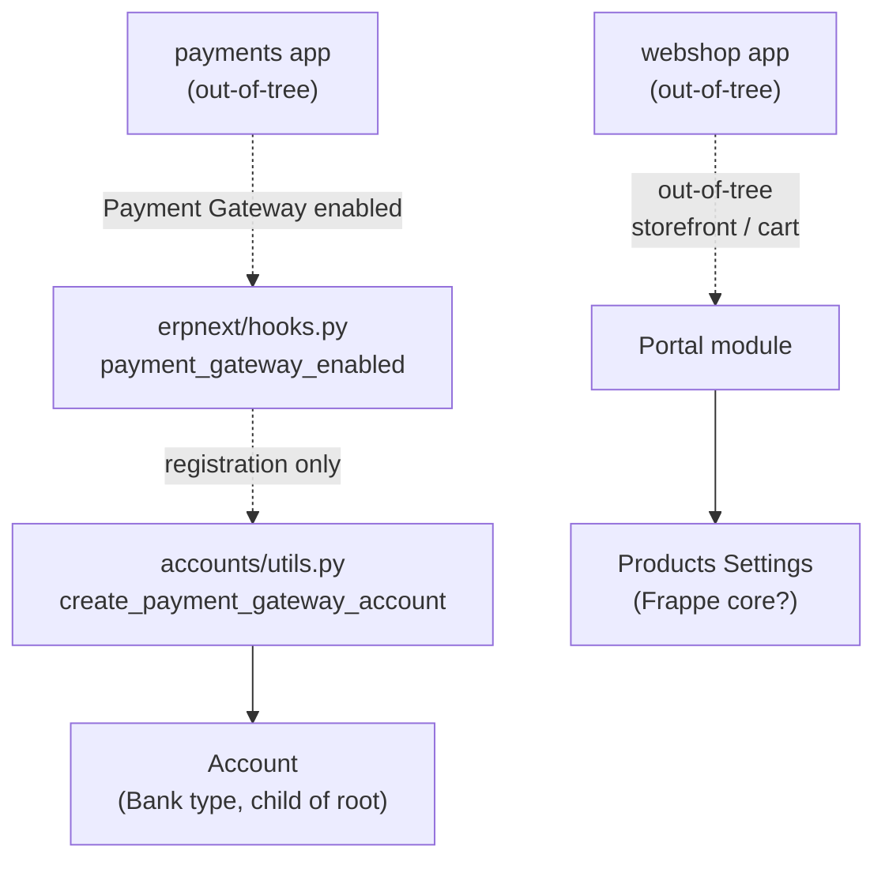

# Shopping Cart

> **TL;DR:** At this commit the in-tree `erpnext/shopping_cart/` module is **a shell** — three empty `__init__.py` files, no DocTypes, no controllers, no `web_template/` content. The actual cart and checkout DocTypes (E-Commerce Settings, Item Cart, Payment Request, etc.) and the `/cart` page logic that earlier ERPNext versions shipped have **moved out of this app** in v15+ to the standalone `webshop` and `payments` apps. What remains here is module scaffolding for legacy compatibility plus the storefront filter glue handed off to the [Portal](portal.md) module via `Products Settings`. **`payment_gateway_enabled` ([hooks.py:521](../../erpnext/hooks.py:521)) registers `erpnext.accounts.utils.create_payment_gateway_account` for the external `payments` app to call when a gateway is enabled — the consumer side is out-of-tree.**

## Key files

- [erpnext/shopping_cart/__init__.py](../../erpnext/shopping_cart/__init__.py:1) — empty (3 lines, comment header only).
- [erpnext/shopping_cart/doctype/__init__.py](../../erpnext/shopping_cart/doctype/__init__.py) — empty subpackage marker; **no DocTypes ship in this directory at this commit**.
- [erpnext/shopping_cart/web_template/__init__.py](../../erpnext/shopping_cart/web_template/__init__.py) — empty subpackage marker; no web templates.
- [erpnext/hooks.py:521](../../erpnext/hooks.py:521) — `payment_gateway_enabled = "erpnext.accounts.utils.create_payment_gateway_account"`.
- [erpnext/accounts/utils.py:1489](../../erpnext/accounts/utils.py:1489) — `def create_payment_gateway_account(gateway, payment_channel="Email", company=None)` — the **callee** invoked by the external `payments` app whenever a Payment Gateway document is enabled. Creates a matching `Account` (sub-account of the company root) so payment-gateway charges can post into the GL.

## Diagram



Legend: dashed = registration / out-of-tree dependency; solid = synchronous call.

## 1. What `erpnext/shopping_cart/` actually contains

- **3 directories**, all whose only file is `__init__.py`:
  - `erpnext/shopping_cart/` ([__init__.py](../../erpnext/shopping_cart/__init__.py:1))
  - `erpnext/shopping_cart/doctype/`
  - `erpnext/shopping_cart/web_template/`
- **No DocType folders** under `doctype/`. (Verified by directory listing — only `__init__.py`.)
- **No web template files** under `web_template/`.

The module exists in [erpnext/modules.txt](../../erpnext/modules.txt) for historical/scaffolding reasons but ships zero functional code at this commit. Cards in [shopping-cart-doctypes.md](shopping-cart-doctypes.md) reflect this: the file enumerates "no in-tree DocTypes" and points readers at the cross-app surfaces that participate in cart-style flows (Quotation, Sales Order, Customer, Address, Payment Request).

## 2. Cart-style flows still inside ERPNext

Although the dedicated module is empty, ERPNext core still owns the **DocType endpoints** that an external storefront app uses to materialise a cart into transactions:

| Stage | Owner | DocType | Doc reference |
|-------|-------|---------|---------------|
| Item search / list | external | Item, Item Price, Pricing Rule | [selling-doctypes.md](selling-doctypes.md) |
| Cart line item | external | Quotation Item (child) | [selling-doctypes.md](selling-doctypes.md) |
| Cart submission | external | Quotation (`order_type = "Shopping Cart"`) | [selling-doctypes.md](selling-doctypes.md) |
| Order placement | external | Sales Order | [selling-doctypes.md](selling-doctypes.md), [selling-flow.md](../flows/selling-flow.md) |
| Customer master | external | Customer (auto-created via [portal.utils.create_customer_or_supplier](../../erpnext/portal/utils.py:22)) | [portal.md](portal.md) |
| Address capture | external | Address (`/addresses` route at [hooks.py:199-204](../../erpnext/hooks.py:199)) | [portal.md](portal.md) |
| Payment request | external | Payment Request | [accounts-doctypes.md](accounts-doctypes.md) (Payment Entry / Payment Request) |
| Payment gateway hook | ERPNext side | `payment_gateway_enabled` | this doc, section 3 |

**Out-of-tree dependencies:**
- The [`webshop`](https://github.com/frappe/webshop) app provides the actual `/cart`, `/checkout`, item catalogue, and Shopping Cart Settings DocType. ERPNext does not depend on `webshop` and does not import from it.
- The [`payments`](https://github.com/frappe/payments) app provides the Payment Gateway DocTypes and webhook handlers. [erpnext/utilities/__init__.py:43-53](../../erpnext/utilities/__init__.py:43) ships a `payment_app_import_guard()` context manager that throws a friendly "payments app is not installed" message when ERPNext tries to import payment-gateway code without the app installed.

## 3. `payment_gateway_enabled` — the only live hook

[hooks.py:521](../../erpnext/hooks.py:521) registers:

```python
payment_gateway_enabled = "erpnext.accounts.utils.create_payment_gateway_account"
```

This is **a callable target**, not an event subscriber — the external `payments` app calls `frappe.get_hooks("payment_gateway_enabled")` and invokes the resolved function whenever a Payment Gateway document is set to `enabled`. The body at [accounts/utils.py:1489](../../erpnext/accounts/utils.py:1489):

1. Receives `(gateway, payment_channel="Email", company=None)`.
2. Resolves company default if not supplied.
3. Looks up the company's bank account group node in CoA.
4. Creates a child `Account` (account_type = `Bank`) named after the gateway under that node, idempotently.
5. Returns the new account name so `payments` can persist the gateway → account link.

Without this account, gateway charges cannot post into the GL, so the bridge is a **prerequisite for any cart that books a Payment Entry on submit**.

`TODO(verify)` — the consumer side (the `payments` app's call site) was not inspected. The hook target itself is verified live and reachable.

## 4. Why the module is mostly empty

In v14 / v15 the storefront moved to the dedicated `webshop` app. The empty scaffolding here is preserved for:

- `modules.txt` registration so reports/permissions can still namespace by "Shopping Cart" if a custom app re-uses the slot.
- Forward compatibility with custom child modules placed under `erpnext/shopping_cart/doctype/<custom>` by site-specific apps.

If the directory is ever populated again with first-party DocTypes, this page should be expanded; the module overview pattern ([modules/portal.md](portal.md), [modules/setup.md](setup.md)) is the template to follow.

## Related

- [Portal module](portal.md) — `on_session_creation` auto-provisions a Customer for cart sessions; `/addresses` portal route hosts shipping address entry.
- [Selling DocTypes](selling-doctypes.md) — Quotation (`order_type = "Shopping Cart"`), Sales Order, Customer.
- [Selling flow](../flows/selling-flow.md) — Quotation → Sales Order → Delivery Note → Sales Invoice cascade.
- [Accounts DocTypes](accounts-doctypes.md) — Payment Entry / Payment Request DocTypes that gateways call into.
- [www / templates](www-and-templates.md) — `templates/includes/cart.css` and the `/checkout` family of page assets, where they exist.

## Changelog

- `2026-04-18` — initial version. Documented the empty-module state, in-tree `payment_gateway_enabled` hook, out-of-tree `webshop` / `payments` app boundaries.
