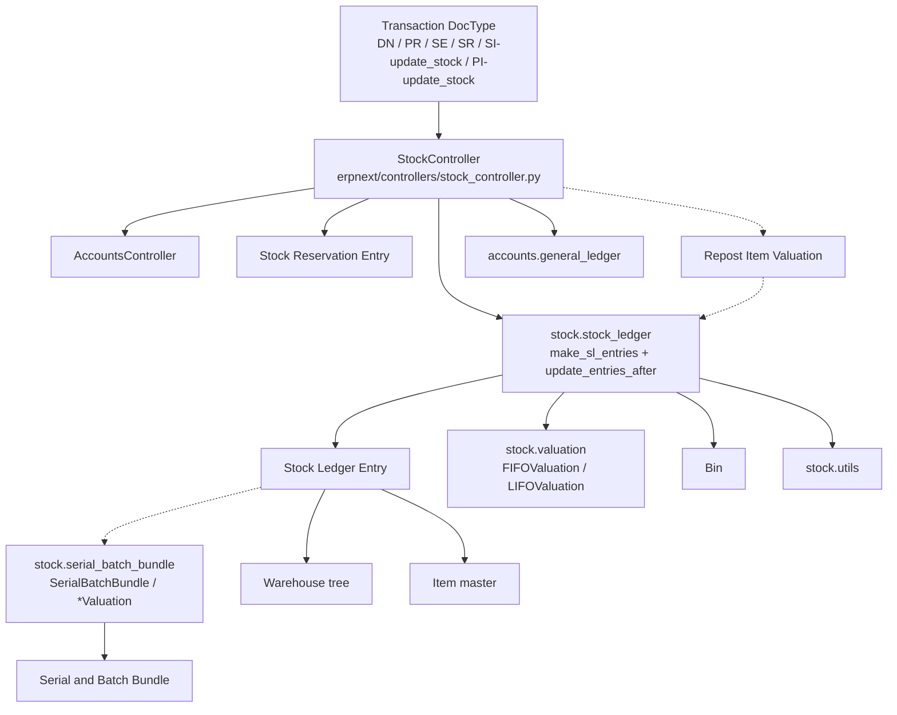

# Stock Module

> **TL;DR:** The Stock module owns every item movement: the `Stock Ledger Entry` (SLE) event log, the `Bin` per-(item, warehouse) cache, the `Serial and Batch Bundle` canonical lot/serial container, the `Warehouse` tree, valuation math (FIFO / LIFO / Moving Average, plus Batch/Serial), reservations, and the `Repost Item Valuation` framework that rebuilds balances after backdated edits. Every transactional stock DocType (`Delivery Note`, `Purchase Receipt`, `Stock Entry`, `Stock Reconciliation`, plus `update_stock=1` invoices) inherits from `StockController` and funnels through `StockController.make_sl_entries` into the module-level `stock_ledger.make_sl_entries`. Perpetual-inventory companies then let `StockController.get_gl_entries` translate each SLE's `stock_value_difference` into a paired GL row — see [flows/accounting-flow.md](../flows/accounting-flow.md) for the GL write side and [flows/stock-flow.md](../flows/stock-flow.md) for the SLE write side.

## Directory layout

```
erpnext/stock/
├── __init__.py               # get_warehouse_account_map / get_warehouse_account
├── stock_ledger.py           # SLE write path + update_entries_after + reposting
├── serial_batch_bundle.py    # SABB post-processing + SerialNoValuation / BatchNoValuation
├── valuation.py              # FIFOValuation / LIFOValuation queue math
├── utils.py                  # get_stock_balance, get_valuation_method, get_incoming_rate, get_or_make_bin
├── reorder_item.py           # daily scheduler: auto-create Material Requests under reorder level
├── stock_balance.py          # recompute Bin columns (reserved_qty, ordered_qty, indented_qty, planned_qty)
├── get_item_details.py       # Item defaults for transaction rows (tax, price, UOM, warehouse)
├── deprecated_serial_batch.py# v15 legacy serial/batch valuation kept for backwards compat
├── doctype/                  # ~80 DocTypes (Item, Warehouse, SLE, Bin, SABB, DN, PR, ...)
├── report/                   # ~30 analytical reports (Stock Balance, Stock Ageing, ...)
├── dashboard_chart/          # chart sources
├── dashboard_chart_source/
├── stock_dashboard/
├── workspace/
├── page/                     # stock-entry-bar-code, stock-balance, wms
├── print_format/
├── number_card/
├── onboarding_step/
├── module_onboarding/
├── spec/                     # OpenAPI-style specs
└── tests/
```

Key files:

- [`__init__.py`](erpnext/stock/__init__.py:19) — `get_warehouse_account_map(company)` — inventory-account lookup by warehouse, cached on `frappe.flags.warehouse_account_map`. Fallback chain: warehouse's `account` field → parent warehouse (by tree ancestry) → `Company.default_inventory_account` → any account where `account_type='Stock'`.
- [`stock_ledger.py`](erpnext/stock/stock_ledger.py:1) — 2500 LOC; the SLE state machine. See [flows/stock-flow.md](../flows/stock-flow.md).
- [`serial_batch_bundle.py`](erpnext/stock/serial_batch_bundle.py:1) — 1578 LOC; `SerialBatchBundle` post-processor (status & warehouse updates on serial nos after SLE submit), `SerialNoValuation` ([line 624](erpnext/stock/serial_batch_bundle.py:624)), `BatchNoValuation` ([line 792](erpnext/stock/serial_batch_bundle.py:792)), `SerialBatchCreation` ([line 1025](erpnext/stock/serial_batch_bundle.py:1025)).
- [`valuation.py`](erpnext/stock/valuation.py:1) — `BinWiseValuation` abstract base + `FIFOValuation` queue / `LIFOValuation` stack; `round_off_if_near_zero`.
- [`utils.py`](erpnext/stock/utils.py:1) — stock utilities, especially `get_valuation_method` ([line 352](erpnext/stock/utils.py:352)), `get_or_make_bin` ([line 216](erpnext/stock/utils.py:216)), `get_incoming_rate` ([line 242](erpnext/stock/utils.py:242)), `get_stock_balance` ([line 97](erpnext/stock/utils.py:97)), `check_pending_reposting` ([line 538](erpnext/stock/utils.py:538)), `get_combine_datetime` ([line 661](erpnext/stock/utils.py:661)).
- [`reorder_item.py`](erpnext/stock/reorder_item.py:14) — scheduled `reorder_item` entry point; computes projected qty vs warehouse reorder level and calls `create_material_request`.
- [`stock_balance.py`](erpnext/stock/stock_balance.py:12) — `repost` / `repost_stock` / `repost_actual_qty` — manual Bin recompute utilities used by the `repost` bench command and maintenance scripts; `get_reserved_qty`, `get_ordered_qty`, `get_indented_qty`, `get_planned_qty` drive `Bin.recalculate_qty`.

## SLE model

`Stock Ledger Entry` ([stock_ledger_entry.py:35](erpnext/stock/doctype/stock_ledger_entry/stock_ledger_entry.py:35)) is an **append-only event log**. Canonical columns:

| Field | Purpose |
|---|---|
| `item_code`, `warehouse`, `company` | Ledger scope |
| `posting_date`, `posting_time`, `posting_datetime` | Ordering key; `posting_datetime` combined by `get_combine_datetime` |
| `voucher_type`, `voucher_no`, `voucher_detail_no` | Back-reference to the parent transaction row |
| `actual_qty` | Signed quantity for this event (negative = issue) |
| `incoming_rate` / `outgoing_rate` | Per-event rates used by the valuation branch |
| `qty_after_transaction` | Running balance after this event (recomputed by `update_entries_after`) |
| `valuation_rate` | Weighted rate after this event |
| `stock_value` | `qty_after_transaction * valuation_rate` (rounded) |
| `stock_value_difference` | `stock_value - previous stock_value`; this feeds the GL bridge |
| `stock_queue` | JSON of FIFO/LIFO bins `[[qty, rate], ...]` |
| `batch_no`, `serial_no`, `serial_and_batch_bundle` | Lot tracking — SABB is the canonical container (new code); `batch_no`/`serial_no` kept for legacy SLEs |
| `is_cancelled` | Set via raw SQL by `stock_ledger.set_as_cancel` on voucher cancel |
| `is_adjustment_entry` | Stock Reconciliation path; triggers `get_stock_value_difference` recompute |
| `dependant_sle_voucher_detail_no` | Sibling SLE link (e.g., same Stock Entry source-vs-target row) — used by reposting to pull dependant SLEs into the rewrite set |
| `fiscal_year`, `project` | Reporting dimensions |

Indexes (via `on_doctype_update` at [line 351](erpnext/stock/doctype/stock_ledger_entry/stock_ledger_entry.py:351)): `(voucher_no, voucher_type)` and `(item_code, warehouse, posting_datetime, creation)`. `on_cancel` forbids direct SLE cancellation — always through the voucher ([line 345](erpnext/stock/doctype/stock_ledger_entry/stock_ledger_entry.py:345)).

## Bin — per-(item, warehouse) cache

`Bin` ([bin.py:12](erpnext/stock/doctype/bin/bin.py:12)) is the aggregate projection of SLEs for quick reads (`projected_qty` on transaction rows, stock dashboards). Columns:

- `actual_qty` — last SLE's `qty_after_transaction`, written by `update_entries_after.update_bin` and `bin.update_qty`.
- `stock_value`, `valuation_rate` — cached from the last SLE.
- `ordered_qty` — open Purchase Order qty for this item/warehouse.
- `reserved_qty` — open Sales Order delivery qty.
- `indented_qty` — open Material Request qty.
- `planned_qty` — open Work Order planned qty.
- `reserved_qty_for_production`, `reserved_qty_for_sub_contract`, `reserved_qty_for_production_plan` — Manufacturing / Subcontracting reservations.
- `reserved_stock` — aggregate from submitted `Stock Reservation Entry` rows.
- `projected_qty` — computed by `set_projected_qty` ([bin.py:66](erpnext/stock/doctype/bin/bin.py:66)):
  ```
  projected = actual + ordered + indented + planned
              - reserved - reserved_for_production
              - reserved_for_sub_contract - reserved_for_production_plan
  ```

Uniqueness is enforced at the DB level by `on_doctype_update` at [bin.py:238](erpnext/stock/doctype/bin/bin.py:238) — `add_unique(["item_code", "warehouse"])`. `Bin.recalculate_qty` ([bin.py:40](erpnext/stock/doctype/bin/bin.py:40)) is the manual rescue button when Bin drifts from SLE truth.

## Serial and Batch Bundle (SABB)

`Serial and Batch Bundle` ([serial_and_batch_bundle.py:56](erpnext/stock/doctype/serial_and_batch_bundle/serial_and_batch_bundle.py:56)) is the canonical container linking a transaction row to its serial nos / batch nos (v15+). One bundle → many `Serial and Batch Entry` child rows. The bundle stores `type_of_transaction` (Inward/Outward), `voucher_type`, `voucher_no`, `warehouse`, `has_serial_no`/`has_batch_no`, and aggregate qty/rate.

SABB post-processing runs from `StockLedgerEntry.on_submit` ([stock_ledger_entry.py:174](erpnext/stock/doctype/stock_ledger_entry/stock_ledger_entry.py:174)) via `SerialBatchBundle(sle=...)` ([serial_batch_bundle.py:17](erpnext/stock/serial_batch_bundle.py:17)):

- `process_serial_no` / `process_batch_no` — updates Serial No warehouse + status, Batch qty, and writes `serial_no`/`batch_no` onto the SLE for legacy reporting.
- `set_warehouse_and_status_in_serial_nos` ([line 410](erpnext/stock/serial_batch_bundle.py:410)) — bulk update of Serial No master when the SLE crosses warehouses.
- `cancel_serial_and_batch_bundle` / `delink_serial_and_batch_bundle` — invoked from transaction cancel paths.

For legacy `serial_no` text-field flows, `StockController.make_bundle_using_old_serial_batch_fields` ([stock_controller.py:334](erpnext/controllers/stock_controller.py:334)) auto-creates bundles from the textarea on submit.

Valuation sub-objects:

- `SerialNoValuation` ([serial_batch_bundle.py:624](erpnext/stock/serial_batch_bundle.py:624)) — reads per-serial incoming rates from prior SLEs.
- `BatchNoValuation` ([serial_batch_bundle.py:792](erpnext/stock/serial_batch_bundle.py:792)) — per-batch moving average computed from batch's SLE history, used only when `Batch.use_batchwise_valuation=1` ([batch.py:180](erpnext/stock/doctype/batch/batch.py:180)).

## Warehouse tree

`Warehouse` ([warehouse.py:21](erpnext/stock/doctype/warehouse/warehouse.py:21)) extends `NestedSet` (tree DocType). Each warehouse can be a ledger (leaf) or a group. Group warehouses cannot have SLEs — enforced by `StockLedgerEntry.block_transactions_against_group_warehouse` ([stock_ledger_entry.py:302](erpnext/stock/doctype/stock_ledger_entry/stock_ledger_entry.py:302)) via `is_group_warehouse` ([utils.py:417](erpnext/stock/utils.py:417)).

Each leaf warehouse has an optional `account` link to an Asset account under Stock. `get_warehouse_account_map` ([stock/__init__.py:19](erpnext/stock/__init__.py:19)) resolves this at `make_gl_entries` time, climbing the tree via `lft/rgt` if the immediate warehouse has no account set.

`convert_to_group_or_ledger` ([warehouse.py:140](erpnext/stock/doctype/warehouse/warehouse.py:140)) blocks the conversion if SLEs exist (via `check_if_sle_exists` at [line 131](erpnext/stock/doctype/warehouse/warehouse.py:131)).

`Warehouse` is registered as a `treeview` ([hooks.py:80](erpnext/hooks.py:80)) and in `global_search_doctypes` ([hooks.py:642](erpnext/hooks.py:642)).

## Item stock flags

`Item` (in `stock/doctype/item/item.py`) exposes the switches that drive every stock decision:

- `is_stock_item` — non-stock items bypass SLE creation entirely; the short-circuit lives in `stock_ledger.make_sl_entries` ([stock_ledger.py:105](erpnext/stock/stock_ledger.py:105)).
- `has_serial_no` / `has_batch_no` — enforced by `StockLedgerEntry.validate_serial_batch_no_bundle` ([stock_ledger_entry.py:203](erpnext/stock/doctype/stock_ledger_entry/stock_ledger_entry.py:203)).
- `has_variants` — template items cannot hold stock; raises `ItemTemplateCannotHaveStock` ([stock_ledger_entry.py:227](erpnext/stock/doctype/stock_ledger_entry/stock_ledger_entry.py:227)).
- `valuation_method` — per-item override; when blank, falls back to `Stock Settings.valuation_method` via `get_valuation_method` ([utils.py:352](erpnext/stock/utils.py:352)).
- `is_customer_provided_item` — forces `allow_zero_valuation_rate=1` on item rows ([stock_controller.py:1503](erpnext/controllers/stock_controller.py:1503)).
- `is_fixed_asset` — routes Purchase Receipt items through the Asset flow (not stock valuation) and forces GL generation even for periodic inventory companies ([stock_controller.py:266](erpnext/controllers/stock_controller.py:266)).

## Perpetual vs periodic inventory

Switched via `Company.enable_perpetual_inventory`. Checked by `erpnext.is_perpetual_inventory_enabled(company)` (in `erpnext/__init__.py`).

- **Perpetual** → `StockController.make_gl_entries` ([stock_controller.py:256](erpnext/controllers/stock_controller.py:256)) runs `get_gl_entries` and posts paired warehouse / expense GL entries for each SLE. Every stock movement also writes to the general ledger.
- **Periodic** → `make_gl_entries` returns without GL writes, unless `enable_provisional_accounting_for_non_stock_items` is on or the document has fixed-asset items. Stock valuation still happens (the SLE is still written and balanced), but it is not mirrored to the GL — period-end Journal Entries reconcile inventory instead.

The bridge is `SLE.stock_value_difference` — debited to the warehouse inventory account, credited to the item's expense account (or `target_warehouse` account for internal transfers). Rounding drift on internal transfers is booked to `Company.default_expense_account` — see [flows/stock-flow.md](../flows/stock-flow.md#perpetual-gl-bridge-stockcontrollerget_gl_entries).

## Valuation methods — where the math lives

| Method | Location | Invoked from |
|---|---|---|
| Moving Average | `update_entries_after.get_moving_average_values` ([stock_ledger.py:1532](erpnext/stock/stock_ledger.py:1532)) | `process_sle` non-batch non-serial branch |
| FIFO | `FIFOValuation` ([valuation.py:55](erpnext/stock/valuation.py:55)) via `update_queue_values` ([stock_ledger.py:1571](erpnext/stock/stock_ledger.py:1571)) | `process_sle` when `valuation_method=='FIFO'` |
| LIFO | `LIFOValuation` ([valuation.py:162](erpnext/stock/valuation.py:162)) via `update_queue_values` ([stock_ledger.py:1571](erpnext/stock/stock_ledger.py:1571)) | same |
| Batchwise Moving Average | `BatchNoValuation.calculate_avg_rate` ([serial_batch_bundle.py:804](erpnext/stock/serial_batch_bundle.py:804)) via `update_batched_values` ([stock_ledger.py:1628](erpnext/stock/stock_ledger.py:1628)) | `process_sle` when batch has `use_batchwise_valuation=1` |
| Serial-No Average | `SerialNoValuation` ([serial_batch_bundle.py:624](erpnext/stock/serial_batch_bundle.py:624)) via `calculate_valuation_for_serial_batch_bundle` ([stock_ledger.py:1084](erpnext/stock/stock_ledger.py:1084)) | `process_sle` when `sle.serial_and_batch_bundle` is set |

`check_if_allow_zero_valuation_rate` ([stock_ledger.py:1666](erpnext/stock/stock_ledger.py:1666)) lets item rows opt out of the "valuation rate missing" throw; `get_fallback_rate` ([stock_ledger.py:1679](erpnext/stock/stock_ledger.py:1679)) hits `get_valuation_rate` ([stock_ledger.py:1962](erpnext/stock/stock_ledger.py:1962)) which tries Item master price, Price List, BOM rate.

## Scheduler jobs

Registered in [`hooks.py`](erpnext/hooks.py):

| Schedule | Job | Line |
|---|---|---|
| `cron` `0/30 * * * *` | `erpnext.stock.doctype.repost_item_valuation.repost_item_valuation.run_parallel_reposting` | [hooks.py:438](erpnext/hooks.py:438) |
| `cron` `30 * * * *` | `erpnext.accounts.doctype.gl_entry.gl_entry.rename_gle_sle_docs` | [hooks.py:442](erpnext/hooks.py:442) — renames SLE hash names |
| `hourly_maintenance` | `erpnext.stock.doctype.repost_item_valuation.repost_item_valuation.repost_entries` | [hooks.py:453](erpnext/hooks.py:453) |
| `daily_maintenance` | `erpnext.stock.doctype.serial_no.serial_no.update_maintenance_status` | [hooks.py:468](erpnext/hooks.py:468) |
| `daily_maintenance` | `erpnext.stock.reorder_item.reorder_item` | [hooks.py:486](erpnext/hooks.py:486) |

`run_parallel_reposting` picks ready `Repost Item Valuation` entries (Queued, within the configured timeslot per `Stock Reposting Settings`) and enqueues `execute_reposting_entry` jobs ([repost_item_valuation.py:580](erpnext/stock/doctype/repost_item_valuation/repost_item_valuation.py:580)). `repost_entries` is the hourly fallback ([line 629](erpnext/stock/doctype/repost_item_valuation/repost_item_valuation.py:629)). `reorder_item` walks all items below their reorder level and creates Material Requests grouped by company ([reorder_item.py:24](erpnext/stock/reorder_item.py:24)).

Default log clearing: `Repost Item Valuation` entries older than 60 days are auto-deleted per `default_log_clearing_doctypes` ([hooks.py:693](erpnext/hooks.py:693)).

## `doc_events` for stock

From [hooks.py:353](erpnext/hooks.py:353):

```python
"Stock Entry": {
    "on_submit": "erpnext.stock.doctype.material_request.material_request.update_completed_and_requested_qty",
    "on_cancel": "erpnext.stock.doctype.material_request.material_request.update_completed_and_requested_qty",
},
```

On Stock Entry submit/cancel, Material Request completion status (`per_ordered`, `ordered_qty` on MR items) is recomputed. Implementation in [material_request.py:422](erpnext/stock/doctype/material_request/material_request.py:422).

No other stock DocTypes have explicit `doc_events` — all other stock wiring goes through the controller chain (`StockController` → `AccountsController`) rather than hooks.

## Stock DocTypes in metadata registries

`period_closing_doctypes` ([hooks.py:322](erpnext/hooks.py:322)) — validated against open accounting periods on save:

- `Stock Entry`, `Delivery Note`, `Landed Cost Voucher`, `Purchase Receipt`, `Stock Reconciliation`, `Subcontracting Receipt`.

The `*.validate` hook applied to all of these is `accounting_period.validate_accounting_period_on_doc_save` ([hooks.py:350](erpnext/hooks.py:350)).

`accounting_dimension_doctypes` ([hooks.py:537](erpnext/hooks.py:537)) — participate in accounting dimension filtering (cost centers, custom dimensions):

- Parents: `Stock Entry`, `Delivery Note`, `Purchase Receipt`, `Stock Reconciliation`, `Subcontracting Receipt`, `Material Request`, `Landed Cost Item`.
- Children: `Stock Entry Detail`, `Delivery Note Item`, `Purchase Receipt Item`, `Material Request Item`, `Subcontracting Receipt Item`.

`repost_allowed_doctypes` ([hooks.py:707](erpnext/hooks.py:707)) — transactions that a `Repost Item Valuation` can repost:

- `Sales Invoice`, `Purchase Invoice`, `Journal Entry`, `Payment Entry`, `Purchase Receipt`.

`auto_cancel_exempted_doctypes` ([hooks.py:418](erpnext/hooks.py:418)) — ledger immutability: `GL Entry`, `Stock Ledger Entry`, `Payment Ledger Entry`, `Advance Payment Ledger Entry`, `Account Closing Balance`. None are ever auto-cancelled; compensating entries are used instead.

`global_search_doctypes` ([hooks.py:642](erpnext/hooks.py:642)) includes `Warehouse`, `Purchase Receipt`, `Delivery Note`, `Stock Entry`, `Material Request`, `Pick List`, `Serial No`, `Batch`.

## Reports

Located in `erpnext/stock/report/`. Core inventory reports:

- `stock_ledger` — raw SLE log filtered by item/warehouse/date.
- `stock_balance` — per-(item, warehouse) opening/in/out/closing qty + value.
- `stock_ageing` — FIFO age buckets from `stock_queue`.
- `stock_projected_qty` — Bin `projected_qty` projection.
- `batch_wise_balance_history`, `batch_item_expiry_status` — per-batch views.
- `available_batch_report`, `available_serial_no` — availability queries.
- `reserved_stock` — Stock Reservation Entry aggregates.
- `itemwise_recommended_reorder_level` — reorder planning.
- Health / drift reports: `incorrect_balance_qty_after_transaction`, `incorrect_serial_and_batch_bundle`, `incorrect_serial_no_valuation`, `incorrect_stock_value_report`, `fifo_queue_vs_qty_after_transaction_comparison`, `negative_batch_report` — diagnostic tools for reposting decisions.

Reports are read-only aggregations; they never mutate SLEs.

## Stock Settings (Single)

`Stock Settings` (single DocType in `stock/doctype/stock_settings/`) carries:

- `valuation_method` — default for items that don't override.
- `allow_negative_stock` — global kill switch; also checked per-item.
- `stock_frozen_upto` / `stock_frozen_upto_days` — backdate cutoff enforced at `StockLedgerEntry.check_stock_frozen_date` ([stock_ledger_entry.py:246](erpnext/stock/doctype/stock_ledger_entry/stock_ledger_entry.py:246)).
- `role_allowed_to_create_edit_back_dated_transactions` — enforced at [stock_ledger_entry.py:307](erpnext/stock/doctype/stock_ledger_entry/stock_ledger_entry.py:307).
- `enable_stock_reservation` — gates the Stock Reservation Entry feature across selling/manufacturing.
- `use_serial_batch_fields` — makes new transactions auto-populate the legacy `serial_no`/`batch_no` text fields alongside SABB.
- `allow_to_make_quality_inspection_after_purchase_or_delivery` — relaxes the QI-required gate at [stock_controller.py:1448](erpnext/controllers/stock_controller.py:1448).
- `action_if_quality_inspection_is_not_submitted` / `action_if_quality_inspection_is_rejected` — drives the throw-vs-warn behaviour in `validate_qi_submission` / `validate_qi_rejection` ([stock_controller.py:1468](erpnext/controllers/stock_controller.py:1468), [:1483](erpnext/controllers/stock_controller.py:1483)).

## Diagram — module dependencies



Solid arrows: direct function calls. Dashed arrows: event-triggered or scheduled.

## Entry points for tracing

When debugging a stock issue, start here:

| Symptom | Starting point |
|---|---|
| Wrong `actual_qty` on Bin | `update_entries_after.update_bin` ([stock_ledger.py:1760](erpnext/stock/stock_ledger.py:1760)) + `bin.update_qty` ([bin.py:260](erpnext/stock/doctype/bin/bin.py:260)) |
| Wrong `valuation_rate` / `stock_value` on SLE | `process_sle` ([stock_ledger.py:838](erpnext/stock/stock_ledger.py:838)) — identify branch, then `get_moving_average_values` / `update_queue_values` / `update_batched_values` / `get_serialized_values` |
| Negative-stock false positive | `validate_negative_stock` ([stock_ledger.py:1204](erpnext/stock/stock_ledger.py:1204)) + `is_negative_with_precision` ([stock_ledger.py:2243](erpnext/stock/stock_ledger.py:2243)) |
| Backdated entry not rebuilding balances | `StockController.repost_future_sle_and_gle` ([stock_controller.py:1745](erpnext/controllers/stock_controller.py:1745)) + `Repost Item Valuation` queue (status vs timeslot) |
| GL mismatch with SLE | `StockController.get_gl_entries` ([stock_controller.py:685](erpnext/controllers/stock_controller.py:685)) — especially the rounding-diff branch at [:759](erpnext/controllers/stock_controller.py:759) |
| Serial No status out of sync | `SerialBatchBundle.set_warehouse_and_status_in_serial_nos` ([serial_batch_bundle.py:410](erpnext/stock/serial_batch_bundle.py:410)) |
| Cancel didn't reverse stock | `stock_ledger.set_as_cancel` ([stock_ledger.py:188](erpnext/stock/stock_ledger.py:188)) + verify `is_cancelled=1` on SLEs |
| Reorder not creating MR | `erpnext.stock.reorder_item.reorder_item` ([reorder_item.py:14](erpnext/stock/reorder_item.py:14)) daily job |

## Related

- [Stock flow](../flows/stock-flow.md) — end-to-end SLE write path + mermaid diagrams.
- [Stock DocTypes reference](./stock-doctypes.md) — per-doctype cards.
- [Controller hierarchy](../architecture/controllers.md) — `StockController` position in the chain.
- [DocType lifecycle](../architecture/doctype-lifecycle.md) — when each method runs.
- [Accounting flow](../flows/accounting-flow.md) — GL side for perpetual inventory.
- [Hooks & overrides](../architecture/hooks-and-overrides.md) — the `hooks.py` registrations referenced here.
- [Patches](../patterns/patches.md) — how SLE migrations are sequenced.

## Changelog

- `2026-04-17` — initial version.
