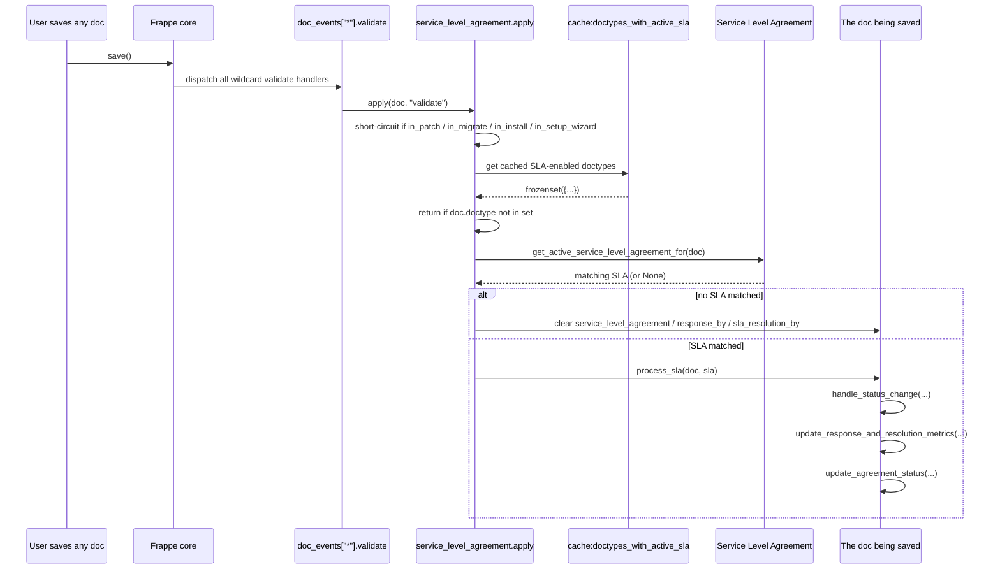
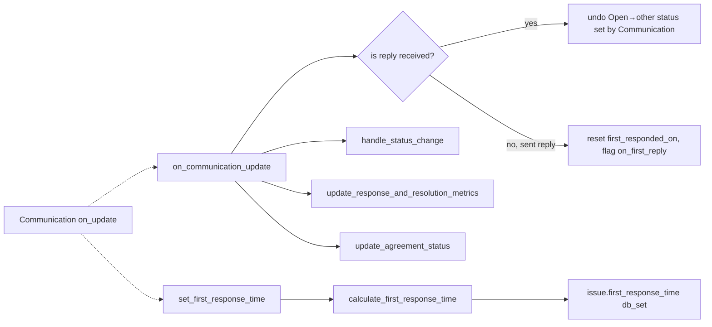

# Support module

> **TL;DR:** Support owns three concerns: customer-facing **Issue** tickets, the cross-DocType **Service Level Agreement** (SLA) framework that piggybacks on *every doc save in the system* via a wildcard `doc_events["*"].validate` hook, and **Warranty Claim** as the post-sale serial-no fault entry point. The SLA framework is the load-bearing piece — it injects `response_by` / `sla_resolution_by` / `agreement_status` fields into any DocType picked in `Service Level Agreement.document_type`, then re-evaluates them on every save.

## Key files

- [erpnext/hooks.py:343-348](../../erpnext/hooks.py:343) — wildcard `doc_events["*"].validate` registers `service_level_agreement.apply` (load-bearing — runs on **every doc save**, including non-Support DocTypes).
- [erpnext/hooks.py:362-371](../../erpnext/hooks.py:362) — `doc_events["Communication"].on_update` dispatches into `service_level_agreement.on_communication_update` and `issue.set_first_response_time`.
- [erpnext/hooks.py:398-402](../../erpnext/hooks.py:398) — `doc_events["Contact"].on_trash` calls `issue.update_issue` to clear the foreign-key column on Issues whose contact is being deleted.
- [erpnext/hooks.py:316](../../erpnext/hooks.py:316) — `has_website_permission["Issue"] = "erpnext.support.doctype.issue.issue.has_website_permission"` (custom portal ACL on top of the shared contact-based check).
- [erpnext/hooks.py:281](../../erpnext/hooks.py:281) — `standard_portal_menu_items` registers `/issues` as the customer self-service surface for Issue.
- [erpnext/hooks.py:463](../../erpnext/hooks.py:463) — `daily_maintenance` scheduler runs `issue.auto_close_tickets`.
- [erpnext/hooks.py:477](../../erpnext/hooks.py:477) — `daily_maintenance` scheduler runs `service_level_agreement.check_agreement_status` (disables expired SLAs).
- [erpnext/hooks.py:687-690](../../erpnext/hooks.py:687) — `extend_bootinfo[0]` is `service_level_agreement.add_sla_doctypes` (publishes `bootinfo.service_level_agreement_doctypes` to the desk client). See [boot-session.md](../architecture/boot-session.md).
- [erpnext/hooks.py:674-676](../../erpnext/hooks.py:674) — Maintenance Schedule / Maintenance Visit / Warranty Claim listed in `global_search_doctypes`.
- [erpnext/support/doctype/service_level_agreement/service_level_agreement.py:500](../../erpnext/support/doctype/service_level_agreement/service_level_agreement.py:500) — `apply(doc, method=None)` — the entry point invoked from the wildcard validate hook.
- [erpnext/support/doctype/service_level_agreement/service_level_agreement.py:528](../../erpnext/support/doctype/service_level_agreement/service_level_agreement.py:528) — `process_sla(doc, sla)` — sets SLA name, priority, then drives status/metric/agreement updates.
- [erpnext/support/doctype/service_level_agreement/service_level_agreement.py:542](../../erpnext/support/doctype/service_level_agreement/service_level_agreement.py:542) — `handle_status_change(doc, apply_sla_for_resolution)` — status-transition state machine.
- [erpnext/support/doctype/service_level_agreement/service_level_agreement.py:984](../../erpnext/support/doctype/service_level_agreement/service_level_agreement.py:984) — `update_agreement_status(doc, apply_sla_for_resolution)` — flips `agreement_status` between *First Response Due / Resolution Due / Fulfilled / Failed*.
- [erpnext/support/doctype/service_level_agreement/service_level_agreement.py:486](../../erpnext/support/doctype/service_level_agreement/service_level_agreement.py:486) — `set_documents_with_active_service_level_agreement()` — caches the SLA-enabled DocType set in `frappe.cache:doctypes_with_active_sla`.
- [erpnext/support/doctype/service_level_agreement/service_level_agreement.py:910-976](../../erpnext/support/doctype/service_level_agreement/service_level_agreement.py:910) — `get_service_level_agreement_fields()` defines the field set injected into every SLA-enabled non-Issue DocType (`response_by`, `first_responded_on`, `agreement_status`, `sla_resolution_by`, `sla_resolution_date`, `total_hold_time`, `on_hold_since`, `service_level_agreement_creation`).
- [erpnext/support/doctype/issue/issue.py:20](../../erpnext/support/doctype/issue/issue.py:20) — `Issue` extends `Document` directly (no transaction-controller chain).
- [erpnext/support/doctype/issue/issue.py:229-253](../../erpnext/support/doctype/issue/issue.py:229) — `auto_close_tickets()` — daily scheduler that closes `Replied` issues older than `Support Settings.close_issue_after_days`.
- [erpnext/support/doctype/issue/issue.py:301-306](../../erpnext/support/doctype/issue/issue.py:301) — `set_first_response_time(communication, method)` — callback invoked from `doc_events["Communication"].on_update`.
- [erpnext/support/doctype/issue/issue.py:318-381](../../erpnext/support/doctype/issue/issue.py:318) — `calculate_first_response_time(issue, first_responded_on)` — working-hours-aware duration math.
- [erpnext/support/doctype/issue/issue.py:256-261](../../erpnext/support/doctype/issue/issue.py:256) — `has_website_permission(doc, ptype, user, verbose)` — falls back to `raised_by == user` if the contact-based portal check fails.
- [erpnext/support/doctype/issue/issue.py:264-266](../../erpnext/support/doctype/issue/issue.py:264) — `update_issue(contact, method)` — Contact `on_trash` dispatcher; clears `Issue.contact` FK.
- [erpnext/support/doctype/warranty_claim/warranty_claim.py:13](../../erpnext/support/doctype/warranty_claim/warranty_claim.py:13) — `WarrantyClaim` extends `TransactionBase` from `erpnext.utilities.transaction_base`.
- [erpnext/support/doctype/warranty_claim/warranty_claim.py:64-75](../../erpnext/support/doctype/warranty_claim/warranty_claim.py:64) — `on_cancel` blocks cancellation while a non-cancelled `Maintenance Visit` references the claim.
- [erpnext/support/doctype/warranty_claim/warranty_claim.py:82-110](../../erpnext/support/doctype/warranty_claim/warranty_claim.py:82) — `make_maintenance_visit` mapper — Warranty Claim → Maintenance Visit.
- [erpnext/support/doctype/support_settings/support_settings.json:124-134](../../erpnext/support/doctype/support_settings/support_settings.json:124) — `track_service_level_agreement` + `allow_resetting_service_level_agreement` — the master toggles for the entire SLA framework.

## Directory layout

```
erpnext/support/
├── README.md
├── doctype/
│   ├── issue/                          # primary ticket DocType (extends Document)
│   ├── issue_priority/                 # masters
│   ├── issue_type/
│   ├── pause_sla_on_status/            # SLA child table
│   ├── service_day/                    # SLA child table (workday + start/end time)
│   ├── service_level_agreement/        # the SLA driver
│   ├── service_level_priority/         # SLA child table (response/resolution per priority)
│   ├── sla_fulfilled_on_status/        # SLA child table
│   ├── support_search_source/          # portal helper child table
│   ├── support_settings/               # Single — site-wide SLA + portal toggles
│   └── warranty_claim/                 # post-sale serial-no fault entry (extends TransactionBase)
├── page/
├── report/
├── web_form/                           # /issues portal entry form
└── workspace/
```

## Why Support is load-bearing across the whole app

Three pieces of the registry catalogue make Support code visible from every other module:

1. **`doc_events["*"].validate`** ([hooks.py:344-348](../../erpnext/hooks.py:344)) calls `service_level_agreement.apply` on **every save of every DocType in the system**. The function fast-paths out on the third line: it consults the cached `doctypes_with_active_sla` frozenset ([service_level_agreement.py:486-497](../../erpnext/support/doctype/service_level_agreement/service_level_agreement.py:486)) and returns immediately if the doc's DocType isn't in the set. **Blast radius:** a stale or never-built cache value means *every* doc validate pays the cost of building the set; a corrupt SLA condition (`safe_eval` failure inside `get_active_service_level_agreement_for`) raises on a doc that has nothing to do with Support. Anyone tracing a slow save anywhere in ERPNext should look here first.

2. **`extend_bootinfo[0]`** ([hooks.py:687-690](../../erpnext/hooks.py:687)) injects `service_level_agreement_doctypes` into the desk client's `frappe.boot` payload via [add_sla_doctypes](../../erpnext/support/doctype/service_level_agreement/service_level_agreement.py:1053). Form scripts on every SLA-enabled DocType read this list to render the SLA timer panel. See [boot-session.md](../architecture/boot-session.md) for the full bootinfo trace.

3. **`doc_events["Communication"].on_update`** ([hooks.py:362-366](../../erpnext/hooks.py:362)) wires Communication updates into both `service_level_agreement.on_communication_update` (status flip-flop guard, `first_responded_on` reset) and `issue.set_first_response_time` (writeback of duration on the parent Issue). Any inbound/outbound email related to *any* SLA-tracked doc passes through this hook.

## SLA — how the wildcard validate hook works end-to-end



**Cache invalidation.** [service_level_agreement.py:243-251](../../erpnext/support/doctype/service_level_agreement/service_level_agreement.py:243) wires `on_trash` / `after_insert` / `on_update` on the SLA DocType to call `set_documents_with_active_service_level_agreement()`, which rebuilds and rewrites the redis cache key.

**Field injection on non-Issue SLA targets.** [service_level_agreement.py:230-241](../../erpnext/support/doctype/service_level_agreement/service_level_agreement.py:230) runs in `before_insert`: when a new `Service Level Agreement` is created for a custom DocType, it appends either `DocField` rows (for custom DocTypes) or `Custom Field` rows (for standard DocTypes) so the new SLA timer fields exist on the target. Issue is exempt because Issue's `.json` already declares the SLA columns natively.

## Issue lifecycle

The Issue status machine is `Open → Replied → On Hold → Resolved → Closed`. Status options live in [issue.json:120](../../erpnext/support/doctype/issue/issue.json:120) (`"options": "Open\nReplied\nOn Hold\nResolved\nClosed"`).

Transitions drive SLA timer math via [handle_status_change](../../erpnext/support/doctype/service_level_agreement/service_level_agreement.py:542):

| Previous status | New status      | Effect on timers                                                                 |
|-----------------|-----------------|----------------------------------------------------------------------------------|
| Open            | Replied/On Hold | Set `on_hold_since`, clear `response_by` / `sla_resolution_by` (lines 580-583)   |
| Replied/On Hold | Open            | Add elapsed hold time to `total_hold_time`, clear `sla_resolution_date` (lines 586-590) |
| Open            | Resolved/Closed | Set `sla_resolution_date`, compute `resolution_time` (lines 593-596)             |
| Resolved/Closed | Open            | Recompute hold from previous resolution date, clear resolution metrics (lines 599-603) |
| Resolved/Closed | Replied/On Hold | Recompute hold from resolution date, set `on_hold_since` (lines 606-611)         |
| Replied/On Hold | Resolved/Closed | Add elapsed hold to `total_hold_time`, set `sla_resolution_date` (lines 614-620) |

The fulfillment / hold status sets are not hard-coded — they come from the SLA's `sla_fulfilled_on` and `pause_sla_on` child tables ([service_level_agreement.py:623-638](../../erpnext/support/doctype/service_level_agreement/service_level_agreement.py:623)), which means a customer can re-tag *Resolved* as a hold state by listing it in `Pause SLA On Status`.

### `agreement_status` truth table

[update_agreement_status](../../erpnext/support/doctype/service_level_agreement/service_level_agreement.py:984) writes one of four values:

```text
apply_sla_for_resolution=1:
    no first_responded_on         → "First Response Due"
    no sla_resolution_date        → "Resolution Due"
    sla_resolution_date <= sla_resolution_by → "Fulfilled"
    otherwise                     → "Failed"

apply_sla_for_resolution=0:
    no first_responded_on         → "First Response Due"
    first_responded_on <= response_by → "Fulfilled"
    otherwise                     → "Failed"
```

### First-response time calculation

[calculate_first_response_time](../../erpnext/support/doctype/issue/issue.py:318) is working-hours-aware. It pulls `support_and_resolution` from the SLA, then:

- **Same-day response:** if both creation and response fall inside the working window, the elapsed seconds count straight ([issue.py:331-334](../../erpnext/support/doctype/issue/issue.py:331)). If one falls outside, the math clips to the working-window bounds.
- **Cross-day response:** [calculate_initial_frt](../../erpnext/support/doctype/issue/issue.py:416) sums full working days in between, then adds the partial windows of the creation and response days.
- A floor of `1.0` second is returned for after-hours/weekend windows ([issue.py:346,381](../../erpnext/support/doctype/issue/issue.py:346)). This is intentional — `0` would be reset by `on_communication_update`.

### `auto_close_tickets` (daily_maintenance scheduler)

[issue.auto_close_tickets](../../erpnext/support/doctype/issue/issue.py:229-253) reads `Support Settings.close_issue_after_days` (default 7, settable to 0 to disable). It scans `Issue` rows where `status='Replied'` and `modified < now - N days`, then sets each to `Closed` via `doc.save()` (so `handle_status_change` fires and SLA metrics are stamped).

## Communication ↔ Issue ↔ SLA wiring



[on_communication_update](../../erpnext/support/doctype/service_level_agreement/service_level_agreement.py:815-866) is responsible for two adjustments before re-running the SLA pipeline:
- If a reply was *received* and Communication had already flipped the parent's status to Open, undo it (the previous status is preserved in `_doc_before_save`, and the column is reset via `frappe.db.set_value(..., update_modified=False)`).
- If a reply was *sent* and `first_responded_on` got pre-stamped by Communication, clear it and flag `parent.flags.on_first_reply = True` so `handle_status_change.set_first_response()` will recompute through the working-hours math.

## Warranty Claim — the Support side of post-sale fault tracking

[WarrantyClaim](../../erpnext/support/doctype/warranty_claim/warranty_claim.py:13) is the only Support DocType that is **submittable** and that extends [TransactionBase](../../erpnext/utilities/transaction_base.py). Its lifecycle is narrow:

- **`validate`** ([warranty_claim.py:53-62](../../erpnext/support/doctype/warranty_claim/warranty_claim.py:53)) requires Customer (unless raised by Guest from the portal), and stamps `resolution_date = now()` on first transition to `Closed`.
- **`on_cancel`** ([warranty_claim.py:64-75](../../erpnext/support/doctype/warranty_claim/warranty_claim.py:64)) blocks the cancel if any non-cancelled `Maintenance Visit` references this claim through `Maintenance Visit Purpose.prevdoc_docname`. Otherwise it `db_set("status", "Cancelled")`.
- **`make_maintenance_visit`** ([warranty_claim.py:82-110](../../erpnext/support/doctype/warranty_claim/warranty_claim.py:82)) is the canonical mapper to a downstream `Maintenance Visit`. It refuses to map if a *Fully Completed* visit already exists for this claim.

The Warranty Claim → Maintenance Visit handoff is the bridge into the [Maintenance module](maintenance.md). Warranty Claim is referenced in `global_search_doctypes` ([hooks.py:676](../../erpnext/hooks.py:676)) and links to Customer + Serial No + Item — it is the standard post-sale entry point for serialized goods.

## Portal / website surface

- **Route:** `/issues` ([hooks.py:281](../../erpnext/hooks.py:281)). Standard portal menu item, role `Customer`.
- **Permission override:** [issue.has_website_permission](../../erpnext/support/doctype/issue/issue.py:256-261) — uses the shared contact-based check from `controllers/website_list_for_contact.py`, then falls back to `raised_by == user`. Net effect: a portal user who *raised* an issue under a different email can still view it.
- **Web form:** lives at [erpnext/support/web_form/](../../erpnext/support/web_form/).
- **List context for `/issues`:** [issue.get_list_context](../../erpnext/support/doctype/issue/issue.py:179-187) wires the portal listing template `templates/includes/issue_row.html`.

## Scheduler jobs

| Frequency         | Job                                                                               | Purpose                                                              |
|-------------------|-----------------------------------------------------------------------------------|----------------------------------------------------------------------|
| daily_maintenance | [issue.auto_close_tickets](../../erpnext/support/doctype/issue/issue.py:229)      | Close `Replied` Issues older than `close_issue_after_days`.          |
| daily_maintenance | [service_level_agreement.check_agreement_status](../../erpnext/support/doctype/service_level_agreement/service_level_agreement.py:326-336) | Disable SLAs whose `end_date` has elapsed (sets `enabled=0`).        |

See the consolidated [scheduler-jobs.md](../architecture/scheduler-jobs.md) for the catalogue.

## Cross-module touch points

- **Boot session.** SLA-enabled DocType list is published into `frappe.boot.service_level_agreement_doctypes` — see [boot-session.md](../architecture/boot-session.md).
- **Maintenance.** Warranty Claim spawns Maintenance Visits via `make_maintenance_visit`. See [maintenance.md](maintenance.md).
- **CRM.** Issue links to Lead and Project. CRM utilities update Lead phone numbers from Contact.
- **Communication (core).** SLA + Issue both react to `Communication.on_update` ([hooks.py:362-366](../../erpnext/hooks.py:362)).
- **Selling.** Customer Group / Territory ancestors are walked when matching SLA `entity` to a Customer ([service_level_agreement.py:409-426](../../erpnext/support/doctype/service_level_agreement/service_level_agreement.py:409)).

## Open questions

- `TODO(verify)` — `Support Settings.show_latest_forum_posts` plus `forum_url` / `get_latest_query` ([support_settings.json:55-77](../../erpnext/support/doctype/support_settings/support_settings.json:55)) point to a portal forum-feed feature; the consumer that calls `get_latest_query` was not located in this pass.
- `TODO(verify)` — `Support Search Source` child table on Support Settings ([support_settings.json:113-117](../../erpnext/support/doctype/support_settings/support_settings.json:113)) wires plug-in search APIs into the support portal; consumer code path not located.

## Related

- [Support DocTypes reference cards](support-doctypes.md)
- [Hooks catalogue](../architecture/hooks-catalogue.md)
- [Boot session](../architecture/boot-session.md)
- [Scheduler jobs](../architecture/scheduler-jobs.md)
- [Maintenance module](maintenance.md)

## Changelog

- `2026-04-18` — initial version. Documented wildcard SLA validate hook, Issue lifecycle, SLA status machine, first-response calculation, Warranty Claim handoff to Maintenance, daily schedulers.
