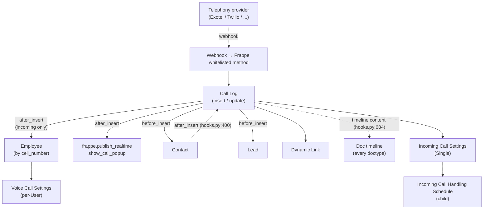

# Telephony

> **TL;DR:** [erpnext/telephony/](../../erpnext/telephony/) ships **five** DocTypes around an inbound/outbound Call Log model: `Call Log`, `Incoming Call Settings` (Single), `Incoming Call Handling Schedule` (child), `Voice Call Settings` (per-User), `Telephony Call Type`. The wiring in `hooks.py` is two lines: `additional_timeline_content["*"]` injects `call_log.get_linked_call_logs` into **every doctype's timeline** ([hooks.py:684](../../erpnext/hooks.py:684)), so any doc whose Contact / Lead has linked calls shows them in the activity rail; and `doc_events["Contact"].after_insert` calls `call_log.link_existing_conversations` ([hooks.py:400](../../erpnext/hooks.py:400)) which back-fills Dynamic Links between the new Contact and any pre-existing Call Log rows that match the contact's phone numbers. There are no telephony scheduler jobs.

## Key files

- [erpnext/telephony/doctype/call_log/call_log.py](../../erpnext/telephony/doctype/call_log/call_log.py:1) — the heavy DocType (228 lines): `validate`, `before_insert`, `after_insert`, `on_update` hooks; module helpers `link_existing_conversations`, `get_linked_call_logs`, `get_employees_with_number`, `add_call_summary_and_call_type`.
- [erpnext/telephony/doctype/incoming_call_settings/incoming_call_settings.py](../../erpnext/telephony/doctype/incoming_call_settings/incoming_call_settings.py:1) — Single. Validates schedule timeslot ordering and overlap.
- [erpnext/telephony/doctype/incoming_call_handling_schedule/incoming_call_handling_schedule.py](../../erpnext/telephony/doctype/incoming_call_handling_schedule/incoming_call_handling_schedule.py:1) — child table for Incoming Call Settings; plain `Document`.
- [erpnext/telephony/doctype/voice_call_settings/voice_call_settings.py](../../erpnext/telephony/doctype/voice_call_settings/voice_call_settings.py:1) — per-User configuration for the desk's call popup.
- [erpnext/telephony/doctype/telephony_call_type/telephony_call_type.py](../../erpnext/telephony/doctype/telephony_call_type/telephony_call_type.py:1) — submittable label DocType (`amended_from` field, [line 17](../../erpnext/telephony/doctype/telephony_call_type/telephony_call_type.py:17)).
- [erpnext/hooks.py:400](../../erpnext/hooks.py:400) — `doc_events["Contact"].after_insert = "erpnext.telephony.doctype.call_log.call_log.link_existing_conversations"`.
- [erpnext/hooks.py:684](../../erpnext/hooks.py:684) — `additional_timeline_content = {"*": ["erpnext.telephony.doctype.call_log.call_log.get_linked_call_logs"]}`.
- [erpnext/hooks.py:299-303](../../erpnext/hooks.py:299) — `sounds = [...]` registers `incoming-call.mp3`, `call-disconnect.mp3`, `numpad-touch.mp3` for the desk popup.

## Diagram



Legend: solid = synchronous; dashed = registration / event.

## 1. `Call Log` lifecycle

[call_log.py:18-126](../../erpnext/telephony/doctype/call_log/call_log.py:18) defines `class CallLog(Document)`. The schema fields ([line 22-45](../../erpnext/telephony/doctype/call_log/call_log.py:22)) include `from`, `to`, `id`, `medium`, `start_time`, `end_time`, `duration`, `recording_url`, `summary`, `status` (Literal: `Ringing`, `In Progress`, `Completed`, `Failed`, `Busy`, `No Answer`, `Queued`, `Cancelled`), `type` (`Incoming` / `Outgoing`), `type_of_call` (Link to `Telephony Call Type`), `call_received_by`, `employee_user_id`, `customer`, `links` (Dynamic Link table).

End-call statuses are constants at [call_log.py:14](../../erpnext/telephony/doctype/call_log/call_log.py:14):

```python
END_CALL_STATUSES = ["No Answer", "Completed", "Busy", "Failed"]
ONGOING_CALL_STATUSES = ["Ringing", "In Progress"]
```

### Lifecycle hooks

- **`validate`** ([line 47-48](../../erpnext/telephony/doctype/call_log/call_log.py:47)) — `deduplicate_dynamic_links(self)` (Frappe core util).
- **`before_insert`** ([line 50-63](../../erpnext/telephony/doctype/call_log/call_log.py:50)):
  - Strips the third-party number (`from` for incoming, `to` for outgoing) via `crm.utils.strip_number`.
  - If a `Contact` matches the phone, appends `Dynamic Link` to the call log's `links` table.
  - If a `Lead` matches via `lead.get_lead_with_phone_number`, appends another Dynamic Link.
  - For incoming calls: calls `update_received_by` ([line 122](../../erpnext/telephony/doctype/call_log/call_log.py:122)) to look up the Employee by `tabEmployee.cell_number LIKE %number%` and set `call_received_by` + `employee_user_id`.
- **`after_insert`** ([line 65-66](../../erpnext/telephony/doctype/call_log/call_log.py:65)) → `trigger_call_popup` ([line 96-120](../../erpnext/telephony/doctype/call_log/call_log.py:96)):
  - Only for incoming calls.
  - Reads `get_scheduled_employees_for_popup(self.medium)` (CRM utility) — returns list of employees scheduled per `Incoming Call Handling Schedule` for the current day-of-week and time.
  - Intersects with `get_employees_with_number(self.to)` (the dialed number's matching employees).
  - For each matching email, `frappe.publish_realtime("show_call_popup", self, user=email)`.
  - Adds an audit comment when `developer_mode` is on.
- **`on_update`** ([line 68-88](../../erpnext/telephony/doctype/call_log/call_log.py:68)):
  - Detects "missed call" (recipient changed AND new status is not an end-state) → `frappe.publish_realtime(f"call_{id}_missed", self)` and re-triggers popup.
  - Detects "ended call" (status transitions into an END status) → `frappe.publish_realtime(f"call_{id}_ended", self)`.
  - Note: the missed-call detection comment ([line 71](../../erpnext/telephony/doctype/call_log/call_log.py:71)) — `# FIXME: This works for Exotel but not for all telephony providers`.

### `get_employees_with_number` cache

[call_log.py:136-153](../../erpnext/telephony/doctype/call_log/call_log.py:136) — caches the `Employee` lookup in `frappe.cache().hset("employees_with_number", number, ...)` to avoid repeated DB hits during call routing.

## 2. `link_existing_conversations` — Contact after_insert wiring

[call_log.py:156-197](../../erpnext/telephony/doctype/call_log/call_log.py:156). Registered at [hooks.py:400](../../erpnext/hooks.py:400) for `Contact.after_insert`.

Walks the new Contact's `phone_nos` table; for each phone number, runs a SQL query against `tabCall Log` joined to `tabDynamic Link` to find calls that:

- Have the phone number in either `from` or `to`.
- Are NOT already linked to this Contact.

For each matching Call Log, appends a `Dynamic Link` row pointing at the new Contact and saves with `ignore_permissions=True`. Commits explicitly when not in test mode ([line 195](../../erpnext/telephony/doctype/call_log/call_log.py:195)) so the back-fill is durable even when the originating request is rolled back.

Guarded by `frappe.flags.ignore_auto_link_call_log` ([line 160](../../erpnext/telephony/doctype/call_log/call_log.py:160)) and a doctype check (`doc.doctype == "Contact"`, [line 162](../../erpnext/telephony/doctype/call_log/call_log.py:162)) — the same handler is registered for Contact only but defensively re-checks.

Errors are swallowed and logged as `frappe.log_error(title="Error during caller information update")` ([line 196-197](../../erpnext/telephony/doctype/call_log/call_log.py:196)) — the Contact insert never fails because of telephony.

## 3. `get_linked_call_logs` — universal timeline content

[call_log.py:200-227](../../erpnext/telephony/doctype/call_log/call_log.py:200). Registered at [hooks.py:684](../../erpnext/hooks.py:684) under the wildcard key `"*"`:

```python
additional_timeline_content = {"*": ["erpnext.telephony.doctype.call_log.call_log.get_linked_call_logs"]}
```

Frappe's timeline rendering invokes every callable here for **every doctype's** activity rail. The handler:

- Looks up `Dynamic Link` rows where `parenttype='Call Log' AND link_doctype=doctype AND link_name=docname`.
- Returns a list of `{icon: "call", is_card: True, creation, template: "call_link", template_data: log}` entries.

Effect: **opening any document** whose Contact has linked calls renders those calls inline as call-cards. This is the load-bearing reason telephony shows up across the entire UI.

The cross-reference appears in [hooks-catalogue.md](../architecture/hooks-catalogue.md).

## 4. `Incoming Call Settings` — per-day routing schedule

[incoming_call_settings.py:12-85](../../erpnext/telephony/doctype/incoming_call_settings/incoming_call_settings.py:12) defines the Single. Fields:

- `greeting_message`, `agent_busy_message`, `agent_unavailable_message` — `DF.Data | None`.
- `call_routing` — `DF.Literal["Sequential", "Simultaneous"]`.
- `call_handling_schedule` — `DF.Table[IncomingCallHandlingSchedule]`.

**Validations** ([line 32-38](../../erpnext/telephony/doctype/incoming_call_settings/incoming_call_settings.py:32)):

- `validate_call_schedule_timeslot` — every row's `to_time > from_time` ([line 40-54](../../erpnext/telephony/doctype/incoming_call_settings/incoming_call_settings.py:40)).
- `validate_call_schedule_overlaps` — for each weekday with multiple rows, ensures no two timeslots overlap ([line 56-72](../../erpnext/telephony/doctype/incoming_call_settings/incoming_call_settings.py:56)).

The overlap check sorts timeslots by start, then iterates and returns false only when `ts1.end <= ts2.start` (no overlap) — anything else throws.

## 5. `sounds` — desk audio assets

[hooks.py:299-303](../../erpnext/hooks.py:299):

```python
sounds = [
    {"name": "incoming-call", "src": "/assets/erpnext/sounds/incoming-call.mp3", "volume": 0.2},
    {"name": "call-disconnect", "src": "/assets/erpnext/sounds/call-disconnect.mp3", "volume": 0.2},
    {"name": "numpad-touch", "src": "/assets/erpnext/sounds/numpad-touch.mp3", "volume": 0.8},
]
```

These are surfaced via `frappe.boot.sounds` to the desk client. The Call Log popup plays `incoming-call`; the call-end fires `call-disconnect`; on-screen numpad keys play `numpad-touch`.

## 6. What this module does **not** contain

- **No scheduler jobs.** All call-state propagation is event-driven via webhooks and `publish_realtime`.
- **No regional overrides.** Telephony is identical across countries.
- **No GL or SLE impact.** Call Log is purely operational.
- **No outgoing-call dialer.** The desk Call popup only **handles** calls; the dialer is a Frappe-core widget on Contact / Lead.

## Related

- [Telephony DocTypes](telephony-doctypes.md)
- [Hooks & overrides](../architecture/hooks-and-overrides.md)
- [Hooks catalogue](../architecture/hooks-catalogue.md) — `additional_timeline_content` wildcard semantics.
- [CRM module](crm.md) — `crm.utils.get_scheduled_employees_for_popup`, `crm.utils.strip_number`, `crm.doctype.lead.get_lead_with_phone_number`.

## Changelog

- `2026-04-18` — initial version. Documented `Call Log` (4 lifecycle hooks), `link_existing_conversations` (Contact after_insert), `get_linked_call_logs` (timeline wildcard), Incoming Call Settings + Schedule, `sounds`, and the 5 DocTypes.
