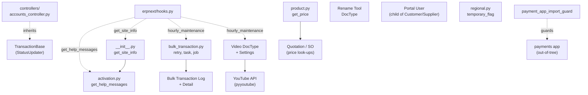

# Utilities

> **TL;DR:** [erpnext/utilities/](../../erpnext/utilities/) is a **catch-all** of small, cross-cutting helpers that did not fit into a single business module. Six concerns sit here: (1) the `TransactionBase` controller class consumed by every transactional DocType in `controllers/` ([transaction_base.py:20](../../erpnext/utilities/transaction_base.py:20)); (2) the `bulk_transaction` helpers that power the bulk doctype-conversion UI and the hourly retry scheduler ([bulk_transaction.py:1](../../erpnext/utilities/bulk_transaction.py:1)); (3) the activation-level helper that drives the desk help-message bubble (`get_help_messages` hook → [activation.py:66](../../erpnext/utilities/activation.py:66)); (4) `get_site_info` reporter for `frappe.get_hooks("get_site_info")` ([__init__.py:28](../../erpnext/utilities/__init__.py:28)); (5) two storefront-pricing helpers `product.get_price` and `product.get_item_codes_by_attributes` ([product.py:1](../../erpnext/utilities/product.py:1)); (6) the four DocTypes Video, Video Settings, Rename Tool, Portal User. The module also ships a single scheduler job (`video.update_youtube_data` hourly_maintenance, [hooks.py:458](../../erpnext/hooks.py:458)) and the `regional.temporary_flag` context manager ([regional.py:1](../../erpnext/utilities/regional.py:1)). **`bot_parsers` registers `erpnext.utilities.bot.FindItemBot` ([hooks.py:516](../../erpnext/hooks.py:516)) but the file does NOT exist on disk** — see Open Questions.

## Key files

- [erpnext/utilities/__init__.py](../../erpnext/utilities/__init__.py:1) — `update_doctypes` (one-off field upgrade), `get_site_info` (hook target), `payment_app_import_guard` context manager.
- [erpnext/utilities/transaction_base.py](../../erpnext/utilities/transaction_base.py:1) — `class TransactionBase(StatusUpdater)` plus `validate_uom_is_integer` helper.
- [erpnext/utilities/bulk_transaction.py](../../erpnext/utilities/bulk_transaction.py:1) — `transaction_processing` (UI entry), `retry` (hourly scheduler), `task` (mapper dispatch), `job` / `retry_failed_transactions` / `update_log` / `create_log` / `show_job_status`.
- [erpnext/utilities/activation.py](../../erpnext/utilities/activation.py:1) — `get_level` (24 doctype counts → score), `get_help_messages` (hook target).
- [erpnext/utilities/product.py](../../erpnext/utilities/product.py:1) — `get_price`, `get_item_codes_by_attributes`.
- [erpnext/utilities/naming.py](../../erpnext/utilities/naming.py:1) — `set_by_naming_series` (one-off helper used by Setup Wizard).
- [erpnext/utilities/regional.py](../../erpnext/utilities/regional.py:1) — `temporary_flag` context manager.
- [erpnext/utilities/doctype/video/video.py](../../erpnext/utilities/doctype/video/video.py:1), [video_settings/video_settings.py](../../erpnext/utilities/doctype/video_settings/video_settings.py:1), [rename_tool/rename_tool.py](../../erpnext/utilities/doctype/rename_tool/rename_tool.py:1), [portal_user/portal_user.py](../../erpnext/utilities/doctype/portal_user/portal_user.py:1) — the four DocTypes.
- [erpnext/utilities/web_form/addresses/](../../erpnext/utilities/web_form/addresses/) — Address Web Form fixture.
- [erpnext/utilities/report/youtube_interactions/](../../erpnext/utilities/report/youtube_interactions/) — Report fixture (consumes Video DocType counters).
- [erpnext/hooks.py:70](../../erpnext/hooks.py:70) — `get_help_messages = "erpnext.utilities.activation.get_help_messages"`.
- [erpnext/hooks.py:454](../../erpnext/hooks.py:454) — `hourly_maintenance: erpnext.utilities.bulk_transaction.retry`.
- [erpnext/hooks.py:458](../../erpnext/hooks.py:458) — `hourly_maintenance: erpnext.utilities.doctype.video.video.update_youtube_data`.
- [erpnext/hooks.py:516](../../erpnext/hooks.py:516) — `bot_parsers = ["erpnext.utilities.bot.FindItemBot"]` (target file does not exist; see §6).
- [erpnext/hooks.py:519](../../erpnext/hooks.py:519) — `get_site_info = "erpnext.utilities.get_site_info"`.
- [erpnext/commands/__init__.py:11](../../erpnext/commands/__init__.py:11) — declares `commands = []` (ERPNext ships zero custom bench commands).

## Diagram



## 1. `TransactionBase` — base controller

[erpnext/utilities/transaction_base.py:20](../../erpnext/utilities/transaction_base.py:20) defines `class TransactionBase(StatusUpdater)`. It is the **layer between** `StatusUpdater` (lower) and `AccountsController` (higher) in the controller hierarchy ([controllers.md](../architecture/controllers.md)).

Responsibilities — verified against the source ([transaction_base.py:20-516](../../erpnext/utilities/transaction_base.py:20)):

- `validate_posting_time` ([line 21](../../erpnext/utilities/transaction_base.py:21)) — auto-populates `posting_date` / `posting_time` if `set_posting_time` flag is unset; honours `frappe.flags.in_import` and `from_restore`.
- `validate_uom_is_integer` ([line 36](../../erpnext/utilities/transaction_base.py:36)) — child-table UoM whole-number gate (delegates to module-level helper at [line 540](../../erpnext/utilities/transaction_base.py:540)).
- `validate_with_previous_doc` / `compare_values` / `get_prev_doc_reference_details` ([lines 39-85](../../erpnext/utilities/transaction_base.py:39)) — the cross-doctype field-comparison engine that, e.g., refuses Sales Invoice items whose `customer` differs from the source Sales Order.
- `validate_rate_with_reference_doc` ([line 87](../../erpnext/utilities/transaction_base.py:87)) — enforces `Selling Settings.maintain_same_rate_action` / `Buying Settings.maintain_same_rate_action`.
- `reset_default_field_value` ([line 154](../../erpnext/utilities/transaction_base.py:154)) — used to clear `set_warehouse` / `set_from_warehouse` when child rows have heterogeneous values.
- `validate_currency_for_receivable_payable_and_advance_account` ([line 177](../../erpnext/utilities/transaction_base.py:177)) — Customer / Supplier accounts row currency gate.
- `fetch_item_details` ([line 240](../../erpnext/utilities/transaction_base.py:240)) — packs every party / pricing / dimension / posting field into the `frappe._dict` consumed by `stock.get_item_details.get_item_details`.
- `process_item_selection` ([line 295](../../erpnext/utilities/transaction_base.py:295)) — `@frappe.whitelist()`. Composite call from the desk-side item picker; chains `set_fetched_values` → `set_item_rate_and_discounts` → `add_taxes_from_item_template` → `add_free_item` → `handle_internal_parties` → `conversion_factor` → `calculate_taxes_and_totals`.
- `handle_internal_parties` ([line 322](../../erpnext/utilities/transaction_base.py:322)) — when `is_internal_customer` / `is_internal_supplier` is set and `Accounts Settings.fetch_valuation_rate_for_internal_transaction` is on, replaces price-list rate with valuation rate via `stock.utils.get_incoming_rate`. This is what makes inter-company transfers post at cost.
- `_apply_price_list` ([line 470](../../erpnext/utilities/transaction_base.py:470)) — wraps `stock.get_item_details.apply_price_list` with re-entrance guard (`in_apply_price_list`).

Also exports the `delete_events(ref_type, ref_name)` helper ([line 519](../../erpnext/utilities/transaction_base.py:519)) — used by Project / Task / Maintenance Visit on delete.

The class exception `UOMMustBeIntegerError(frappe.ValidationError)` ([line 16](../../erpnext/utilities/transaction_base.py:16)) is raised by `validate_uom_is_integer` and explicitly caught by transaction-level fixtures.

## 2. `bulk_transaction` — convert N source docs into N target docs

The bulk-conversion engine sits at [erpnext/utilities/bulk_transaction.py:1-235](../../erpnext/utilities/bulk_transaction.py:1).

### 2.1 Entry point — `transaction_processing`

[bulk_transaction.py:9-54](../../erpnext/utilities/bulk_transaction.py:9) — `@frappe.whitelist()`.

- Permission gate: `frappe.has_permission(from_doctype, "read", throw=True)` and `frappe.has_permission(to_doctype, "create", throw=True)` ([lines 13-14](../../erpnext/utilities/bulk_transaction.py:13)).
- Skips rows whose status is `"On Hold"` or `"Closed"` ([lines 24-26](../../erpnext/utilities/bulk_transaction.py:24)) — emits a skip message listing those names.
- `frappe.enqueue(job, ...)` to the default RQ queue ([lines 48-54](../../erpnext/utilities/bulk_transaction.py:48)).

### 2.2 Per-row dispatch — `task`

[bulk_transaction.py:131-192](../../erpnext/utilities/bulk_transaction.py:131) holds the in-tree `mapper` dict — 8 source DocTypes × N target DocTypes:

| From | To options |
|------|-----------|
| Sales Order | Sales Invoice, Delivery Note, Payment Entry |
| Sales Invoice | Delivery Note, Payment Entry |
| Delivery Note | Sales Invoice, Packing Slip |
| Quotation | Sales Order, Sales Invoice |
| Supplier Quotation | Purchase Order, Purchase Invoice |
| Purchase Order | Purchase Invoice, Purchase Receipt, Payment Entry |
| Purchase Invoice | Purchase Receipt, Payment Entry |
| Purchase Receipt | Purchase Invoice |

The mapper is **extensible** via `frappe.get_hooks("bulk_transaction_task_mapper")` ([line 176](../../erpnext/utilities/bulk_transaction.py:176)) — a custom app can register a callable that returns a dict to merge.

Per-row insert ([lines 180-192](../../erpnext/utilities/bulk_transaction.py:180)):
- `frappe.flags.bulk_transaction = True` set before insert (consumers can short-circuit on this flag).
- `obj.flags.ignore_validate = True` — skips `validate()` on the new doc.
- `obj.set_title_field()` then `obj.insert(ignore_mandatory=True)`.

### 2.3 Failure isolation

Each row is wrapped in a savepoint:

```python
frappe.db.savepoint("before_creation_state")
task(doc_name, from_doctype, to_doctype)
# on Exception:
frappe.db.rollback(save_point="before_creation_state")
create_log(..., status="Failed", ...)
```

([bulk_transaction.py:109-126](../../erpnext/utilities/bulk_transaction.py:109)). One bad row does not rollback the whole batch.

### 2.4 Hourly retry

[bulk_transaction.py:57-79](../../erpnext/utilities/bulk_transaction.py:57) — `retry(date=None)`. Defaults to `today()`. Pulls all `Bulk Transaction Log Detail` rows where `transaction_status='Failed'` and `retried=0` and enqueues `retry_failed_transactions`. Wired to `hourly_maintenance` at [hooks.py:454](../../erpnext/hooks.py:454).

The retry path uses the same savepoint pattern; on success bumps `retried=1` and `transaction_status='Success'`. There is no second-retry of a row already retried once.

## 3. `activation` — desk help-message scoring

`get_level(site_info)` at [activation.py:12-63](../../erpnext/utilities/activation.py:12) computes a numeric "activation level" by walking 24 DocType counts against per-doctype thresholds:

```python
doctypes = {"Asset": 5, "BOM": 3, "Customer": 5, "Delivery Note": 5,
            "Employee": 3, "Issue": 5, "Item": 5, "Journal Entry": 3,
            "Lead": 3, "Material Request": 5, "Opportunity": 5,
            "Payment Entry": 2, "Project": 5, "Purchase Order": 2,
            "Purchase Invoice": 5, "Purchase Receipt": 5, "Quotation": 3,
            "Sales Order": 2, "Sales Invoice": 2, "Stock Entry": 3,
            "Supplier": 5, "Task": 5, "User": 5, "Work Order": 5}
```

([activation.py:16-41](../../erpnext/utilities/activation.py:16)). Each doctype that exceeds its threshold adds 1. Bonus +1 if Setup Wizard is complete; +1 if `>10` Email Communications; +1 if at least one user has logged in within the last 2 days.

`get_help_messages()` at [activation.py:66-149](../../erpnext/utilities/activation.py:66) is the `get_help_messages` hook target ([hooks.py:70](../../erpnext/hooks.py:70)). Returns a list of `{title, description, action, route, count, target}` entries for any doctype whose count is below `target` — gated by the company's `domain` (Manufacturing / Retail / Services / Distribution). Returns `[]` once activation level exceeds 6.

This drives the per-domain help bubble in the desk landing page.

## 4. `__init__.py` — `get_site_info` and `payment_app_import_guard`

[utilities/__init__.py:28-40](../../erpnext/utilities/__init__.py:28) — `get_site_info(site_info)` is the `get_site_info` hook target ([hooks.py:519](../../erpnext/hooks.py:519)). Returns `{"company": <default_company>, "domain": <company.domain>, "activation": get_level(site_info)}` for the periodic anonymous usage-statistics submission Frappe core sends to `frappe.io`.

[utilities/__init__.py:43-53](../../erpnext/utilities/__init__.py:43) — `payment_app_import_guard()` is a `contextmanager`. Wraps any `from payments.<...>` import; on `ImportError` raises a friendly "payments app is not installed" message with marketplace + GitHub links.

`update_doctypes()` at [utilities/__init__.py:12-25](../../erpnext/utilities/__init__.py:12) is a one-off historical migrator that converted child-table description fields from `Text` / `Small Text` to `Text Editor`. Not currently registered to any patch — left in case manual migration is needed.

## 5. `product.get_price` — storefront pricing helper

[product.py:10-107](../../erpnext/utilities/product.py:10) — pricing computation for storefront / portal contexts. Walks Item Price → Pricing Rule chain, applies discount-percentage or rate override, formats currency-aware output, and converts to `sales_uom`. Used by the out-of-tree storefront app and by the `/quotations/<name>` order page.

`product.get_item_codes_by_attributes(attribute_filters, template_item_code=None)` at [product.py:110-166](../../erpnext/utilities/product.py:110) — translates a `{attribute: [values]}` filter map into the SET of Item codes whose Item Variant Attribute rows match all filters. The storefront facet UI calls this after `Website Attribute` / `Website Filter Field` ([portal-doctypes.md](portal-doctypes.md)) compose the filter map.

## 6. `bot_parsers` — broken hook

[hooks.py:516](../../erpnext/hooks.py:516):

```python
bot_parsers = [
    "erpnext.utilities.bot.FindItemBot",
]
```

Verified by directory listing: `erpnext/utilities/bot.py` **does not exist**. The hook target is dangling.

`TODO(verify)` — the `FindItemBot` class is registered but its module file is missing. Either: (a) the file was removed in a refactor and `bot_parsers` was not cleaned up, (b) it lives in another app and the path here is stale. Frappe core only invokes `bot_parsers` when the (legacy) chat / bot framework is enabled — most installations never trigger this code path, so the broken registration is silent.

The `FindItemBot` reference is the **only** entry in `bot_parsers` and is mentioned only in `hooks.py:515-517` (verified by grep).

## 7. `regional.temporary_flag` — small but widely used

[regional.py:1-13](../../erpnext/utilities/regional.py:1) — `temporary_flag(flag_name, value)` context manager that sets `frappe.local.flags[flag_name] = value` for the duration of the `with` block, then pops it. Used by regional handlers (Italy, UAE) and a handful of accounts paths to suppress validations during scripted operations.

## 8. `naming.set_by_naming_series` — one-off helper

[naming.py:9-48](../../erpnext/utilities/naming.py:9) — toggles a DocType between `naming_series` based naming and explicit `<fieldname>` naming via `make_property_setter`. Used by the Setup Wizard at first install and by the per-doctype "Change to Naming Series" control. Not invoked at runtime by transactions.

## 9. Scheduler jobs owned by this module

| Frequency | Function | What it does |
|-----------|----------|--------------|
| `hourly_maintenance` ([hooks.py:454](../../erpnext/hooks.py:454)) | `erpnext.utilities.bulk_transaction.retry` | Retries failed `Bulk Transaction Log Detail` rows for today's date. |
| `hourly_maintenance` ([hooks.py:458](../../erpnext/hooks.py:458)) | `erpnext.utilities.doctype.video.video.update_youtube_data` | Refreshes YouTube view/like/dislike/comment counts for tracked Video records. Honours `Video Settings.frequency` (30 mins / 1hr / 6hrs / Daily). |

See [scheduler-jobs.md](../architecture/scheduler-jobs.md) for the full catalogue.

## 10. DocTypes (the four)

See [utilities-doctypes.md](utilities-doctypes.md) for full cards. Summary:

| DocType | Base | Purpose |
|---------|------|---------|
| Video | `Document` | YouTube / Vimeo video record with periodic stat refresh. |
| Video Settings | `Document` (Single) | YouTube API key + tracking toggle + refresh frequency. |
| Rename Tool | `Document` (Single) | CSV-driven bulk-rename tool. |
| Portal User | `Document` (child) | Per-Customer/Supplier "Portal User" link row, embedded in master forms. |

## 11. Other directory contents

- [erpnext/utilities/web_form/addresses/](../../erpnext/utilities/web_form/addresses/) — `addresses.json` Web Form fixture for the `/addresses` portal route. Picked up at install / migrate.
- [erpnext/utilities/report/youtube_interactions/](../../erpnext/utilities/report/youtube_interactions/) — Script Report fixture for Video stats.

## Open Questions

- `TODO(verify)` — `bot_parsers = ["erpnext.utilities.bot.FindItemBot"]` ([hooks.py:515-517](../../erpnext/hooks.py:515)) is registered but `erpnext/utilities/bot.py` does not exist on disk. Likely vestigial.
- `TODO(verify)` — `update_doctypes()` at [utilities/__init__.py:12](../../erpnext/utilities/__init__.py:12) is not registered as a patch and not called from anywhere in-tree. Likely a leftover one-off migrator.

## Related

- [Utilities DocTypes](utilities-doctypes.md)
- [Controller hierarchy](../architecture/controllers.md) — `TransactionBase` lineage.
- [Hooks catalogue](../architecture/hooks-catalogue.md) — `get_site_info`, `get_help_messages`, `bot_parsers`, `webform_list_context`.
- [Scheduler jobs](../architecture/scheduler-jobs.md) — `bulk_transaction.retry`, `video.update_youtube_data`.
- [Boot session](../architecture/boot-session.md) — `get_help_messages` is consulted on desk boot.

## Changelog

- `2026-04-18` — initial version. Documented `TransactionBase`, `bulk_transaction` engine + retry scheduler, `activation`, `get_site_info`, `product`, `naming`, `regional`, `payment_app_import_guard`, the four DocTypes, and the broken `bot_parsers` registration.
