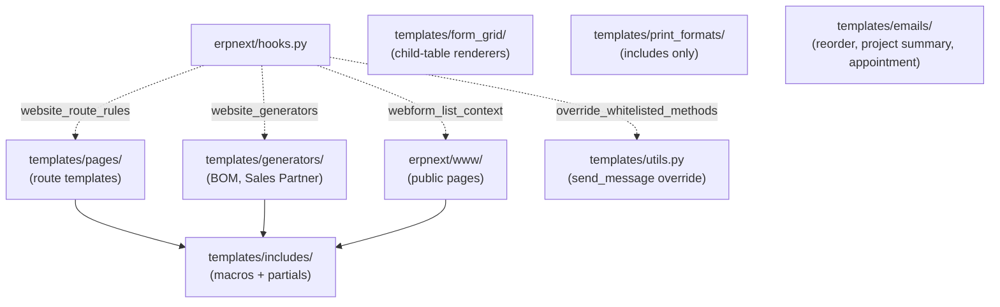

# `www/` and `templates/`

> **TL;DR:** ERPNext's public-page surface lives in two top-level directories: [erpnext/www/](../../erpnext/www/) (six page slots, of which only `book_appointment/` and `support/` carry real Python + Jinja today) and [erpnext/templates/](../../erpnext/templates/) (six subdirs of Jinja includes / page templates / form-grid renderers / generators / print-format includes / emails plus the bridge file `templates/utils.py`). The single hook that wires them into request handling is [hooks.py:58](../../erpnext/hooks.py:58) — `override_whitelisted_methods["frappe.www.contact.send_message"] = "erpnext.templates.utils.send_message"` — which redirects the public contact form into ERPNext's Lead/Opportunity/Communication composer. Webform list scoping is wired at [hooks.py:109](../../erpnext/hooks.py:109). This module ships **no DocTypes**; it is structural / presentation only.

## Key files

- [erpnext/templates/utils.py](../../erpnext/templates/utils.py:1) — `send_message`: handles the public `/contact` form override.
- [erpnext/www/book_appointment/index.py](../../erpnext/www/book_appointment/index.py:1) — appointment booking page controller; `get_context`, `get_appointment_settings`, `get_timezones`, `get_appointment_slots`, `create_appointment`.
- [erpnext/www/support/index.py](../../erpnext/www/support/index.py:1) — public Help Article landing page controller.
- [erpnext/www/payment_setup_certification.py](../../erpnext/www/payment_setup_certification.py) — payment-setup certification page; one-off helper.
- [erpnext/templates/pages/](../../erpnext/templates/pages/) — Jinja templates referenced by `website_route_rules` (`order.html`, `rfq.html`, `addresses.html`, `material_request_info.html`, `task_info.html`, `timelog_info.html`, `partners.html`, `projects.html`, `help.html`, `search_help.html`).
- [erpnext/hooks.py:58](../../erpnext/hooks.py:58) — public contact form override.
- [erpnext/hooks.py:109](../../erpnext/hooks.py:109) — `webform_list_context = "erpnext.controllers.website_list_for_contact.get_webform_list_context"`.
- [erpnext/hooks.py:113](../../erpnext/hooks.py:113) — `website_generators = ["BOM", "Sales Partner"]` — DocTypes that auto-publish website pages; their templates live in [templates/generators/](../../erpnext/templates/generators/).

## Diagram



## 1. `erpnext/www/` inventory

| Slot | Files | Status |
|------|-------|--------|
| [www/all-products/](../../erpnext/www/all-products/) | `__init__.py` only | **Empty placeholder** — slot reserved for legacy storefront. |
| [www/book-appointment/](../../erpnext/www/book-appointment/) | `__init__.py`, `verify/` | Empty top-level + child `verify/` placeholder. |
| [www/book_appointment/](../../erpnext/www/book_appointment/) | `__init__.py`, `index.html`, `index.css`, `index.js`, `index.py`, `verify/` | **Live page** — public appointment booking flow. |
| [www/lms/](../../erpnext/www/lms/) | `__init__.py` only | **Empty placeholder** — slot reserved for legacy LMS. |
| [www/shop-by-category/](../../erpnext/www/shop-by-category/) | `__init__.py` only | **Empty placeholder** — slot reserved for legacy storefront. |
| [www/support/](../../erpnext/www/support/) | `__init__.py`, `index.html`, `index.py` | **Live page** — public Help Article landing. |
| [www/payment_setup_certification.html](../../erpnext/www/payment_setup_certification.html) | + `.py` | One-off certification confirmation page. |

Five of the eight slots are empty placeholders shipped only so user URLs (e.g. `/all-products`) do not 404 if a custom theme links to them. Only `book_appointment/`, `support/`, and `payment_setup_certification` carry real Python today.

### 1.1 `www/book_appointment/index.py`

The public appointment booking flow at [erpnext/www/book_appointment/index.py:1-171](../../erpnext/www/book_appointment/index.py:1):

- `get_context(context)` — gates render on `Appointment Booking Settings.enable_scheduling`; redirects to a friendly message page if disabled ([index.py:14-25](../../erpnext/www/book_appointment/index.py:14)).
- `get_appointment_settings()` — `@frappe.whitelist(allow_guest=True)`. Returns `advance_booking_days`, `appointment_duration`, `success_redirect_url` ([index.py:28-36](../../erpnext/www/book_appointment/index.py:28)).
- `get_timezones()` — returns `zoneinfo.available_timezones()` ([index.py:39-41](../../erpnext/www/book_appointment/index.py:39)).
- `get_appointment_slots(date, timezone)` — computes day's slots respecting Holiday List, agent count, and guest timezone ([index.py:44-74](../../erpnext/www/book_appointment/index.py:44)).
- `create_appointment(date, time, tz, contact)` — inserts a `Appointment` doc with `status = "Open"` and `ignore_permissions=True` ([index.py:94-113](../../erpnext/www/book_appointment/index.py:94)).

The page is reachable via the `Appointment Booking` entry in `standard_portal_menu_items` ([hooks.py:296](../../erpnext/hooks.py:296)) at `/book_appointment` — visible to all users, no role gate.

Helper `convert_to_guest_timezone` / `convert_to_system_timezone` ([index.py:125-138](../../erpnext/www/book_appointment/index.py:125)) bracket every datetime in `zoneinfo.ZoneInfo(get_system_timezone())` and the guest-supplied tz to keep slot maths timezone-aware.

### 1.2 `www/support/index.py`

The public Help Article landing at [erpnext/www/support/index.py:1-89](../../erpnext/www/support/index.py:1):

- `get_context(context)` — pulls `Support Settings.greeting_title` / `greeting_subtitle` ([index.py:5-9](../../erpnext/www/support/index.py:5)).
- Builds a **favourite articles** list by joining `tabHelp Article` against `tabWeb Page View` and ordering by view count, capped at 6 ([index.py:32-52](../../erpnext/www/support/index.py:32)).
- Pads with most-recently-published articles up to 6 ([index.py:14-26](../../erpnext/www/support/index.py:14)).
- Builds a per-Help-Category section (5 articles each, most recent) ([index.py:71-88](../../erpnext/www/support/index.py:71)).

Used as the public `/support` landing — distinct from the desk-side Support module's Issue / SLA logic.

## 2. `erpnext/templates/` inventory

| Subdir | Contents | Purpose |
|--------|----------|---------|
| [emails/](../../erpnext/templates/emails/) | `confirm_appointment.html`, `daily_project_summary.html`, `reorder_item.html` | Outbound notification email bodies (Jinja). |
| [form_grid/](../../erpnext/templates/form_grid/) | `bank_reconciliation_grid.html`, `item_grid.html`, `material_request_grid.html`, `stock_entry_grid.html`, `includes/` | Custom HTML grids for child-table-heavy desk forms. |
| [generators/](../../erpnext/templates/generators/) | `bom.html`, `sales_partner.html` | Templates auto-rendered for the two `website_generators` DocTypes ([hooks.py:113](../../erpnext/hooks.py:113)). Each instance of BOM / Sales Partner with `published=1` becomes a public page using these templates. |
| [includes/](../../erpnext/templates/includes/) | `macros.html`, `transaction_row.html`, `address_row.html`, `issue_row.html`, `cart.css`, `discussion/`, `fee/`, `footer/`, `healthcare/`, `order/`, `projects/`, `rfq/`, `timesheet/`, `topic/`, `announcement/`, `itemised_tax_breakup.html`, `products_as_grid.html`, `products_as_list.html`, `product_list.js`, `projects.css`, `rfq.js` | Reusable Jinja partials and macros. `macros.html` (referenced by most pages) defines `product_image`, `media_image`, `item_card`, etc. |
| [pages/](../../erpnext/templates/pages/) | `order.html` / `order.py`, `rfq.html` / `rfq.py`, `material_request_info.html` / `.py`, `task_info.html` / `.py`, `timelog_info.html` / `.py`, `partners.html` / `.py`, `projects.html` / `projects.py` / `projects.js`, `help.html` / `.py`, `search_help.html` / `.py`, `integrations/`, `non_profit/`, `regional/` | Page templates resolved by `website_route_rules` (e.g. `/orders/<name>` → `order.html`). |
| [print_formats/](../../erpnext/templates/print_formats/) | `includes/` only | Print-format Jinja includes (no top-level templates). |

### 2.1 `templates/utils.py`

Single live function: `send_message(sender, message, subject="Website Query")` at [erpnext/templates/utils.py:9-60](../../erpnext/templates/utils.py:9). Decorated `@frappe.whitelist(allow_guest=True)`. See [customer-portal-flow.md, Stage 5](../flows/customer-portal-flow.md) for the full call graph.

The wiring in [hooks.py:58](../../erpnext/hooks.py:58):

```python
override_whitelisted_methods = {"frappe.www.contact.send_message": "erpnext.templates.utils.send_message"}
```

means **any** call to `frappe.www.contact.send_message` (whether from the bundled `/contact` page or from a custom client invoking `frappe.call`) is rerouted into ERPNext's lead-capture composer.

### 2.2 `templates/generators/`

The two website-generator DocTypes ([hooks.py:113](../../erpnext/hooks.py:113)):

| DocType | Template | Notes |
|---------|----------|-------|
| BOM | [templates/generators/bom.html](../../erpnext/templates/generators/bom.html) | Reachable at `/boms/<bom-name>` if the BOM record sets `published=1`. |
| Sales Partner | [templates/generators/sales_partner.html](../../erpnext/templates/generators/sales_partner.html) | Reachable at `/<route>` from the Sales Partner record. |

Frappe core's website-generator infrastructure picks these up automatically based on the DocType's `WebsiteGenerator` base class.

### 2.3 `templates/emails/`

| Template | Producer | Purpose |
|----------|----------|---------|
| `confirm_appointment.html` | `Appointment` after_insert / submit | Email confirmation to customer for a booked Appointment. |
| `daily_project_summary.html` | `projects/project.send_project_status_email_to_users` (daily) | The Project status digest. |
| `reorder_item.html` | `stock/reorder_item.reorder_item` (daily) | Reorder-level alert email. |

### 2.4 `templates/form_grid/`

Four custom HTML grid templates rendered for child-table-heavy forms:

- `bank_reconciliation_grid.html` — Bank Reconciliation tool's transaction grid.
- `item_grid.html` — Item-listing grid in transactions.
- `material_request_grid.html` — Material Request items with stock-on-hand columns.
- `stock_entry_grid.html` — Stock Entry items with batch / serial helpers.

Frappe core renders these instead of the default child-table grid when configured per-doctype via `Customize Form`.

## 3. Hook wiring summary

| Hook | Target | Purpose |
|------|--------|---------|
| `override_whitelisted_methods["frappe.www.contact.send_message"]` ([hooks.py:58](../../erpnext/hooks.py:58)) | `erpnext.templates.utils.send_message` | Lead/Opportunity/Communication composer for public contact form. |
| `webform_list_context` ([hooks.py:109](../../erpnext/hooks.py:109)) | `erpnext.controllers.website_list_for_contact.get_webform_list_context` | Web Form list scoping by Customer/Supplier link. |
| `website_generators` ([hooks.py:113](../../erpnext/hooks.py:113)) | `["BOM", "Sales Partner"]` | DocTypes that auto-publish website pages. |
| `website_context` ([hooks.py:115-118](../../erpnext/hooks.py:115)) | `{favicon, splash_image}` | Brand assets injected into every public-page render context. |
| `website_route_rules` ([hooks.py:121-218](../../erpnext/hooks.py:121)) | 14 entries (see [portal.md](portal.md)) | URL → DocType mapping; resolves to templates in `templates/pages/`. |
| `webform_list_context` (repeated) — same as above | | |

This module **does not register**:

- Any `doc_events` (no DocTypes here).
- Any `scheduler_events` (the email templates above are consumed by schedulers in other modules).

## 4. What this module does **not** contain

- **DocTypes** — none ship under `www/` or `templates/` (these are not module slots for DocTypes; `erpnext/templates/` is a Jinja root, not a Python package of business logic).
- **Frappe core's `/me`, `/login`, `/desk`, `/contact` pages** — those live in Frappe core; ERPNext only overrides the `/contact` submit handler.
- **Storefront cart** — moved to the out-of-tree `webshop` app; ERPNext-side stub at [shopping-cart.md](shopping-cart.md).
- **Print formats themselves** — Print Format records are seeded as fixtures at install time; the `templates/print_formats/includes/` files are only Jinja partials.

## Related

- [Portal module](portal.md) — `website_route_rules` consumer side; defines which pages exist.
- [Customer-portal flow](../flows/customer-portal-flow.md) — public form → Lead/Opportunity/Communication.
- [Hooks & overrides](../architecture/hooks-and-overrides.md)
- [Hooks catalogue](../architecture/hooks-catalogue.md) — `website_generators`, `website_route_rules`, `webform_list_context`, `additional_timeline_content` registries.
- [Scheduler jobs](../architecture/scheduler-jobs.md) — consumers of `templates/emails/*.html` (project digest, reorder, appointment confirmation).

## Changelog

- `2026-04-18` — initial version. Inventoried all 8 `www/` slots, 6 `templates/` subdirs, the `templates/utils.py` `send_message` override, and the four hook entries that wire this module in. No DocTypes file is needed (no DocTypes ship here).
