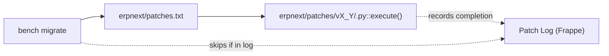

# Patches

> **TL;DR:** Database migrations in ERPNext are Python modules under [erpnext/patches/](../../erpnext/patches) (organised by version: `v4_2`, `v5_7`, `v8_1`, `v10_0`, `v10_1`, `v11_0`, `v11_1`, `v12_0`, `v13_0`, `v14_0`, `v15_0`, `v16_0`). Each patch exposes an `execute()` function. Patches are ordered and executed by being listed in [erpnext/patches.txt](../../erpnext/patches.txt:1). Frappe's `bench migrate` runs every unexecuted patch exactly once, tracking completions in the `Patch Log` DocType.

## Key files

- [erpnext/patches.txt](../../erpnext/patches.txt:1) — the **ordered manifest**. 479 lines split into two sections: `[pre_model_sync]` (line 1) and `[post_model_sync]` (line 265).
- [erpnext/patches/](../../erpnext/patches) — module tree. Each `vX_Y` folder groups patches by the ERPNext version that introduced them.
- Any patch module defines `execute()` — see [erpnext/patches/v15_0/add_company_payment_gateway_account.py](../../erpnext/patches/v15_0/add_company_payment_gateway_account.py) for a minimal example.

## How patches are wired in

Patches are registered by **listing their dotted path in `patches.txt`**. There is no `hooks.py` entry for patches. Frappe reads `patches.txt` during `bench migrate` and iterates the list top-to-bottom.



## Two-phase execution

[patches.txt:1](../../erpnext/patches.txt:1) opens with a section header:

```
[pre_model_sync]
...
[post_model_sync]
...
```

- `[pre_model_sync]` at [patches.txt:1](../../erpnext/patches.txt:1) — runs **before** Frappe syncs the DocType schema from JSON. Use when a patch needs to reference a field / DocType in its old form before migration.
- `[post_model_sync]` at [patches.txt:265](../../erpnext/patches.txt:265) — runs **after** DocType schema sync. This is the more common case: patches that depend on the new fields / new DocTypes being present.

Put a new patch in `pre_model_sync` only if it must operate on the pre-migration schema (e.g. renaming a DocType that the new schema no longer declares under the old name).

## Supported entry formats

Three forms appear in `patches.txt`:

1. **Module path** — `erpnext.patches.v15_0.my_patch`. Frappe imports the module and runs `execute()`.
2. **Module path with suffix comment** — `erpnext.patches.v4_2.update_requested_and_ordered_qty #2021-03-31` at [patches.txt:9](../../erpnext/patches.txt:9). The `#` comment is metadata; sometimes it marks a re-run date so the same patch module gets re-executed as of that date (Frappe treats the full line, including the comment, as the Patch Log key).
3. **Inline Python** — `execute:frappe.delete_doc(...)`. Example at [patches.txt:8](../../erpnext/patches.txt:8): `execute:frappe.reload_doc("accounts", "doctype", "POS Payment Method") #2020-05-28`. Everything after `execute:` is evaluated as Python by Frappe's patch runner. Used for one-liners: `frappe.delete_doc`, `frappe.reload_doc`, `frappe.db.delete`, etc.

## Minimal patch structure

```python
# erpnext/patches/v15_0/add_company_payment_gateway_account.py
import frappe


def execute():
    for gateway_account in frappe.get_list(
        "Payment Gateway Account", fields=["name", "payment_account"]
    ):
        company = frappe.db.get_value("Account", gateway_account.payment_account, "company")
        frappe.db.set_value(
            "Payment Gateway Account", gateway_account.name, "company", company
        )
```

Full source: [erpnext/patches/v15_0/add_company_payment_gateway_account.py](../../erpnext/patches/v15_0/add_company_payment_gateway_account.py).

Requirements for a patch module:
- Must define `execute()` with no arguments.
- Must be idempotent in practice (Frappe only runs it once via Patch Log, but re-running after database restore should not corrupt state).
- Should be tolerant of partial data (older sites may not have all expected fields / rows).

## Conventions observed in this repo

- **Version folders** (`vX_Y`) group patches by the ERPNext release in which they first shipped. Create a new folder (`v17_0`, etc.) when starting a new major version.
- **Snake-case module names** describing the migration: `rename_production_order_to_work_order`, `refactor_naming_series`, `change_is_subcontracted_fieldtype`, `add_bin_unique_constraint`.
- **Date comments** (`#YYYY-MM-DD` or `#DD-MM-YYYY`) appear on some entries. When present, changing the date re-runs the patch (because the Patch Log key changes).
- **Inline `execute:` statements** are used almost exclusively for `frappe.delete_doc(...)`, `frappe.delete_doc_if_exists(...)`, `frappe.reload_doc(...)`. More complex logic belongs in a proper module.
- The top of `patches.txt` is pinned order-sensitive: `update_is_cancelled_field`, `rename_production_order_to_work_order`, `add_bin_unique_constraint`, `refactor_naming_series`, `refactor_autoname_naming`, `change_is_subcontracted_fieldtype` run first because later patches depend on the new schema/names they produce.

## Adding a new patch

1. Pick the correct section — `post_model_sync` by default.
2. Create `erpnext/patches/v<N>_0/<descriptive_name>.py` with an `execute()` function.
3. Append a line to [erpnext/patches.txt](../../erpnext/patches.txt:1) referencing the module by dotted path. Place it **at the end of the section** unless it must run before a specific subsequent patch.
4. On target sites, run `bench --site <site> migrate`. Frappe imports the module, runs `execute()`, and records the entry in the `Patch Log` DocType so it never re-runs (unless the line changes, e.g. via a date comment).

## Gotchas

- **Ordering is manual.** Patches declared later in `patches.txt` run later. There is no automatic dependency resolution. If patch B depends on patch A, place A above B.
- **Schema available after `[post_model_sync]`** only. Before that point, the live DocType schema may still be the pre-migration one — do not assume a freshly-added field exists in a `pre_model_sync` patch.
- **`Patch Log` keys the entire line**, including comments. Editing a date comment therefore *re-runs* the patch. Useful for forced re-execution, but it also means formatting changes (adding/removing comments) may re-run historical patches.
- **Inline `execute:` statements run with full `frappe.*` access** in the local namespace.

## Related

- [Architecture overview](../architecture/overview.md) — where patches fit in the overall system.
- [Hooks and overrides](../architecture/hooks-and-overrides.md) — `after_install` runs ERPNext's one-time bootstrap ([erpnext/hooks.py:66](../../erpnext/hooks.py:66)) but is separate from patches.

## Changelog

- `2026-04-17` — initial version.
